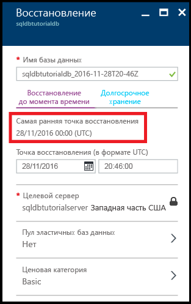
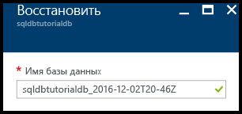
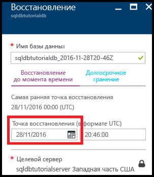
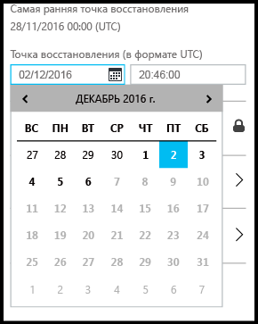
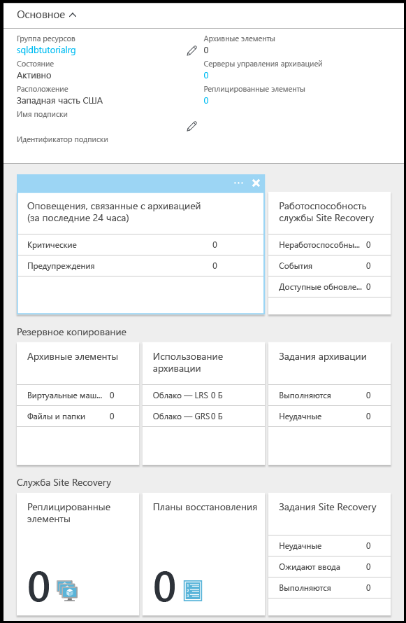

# Руководство по резервному копированию и восстановлению базы данных SQL Azure с помощью портала Azure
Из этого руководства вы узнаете, как с помощью портала Azure выполнять следующие операции.

- просмотрим имеющиеся резервные копии базы данных;
- восстановим базу данных до предыдущей точки во времени;
- настроим долгосрочное хранение файла резервной копии базы данных в хранилище служб восстановления Azure;
- восстановим базу данных из хранилища служб восстановления Azure.

**Оценка времени.** Для работы с этим руководством требуется около 30 минут (при условии, что предварительные требования уже выполнены).

> [!TIP]
> Во время работы с руководством по началу работы эти же задачи можно выполнять с помощью [PowerShell](sql-database-get-started-backup-recovery-powershell.md).
>

## Предварительные требования

* **Учетная запись Azure.** Вам понадобится учетная запись Azure. Вы можете [создать бесплатную учетную запись Azure](https://azure.microsoft.com/free/) или [активировать преимущества для подписчиков Visual Studio](https://azure.microsoft.com/pricing/member-offers/msdn-benefits/). 

* **Разрешения на создание в Azure.** У вас должна быть возможность подключиться к порталу Azure с помощью учетной записи, которой назначена роль владельца или участника подписки. Дополнительные сведения об управлении доступом на основе ролей (RBAC) см. в статье [Начало работы с управлением доступом на портале Azure](../active-directory/role-based-access-control-what-is.md).

* **SQL Server Management Studio.** Скачать и установить последнюю версию среды SQL Server Management Studio (SSMS) можно в статье [Скачивание SQL Server Management Studio (SSMS)](https://msdn.microsoft.com/library/mt238290.aspx). При подключении к базе данных SQL Azure всегда используйте последнюю версию SSMS, так как постоянно выпускаются новые возможности.

* **Базовый сервер и базы данных**. Для установки и настройки сервера и двух баз данных, используемых в данном руководстве, нажмите кнопку **Развертывание в Azure**. При нажатии кнопки открывается колонка **Deploy from a template** (Развертывание из шаблона). Создайте группу ресурсов и предоставьте **пароль для входа администратора** для создаваемого сервера.

   

> [!NOTE]
> Это руководство поможет вам освоить содержание следующих статей: [Подробнее о резервном копировании базы данных SQL](sql-database-automated-backups.md), [Хранение резервных копий базы данных SQL Azure до&10; лет](sql-database-long-term-retention.md) и [Восстановление базы данных Azure SQL с помощью создаваемых автоматически резервных копий](sql-database-recovery-using-backups.md).
>  

## Вход на портал Azure с помощью учетной записи Azure
Используя [существующую подписку](https://account.windowsazure.com/Home/Index), выполните следующие действия, чтобы подключиться к порталу Azure.

1. Откройте любой браузер и подключитесь к [порталу Azure](https://portal.azure.com/).
2. Выполните вход на [портал Azure](https://portal.azure.com/).
3. На странице **входа** введите учетные данные своей подписки.
   
   

## Просмотр самой старой точки восстановления из резервных копий базы данных, создаваемых автоматически службой

При работе с этим разделом руководства вы просмотрите самую старую точку восстановления из [резервных копий базы данных, создаваемых автоматически службой](sql-database-automated-backups.md). 

1. Откройте колонку **База данных SQL** для базы данных **sqldbtutorialdb**.

   

2. На панели инструментов щелкните **Восстановить**.

   

3. В колонке "Восстановление" просмотрите самую старую точку восстановления.

   

## Восстановление базы данных до предыдущей точки во времени

При работе с этим разделом руководства вы восстановите имеющуюся базу данных в новую базу данных до определенной точки во времени.

1. В колонке **Восстановление** базы данных просмотрите имя по умолчанию новой базы данных, в которую вы хотите восстановить свою базу данных до более ранней точки во времени (это имя имеющейся базы данных с меткой времени). Это имя изменяется с учетом времени, который вы будете указывать на следующих этапах.

   

2. Щелкните значок **календаря** в поле ввода **Точка восстановления (в формате UTС)**.

   

2. В календаре выберите дату с учетом срока хранения.

   

3. В поле ввода **Точка восстановления (в формате UTС)** укажите время восстановления данных из создаваемых автоматически резервных копий базы данных для выбранной даты.

   

   >[!NOTE]
   >Обратите внимание, что имя базы данных изменилось в соответствии с выбранной датой и временем. Обратите также внимание, что вы не можете изменить сервер, на который выполняется восстановление до определенной точки во времени. Чтобы выполнить восстановление на другой сервер, используйте [геовосстановление](sql-database-disaster-recovery.md#recover-using-geo-restore). Наконец, обратите внимание, что базу данных можно восстановить в [эластичный пул](sql-database-elastic-jobs-overview.md) или до другой ценовой категории. 
   >

4. Щелкните **ОК**, чтобы восстановить базу данных в новую базу данных до более ранней точки во времени.

5. На панели инструментов щелкните значок уведомления, чтобы просмотреть состояние задания восстановления.

   

6. После завершения задания откройте колонку **Базы данных SQL**, чтобы просмотреть восстановленную базу данных.

   

> [!NOTE]
> Здесь вы можете подключиться к восстановленной базе данных с помощью SQL Server Management Studio и выполнить необходимые задания, например [извлечь часть данных из восстановленной базы данных, чтобы скопировать их в имеющуюся базу данных, или удалить имеющуюся базу данных и присвоить ее имя восстановленной базе данных](sql-database-recovery-using-backups.md#point-in-time-restore).
>

## Настройка долгосрочного хранения создаваемых автоматически резервных копий в хранилище служб восстановления Azure 

При работе с этим разделом руководства вы [настроите более длительный срок хранения создаваемых автоматически резервных копий в хранилище служб восстановления Azure](sql-database-long-term-retention.md), чем для вашего уровня служб. 

> [!TIP]
> Сведения об удалении резервных копий с длительным периодом хранения см. в статье [Настройка долгосрочного хранения создаваемых автоматически резервных копий баз данных в хранилище служб восстановления Azure с помощью PowerShell](sql-database-manage-long-term-backup-retention-powershell.md).
>

1. Откройте колонку **SQL Server** для сервера **sqldbtutorialserver**.

   

2. Щелкните **Long-term backup retention** (Долгосрочное хранение резервных копий).

   

3. В колонке **sqldbtutorial - Long-term backup retention** (sqldbtutorial — долгосрочное хранение резервных копий) просмотрите и примите условия использования предварительной версии (если вы этого еще не сделали и эта функция по-прежнему находится на этапе предварительной версии).

   

4. Чтобы настроить долгосрочное хранение резервных копий для базы данных sqldbtutorialdb, выберите эту базу данных в таблице и щелкните **Настроить** на панели инструментов.

   

5. В колонке **Настройка** в разделе **Хранилище служб восстановления** щелкните **Настройка обязательных параметров**.

   

6. В колонке **Хранилище служб восстановления** выберите имеющееся хранилище (при наличии). Если хранилище служб восстановления отсутствует, щелкните, чтобы выйти, и создайте хранилище служб восстановления.

   

7. В колонке **Хранилища служб восстановления** щелкните **Добавить**.

   
   
8. В колонке **Хранилище служб восстановления** предоставьте допустимое имя для нового хранилища служб восстановления.

   

9. Выберите подписку и группу ресурсов, а затем выберите расположение хранилища. По завершении нажмите кнопку **Создать**.

   

   > [!IMPORTANT]
   > Хранилище должно находиться в том же регионе, что и логический сервер Azure SQL Server, и использовать ту же группу ресурсов.
   >

10. После создания хранилища вернитесь в колонку **Хранилище служб восстановления**.

11. В колонке **Хранилище служб восстановления** щелкните хранилище, а затем нажмите кнопку **Выбрать**.

   

12. В колонке **Настройка** предоставьте допустимое имя для новой политики хранения, измените ее должным образом и нажмите кнопку **ОК**.

   

13. В колонке **sqldbtutorial - Long-term backup retention** (sqldbtutorial — долгосрочное хранение резервных копий) щелкните **Сохранить**, а затем нажмите кнопку **ОК**, чтобы применить политику долгосрочного хранения резервных копий ко всем выбранным базам данных.

   

14. Щелкните **Сохранить**, чтобы включить новую политику долгосрочного хранения резервных копий в настроенном хранилище служб восстановления Azure.

   

15. После включения долгосрочного хранения резервных копий откройте колонку **sqldbtutorialvault** (щелкните **Все ресурсы** и выберите эту базу данных в списке ресурсов для своей подписки).

   

> [!IMPORTANT]
> После настройки резервные копии появятся в хранилище в течение следующих семи дней. Не выполняйте следующие этапы до появления резервных копий в хранилище.
>

## Просмотр резервных копий в хранилище с включенной функцией долгосрочного хранения

При работе с этим разделом руководства вы просмотрите сведения о резервных копиях базы данных в хранилище с включенной функцией [долгосрочного хранения резервных копий](sql-database-long-term-retention.md). 

1. Откройте колонку **sqldbtutorialvault** (щелкните **Все ресурсы** и выберите эту базу данных в списке ресурсов для своей подписки), чтобы просмотреть сведения об объеме хранилища, используемого для хранения резервных копий базы данных.

   

2. Откройте колонку **База данных SQL** для базы данных **sqldbtutorialdb**.

   

3. На панели инструментов щелкните **Восстановить**.

   

4. В колонке "Восстановление" щелкните **Долгосрочные**.

5. В разделе Azure vault backups (Резервные копии хранилища Azure) щелкните **Выберите архив**, чтобы просмотреть список доступных резервных копий с долгосрочным хранением.

   

## Восстановление базы данных из резервной копии с долгосрочным хранением

При работе с этим разделом руководства вы восстановите имеющуюся базу данных из резервной копии, расположенной в хранилище служб восстановления Azure, в новую базу данных.

1. В колонке **Azure vault backups** (Резервные копии хранилища Azure) щелкните резервную копию, которую нужно восстановить, а затем нажмите кнопку **Выбрать**.

   

2. В текстовом поле **Имя базы данных** введите имя для восстановленной базы данных.

   

3. Нажмите кнопку **ОК**, чтобы восстановить базу данных из резервной копии, расположенной в хранилище, в новую базу данных.

4. На панели инструментов щелкните значок уведомления, чтобы просмотреть состояние задания восстановления.

   

5. После завершения задания откройте колонку **Базы данных SQL**, чтобы просмотреть восстановленную базу данных.

   

> [!NOTE]
> Здесь вы можете подключиться к восстановленной базе данных с помощью SQL Server Management Studio и выполнить необходимые задания, например [извлечь часть данных из восстановленной базы данных, чтобы скопировать их в имеющуюся базу данных, или удалить имеющуюся базу данных и присвоить ее имя восстановленной базе данных](sql-database-recovery-using-backups.md#point-in-time-restore).
>

## Дальнейшие действия

- Дополнительные сведения о резервных копиях базы данных, создаваемых автоматически службой, см. в [этой статье](sql-database-automated-backups.md).
- Дополнительные сведения о долгосрочном хранении резервных копий см. в статье [Хранение резервных копий базы данных SQL Azure до&10; лет](sql-database-long-term-retention.md).
- Дополнительные сведения о восстановлении из резервных копий см. в статье [Восстановление базы данных Azure SQL с помощью создаваемых автоматически резервных копий](sql-database-recovery-using-backups.md).

