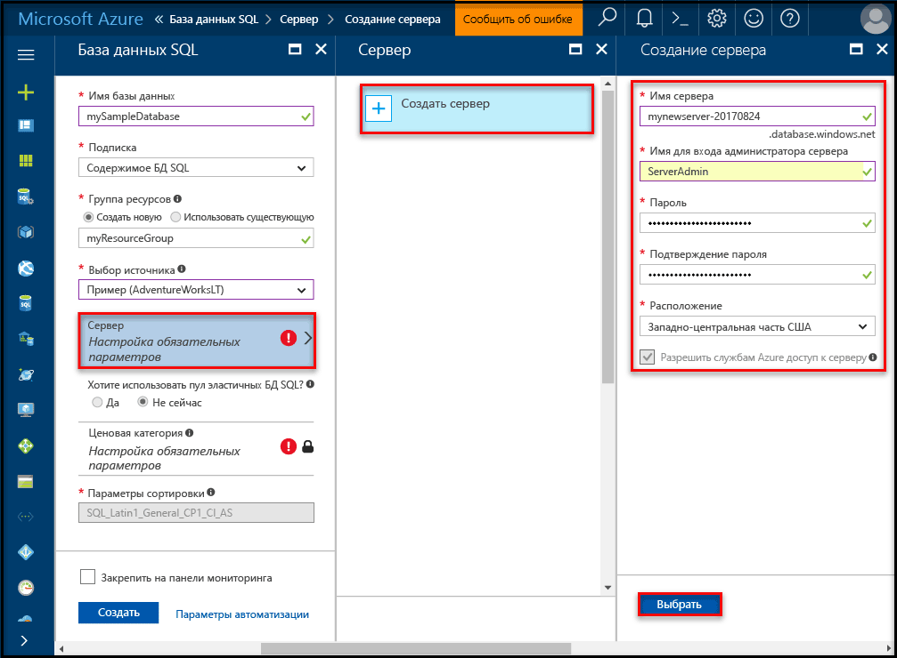
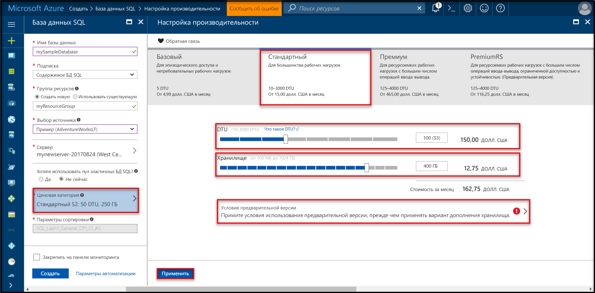
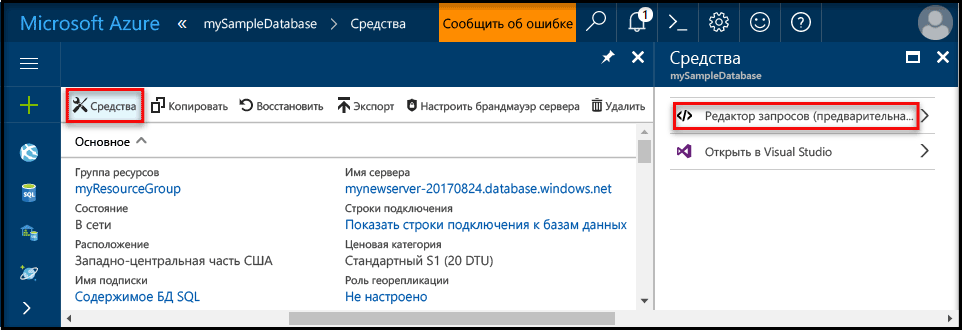
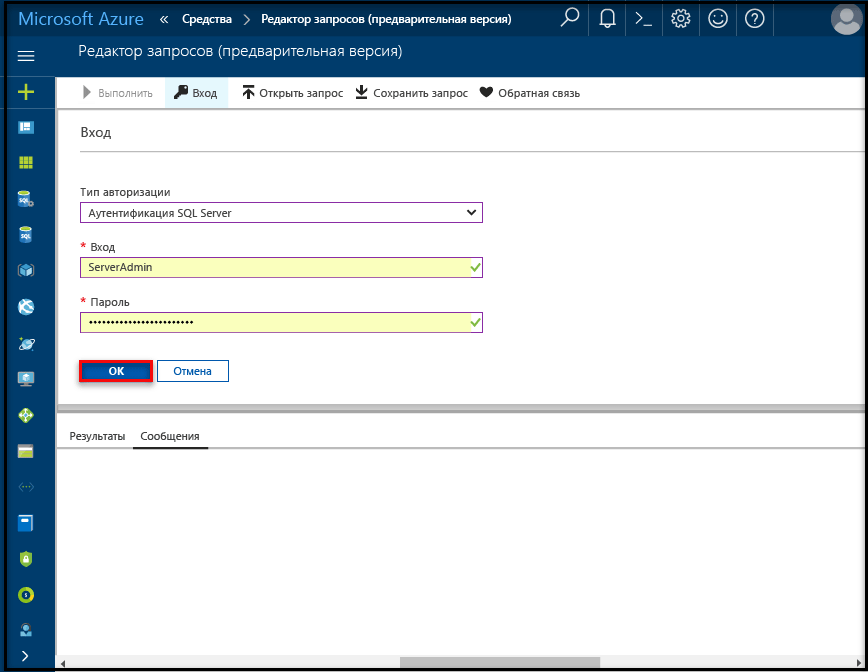
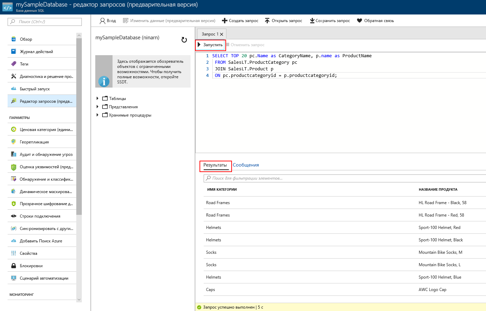

# <a name="create-an-azure-sql-database-in-the-azure-portal"></a>Создание базы данных SQL Azure на портале Azure

Это краткое руководство содержит пошаговые инструкции по созданию базы данных SQL на портале Azure. База данных SQL Azure — это база данных как услуга, которая позволяет запускать и масштабировать высокодоступные базы данных SQL Server в облаке. В этом кратком руководстве объясняется, как начать работу, создав базу данных SQL с помощью портала Azure.

Если у вас еще нет подписки Azure, создайте [бесплатную](https://azure.microsoft.com/free/) учетную запись Azure, прежде чем начинать работу.

## <a name="log-in-to-the-azure-portal"></a>Войдите на портал Azure.

Войдите на [портал Azure](https://portal.azure.com/).

## <a name="create-a-sql-database"></a>Создание базы данных SQL

База данных Azure SQL создается с определенным набором [вычислительных ресурсов и ресурсов хранения](sql-database-service-tiers.md). База данных создается в пределах [группы ресурсов Azure](../azure-resource-manager/resource-group-overview.md) и [логического сервера базы данных SQL Azure](sql-database-features.md). 

Выполните следующие действия, чтобы создать базу данных SQL, содержащую образец данных Adventure Works LT. 

1. Щелкните **Создать** в верхнем левом углу портала Azure.

2. Выберите **Базы данных** на странице **создания** и щелкните **Создать** в разделе **База данных SQL** страницы **создания нового элемента**.

   

3. Заполните форму базы данных SQL, указав следующую информацию, как показано на предыдущем рисунке.   

   | Настройка       | Рекомендуемое значение | Описание | 
   | ------------ | ------------------ | ------------------------------------------------- | 
   | **Database name** (Имя базы данных) | mySampleDatabase | Допустимые имена баз данных см. в статье об [идентификаторах базы данных](https://docs.microsoft.com/en-us/sql/relational-databases/databases/database-identifiers). | 
   | **Подписка** | Ваша подписка  | Дополнительные сведения о подписках см. [здесь](https://account.windowsazure.com/Subscriptions). |
   | **Группа ресурсов**  | myResourceGroup | Допустимые имена групп ресурсов см. в статье о [правилах и ограничениях именования](https://docs.microsoft.com/azure/architecture/best-practices/naming-conventions). |
   | **Источник** | Пример (AdventureWorksLT) | Загружает схему и данные AdventureWorksLT в новую базу данных |

   > [!IMPORTANT]
   > Необходимо выбрать пример базы данных этой формы, так как она используется в оставшейся части этого руководства.
   > 

4. В разделе **Сервер** щелкните **Настроить необходимые параметры** и заполните форму SQL Server (логический сервер), указав следующую информацию, как показано на указанном ниже изображении.   

   | Настройка       | Рекомендуемое значение | Описание | 
   | ------------ | ------------------ | ------------------------------------------------- | 
   | **Server name** (Имя сервера) | Любое глобально уникальное имя | Допустимые имена серверов см. в статье о [правилах и ограничениях именования](https://docs.microsoft.com/azure/architecture/best-practices/naming-conventions). | 
   | **Имя для входа администратора сервера** | Любое допустимое имя | Допустимые имена входа см. в статье об [идентификаторах базы данных](https://docs.microsoft.com/en-us/sql/relational-databases/databases/database-identifiers). |
   | **Пароль** | Любой допустимый пароль | Длина пароля должна составлять минимум 8 символов. Пароль должен содержать символы трех категорий из перечисленных: прописные буквы, строчные буквы, цифры и специальные символы. |
   | **Подписка** | Ваша подписка | Дополнительные сведения о подписках см. [здесь](https://account.windowsazure.com/Subscriptions). |
   | **Группа ресурсов** | myResourceGroup | Допустимые имена групп ресурсов см. в статье о [правилах и ограничениях именования](https://docs.microsoft.com/azure/architecture/best-practices/naming-conventions). |
   | **Расположение** | Любое допустимое расположение | Дополнительные сведения о регионах Azure см. [здесь](https://azure.microsoft.com/regions/). |

   > [!IMPORTANT]
   > Указанные здесь учетные данные и пароль администратора сервера понадобятся позже в этом руководстве, чтобы войти на сервер и в его базу данных. Запомните или запишите эту информацию для последующего использования. 
   >  

   

5. Заполнив форму, щелкните **Выбрать**.

6. Щелкните **Ценовая категория**, чтобы указать уровень службы, количество DTU и объем хранилища. Изучите доступные ресурсы для каждого уровня служб (число DTU и объем хранилища). 

   > [!IMPORTANT]
   > \* Размеры хранилища, превышающие включенный объем, доступны в предварительной версии. За их использование взимается дополнительная плата. Подробнее об этом можно узнать в статье [Стоимость использования Базы данных SQL](https://azure.microsoft.com/pricing/details/sql-database/). 
   >
   >\* На уровне "Премиум" хранилище объемом свыше 1 ТБ сейчас доступно в следующих регионах: восточная часть США 2, западная часть США, Виргиния (для обслуживания государственных организаций США), Западная Европа, центральная Германия, Юго-Восточная Азия, восточная Япония, восточная Австралия, центральная Канада и восточная Канада. См. [текущие ограничения для баз данных P11–P15](sql-database-resource-limits.md#single-database-limitations-of-p11-and-p15-when-the-maximum-size-greater-than-1-tb).  
   > 

7. Для работы с этим кратким руководством выберите уровень служб **Стандартный**, а затем с помощью ползунка выберите **100 DTU (S3)** и **400** ГБ хранилища.

   

8. Примите условия использования предварительной версии, чтобы использовать **дополнительное хранилище**. 

   > [!IMPORTANT]
   > \* Размеры хранилища, превышающие включенный объем, доступны в предварительной версии. За их использование взимается дополнительная плата. Подробнее об этом можно узнать в статье [Стоимость использования Базы данных SQL](https://azure.microsoft.com/pricing/details/sql-database/). 
   >
   >\* На уровне "Премиум" хранилище объемом свыше 1 ТБ сейчас доступно в следующих регионах: восточная часть США 2, западная часть США, Виргиния (для обслуживания государственных организаций США), Западная Европа, центральная Германия, Юго-Восточная Азия, восточная Япония, восточная Австралия, центральная Канада и восточная Канада. См. [текущие ограничения для баз данных P11–P15](sql-database-resource-limits.md#single-database-limitations-of-p11-and-p15-when-the-maximum-size-greater-than-1-tb).  
   > 

9. Выбрав уровень сервера, число DTU и объем хранилища, нажмите кнопку **Применить**.  

10. Заполнив форму базы данных SQL, нажмите кнопку **Создать**, чтобы подготовить базу данных. Подготовка занимает несколько минут. 

11. На панели инструментов щелкните **Уведомления**, чтобы отслеживать процесс развертывания.
    
     

## <a name="create-a-server-level-firewall-rule"></a>создадим правило брандмауэра на уровне сервера;

Служба базы данных SQL создает брандмауэр уровня сервера, который не позволяет внешним приложениям и средствам подключаться к серверу или любой базе данных на сервере, если не создано правило брандмауэра, открывающее брандмауэр для определенных IP-адресов. Выполните следующие действия, чтобы создать [правило брандмауэра уровня сервера базы данных SQL](sql-database-firewall-configure.md) для IP-адреса вашего клиента и разрешить внешнее подключение через брандмауэр базы данных SQL только с вашего IP-адреса. 

> [!NOTE]
> База данных SQL обменивается данными через порт 1433. Если вы пытаетесь подключиться из корпоративной сети, исходящий трафик через порт 1433 может быть запрещен сетевым брандмауэром. В таком случае вы не сможете подключиться к серверу базы данных SQL Azure, пока ваш ИТ-отдел не откроет порт 1433.
>

1. По завершении развертывания щелкните раздел **Базы данных SQL** в меню слева и выберите **mySampleDatabase** на странице **баз данных SQL**. После этого откроется страница обзора базы данных, где будет указано полное имя сервера (например, **mynewserver-20170824.database.windows.net**) и предоставлены параметры для дальнейшей настройки. 

2. Скопируйте полное имя сервера. Оно понадобится вам при работе с последующими руководствами для подключения к серверу и связанным базам данных. 

    

3. Щелкните **Настройка брандмауэра для сервера** на панели инструментов, как показано на предыдущем рисунке. Откроется страница **параметров брандмауэра** для сервера базы данных SQL. 

    

4. На панели инструментов щелкните **Добавить IP-адрес клиента**, чтобы добавить текущий IP-адрес в новое правило брандмауэра. С использованием правила брандмауэра можно открыть порт 1433 для одного IP-адреса или диапазона IP-адресов.

5. Щелкните **Сохранить**. Для текущего IP-адреса будет создано правило брандмауэра уровня сервера, с помощью которого можно открыть порт 1433 логического сервера.

6. Нажмите кнопку **ОК**, а затем закройте страницу **Параметры брандмауэра**.

Теперь можно подключиться с этого IP-адреса к серверу базы данных SQL и его базам данных с помощью SQL Server Management Studio или другого средства по своему усмотрению, используя учетную запись администратора сервера, созданную ранее.

> [!IMPORTANT]
> По умолчанию доступ через брандмауэр базы данных SQL включен для всех служб Azure. На этой странице щелкните **Откл.**, чтобы отключить доступ для всех служб Azure.
>

## <a name="query-the-sql-database"></a>Отправка запросов к базе данных SQL

После создания примера базы данных в Azure можно воспользоваться встроенным средством запроса на портале Azure, чтобы убедится, что вы сможете подключиться к базе данных и выполнить запрос данных. 

1. На странице базы данных SQL нажмите кнопку **Средства** на панели инструментов, а затем щелкните **Редактор запросов (предварительная версия)**.

    

2. Установите флажок напротив пункта **Условия предварительной версии** и нажмите кнопку **ОК**. Откроется страница редактора запросов.

3. Щелкните **Вход**, проверьте данные для входа и нажмите кнопку **ОК**, чтобы войти с использованием проверки подлинности SQL Server, указав имя и пароль администратора сервера, созданные ранее.

    

4. Нажмите кнопку **ОК**, чтобы выполнить вход.

5. После того как вы пройдете проверку подлинности как **администратор сервера**, в области редактора запросов введите следующий запрос.

   ```sql
   SELECT TOP 20 pc.Name as CategoryName, p.name as ProductName
   FROM SalesLT.ProductCategory pc
   JOIN SalesLT.Product p
   ON pc.productcategoryid = p.productcategoryid;
   ```

6. Щелкните **Выполнить** и просмотрите результаты запроса в области **Результаты**.

   

7. Закройте страницу **редактора запросов**, нажмите кнопку **ОК**, чтобы отменить несохраненные изменения, и закройте страницу **Средства**.

## <a name="clean-up-resources"></a>Очистка ресурсов

Сохраните эти ресурсы, если вы планируете перейти к [дальнейшим действиям](#next-steps) и узнать о различных методах подключения к базе данных и отправки запросов к ней. Если вы все-таки решите удалить ресурсы, созданные в этом кратком руководстве, выполните следующие действия. 


1. В меню слева на портале Azure щелкните **Группы ресурсов**, а затем выберите **myResourceGroup**. 
2. На странице группы ресурсов щелкните **Удалить**, в текстовом поле введите **myResourceGroup** и щелкните **Удалить**.

## <a name="next-steps"></a>Дальнейшие действия

Теперь, когда у вас есть база данных, вы можете подключиться и создать запрос, используя привычные средства. См. дополнительные сведения о доступных средствах:

- [SQL Server Management Studio](sql-database-connect-query-ssms.md)
- [Visual Studio Code](sql-database-connect-query-vscode.md)
- [.NET](sql-database-connect-query-dotnet.md)
- [PHP](sql-database-connect-query-php.md)
- [Node.js](sql-database-connect-query-nodejs.md)
- [Java](sql-database-connect-query-java.md)
- [Python](sql-database-connect-query-python.md)
- [Ruby](sql-database-connect-query-ruby.md)

