# <a name="tutorial-provision-and-access-an-azure-sql-database-using-the-azure-portal-and-sql-server-management-studio"></a>Руководство по подготовке базы данных SQL Azure и доступу к ней с помощью портала Azure и SQL Server Management Studio

Из этого руководства вы узнаете, как с помощью портала Azure выполнять следующие операции.

* создадим группу ресурсов Azure;
* создадим логический сервер SQL Azure;
* просмотрим свойства логического сервера SQL Azure;
* создадим правило брандмауэра на уровне сервера;
* создадим пример отдельной базы данных Adventure Works LT;
* просмотрим свойства примера базы данных Adventure Works LT в Azure.

В этом руководстве мы также будем использовать последнюю версию SQL Server Management Studio. Этот продукт нам понадобится для:

* подключения к логическому серверу и его базе данных master;
* отправки запросов к базе данных master;
* подключения к примеру базы данных;
* отправки запросов к примеру базы данных.

После завершения работы с этим руководством у вас будет пример базы данных и пустая база данных, подключенные к логическому серверу и работающие в группе ресурсов Azure. У вас также будет правило брандмауэра на уровне сервера, которое будет разрешать субъектам уровня сервера входить на сервер из указанного IP-адреса (или диапазона IP-адресов). 

**Оценка времени**. Для работы с этим руководством потребуется около 30 минут (при условии, что предварительные требования уже выполнены).

> [!TIP]
> Во время работы с руководством по началу работы эти же задачи можно выполнять с помощью [C#](sql-database-get-started-csharp.md) или [PowerShell](sql-database-get-started-powershell.md).
>

## <a name="prerequisites"></a>Предварительные требования

* Вам понадобится учетная запись Azure. Вы можете [создать бесплатную учетную запись Azure](/pricing/free-trial/?WT.mc_id=A261C142F) или [активировать преимущества для подписчиков Visual Studio](/pricing/member-offers/msdn-benefits-details/?WT.mc_id=A261C142F). 

* У вас должна быть возможность подключиться к порталу Azure с помощью учетной записи, которой назначена роль владельца или участника подписки. Дополнительные сведения об управлении доступом на основе ролей (RBAC) см. в статье [Начало работы с управлением доступом на портале Azure](../active-directory/role-based-access-control-what-is.md).

> [!NOTE]
> Это руководство поможет вам освоить содержание следующих статей: [Логические серверы базы данных SQL Azure](sql-database-server-overview.md), [Общие сведения о базе данных SQL Azure](sql-database-overview.md) и [Обзор правил брандмауэра базы данных SQL Azure](sql-database-firewall-configure.md).
>  


### <a name="sign-in-to-the-azure-portal-using-your-azure-account"></a>Вход на портал Azure с помощью учетной записи Azure
Используя [существующую подписку](https://account.windowsazure.com/Home/Index), выполните следующие действия, чтобы подключиться к порталу Azure.

1. Откройте любой браузер и подключитесь к [порталу Azure](https://portal.azure.com/).
2. Выполните вход на [портал Azure](https://portal.azure.com/).
3. На странице **входа** введите учетные данные своей подписки.
   
   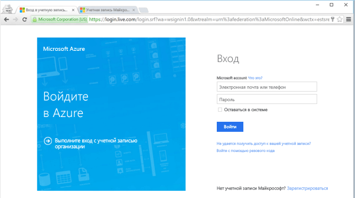


<a name="create-logical-server-bk"></a>

## <a name="create-a-new-logical-sql-server-in-the-azure-portal"></a>Создание логического сервера SQL Server на портале Azure

1. Щелкните **Создать**, введите **sql server** и нажмите клавишу **ВВОД**.

    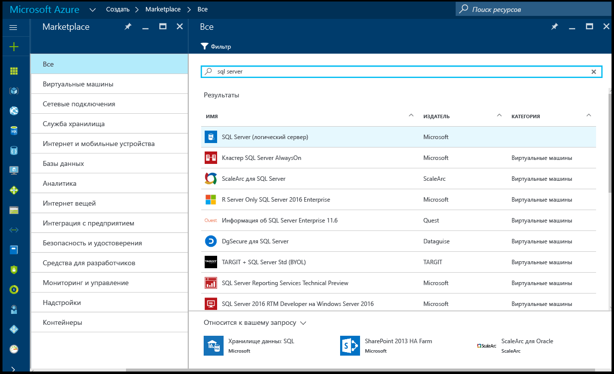
2. Щелкните **SQL Server (логический сервер)**.
   
    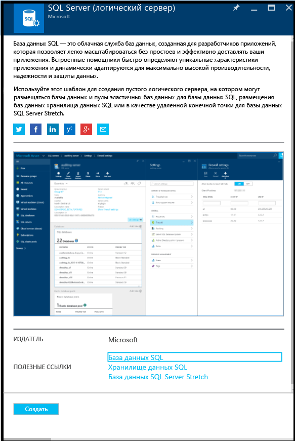
3. Щелкните **Создать**, чтобы открыть колонку создания логического сервера SQL Server.

    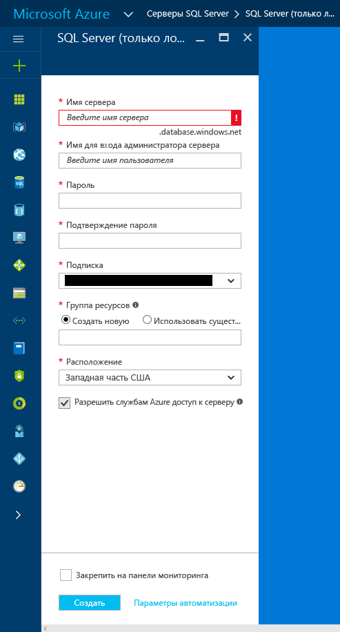
3. В поле "Имя сервера" введите допустимое имя для нового логического сервера. Зеленый флажок указывает, что выбрано допустимое имя.
    
    

    > [!IMPORTANT]
    > Полным именем нового сервера будет <имя_вашего_сервера>.database.windows.net.
    >
    
4. В текстовом поле "Имя входа администратора сервера" укажите имя пользователя, которое будет использоваться сервером при проверке подлинности SQL Server. Это имя называется именем субъекта сервера. Зеленый флажок указывает, что выбрано допустимое имя.
    
    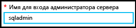
5. В полях **Пароль** и **Подтверждение пароля** укажите пароль для входа в учетную запись субъекта сервера. Зеленый флажок указывает, что выбран допустимый пароль.
    
    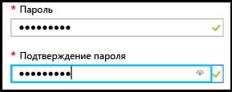
6. Выберите подписку, в которой у вас есть разрешение на создание объектов.

    
7. Над полем "Группа ресурсов" установите переключатель **Создать новую**, а затем в текстовом поле введите допустимое имя новой группы ресурсов. Также можно использовать существующую группу, если она уже создана. Зеленый флажок указывает, что выбрано допустимое имя.

    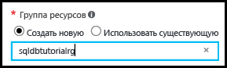

8. В списке **Расположение** выберите центр обработки данных, соответствующий вашему расположению, например "Восточная Австралия".
    
    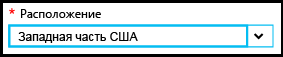
    
    > [!TIP]
    > Параметр **Разрешить службам Azure доступ к серверу** невозможно изменить в этой колонке. Его можно изменить в колонке брандмауэра сервера. Дополнительные сведения см. в статье [Руководство по базам данных SQL: создание учетных записей пользователей базы данных SQL для доступа к базе данных и управления ею с помощью портала Azure](sql-database-control-access-sql-authentication-get-started.md).
    >
    
9. Щелкните **Создать**.

    

## <a name="view-the-logical-sql-server-properties-in-the-azure-portal"></a>Просмотр свойств логического сервера SQL Server на портале Azure

1. На портале Azure щелкните **Больше служб**.

    
2. В поле фильтра введите **SQL**, а затем щелкните значок звезды напротив пункта "Серверы SQL". Так вы добавите серверы SQL Server в список избранного в Azure. 

    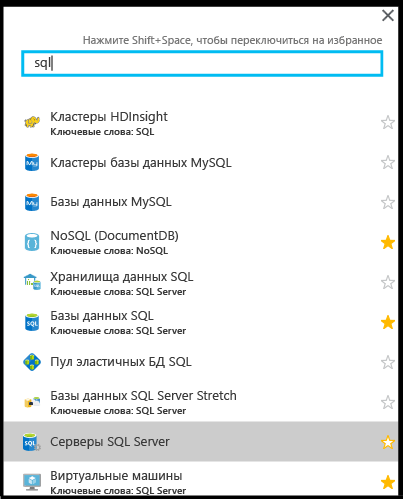
3. В колонке по умолчанию щелкните **Серверы SQL**, чтобы открыть список серверов SQL Server в вашей подписке Azure. 

    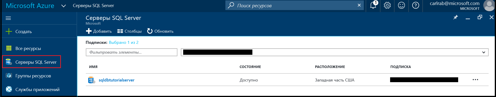

4. Щелкните свой новый сервер SQL Server, чтобы просмотреть его свойства на портале Azure. Подробное описание параметров из этой колонки приведено в последующих руководствах.

    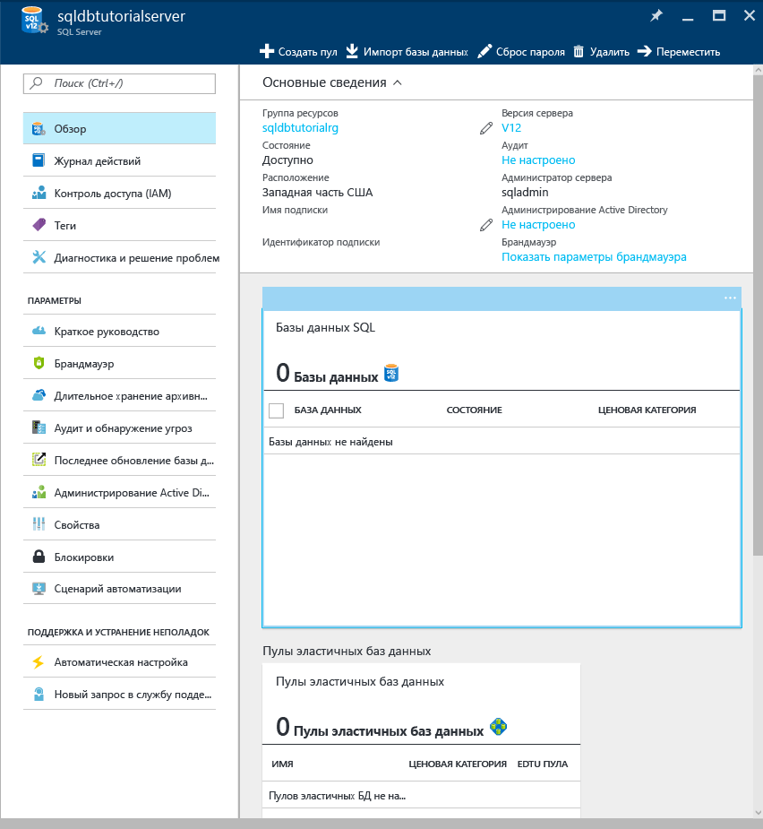
5. В разделе "Параметры" щелкните **Свойства**, чтобы просмотреть различные свойства логического сервера SQL Server.

    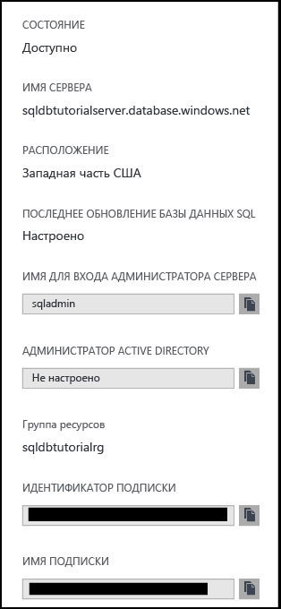
6. Скопируйте полное имя сервера в буфер обмена. Оно нам вскоре понадобится.

    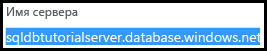

## <a name="create-a-server-level-firewall-rule-in-the-azure-portal"></a>Создание правила брандмауэра на уровне сервера с помощью портала Azure

1. В колонке сервера SQL Server в разделе "Параметры" щелкните **Брандмауэр**, чтобы открыть колонку брандмауэра для SQL Server.

    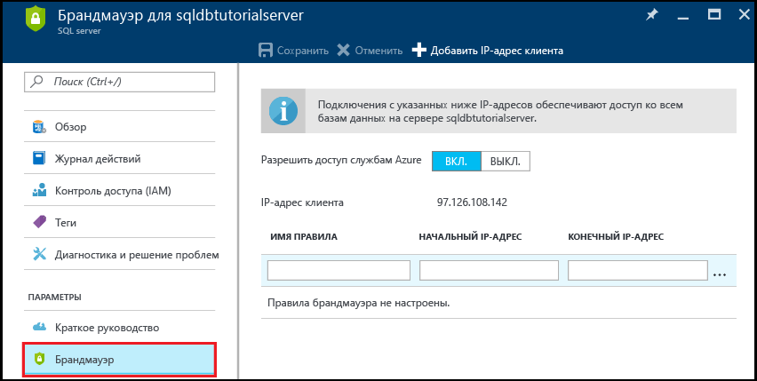

2. Просмотрите IP-адрес клиента и убедитесь, что это именно ваш IP-адрес в Интернете. Для этого в любом браузере введите поисковый запрос "мой IP-адрес". Иногда адреса могут не совпадать по тем или иным причинам.

    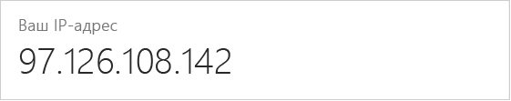

3. Для удобства предположим, что IP-адреса совпадают. Далее на панели инструментов нажмите кнопку **Добавить IP-адрес клиента**.

    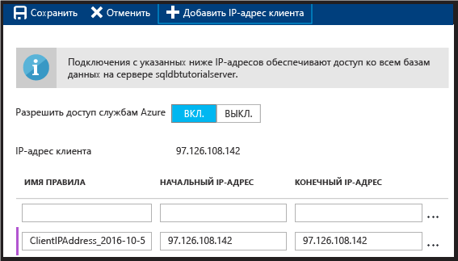

    > [!NOTE]
    > Брандмауэр базы данных SQL на сервере можно открыть для одного IP-адреса или целого диапазона IP-адресов. Открыв брандмауэр, вы дадите возможность администраторам и пользователям SQL входить в любую базу данных на сервере, для которой у них есть действительные учетные данные.
    >

4. На панели инструментов нажмите кнопку **Сохранить**, чтобы сохранить это правило брандмауэра на уровне сервера, а затем нажмите кнопку **ОК**.

    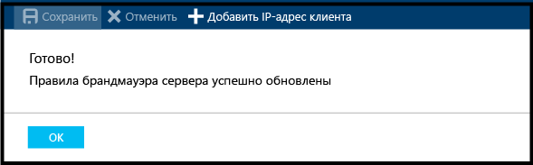

## <a name="connect-to-sql-server-using-sql-server-management-studio-ssms"></a>Подключение к SQL Server с помощью SQL Server Management Studio (SSMS)

1. Сведения о том, как скачать и установить последнюю версию SSMS, см. в статье [Скачивание SQL Server Management Studio (SSMS)](https://msdn.microsoft.com/library/mt238290.aspx). Когда новая версия становится доступной для скачивания, последняя версия SSMS выдает соответствующий запрос. Это позволяет всегда пользоваться обновленным ПО.

2. После установки введите в поле поиска Windows текст **Microsoft SQL Server Management Studio** и нажмите клавишу **ВВОД**, чтобы запустить приложение.

    
3. В диалоговом окне подключения к серверу введите данные, необходимые для подключения к серверу SQL Server с использованием проверки подлинности SQL Server.

    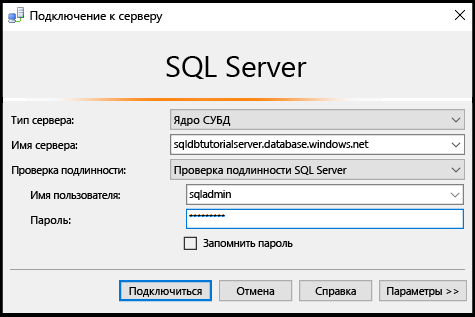
4. Щелкните **Подключить**.

    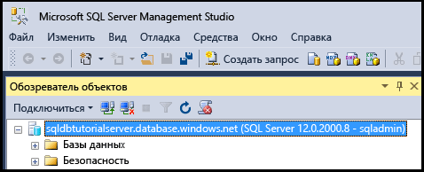
5. В обозревателе объектов последовательно разверните **Базы данных**, **Системные базы данных** и **master**, чтобы просмотреть объекты в базе данных master.

    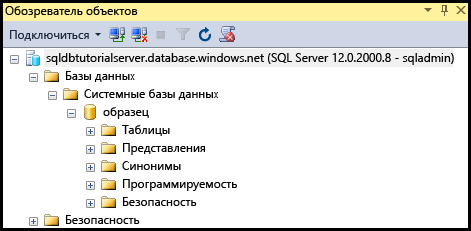
6. Щелкните правой кнопкой мыши **master** и выберите **Создать запрос**.

    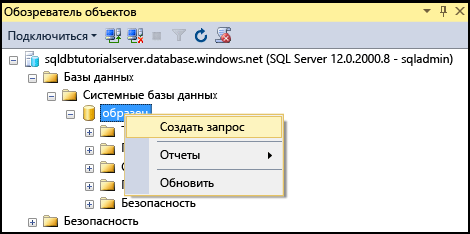

8. В окне запроса введите следующее:

   ```select * from sys.objects```

9.  На панели инструментов нажмите кнопку **Выполнить**, чтобы получить список всех системных объектов в базе данных master.

    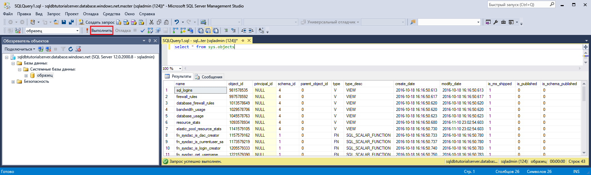

    > [!NOTE]
    > Сведения о системе безопасности SQL см. в статье [Руководство по базам данных SQL: создание учетных записей пользователей базы данных SQL для доступа к базе данных и управления ею с помощью портала Azure](sql-database-control-access-sql-authentication-get-started.md)
    >

## <a name="create-new-database-in-the-azure-portal-using-adventure-works-lt-sample"></a>Создание базы данных на портале Azure с использованием примера Adventure Works LT

1. На портале Azure в колонке по умолчанию щелкните **Базы данных SQL**.

    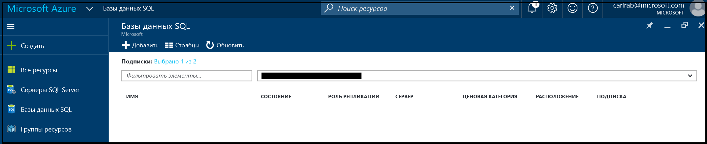
2. В колонке баз данных SQL щелкните **Добавить**.

    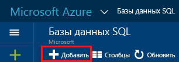
3. В колонке базы данных SQL ознакомьтесь с автоматически подставленной информацией.

    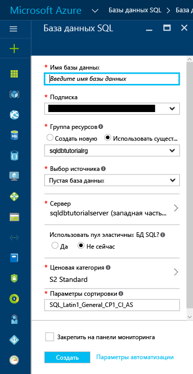
4. Укажите допустимое имя базы данных.

    
5. В разделе "Выбрать источник" щелкните **Пример**, а затем в списке "Выберите пример" щелкните **AdventureWorksLT [V12]**.
   
    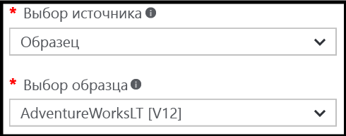
6. В разделе "Сервер" укажите учетные данные администратора.

    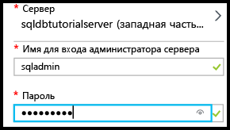

    > [!NOTE]
    > Базу данных можно добавить на сервер как отдельную базу данных (по умолчанию) или в составе пула эластичных БД. Дополнительные сведения о пулах эластичных БД см. в статье [Что такое пул эластичных БД Azure](sql-database-elastic-pool.md).
    >

7. В разделе "Ценовая категория" выберите уровень **Базовый**. При необходимости ценовую категорию можно будет изменить позже, но для учебных целей мы рекомендуем использовать категорию с наименьшей стоимостью.

    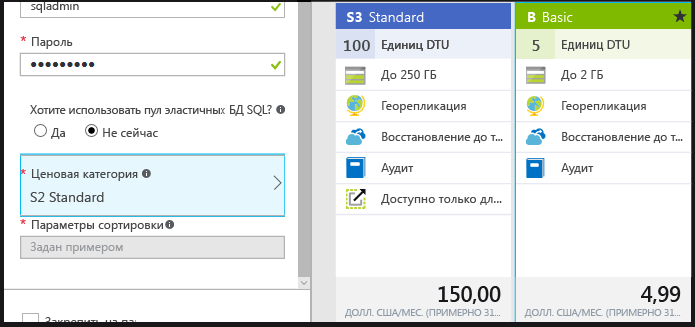
8. Щелкните **Создать**.

    

## <a name="view-database-properties-in-the-azure-portal"></a>Просмотр свойств базы данных на портале Azure

1. В колонке "Базы данных SQL" щелкните имя новой базы данных, чтобы просмотреть ее свойства на портале Azure. Подробное описание параметров из этой колонки приведено в последующих руководствах. 

    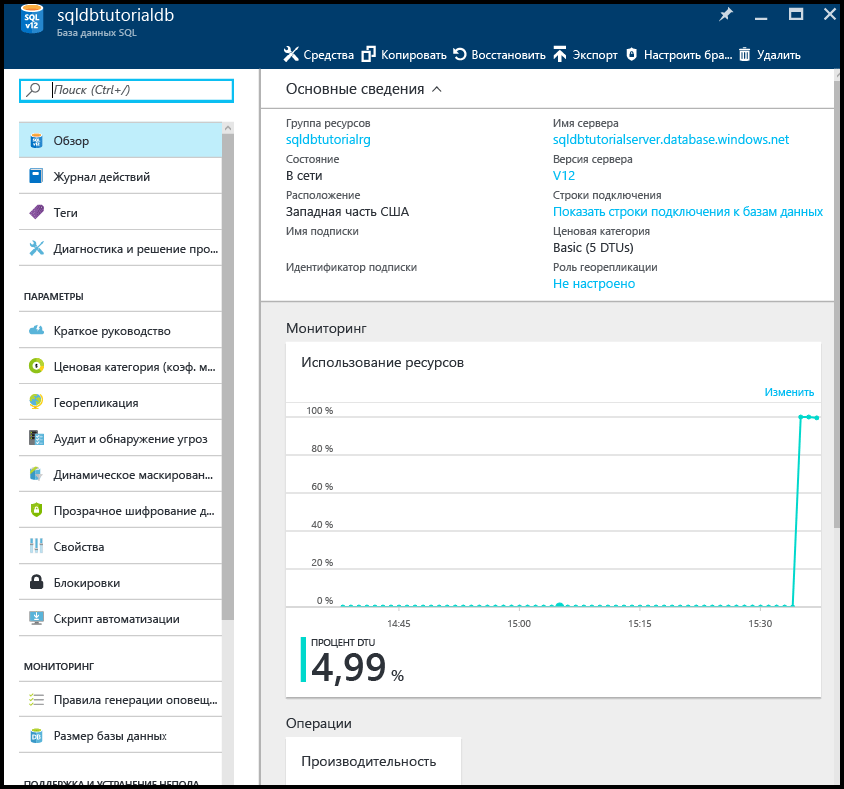
2. Щелкните **Свойства**, чтобы просмотреть дополнительные сведения о базе данных.

    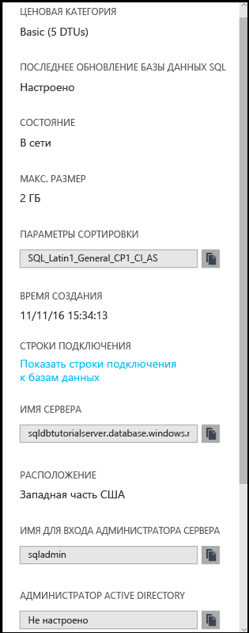

3. Щелкните **Показать строки подключения к базам данных**.

    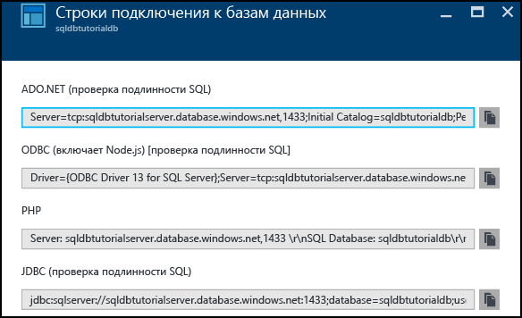
4. Щелкните **Обзор**, а затем в области "Основное" щелкните имя сервера.
    
    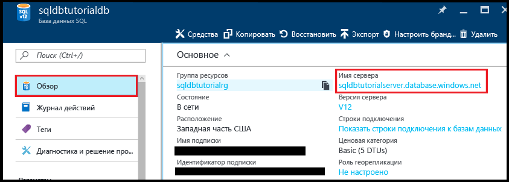
5. В области "Основное" для вашего сервера просмотрите сведения о только что добавленной базе данных.

    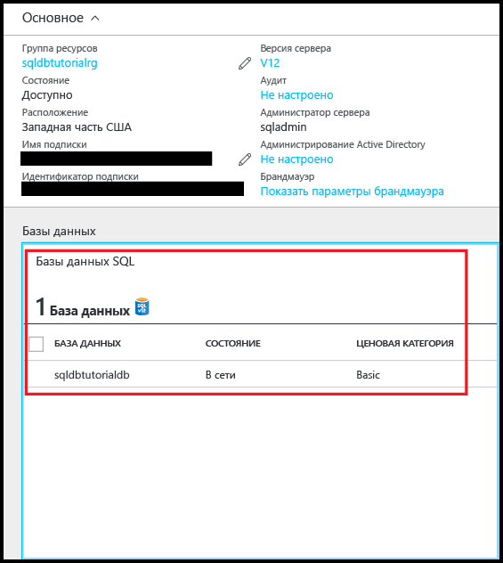

## <a name="connect-and-query-sample-database-using-sql-server-management-studio"></a>Подключение к примеру базы данных и отправка к ней запросов с помощью SQL Server Management Studio

1. Переключитесь в SQL Server Management Studio и в обозревателе объектов щелкните **Базы данных**. Затем на панели инструментов нажмите кнопку **Обновить**, чтобы просмотреть свой пример базы данных.

    
2. В обозревателе объектов разверните новую базу данных, чтобы просмотреть ее объекты.

    
3. Щелкните правой кнопкой мыши пример базы данных и выберите пункт **Создать запрос**.

    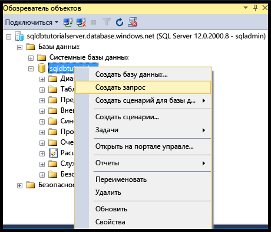
4. В окне запроса введите следующее:

   ```select * from sys.objects```
   
9.  На панели инструментов нажмите кнопку **Выполнить**, чтобы получить список всех системных объектов в примере базы данных.

    

## <a name="create-a-new-blank-database-using-sql-server-management-studio"></a>Создание пустой базы данных с помощью SQL Server Management Studio

1. В обозревателе объектов щелкните правой кнопкой мыши элемент **Базы данных** и выберите пункт **Новая база данных**.

    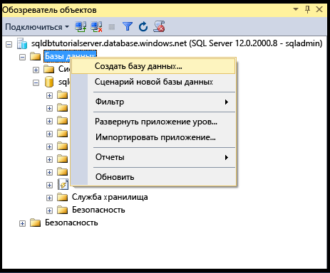

    > [!NOTE]
    > SSMS может создать для вас скрипт Transact-SQL для создания базы данных.
    >

2. В диалоговом окне создания базы данных введите в соответствующем текстовом поле имя базы данных. 

    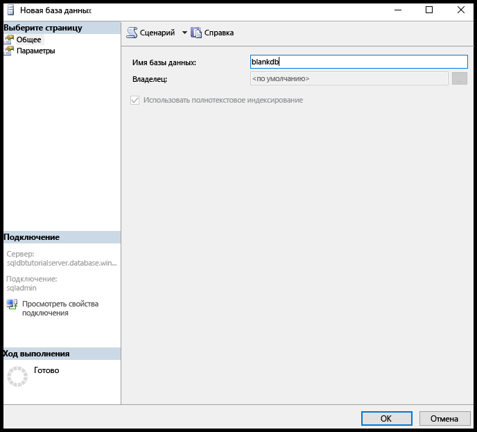

3. В диалоговом окне создания базы данных щелкните **Параметры**, а затем измените выпуск на **Базовый**.

    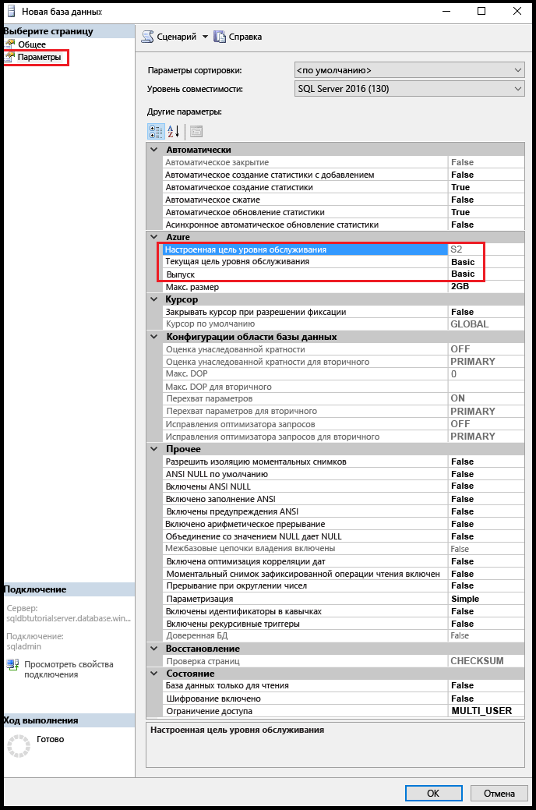

    > [!TIP]
    > Просмотрите в этом окне, какие еще параметры можно изменить для базы данных SQL Azure. Дополнительные сведения об этих параметрах см. в статье [CREATE DATABASE (база данных SQL Azure)](https://msdn.microsoft.com/library/dn268335.aspx).
    >

4. Нажмите кнопку **ОК**, чтобы создать пустую базу данных.
5. По завершении обновите в обозревателе объектов узел "Базы данных" и просмотрите только что созданную пустую базу данных. 

    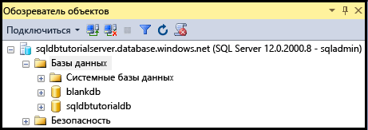

> [!TIP]
> Чтобы сэкономить деньги во время обучения, удалите неиспользуемые базы данных. Базы данных выпуска "Базовый" можно восстановить в течение семи дней. Ни в коем случае не удаляйте сервер. Сделав это, вы не сможете восстановить ни сам север, ни его базы данных.
>


## <a name="next-steps"></a>Дальнейшие действия
Завершив работу с этим руководством, изучите дополнительные материалы, в которых продолжается начатая в этом руководстве тема. 

- Основные сведения об аутентификации SQL Server см. в статье [Руководство по базам данных SQL: аутентификация, доступ и правила брандмауэра уровня базы данных в SQL Server](sql-database-control-access-sql-authentication-get-started.md).
- Основные сведения об аутентификации Azure Active Directory см. в статье [Руководство по базам данных SQL: доступ с аутентификацией Azure AD и правила брандмауэра уровня базы данных](sql-database-control-access-aad-authentication-get-started.md).
* Если вы хотите поработать с запросами к примеру базы данных на портале Azure, см. страницу [Public preview: Interactive query experience for SQL databases](https://azure.microsoft.com/en-us/updates/azure-sql-database-public-preview-t-sql-editor/) (Предварительная версия: интерактивные запросы к базам данных SQL).
* Если вы знаете Excel, узнайте, как [подключиться к базе данных SQL в Azure с помощью Excel](sql-database-connect-excel.md).
* Если вы готовы написать свой собственный код, выберите язык программирования в [библиотеках подключений для базы данных SQL и SQL Server](sql-database-libraries.md).
* Если вы хотите перенести локальные базы данных SQL Server в облако Azure, см. статью [Миграция базы данных SQL Server в базу данных SQL в облаке](sql-database-cloud-migrate.md).
* Чтобы загрузить данные в новую таблицу из CSV-файла с помощью программы командной строки BCP, см. сведения в статье [Загрузка данных из CSV-файла в хранилище данных SQL Azure (неструктурированные файлы)](sql-database-load-from-csv-with-bcp.md).
* Сведения о том, как создавать таблицы и другие объекты, см. в разделе "Создание таблицы" в статье [Создание таблицы (Учебник)](https://msdn.microsoft.com/library/ms365315.aspx).

## <a name="additional-resources"></a>Дополнительные ресурсы

- Технический обзор см. в статье [Что такое база данных SQL? Введение в базы данных SQL](sql-database-technical-overview.md).
- Сведения о ценах см. на [странице с ценами на базы данных SQL Azure](https://azure.microsoft.com/pricing/details/sql-database/).


<!--HONumber=Feb17_HO1-->


