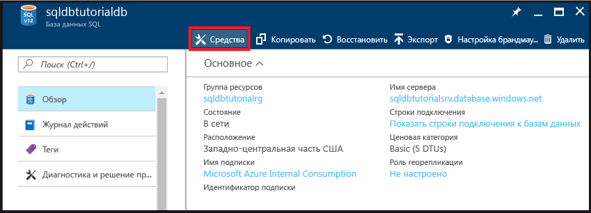
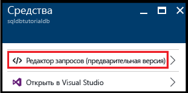
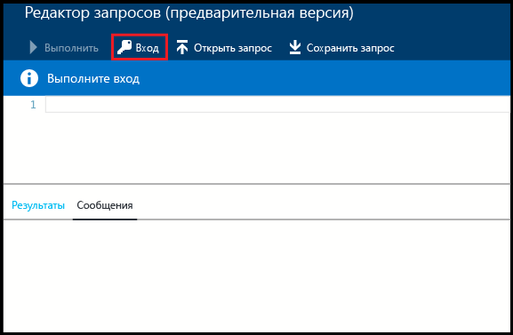
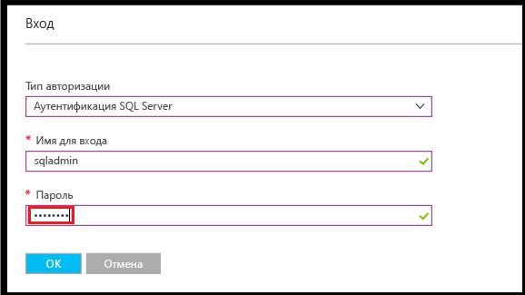
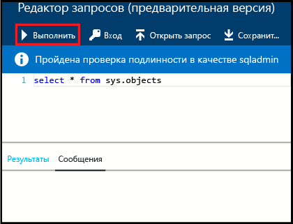
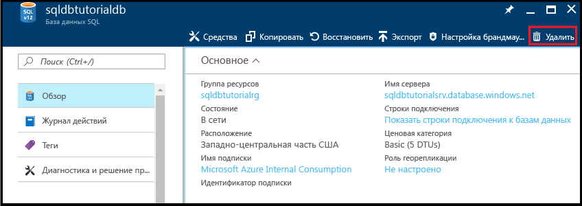

# <a name="create-connect-to-and-query-your-first-azure-sql-databases-in-the-azure-portal-and-using-ssms"></a>Создание первой базы данных SQL Azure, а также подключение и выполнение запросов к ней на портале Azure и с помощью SSMS

В этом руководстве вы узнаете, как создавать базы данных SQL Azure, а также подключаться и выполнять запросы к ним на портале Azure и с помощью SQL Server Management Studio. Завершив работу с этим руководством, вы:

* создадите группу ресурсов, содержащую логический сервер, правило брандмауэра уровня сервера и две базы данных;
* узнаете, как просмотреть свойства сервера и базы данных на портале Azure и с помощью SQL Server Management Studio;
* узнаете, как отправить запрос к базе данных на портале Azure и с помощью SQL Server Management Studio.

**Оценка времени.** Для работы с этим руководством потребуется около 30 минут (при условии, что предварительные требования уже выполнены).

> [!TIP]
> Вы также можете узнать, как создавать базу данных SQL Azure, а также подключаться и выполнять запросы к ней с помощью [PowerShell](sql-database-get-started-powershell.md) или [C#](sql-database-get-started-csharp.md).
>

> [!NOTE]
> Это руководство поможет вам освоить содержание следующих статей: [Логические серверы базы данных SQL Azure](sql-database-server-overview.md), [Общие сведения о базе данных SQL Azure](sql-database-overview.md) и [Обзор правил брандмауэра базы данных SQL Azure](sql-database-firewall-configure.md). Общие сведения о службе базы данных SQL см. в статье [Что такое база данных SQL? Введение в базы данных SQL](sql-database-technical-overview.md).
>  

## <a name="prerequisites"></a>Предварительные требования

* **Учетная запись Azure.** Вы можете [создать бесплатную учетную запись Azure](https://azure.microsoft.com/free/) или [активировать преимущества для подписчиков Visual Studio](https://azure.microsoft.com/pricing/member-offers/msdn-benefits/). 

* **Разрешения на создание в Azure.** У вас должна быть возможность подключиться к порталу Azure с помощью учетной записи, которой назначена роль владельца или участника подписки. Дополнительные сведения об управлении доступом на основе ролей (RBAC) см. в статье [Начало работы с управлением доступом на портале Azure](../active-directory/role-based-access-control-what-is.md).

* **SQL Server Management Studio.** Скачать и установить последнюю версию среды SQL Server Management Studio (SSMS) можно в статье [Скачивание SQL Server Management Studio (SSMS)](https://msdn.microsoft.com/library/mt238290.aspx). При подключении к базе данных SQL Azure всегда используйте последнюю версию SSMS, так как постоянно выпускаются новые возможности.

### <a name="sign-in-to-the-azure-portal"></a>Выполните вход на портал Azure.

В этом разделе показано, как подключиться к порталу Azure с помощью [учетной записи Azure](https://account.windowsazure.com/Home/Index).

1. Откройте любой браузер и подключитесь к [порталу Azure](https://portal.azure.com/).
2. Выполните вход на [портал Azure](https://portal.azure.com/).
3. На странице **входа** введите учетные данные своей подписки.
   
   


<a name="create-logical-server-bk"></a>

## <a name="create-a-new-logical-sql-server"></a>Создание нового логического сервера SQL

В этом разделе показано, как создать логический сервер с помощью портала Azure в любом регионе. Логический сервер  — это объект, в котором можно создавать базы данных SQL и правила брандмауэра, позволяющие разрешить пользователям подключаться через брандмауэр базы данных SQL Azure. 

1. Щелкните **Создать**, введите **sql server** и нажмите клавишу **ВВОД**.

    
2. Щелкните **SQL Server (логический сервер)**.
   
    
3. Щелкните **Создать**, чтобы открыть колонку создания логического сервера SQL Server.

    
3. В поле **Имя сервера** введите допустимое имя для нового логического сервера. Зеленый флажок указывает, что выбрано допустимое имя.
    
    

    > [!IMPORTANT]
    > Полное имя нового сервера должно быть глобально уникальным и иметь следующий формат: **<имя_вашего_сервера>.database.windows.net**. Оно понадобится в этом руководстве для подключения к серверу и базам данных.
    >
    
4. В текстовом поле **Имя для входа администратора сервера** укажите имя пользователя, которое будет использоваться сервером при проверке подлинности SQL. Это имя называется именем субъекта сервера. Зеленый флажок указывает, что выбрано допустимое имя.
    
    
5. В полях **Пароль** и **Подтверждение пароля** укажите пароль для входа в учетную запись субъекта сервера. Зеленый флажок указывает, что выбран допустимый пароль.
    
    
6. В раскрывающемся списке **Подписка** выберите подписку, в которой у вас есть разрешение на создание объектов.

    
7. В разделе **Группа ресурсов** установите переключатель **Создать** и в текстовом поле введите допустимое имя для новой группы ресурсов. Зеленый флажок указывает, что выбрано допустимое имя.

    

8. В текстовом поле **Расположение** выберите центр обработки данных, в котором будет создан логический сервер.
    
    
    
    > [!TIP]
    > Параметр **Разрешить службам Azure доступ к серверу** невозможно изменить в этой колонке. Его можно изменить в колонке брандмауэра сервера. Дополнительные сведения см. в статье [Руководство по базам данных SQL: создание учетных записей пользователей базы данных SQL для доступа к базе данных и управления ею с помощью портала Azure](sql-database-control-access-sql-authentication-get-started.md).
    >
    
9. Установите флажок **Закрепить на панели мониторинга**.

10. Нажмите кнопку **Создать**, чтобы развернуть в Azure скрипт для создания логического сервера.

    

11. После создания сервера просмотрите его свойства, которые отображаются по умолчанию. 

    
12. Щелкните **Свойства**, чтобы просмотреть дополнительные свойства логического сервера SQL.

    
13. Скопируйте полное имя сервера в буфер обмена. Оно нам вскоре понадобится.

    

## <a name="create-a-server-level-firewall-rule"></a>создадим правило брандмауэра на уровне сервера;

В этом разделе показано, как создать правило брандмауэра уровня сервера на портале Azure. По умолчанию брандмауэр базы данных SQL Azure запрещает внешние подключения к логическому серверу и его базам данных. Чтобы обеспечить подключение к серверу, создайте правило брандмауэра для IP-адреса компьютера, из которого вы будете выполнять подключение в следующей процедуре. Дополнительные сведения см. в статье [Обзор правил брандмауэра базы данных SQL Azure](sql-database-firewall-configure.md).

1. В колонке сервера SQL Server щелкните **Брандмауэр**, чтобы открыть колонку брандмауэра для сервера. Обратите внимание, что отображается IP-адрес клиентского компьютера.

    

2. На панели инструментов щелкните **Добавить IP-адрес клиента**, чтобы создать правило брандмауэра для текущего IP-адреса.

    

    > [!NOTE]
    > Вы можете создать правило брандмауэра для одного IP-адреса или диапазона IP-адресов. Открыв брандмауэр, вы дадите возможность администраторам и пользователям SQL входить в любую базу данных на сервере, для которой у них есть допустимые учетные данные.
    >

4. На панели инструментов нажмите кнопку **Сохранить**, чтобы сохранить это правило брандмауэра уровня сервера, а затем нажмите кнопку **ОК**, чтобы закрыть диалоговое окно с сообщением об успешном создании.

    

## <a name="connect-to-the-server-with-ssms"></a>Подключение к серверу с помощью SSMS

В этом разделе показано, как подключиться к логическому серверу SQL с помощью SQL Server Management Studio. Среда SSMS — основной инструмент, который администратор базы данных использует для управления серверами SQL Server и базами данных.

1. Откройте SQL Server Management Studio. Для этого введите в поле поиска Windows текст **Microsoft SQL Server Management Studio** и нажмите клавишу **ВВОД**.

    
3. В диалоговом окне **Подключение к серверу** введите полное имя сервера из предыдущей процедуры, выберите проверку подлинности SQL Server, а затем укажите имя для входа и пароль, указанные во время подготовки сервера.

    
4. Нажмите кнопку **Подключиться**, чтобы инициировать подключение, и откройте обозреватель объектов в среде SSMS.

    
5. В обозревателе объектов последовательно разверните **Базы данных**, **Системные базы данных** и **master**, чтобы просмотреть объекты в базе данных master.

    
6. Щелкните правой кнопкой мыши **master** и выберите **Создать запрос**.

    

8. В окне запроса введите следующее:

   ```select * from sys.objects```

9.  На панели инструментов нажмите кнопку **Выполнить**, чтобы получить список всех системных объектов в базе данных master.

    

    > [!NOTE]
    > Сведения о начале работы с безопасностью SQL см. в статье [Руководство по базам данных SQL: аутентификация, доступ и правила брандмауэра уровня базы данных в SQL Server](sql-database-control-access-sql-authentication-get-started.md).
    >

## <a name="create-a-database-with-sample-data"></a>Создание базы данных с примерами данных

В этом разделе показано, как создать на портале Azure базу данных с примерами данных, связанную с созданным ранее логическим сервером. 

1. На портале Azure в колонке по умолчанию щелкните **Базы данных SQL**.

    
2. В колонке баз данных SQL щелкните **Добавить**. 

    

    
3. В текстовом поле **Имя базы данных** введите допустимое имя базы данных.

    
4. В текстовом поле **Выбрать источник** выберите **Пример (AdventureWorksLT)**.
   
    
5. Убедитесь, что в разделе **Сервер** выбран нужный сервер. Обратите внимание также на то, что базу данных можно добавить на сервер как отдельную базу данных (по умолчанию) или в составе пула эластичных БД. Дополнительные сведения о пулах эластичных БД см. в статье [Что такое пул эластичных БД Azure](sql-database-elastic-pool.md).

6. В разделе **Ценовая категория** выберите уровень **Базовый** и нажмите кнопку **Выбрать**. При необходимости ценовую категорию можно будет изменить позже, но для учебных целей мы рекомендуем использовать категорию с наименьшей стоимостью.

    
7. Установите флажок **Закрепить на панели мониторинга** и нажмите кнопку **Создать**.

    

8. После создания базы данных просмотрите ее свойства на портале Azure. Подробное описание параметров из этой колонки приведено в последующих руководствах. 

    

## <a name="query-the-database-in-the-azure-portal"></a>Запрос базы данных на портале Azure

В этом разделе показано, как запросить базу данных непосредственно на портале Azure. 

1. В колонке "Базы данных SQL" щелкните **Tools** (Инструменты) на панели инструментов.

    
2. В колонке Tools (Инструменты) щелкните **Редактор запросов (предварительная версия)**.

    
3. Установите флажок, чтобы подтвердить, что редактор запросов является компонентом предварительной версии, а затем нажмите кнопку **ОК**.
4. В колонке **Редактор запросов** щелкните **Вход**.

    
5. Проверьте значения в полях "Тип авторизации" и "Вход", а затем введите пароль для этого имени входа. 

    
6. Нажмите кнопку **ОК**, чтобы попытаться войти.
7. Выполнив проверку подлинности, в окне запросов введите следующий запрос, а затем щелкните **Запуск**:

   ```select * from sys.objects```

    

8. Просмотрите результаты запроса в области **Результаты**.

    

## <a name="query-the-database-with-ssms"></a>Выполнение запросов к базе данных с помощью SSMS

В этом разделе показано, как подключиться к базе данных с помощью SQL Server Management Studio, а затем запросить примеры данных, чтобы просмотреть объекты в базе данных.

1. Переключитесь в SQL Server Management Studio и в обозревателе объектов щелкните **Базы данных**. Затем на панели инструментов нажмите кнопку **Обновить**, чтобы просмотреть свой пример базы данных.

    
2. В обозревателе объектов разверните новую базу данных, чтобы просмотреть ее объекты.

    
3. Щелкните правой кнопкой мыши пример базы данных и выберите пункт **Создать запрос**.

    
4. В окне запроса введите следующее:

   ```select * from sys.objects```
   
9.  На панели инструментов нажмите кнопку **Выполнить**, чтобы получить список всех системных объектов в примере базы данных.

    

## <a name="create-a-blank-database-with-ssms"></a>Создание пустой базы данных с помощью SSMS

В этом разделе показано, как создать базу данных с помощью SQL Server Management Studio.

1. В обозревателе объектов щелкните правой кнопкой мыши элемент **Базы данных** и выберите пункт **Новая база данных**.

    

2. В диалоговом окне **создания базы данных** введите в соответствующем текстовом поле имя базы данных. 

    

3. В диалоговом окне создания базы данных щелкните **Параметры**, а затем измените выпуск на **Базовый**.

    

    > [!TIP]
    > Просмотрите в этом окне, какие еще параметры можно изменить для базы данных SQL Azure. Дополнительные сведения об этих параметрах см. в статье [CREATE DATABASE (база данных SQL Azure)](https://msdn.microsoft.com/library/dn268335.aspx).
    >

4. Нажмите кнопку **ОК**, чтобы создать пустую базу данных.
5. По завершении обновите в обозревателе объектов узел "Базы данных" и просмотрите только что созданную пустую базу данных. 

    

## <a name="troubleshoot-connectivity"></a>Устранение неполадок подключения

При сбоях подключения к базе данных SQL Azure отображаются сообщения об ошибке. Проблемы с подключением могут возникнуть из-за перенастройки базы данных SQL Azure, параметров брандмауэра, истечения времени ожидания подключения или использования неправильных учетных данных. Сведения о средстве устранения неполадок с подключением к базе данных SQL Microsoft Azure см. в [этом разделе](https://support.microsoft.com/help/10085/troubleshooting-connectivity-issues-with-microsoft-azure-sql-database).

## <a name="delete-a-single-database-in-the-azure-portal"></a>Удаление отдельной базы данных на портале Azure

В этом разделе показано, как удалить отдельную базу данных с помощью портала Azure.

1. В колонке "Базы данных SQL" на портале Azure щелкните ту базу данных, которую нужно удалить. 
2.  Выбрав ненужную базу данных SQL, щелкните **Удалить**.

    
2. Нажмите кнопку **Да**, чтобы подтвердить безвозвратное удаление этой базы данных.

    

> [!TIP]
> Пока не истек срок хранения базы данных, ее можно восстановить, используя автоматические резервные копии, создаваемые службой (при условии, что вы не удаляете сам сервер). Базы данных выпуска "Базовый" можно восстановить в течение семи дней. Базы данных всех других выпусков можно восстановить в течение 35 дней. Если вы удалите сервер, вы не сможете восстановить ни сам сервер, ни его базы данных. Дополнительные сведения о резервном копировании базы данных см. в статье [Подробнее о резервном копировании базы данных SQL](sql-database-automated-backups.md), а сведения о восстановлении базы данных из резервных копий см. в статье [Восстановление базы данных SQL Azure с помощью создаваемых автоматически резервных копий](sql-database-recovery-using-backups.md). Сведения о восстановлении удаленной базы данных см. в статье [Восстановление удаленной базы данных SQL Azure на портале Azure](sql-database-restore-deleted-database-portal.md).
>


## <a name="next-steps"></a>Дальнейшие действия
Завершив работу с этим руководством, изучите дополнительные материалы, в которых продолжается начатая в этом руководстве тема. 

- Основные сведения об аутентификации SQL Server см. в статье [Руководство по базам данных SQL: аутентификация, доступ и правила брандмауэра уровня базы данных в SQL Server](sql-database-control-access-sql-authentication-get-started.md).
- Основные сведения об аутентификации Azure Active Directory см. в статье [Руководство по базам данных SQL: доступ с аутентификацией Azure AD и правила брандмауэра уровня базы данных](sql-database-control-access-aad-authentication-get-started.md).
* Если вы хотите поработать с запросами к примеру базы данных на портале Azure, см. страницу [Public preview: Interactive query experience for SQL databases](https://azure.microsoft.com/updates/azure-sql-database-public-preview-t-sql-editor/) (Предварительная версия: интерактивные запросы к базам данных SQL).
* Если вы знаете Excel, узнайте, как [подключиться к базе данных SQL в Azure с помощью Excel](sql-database-connect-excel.md).
* Если вы готовы написать свой собственный код, выберите язык программирования в [библиотеках подключений для базы данных SQL и SQL Server](sql-database-libraries.md).
* Если вы хотите перенести локальные базы данных SQL Server в облако Azure, см. статью [Миграция базы данных SQL Server в базу данных SQL в облаке](sql-database-cloud-migrate.md).
* Чтобы загрузить данные в новую таблицу из CSV-файла с помощью программы командной строки BCP, см. сведения в статье [Загрузка данных из CSV-файла в базу данных SQL Azure (неструктурированные файлы)](sql-database-load-from-csv-with-bcp.md).
* Сведения о том, как создавать таблицы и другие объекты, см. в разделе "Создание таблицы" в статье [Создание таблицы (Учебник)](https://msdn.microsoft.com/library/ms365315.aspx).

## <a name="additional-resources"></a>Дополнительные ресурсы

- Технический обзор см. в статье [Что такое база данных SQL? Введение в базы данных SQL](sql-database-technical-overview.md).
- Сведения о ценах см. на [странице с ценами на базы данных SQL Azure](https://azure.microsoft.com/pricing/details/sql-database/).


