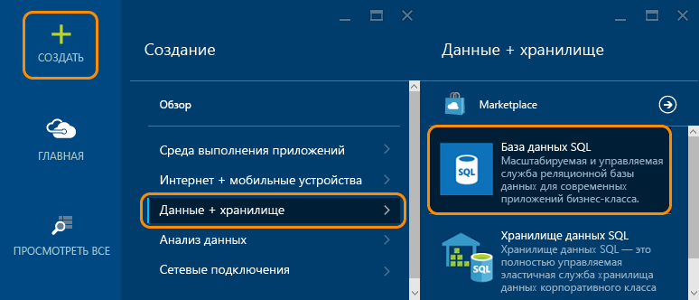
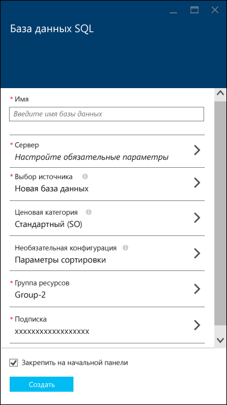
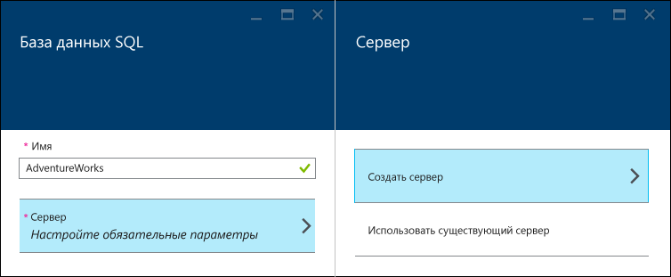
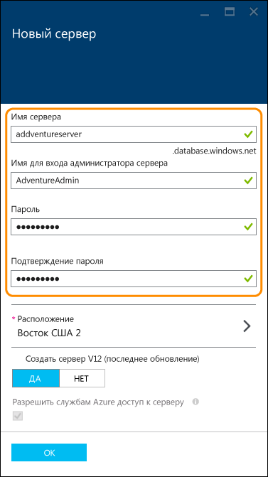
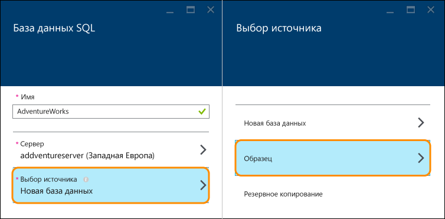
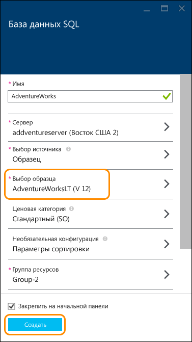
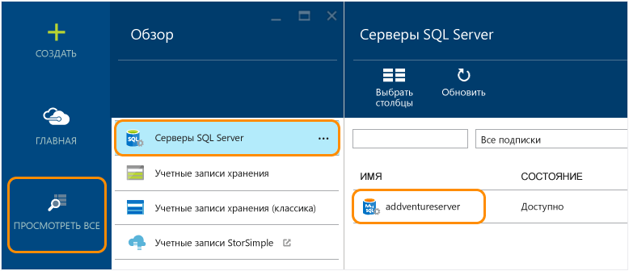
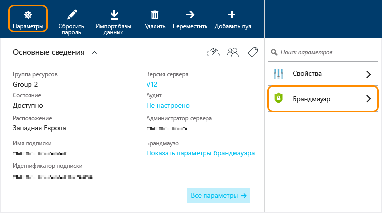
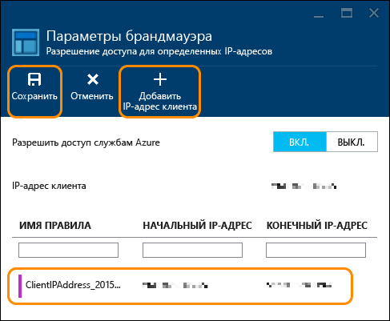

<properties
	pageTitle="Руководство по базам данных SQL: создание базы данных SQL | Microsoft Azure"
	description="Руководство по базам данных SQL: создание базы данных SQL за несколько минут с помощью демонстрационных данных и портала Azure. Узнайте, как настроить сервер размещения и правило брандмауэра."
	keywords="руководство по базам данных, создание базы данных sql "
	services="sql-database"
	documentationCenter=""
	authors="jeffgoll"
	manager="jeffreyg"
	editor="cgronlun"/>

<tags
	ms.service="sql-database"
	ms.workload="data-management"
	ms.tgt_pltfrm="na"
	ms.devlang="na"
	ms.topic="hero-article"
	ms.date="12/01/2015"
	ms.author="jeffreyg"/>

# Руководство по базам данных SQL: создание базы данных SQL за несколько минут с помощью демонстрационных данных и портала Azure

**Отдельная база данных**

> [AZURE.SELECTOR]
- [Портал Azure](sql-database-get-started.md)
- [C#](sql-database-get-started-csharp.md)
- [PowerShell](sql-database-get-started-powershell.md)

В этом руководстве показано, как всего за несколько минут можно создать первую базу данных SQL с помощью демонстрационных данных и портала Azure. Вы узнаете, как:

- создать сервер для размещения создаваемой базы данных, а затем настроить для него правило брандмауэра;
- создать базу данных SQL на основе образца AdventureWorks, с данными которого можно поэкспериментировать.

Перед началом работы вам потребуются учетная запись Azure и подписка. Если у вас ее нет, зарегистрируйтесь, чтобы [воспользоваться бесплатной пробной версией](https://azure.microsoft.com/pricing/free-trial/).

> [AZURE.NOTE] В этом руководстве по базам данных SQL мы рассмотрим настройку базы данных с помощью службы управления реляционной базой данных в облаке (база данных Azure SQL). Второй вариант — запуск SQL Server на виртуальной машине Azure. См. статью [Основные сведения о базе данных SQL Azure и SQL Server в виртуальных машинах Azure](data-management-azure-sql-database-and-sql-server-iaas.md), чтобы сравнить оба варианта, или см. статью [Подготовка виртуальной машины для SQL Server](../virtual-machines/virtual-machines-windows-classic-portal-sql.md), чтобы начать работу с виртуальной машиной.

## Шаг 1. Вход и начало настройки базы данных SQL
1. Войдите на [портал Azure](https://portal.azure.com/).
2. Выберите пункты **Создать** > **Хранилище, кэш и резервное копирование** > **SQL Database**.

	

	Вы увидите колонку **База данных SQL**, где нужно указать параметры сервера и базы данных.

	

## Шаг 2. Выбор параметров сервера
База данных SQL в Azure работает на сервере баз данных. На сервере могут размещаться несколько баз данных. При настройке базы данных можно создать и настроить также сервер, на котором она будет размещена, или использовать созданный ранее. Мы настроим новый сервер.

1. Введите **имя** базы данных (мы будем использовать **AdventureWorks**). Позже мы вернемся к остальным параметрам базы данных.
2. В разделе **Сервер** щелкните **Настроить необходимые параметры**, затем выберите **Создать новый сервер**.

	

3. В колонке **Новый сервер** введите **имя сервера**. Выберите легко запоминающееся имя, уникальное в среде Azure. Это имя нам понадобится позже при подключении и работе с базой данных.
4. Введите легко запоминающееся **имя администратора сервера** (мы используем **AdventureAdmin**). Затем введите надежный **пароль** и введите его еще раз в поле **Подтверждение пароля**.

	

	 Оставьте для параметра **Создать сервер V12 (последнее обновление)** значение **Да** для использования новейших функций. **Расположение** определяет регион центра обработки данных, где создается сервер.

	>[AZURE.TIP] Серверы баз данных следует создавать по возможности ближе к приложениям, которые будут использовать базу данных. Если вы хотите изменить расположение, щелкните пункт **Расположение**, выберите другой вариант и нажмите кнопку **ОК**.

5. Нажмите кнопку **ОК**, чтобы вернуться к колонке **База данных SQL**.

База данных и сервер еще не созданы. Это произойдет после следующего шага, когда вы выберите создание базы данных на основе образца AdventureWorks и подтвердите настройки.

## Шаг 3. Настройка и создание базы данных SQL
1. В колонке **База данных SQL** щелкните элемент **Выбрать источник**, а затем — элемент **Образец**.

	

2. Вы вернетесь к колонке **База данных SQL**, где в области интерфейса **Выбрать образец** теперь отображается **AdventureWorks LT [V12]**. Нажмите **Создать**, чтобы запустить создание сервера и базы данных.

	

	>[AZURE.NOTE] В этом кратком руководстве мы не меняли параметры **Ценовая категория**, **Параметры сортировки** и **Группа ресурсов**. Изменить ценовую категорию базы данных и масштабировать ее в любом направлении можно в любой момент без простоя. Дополнительные сведения см. в статьях [Цены баз данных SQL](https://azure.microsoft.com/pricing/details/sql-database/) и [Ценовые категории базы данных SQL](sql-database-service-tiers.md). Параметры сортировки базы данных нельзя изменить после того, как они уже настроены. Подробные сведения о параметрах сортировки см. в статье [Параметры сортировки и поддержка Юникода](https://msdn.microsoft.com/library/ms143726.aspx). Подробные сведения о группах ресурсов Azure см. в статье [Обзор диспетчера ресурсов Azure](resource-group-overview.md).

Вы вернетесь к начальной панели Azure, где на плитке будет отображаться ход выполнения до тех пор, пока база данных не будет создана и не появится в сети. Кроме того, вы можете нажать кнопку **Просмотреть все** и выбрать **Базы данных SQL**, чтобы подтвердить готовность базы данных к работе.

Поздравляем! Теперь у вас есть база данных, работающая в облаке. Все почти готово. Остался еще один ключевой шаг. Необходимо создать правило на сервере баз данных, позволяющее вам подключиться к базе данных.

## Шаг 4. Настройка брандмауэра

Необходимо настроить правило брандмауэра на сервере, которое будет разрешать подключения с IP-адреса вашего клиентского компьютера для работы с базой данных. Это не только позволяет убедиться в возможности подключения, но и просмотреть область размещения других сведений о ваших серверах SQL в Azure.

1. Нажмите кнопку **Просмотреть все**, прокрутите вниз и выберите **Серверы SQL Server**, а затем в списке **Серверы SQL Server** щелкните имя созданного ранее сервера.

	

3. В колонке свойств базы данных, которая появится справа, выберите **Параметры**, а затем выберите из списка пункт **Брандмауэр**.

	

	В окне **Параметры брандмауэра** отображается ваш текущий **IP-адрес клиента**.

	

4. Нажмите **Добавить IP-адрес клиента**, чтобы система Azure создала правило для этого IP-адреса, а затем нажмите кнопку **Сохранить**.

	

	>[AZURE.IMPORTANT] Ваш IP-адрес клиента, скорее всего, будет периодически меняться, и в таких случаях вы не сможете получить доступ к серверу, пока не создадите новое правило брандмауэра. Вы можете узнать свой IP-адрес с помощью службы [Bing](http://www.bing.com/search?q=my%20ip%20address). Затем добавьте один IP-адрес или диапазон IP-адресов. Подробные сведения см. в статье [Настройка параметров брандмауэра для базы данных SQL](sql-database-configure-firewall-settings.md).

## Дальнейшие действия
После выполнения инструкций этого руководства по базе данных SQL у вас будет готовая база данных с образцами данных, которую можно использовать с помощью привычных средств.

- Если вы знакомы с языком Transact-SQL и средой SQL Server Management Studio, узнайте о [подключении и создании запросов к базе данных SQL с помощью SSMS](sql-database-connect-query-ssms.md).

- Если вы знаете Excel, узнайте, как [подключиться к базе данных SQL с помощью Excel](sql-database-connect-excel.md).

- Если вы готовы писать код, изучите статьи [Подключение и отправка запросов к базе данных SQL с помощью языка C#](sql-database-connect-query.md) и [Использование базы данных SQL из .NET (C#)](sql-database-develop-dotnet-simple.md). Кроме примеров C#, статья [Простые примеры кода клиентских приложений для работы с базой данных SQL](sql-database-develop-quick-start-client-code-samples.md) содержит образцы кода на языках Node.js, Python, Ruby, Java, PHP и C++, а также практические руководства.

- Если вы хотите переместить в Azure локальные базы данных SQL Server, изучите этот процесс в статье [Перенос базы данных SQL Server в базу данных SQL Azure](sql-database-cloud-migrate.md).

<!---HONumber=AcomDC_0323_2016-->