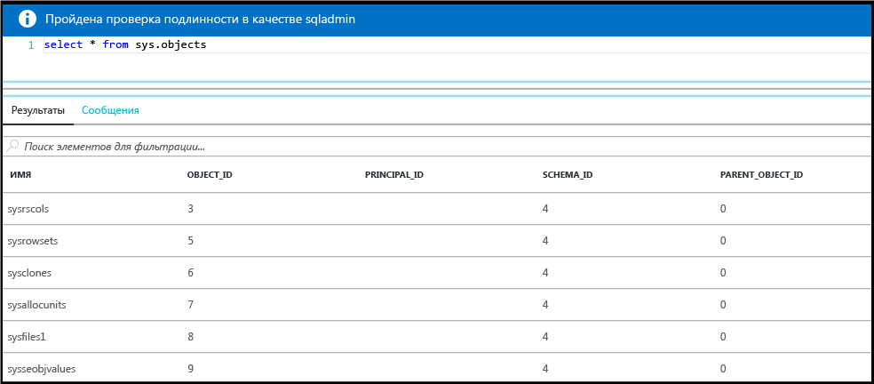

# <a name="create-and-query-a-single-azure-sql-database-in-the-azure-portal"></a>Создание базы данных SQL Azure и отправка к ней запросов с помощью портала Azure

Базы данных SQL Azure можно создать на портале Azure. В этом случае используется интерфейс пользователя на основе браузера для создания и настройки баз данных Azure SQL и всех связанных ресурсов Azure.

## <a name="log-in-to-the-azure-portal"></a>Войдите на портал Azure.

Войдите на [портал Azure](https://portal.azure.com/).

## <a name="create-a-sql-database"></a>Создание базы данных SQL

База данных Azure SQL создается в группе ресурсов Azure на логическом сервере с определенным набором вычислительных ресурсов и ресурсов хранения. Выполните следующие действия, чтобы создать базу данных SQL, содержащую образец данных Adventure Works LT. 

1. Щелкните **Создать** в верхнем левом углу портала Azure.

2. Выберите **Базы данных** в колонке **Создать** и щелкните **База данных SQL** в колонке **Базы данных**.

3. Внесите в форму базы данных SQL необходимые сведения: 
   - Имя базы данных. Укажите имя базы данных.
   - Подписка. Выберите подписку.
   - Группа ресурсов. Выберите новую или существующую.
   - Источник. Выберите **Пример (AdventureWorksLT)**.
   - Сервер. Создайте новый сервер (имя **сервера** должно быть глобально уникальным).
   - Эластичный пул. В этом случае выберите **Не сейчас**.
   - Ценовая категория. Выберите **20 DTU** и хранилище объемом **250** ГБ.
   - Сортировка. Это значение нельзя изменить при импорте образца базы данных. 
   - Установите флажок "Закрепить на панели мониторинга".

      

4. По завершении нажмите кнопку **Создать**. Подготовка занимает несколько минут.
5. После завершения развертывания базы данных SQL выберите **Базы данных SQL** на панели мониторинга или в меню слева и щелкните новую базу данных на странице **Базы данных SQL**.**** Откроется страница с общими сведениями о базе данных, где будет указано полное имя сервера (например, **mynewserver20170313.database.windows.net**) и предоставлены настойки для дальнейшей конфигурации.

       

## <a name="create-a-server-level-firewall-rule"></a>создадим правило брандмауэра на уровне сервера;

Служба базы данных SQL создает брандмауэр, чтобы препятствовать подключению внешних приложений и средств к новому серверу и базе данных. Выполните следующие действия, чтобы создать правило брандмауэра уровня сервера базы данных SQL для IP-адреса для включения внешнего подключения через брандмауэр базы данных SQL. 

1. Щелкните **Настройка брандмауэра для сервера** на панели инструментов базы данных. Откроется страница **параметров брандмауэра** для сервера базы данных SQL. 

       

2. Нажмите кнопку **Добавить IP-адрес клиента** на панели инструментов, а затем щелкните **Сохранить**. Для текущего IP-адреса будет создано правило брандмауэра уровня сервера.

3. Щелкните **ОК** и нажмите кнопку **X**, чтобы закрыть диалоговое окно параметров брандмауэра.

Теперь можно подключиться к базе данных и ее серверу с помощью SQL Server Management Studio или другого средства по своему усмотрению.

## <a name="query-the-sql-database"></a>Отправка запросов к базе данных SQL

Приведенные здесь действия помогут вам запросить базу данных с помощью редактора запросов на портале Azure. 

1. На странице базы данных SQL нажмите кнопку **Средства** на панели инструментов. Откроется страница предварительного просмотра **редактора запросов**.

      

2. Щелкните **Редактор запросов (предварительная версия)**, а затем установите флажок напротив пункта **Условия предварительной версии** и нажмите кнопку **ОК**. Откроется редактор запросов.

3. Щелкните **Вход** и при появлении запроса выберите **Аутентификация SQL Server**, а затем укажите учетные данные и пароль администратора сервера.
4. Нажмите кнопку **ОК**, чтобы выполнить вход.

5. Выполнив проверку подлинности, в окне запросов введите следующий запрос:

   ```
   SELECT pc.Name as CategoryName, p.name as ProductName
   FROM SalesLT.ProductCategory pc
   JOIN SalesLT.Product p
   ON pc.productcategoryid = p.productcategoryid;
   ```

6. Щелкните **Выполнить** и просмотрите результаты запроса в области **Результаты**.

    

7. Нажмите кнопку **X**, чтобы закрыть диалоговое окно редактора запросов.

## <a name="clean-up-resources"></a>Очистка ресурсов

Вы можете сохранить ресурсы, созданные в этой статье, для использования в последующих руководствах. Чтобы удалить все созданные ресурсы, выполните на портале Azure следующие действия.

1. В меню слева на портале Azure щелкните **Группы ресурсов**, а затем выберите **myResourceGroup**. 
2. На странице группы ресурсов щелкните **Удалить**, в текстовом поле введите **myResourceGroup** и щелкните **Удалить**.

## <a name="next-steps"></a>Дальнейшие действия

- Дополнительные сведения о подключении к базе данных SQL с помощью SQL Server Management Studio и выполнении запроса к ней см. [здесь](sql-database-connect-query-ssms.md).
- Дополнительные сведения о подключении с помощью Visual Studio см. в статье [Azure SQL Database: Use Visual Studio Code to connect and query data](sql-database-connect-query.md) (База данных SQL Azure. Использование кода Visual Studio для подключения к базе данных и выполнения запроса).
- Технический обзор базы данных SQL см. в статье [Что такое база данных SQL? Введение в базы данных SQL](sql-database-technical-overview.md).

