<properties
	pageTitle="Руководство по базам данных SQL: создание базы данных SQL | Microsoft Azure"
	description="Из этой статьи вы узнаете, как настроить логический сервер базы данных SQL, правило брандмауэра для сервера, базу данных SQL и демонстрационные данные. Также вы научитесь выполнять подключение с помощью клиентских средств, настраивать пользователей и правила брандмауэра для базы данных."
	keywords="руководство по базам данных SQL, создание базы данных SQL"
	services="sql-database"
	documentationCenter=""
	authors="CarlRabeler"
	manager="jhubbard"
	editor=""/>

<tags
	ms.service="sql-database"
	ms.workload="data-management"
	ms.tgt_pltfrm="na"
	ms.devlang="na"
	ms.topic="hero-article"
	ms.date="09/07/2016"
	ms.author="carlrab"/>

# Руководство по базам данных SQL: создание базы данных SQL за несколько минут с помощью портала Azure

> [AZURE.SELECTOR]
- [Портал Azure](sql-database-get-started.md)
- [C#](sql-database-get-started-csharp.md)
- [PowerShell](sql-database-get-started-powershell.md)

Из этого руководства вы узнаете, как с помощью портала Azure выполнять следующие операции.

- Создание базы данных SQL Azure c помощью демонстрационных данных.
- Создание правила брандмауэра уровня сервера для одного IP-адреса или диапазона IP-адресов.

Эти же задачи можно выполнять с помощью [C#](sql-database-get-started-csharp.md) или [PowerShell](sql-database-get-started-powershell.md).

[AZURE.INCLUDE [Вход](../../includes/azure-getting-started-portal-login.md)]

## Создание своей первой базы данных SQL Azure 

1. Если вы еще этого не сделали, подключитесь к [порталу Azure](http://portal.azure.com).
2. Щелкните **Создать**, **Данные+хранилище** и найдите элемент **База данных SQL**.

    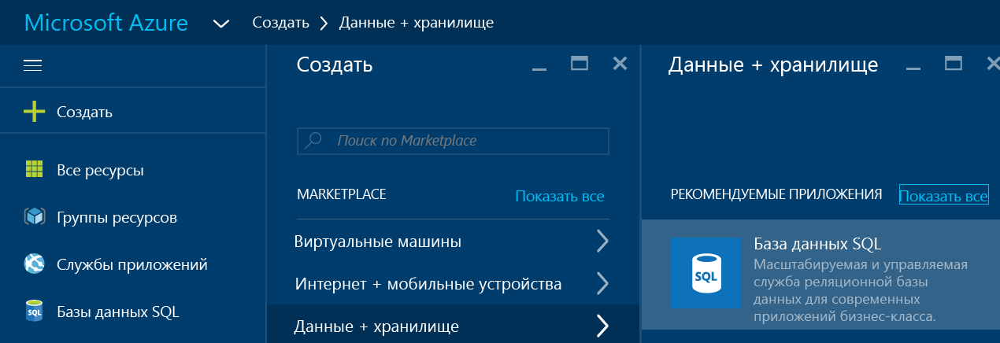

3. Щелкните **База данных SQL**, чтобы открыть колонку "База данных SQL". Содержимое этой колонки зависит от количества подписок и существующих объектов (например, существующих серверов).

    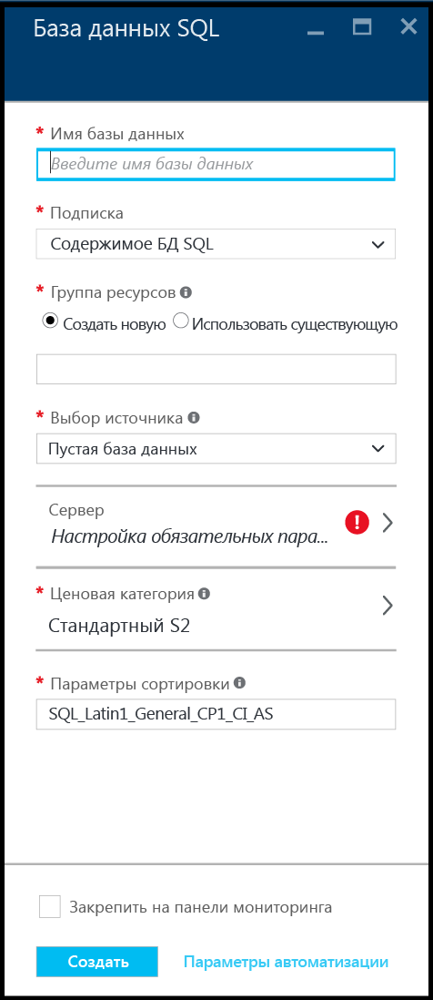

4. В текстовое поле **Имя базы данных** введите имя для своей первой базы данных, например "моя-база-данных". Зеленый флажок указывает, что выбрано допустимое имя.

    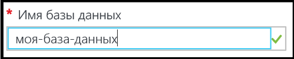

5. Выберите подписку (если у вас их несколько).
6. В разделе **Группа ресурсов** щелкните **Создать** и укажите имя для своей первой группы ресурсов, например "моя-группа-ресурсов". Зеленый флажок указывает, что выбрано допустимое имя.

    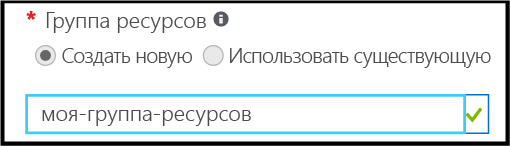

7. В списке **Выбор источника** выберите пункт **Образец**, а затем в списке **Выбор образца** щелкните **AdventureWorksLT [V12]**.

    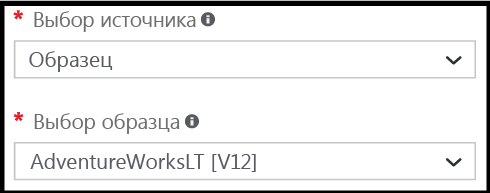

8. В разделе **Сервер** щелкните **Настройка обязательных параметров**.

    

9. В колонке "Сервер" щелкните **Создать сервер**. В объекте сервера (это может быть новый или существующий сервер) будет создана база данных SQL Azure.

    

10. Просмотрите колонку **Создание сервера**, чтобы узнать, какие сведения следует указать для нового сервера.

    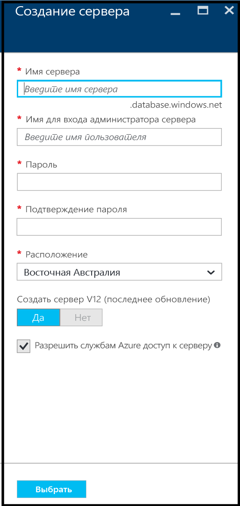

11. В текстовое поле **Имя сервера** введите имя для своего первого сервера, например "мой-новый-серверный-объект". Зеленый флажок указывает, что выбрано допустимое имя.

    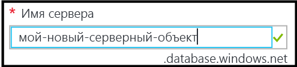
 
12. В поле **Имя для входа администратора сервера** укажите имя пользователя, которое будет использоваться для входа администратора на этот сервер, например my-admin-account. Это имя называется именем субъекта сервер. Зеленый флажок указывает, что выбрано допустимое имя.

    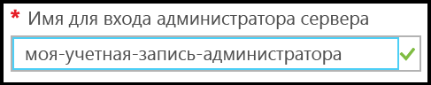

13. В полях **Пароль** и **Подтверждение пароля** укажите пароль учетной записи субъекта сервера, например p@ssw0rd1. Зеленый флажок указывает, что выбран допустимый пароль.

    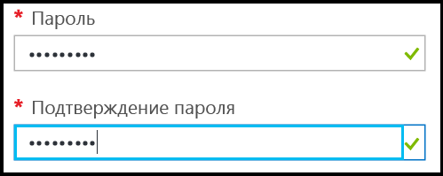
 
14. В списке **Расположение** выберите центр обработки данных, соответствующий вашему расположению, например "Восточная Австралия".

    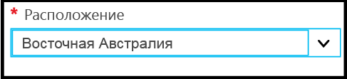

15. В разделе **"Создать сервер V12 (последнее обновление)" обратите внимание, что доступен только вариант создания текущей версии сервера SQL Azure.

    

16. Обратите внимание, что по умолчанию флажок **Разрешить службам Azure доступ к серверу** установлен и его нельзя изменить здесь. Это дополнительный параметр. Его можно изменить в параметрах брандмауэра сервера для этого объекта сервера, хотя в большинстве случаев это не требуется.

    

17. В колонке "Создание сервера" просмотрите выбранные параметры и нажмите кнопку **Выбрать**, чтобы выбрать этот сервер для новой базы данных.

    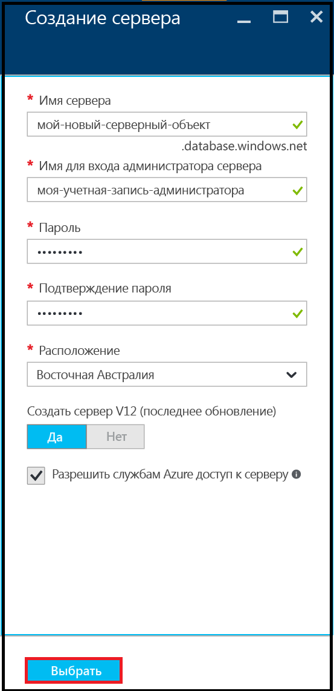

18. В колонке "База данных SQL" в разделе **Ценовая категория** щелкните **Стандартный S2**, а затем **Базовый**, чтобы выбрать самую низкую ценовую категорию для своей первой базы данных. Ценовую категорию всегда можно изменить позднее.

    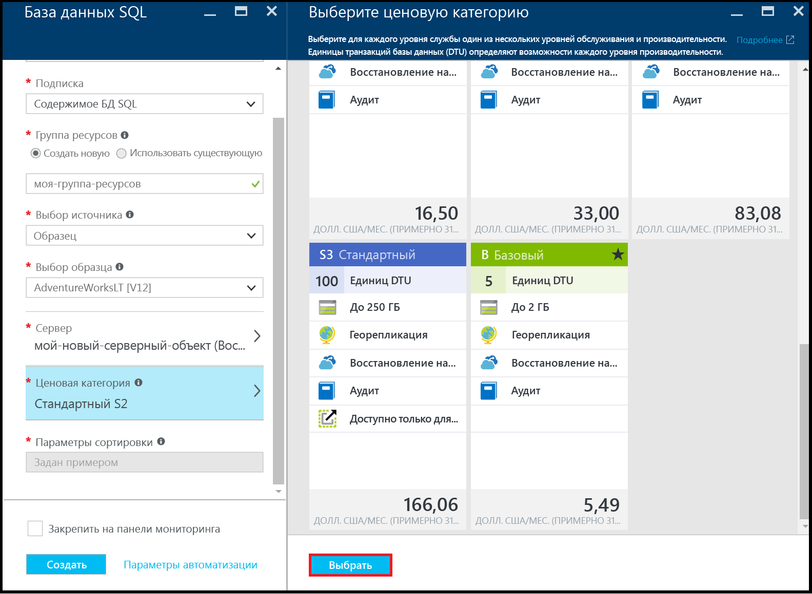

19. В колонке "База данных SQL" просмотрите выбранные параметры и нажмите кнопку **Создать**, чтобы создать свой первый сервер и базу данных. Указанные вами значения пройдут проверку, и начнется развертывание.

    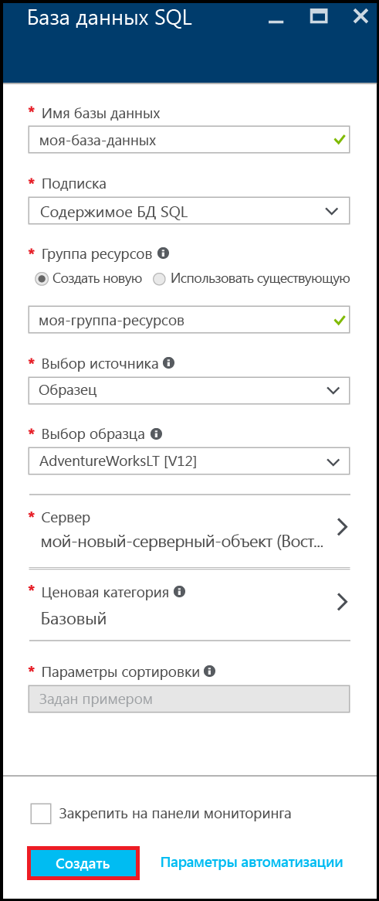

20. Чтобы проверить состояние развертывания, на портале на панели инструментов щелкните **Уведомления**.

    

>[AZURE.IMPORTANT]Когда развертывание завершится, в Azure будут созданы новый сервер и база данных SQL Azure. Вы не сможете подключиться к новому серверу или базе данных с помощью средств SQL Server, пока не создадите правило брандмауэра для сервера, которое открывает брандмауэр базы данных SQL для подключений извне Azure.

[AZURE.INCLUDE [Создание правила брандмауэра для сервера](../../includes/sql-database-create-new-server-firewall-portal.md)]

## Дальнейшие действия
После выполнения инструкций из этого руководства по базам данных SQL у вас будет готовая база данных с демонстрационными данными, которую можно использовать с помощью привычных средств.

- Если вы знакомы с языком Transact-SQL и средой SQL Server Management Studio (SSMS), см. сведения о [подключении и создании запросов к базе данных SQL с помощью SSMS](sql-database-connect-query-ssms.md).

- Если вы знаете Excel, узнайте, как [подключиться к базе данных SQL в Azure с помощью Excel](sql-database-connect-excel.md).

- Если вы готовы написать свой собственный код, выберите язык программирования в [библиотеках подключений для базы данных SQL и SQL Server](sql-database-libraries.md).

- Если вы хотите переместить в Azure локальные базы данных SQL Server, см. статью [Миграция базы данных SQL Server в базу данных SQL в облаке](sql-database-cloud-migrate.md).

- Если вы хотите загрузить данные в новую таблицу из CSV-файла с помощью программы командной строки BCP, см. статью [Загрузка данных из CSV-файла в хранилище данных SQL Azure (неструктурированные файлы)](sql-database-load-from-csv-with-bcp.md).

- Если вы хотите начать изучение безопасности базы данных SQL Azure, см. [эту статью](sql-database-get-started-security.md).

## Дополнительные ресурсы

[Что такое база данных SQL?](sql-database-technical-overview.md)

<!---HONumber=AcomDC_0914_2016--->