# <a name="configure-and-restore-from-azure-sql-database-long-term-backup-retention-using-azure-recovery-services-vault"></a>Настройка долгосрочного хранения резервных копий для базы данных SQL Azure и восстановление из резервной копии с помощью хранилища служб восстановления Azure

Вы можете настроить хранилище служб восстановления Azure для хранения резервных копий баз данных SQL Azure, а затем восстановить базы данных из сохраненных резервных копий, используя портал Azure или PowerShell.

> [!NOTE]
> Как составная часть начальной версии пробного выпуска функции долгосрочного хранения резервных копий, вышедшей в октябре 2016 г., резервные копии хранились в хранилище службы восстановления служб Azure. Данное обновление устраняет такую зависимость, но для обеспечения обратной совместимости поддержка исходного API сохраняется до 31 мая 2018 г. Сведения о взаимодействии с резервными копиями в хранилище службы восстановления служб Azure см. в статье [Configure and restore from Azure SQL Database long-term backup retention using Azure Recovery Services Vault](sql-database-long-term-backup-retention-configure-vault.md) (Настройка и восстановление с использованием долгосрочного хранения резервных копий базы данных SQL Azure с помощью хранилища служб восстановления Azure). 


## <a name="azure-portal"></a>Портал Azure

В следующих разделах показывается, как с помощью портала Azure настроить хранилище служб восстановления Azure, просмотреть резервные копии в хранилище и выполнить восстановление из хранилища.

### <a name="configure-the-vault-register-the-server-and-select-databases"></a>Настройка хранилища, регистрация сервера и выбор баз данных

Вы настроите более длительный срок [хранения создаваемых автоматически резервных копий](sql-database-long-term-retention.md) в хранилище служб восстановления Azure, чем для вашего уровня служб. 

1. Откройте страницу **SQL Server** для своего сервера.

   

2. Щелкните **Long-term backup retention** (Долгосрочное хранение резервных копий).

   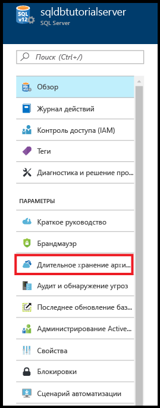

3. На странице **Долгосрочное хранение архивных копий** для вашего сервера просмотрите и примите условия использования предварительной версии (если вы этого еще не сделали или эта функция по-прежнему находится на этапе предварительной версии).

   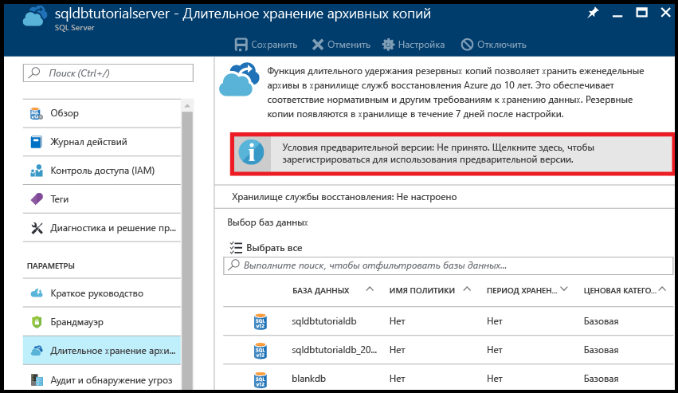

4. Чтобы настроить долгосрочное хранение резервных копий, выберите эту базу данных в таблице и щелкните **Настройка** на панели инструментов.

   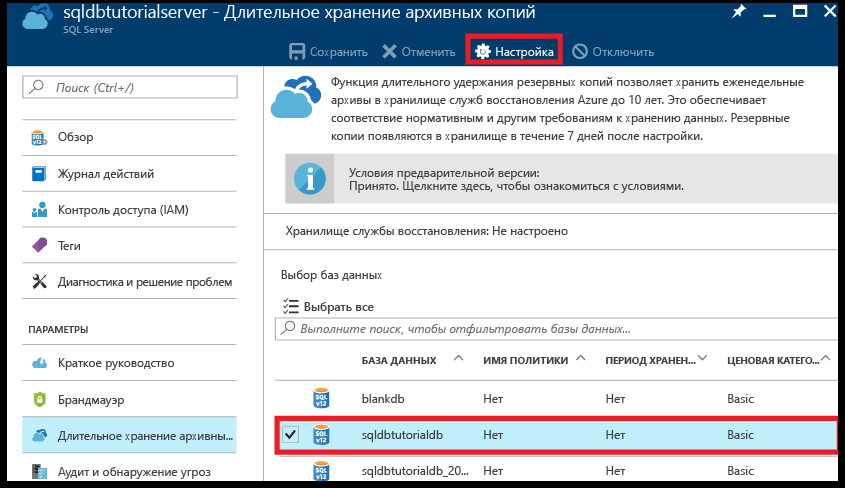

5. На странице **Настройка** в разделе **Хранилище служб восстановления** щелкните **Настройка обязательных параметров**.

   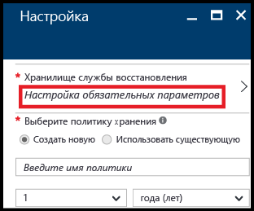

6. На странице **Хранилище служб восстановления** выберите имеющееся хранилище (при наличии). Если хранилище служб восстановления отсутствует, щелкните, чтобы выйти, и создайте хранилище служб восстановления.

   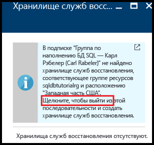

7. На странице **Хранилища служб восстановления** щелкните **Добавить**.

   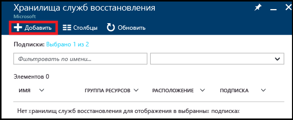
   
8. На странице **Хранилище служб восстановления** введите допустимое имя для хранилища служб восстановления.

   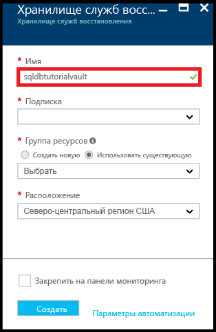

9. Выберите подписку и группу ресурсов, а затем выберите расположение хранилища. По завершении нажмите кнопку **Создать**.

   

   > [!IMPORTANT]
   > Хранилище должно находиться в том же регионе, что и логический сервер Azure SQL Server, и использовать ту же группу ресурсов.
   >

10. После создания хранилища вернитесь на страницу **Хранилище служб восстановления**.

11. На странице **Хранилище служб восстановления** щелкните хранилище, а затем нажмите кнопку **Выбрать**.

   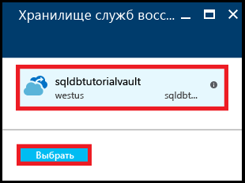

12. На странице **Настройка** введите допустимое имя для новой политики хранения, измените ее должным образом и нажмите кнопку **ОК**.

   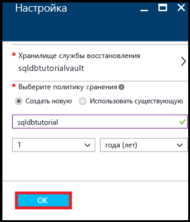
   
   >[!NOTE]
   >В именах политик хранения запрещено использовать некоторые знаки, включая пробелы.

13. На странице **Долгосрочное хранение архивных копий** для вашей базы данных щелкните **Сохранить**, а затем нажмите кнопку **ОК**, чтобы применить политику долгосрочного хранения резервных копий ко всем выбранным базам данных.

   

14. Щелкните **Сохранить**, чтобы включить новую политику долгосрочного хранения резервных копий в настроенном хранилище служб восстановления Azure.

   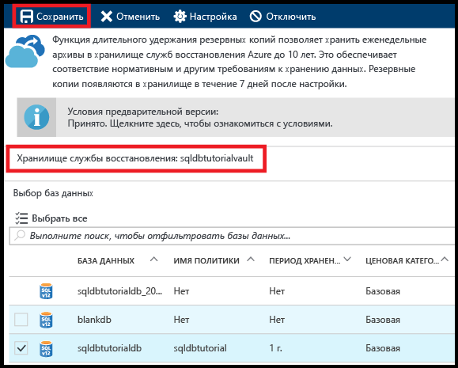

> [!IMPORTANT]
> После настройки резервные копии появятся в хранилище в течение следующих семи дней. Не выполняйте следующие этапы до появления резервных копий в хранилище.
>

### <a name="view-backups-in-long-term-retention-using-azure-portal"></a>Просмотр резервных копий долгосрочного хранения с помощью портала Azure

Просмотрите сведения о резервных копиях базы данных в хранилище с включенной функцией [долгосрочного хранения резервных копий](sql-database-long-term-retention.md). 

1. На портале Azure откройте хранилище служб восстановления Azure, где хранятся резервные копии вашей базы данных (щелкните **Все ресурсы** и выберите его из списка ресурсов вашей подписки), чтобы просмотреть сведения об объеме хранилища, используемого для хранения резервных копий базы данных.

   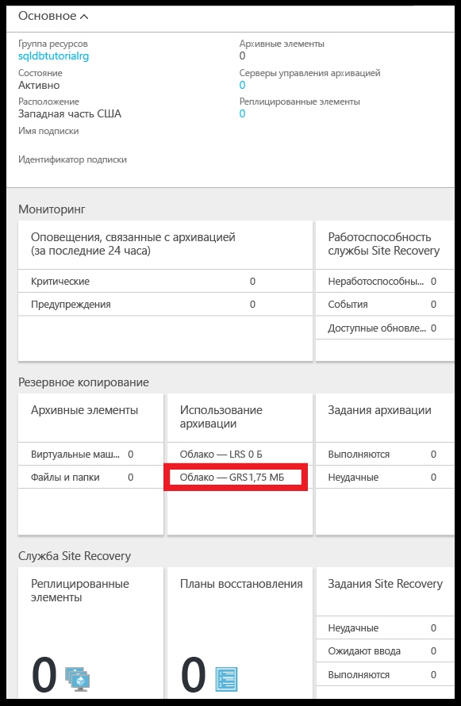

2. Откройте страницу **База данных SQL** для своей базы данных.

   

3. На панели инструментов щелкните **Восстановить**.

   

4. На странице "Восстановление" щелкните **Долгосрочные**.

5. В разделе Azure vault backups (Резервные копии хранилища Azure) щелкните **Выберите архив**, чтобы просмотреть список доступных резервных копий с долгосрочным хранением.

   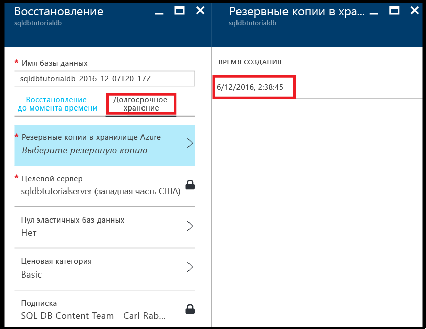

### <a name="restore-a-database-from-a-backup-in-long-term-backup-retention-using-the-azure-portal"></a>Восстановление базы данных из резервной копии долгосрочного хранения с помощью портала Azure

Вы восстановите имеющуюся базу данных из резервной копии, расположенной в хранилище служб восстановления Azure, в новую базу данных.

1. На странице **Архивные копии в хранилище Azure** щелкните резервную копию, которую необходимо восстановить, а затем нажмите кнопку **Выбрать**.

   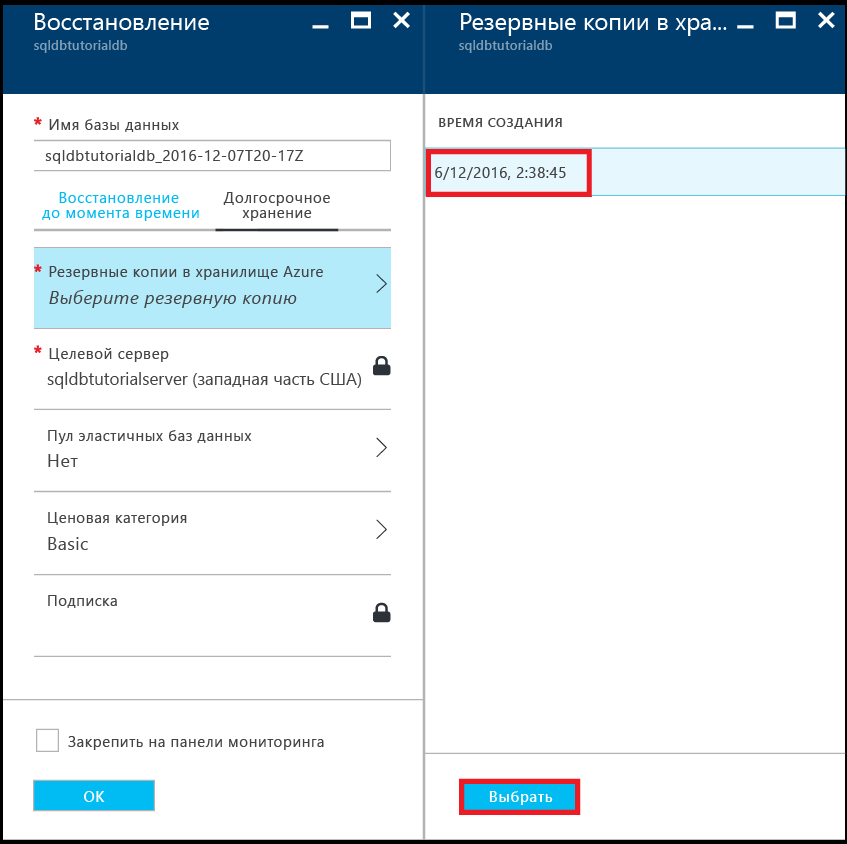

2. В текстовом поле **Имя базы данных** введите имя для восстановленной базы данных.

   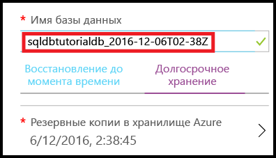

3. Нажмите кнопку **ОК**, чтобы восстановить базу данных из резервной копии, расположенной в хранилище, в новую базу данных.

4. На панели инструментов щелкните значок уведомления, чтобы просмотреть состояние задания восстановления.

   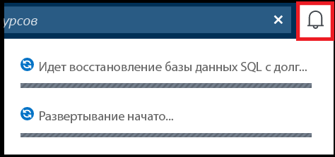

5. После завершения задания откройте страницу **Базы данных SQL**, чтобы просмотреть восстановленную базу данных.

   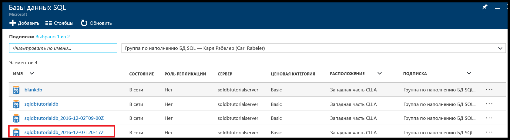

> [!NOTE]
> Здесь вы можете подключиться к восстановленной базе данных с помощью SQL Server Management Studio и выполнить необходимые задания, например [извлечь часть данных из восстановленной базы данных, чтобы скопировать их в имеющуюся базу данных, или удалить имеющуюся базу данных и присвоить ее имя восстановленной базе данных](sql-database-recovery-using-backups.md#point-in-time-restore).
>

## <a name="powershell"></a>PowerShell

В следующих разделах показывается, как с помощью PowerShell настроить хранилище служб восстановления Azure, просмотреть резервные копии в хранилище и выполнить восстановление из хранилища.

### <a name="create-a-recovery-services-vault"></a>Создание хранилища служб восстановления

Воспользуйтесь командлетом [New-AzureRmRecoveryServicesVault](/powershell/module/azurerm.recoveryservices/new-azurermrecoveryservicesvault), чтобы создать хранилище служб восстановления.

> [!IMPORTANT]
> Хранилище должно находиться в том же регионе, что и логический сервер Azure SQL Server, и использовать ту же группу ресурсов.

```PowerShell
# Create a recovery services vault

#$resourceGroupName = "{resource-group-name}"
#$serverName = "{server-name}"
$serverLocation = (Get-AzureRmSqlServer -ServerName $serverName -ResourceGroupName $resourceGroupName).Location
$recoveryServiceVaultName = "{new-vault-name}"

$vault = New-AzureRmRecoveryServicesVault -Name $recoveryServiceVaultName -ResourceGroupName $ResourceGroupName -Location $serverLocation 
Set-AzureRmRecoveryServicesBackupProperties -BackupStorageRedundancy LocallyRedundant -Vault $vault
```

### <a name="set-your-server-to-use-the-recovery-vault-for-its-long-term-retention-backups"></a>Настройка сервера на использование хранилища служб восстановления для долгосрочного хранения резервных копий

Воспользуйтесь командлетом [Set-AzureRmSqlServerBackupLongTermRetentionVault](/powershell/module/azurerm.sql/set-azurermsqlserverbackuplongtermretentionvault), чтобы связать созданное ранее хранилище служб восстановления с определенным сервером SQL Azure.

```PowerShell
# Set your server to use the vault to for long-term backup retention 

Set-AzureRmSqlServerBackupLongTermRetentionVault -ResourceGroupName $resourceGroupName -ServerName $serverName -ResourceId $vault.Id
```

### <a name="create-a-retention-policy"></a>Создание политики хранения

Политика хранения определяет срок хранения резервной копии базы данных. Воспользуйтесь командлетом [Get-AzureRmRecoveryServicesBackupRetentionPolicyObject](https://docs.microsoft.com/powershell/resourcemanager/azurerm.recoveryservices.backup/v2.3.0/get-azurermrecoveryservicesbackupretentionpolicyobject), чтобы получить политику хранения по умолчанию. Она будет использоваться как шаблон при создании других политик. В этом шаблоне для срока хранения задано значение 2 года. Затем выполните командлет [New-AzureRmRecoveryServicesBackupProtectionPolicy](/powershell/module/azurerm.recoveryservices.backup/new-azurermrecoveryservicesbackupprotectionpolicy), чтобы создать политику. 

> [!NOTE]
> Для некоторых командлетов необходимо настроить контекст хранилища перед выполнением ([Set-AzureRmRecoveryServicesVaultContext](/powershell/module/azurerm.recoveryservices/set-azurermrecoveryservicesvaultcontext)). Поэтому вы увидите этот командлет в нескольких связанных фрагментах кода. Контекст необходимо настроить, так как политика является частью хранилища. Вы можете создать несколько политик хранения для каждого хранилища, а затем применять требуемую политику для указанных баз данных. 


```PowerShell
# Retrieve the default retention policy for the AzureSQLDatabase workload type
$retentionPolicy = Get-AzureRmRecoveryServicesBackupRetentionPolicyObject -WorkloadType AzureSQLDatabase

# Set the retention value to two years (you can set to any time between 1 week and 10 years)
$retentionPolicy.RetentionDurationType = "Years"
$retentionPolicy.RetentionCount = 2
$retentionPolicyName = "my2YearRetentionPolicy"

# Set the vault context to the vault you are creating the policy for
Set-AzureRmRecoveryServicesVaultContext -Vault $vault

# Create the new policy
$policy = New-AzureRmRecoveryServicesBackupProtectionPolicy -name $retentionPolicyName -WorkloadType AzureSQLDatabase -retentionPolicy $retentionPolicy
$policy
```

### <a name="configure-a-database-to-use-the-previously-defined-retention-policy"></a>Настройка базы данных для использования ранее определенной политики хранения

Воспользуйтесь командлетом [Set-AzureRmSqlDatabaseBackupLongTermRetentionPolicy](/powershell/module/azurerm.sql/set-azurermsqldatabasebackuplongtermretentionpolicy), чтобы применить новую политику к определенной базе данных.

```PowerShell
# Enable long-term retention for a specific SQL database
$policyState = "enabled"
Set-AzureRmSqlDatabaseBackupLongTermRetentionPolicy -ResourceGroupName $resourceGroupName -ServerName $serverName -DatabaseName $databaseName -State $policyState -ResourceId $policy.Id
```

### <a name="view-backup-info-and-backups-in-long-term-retention"></a>Просмотр сведений о резервных копиях с включенной функцией долгосрочного хранения

Просмотрите сведения о резервных копиях базы данных в хранилище с включенной функцией [долгосрочного хранения резервных копий](sql-database-long-term-retention.md). 

Воспользуйтесь следующими командлетами для просмотра сведений о резервных копиях:

- [Get-AzureRmRecoveryServicesBackupContainer](/powershell/module/azurerm.recoveryservices.backup/get-azurermrecoveryservicesbackupcontainer)
- [Get-AzureRmRecoveryServicesBackupItem](/powershell/module/azurerm.recoveryservices.backup/get-azurermrecoveryservicesbackupitem)
- [Get-AzureRmRecoveryServicesBackupRecoveryPoint](/powershell/module/azurerm.recoveryservices.backup/get-azurermrecoveryservicesbackuprecoverypoint)

```PowerShell
#$resourceGroupName = "{resource-group-name}"
#$serverName = "{server-name}"
$databaseNeedingRestore = $databaseName

# Set the vault context to the vault we want to restore from
#$vault = Get-AzureRmRecoveryServicesVault -ResourceGroupName $resourceGroupName
Set-AzureRmRecoveryServicesVaultContext -Vault $vault

# the following commands find the container associated with the server 'myserver' under resource group 'myresourcegroup'
$container = Get-AzureRmRecoveryServicesBackupContainer -ContainerType AzureSQL -FriendlyName $vault.Name

# Get the long-term retention metadata associated with a specific database
$item = Get-AzureRmRecoveryServicesBackupItem -Container $container -WorkloadType AzureSQLDatabase -Name $databaseNeedingRestore

# Get all available backups for the previously indicated database
# Optionally, set the -StartDate and -EndDate parameters to return backups within a specific time period
$availableBackups = Get-AzureRmRecoveryServicesBackupRecoveryPoint -Item $item
$availableBackups
```

### <a name="restore-a-database-from-a-backup-in-long-term-backup-retention"></a>Восстановление базы данных из резервной копии с долгосрочным хранением

Для восстановления из резервной копии долгосрочного хранения используется командлет [Restore-AzureRmSqlDatabase](/powershell/module/azurerm.sql/restore-azurermsqldatabase).

```PowerShell
# Restore the most recent backup: $availableBackups[0]
#$resourceGroupName = "{resource-group-name}"
#$serverName = "{server-name}"
$restoredDatabaseName = "{new-database-name}"
$edition = "Basic"
$performanceLevel = "Basic"

$restoredDb = Restore-AzureRmSqlDatabase -FromLongTermRetentionBackup -ResourceId $availableBackups[0].Id -ResourceGroupName $resourceGroupName `
 -ServerName $serverName -TargetDatabaseName $restoredDatabaseName -Edition $edition -ServiceObjectiveName $performanceLevel
$restoredDb
```


> [!NOTE]
> Здесь вы можете подключиться к восстановленной базе данных с помощью SQL Server Management Studio и выполнить необходимые задания, например извлечь часть данных из восстановленной базы данных, чтобы скопировать их в имеющуюся базу данных или удалить имеющуюся базу данных и присвоить ее имя восстановленной базе данных. Ознакомьтесь с [восстановлением до точки во времени](sql-database-recovery-using-backups.md#point-in-time-restore).

## <a name="next-steps"></a>Дополнительная информация

- Дополнительные сведения о резервных копиях базы данных, создаваемых автоматически службой, см. в [этой статье](sql-database-automated-backups.md).
- Дополнительные сведения о долгосрочном хранении резервных копий см. в статье [Хранение резервных копий базы данных SQL Azure до 10 лет](sql-database-long-term-retention.md).
- Дополнительные сведения о восстановлении из резервных копий см. в статье [Восстановление базы данных Azure SQL с помощью создаваемых автоматически резервных копий](sql-database-recovery-using-backups.md).
