<properties
	pageTitle="Управление базой данных SQL Azure с помощью портала Azure | Microsoft Azure"
	description="Узнайте, как использовать портал Azure для управления реляционной базой данных в облаке."
	services="sql-database"
	documentationCenter=""
	authors="stevestein"
	manager="jhubbard"
	editor=""/>

<tags
	ms.service="sql-database"
	ms.devlang="NA"
	ms.workload="data-management"
	ms.topic="article"
	ms.tgt_pltfrm="NA"
	ms.date="09/19/2016"
	ms.author="sstein"/>

# Управление базами данных SQL Azure с помощью портала Azure

> [AZURE.SELECTOR]
- [Портал Azure](sql-database-manage-portal.md)
- [SSMS](sql-database-manage-azure-ssms.md)
- [PowerShell](sql-database-command-line-tools.md)

[Портал Azure](https://portal.azure.com/) позволяет создавать базы данных и серверы SQL Azure, выполнять их мониторинг, а также управлять ими. В этой статье представлено краткое описание самых распространенных задач, а также ссылки на дополнительные сведения.

## Просмотр баз данных, серверов и пулов SQL Azure

Чтобы просмотреть доступные службы Базы данных SQL, щелкните **Другие службы** и в поле поиска введите **SQL**.

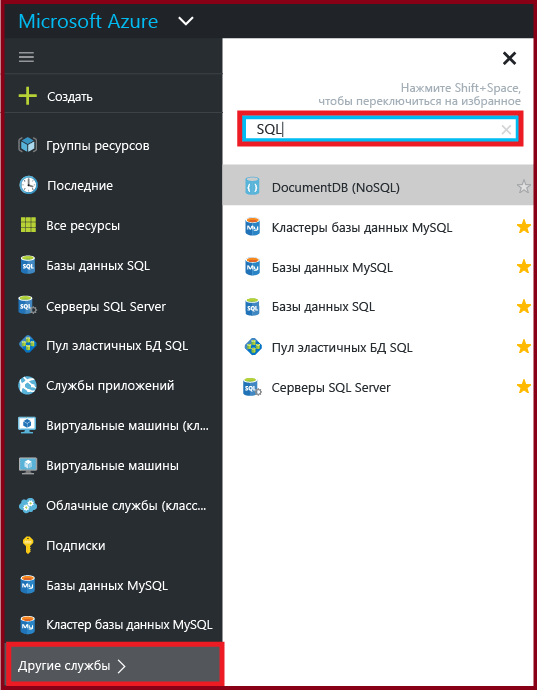

## Как создать или просмотреть базы данных SQL Azure?

Чтобы открыть колонку **Базы данных SQL**, щелкните **Базы данных SQL** и выберите базу данных, с которой будете работать, или щелкните **Добавить** для создания базы данных SQL. Дополнительные сведения см. в статье [Руководство по базам данных SQL: создание базы данных SQL за несколько минут с помощью портала Azure](sql-database-get-started.md).

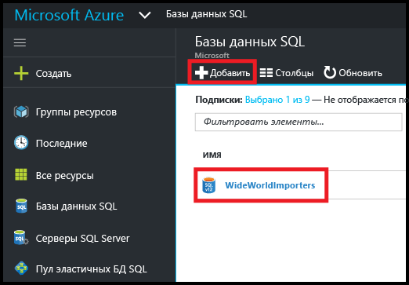

## Как создать или просмотреть серверы SQL Azure?

Чтобы открыть колонку **Серверы SQL**, щелкните **Серверы SQL** и выберите сервер, с которым будете работать, или нажмите кнопку **Добавить** для создания сервера SQL. Дополнительные сведения см. в статье [Руководство по базам данных SQL: создание базы данных SQL за несколько минут с помощью портала Azure](sql-database-get-started.md).

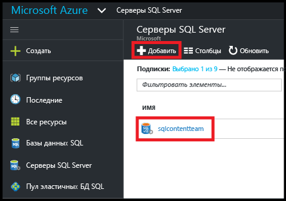

## Как создать или просмотреть пул эластичных БД SQL?

Чтобы открыть колонку **Пулы эластичных БД SQL**, щелкните **Пулы эластичных БД SQL** и выберите пул, с которым будете работать, или нажмите кнопку **Добавить** для создания пула. Дополнительные сведения см. в статье [Создание пула эластичных баз данных на портале Azure](sql-database-elastic-pool-create-portal.md).

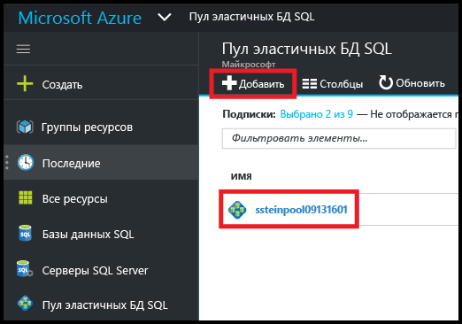

## Как обновить или просмотреть параметры базы данных SQL?

Чтобы просмотреть или обновить параметры базы данных, выберите нужный параметр в колонке базы данных SQL.

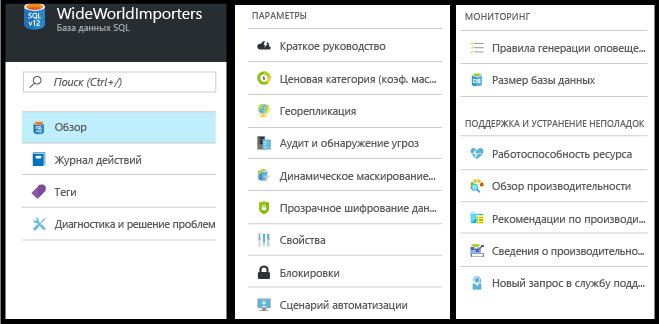

## Как найти полное имя сервера баз данных SQL?

Чтобы просмотреть имя сервера баз данных, щелкните **Обзор** в колонке **База данных SQL** и запишите имя сервера.

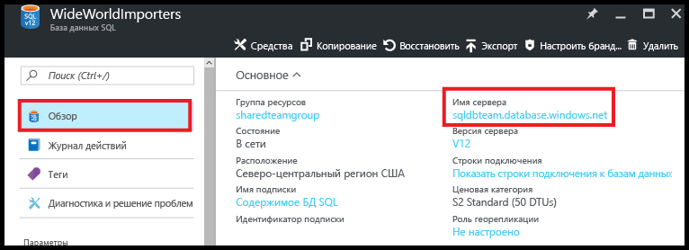

## Как управлять правилами брандмауэра, чтобы контролировать доступ к серверу и базе данных SQL?

Чтобы просмотреть, создать или обновить правила брандмауэра, щелкните **Set server firewall** (Установить брандмауэр сервера) в колонке **База данных SQL**. Дополнительные сведения см. в статье [Настройка правила брандмауэра уровня сервера базы данных SQL Azure с помощью портала Azure](sql-database-configure-firewall-settings.md).

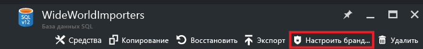

## Как изменить уровень обслуживания или производительности базы данных SQL?

Чтобы обновить уровень обслуживания или производительности базы данных SQL, щелкните **Ценовая категория (единицы DTU масштабирования)** в колонке **База данных SQL**. Дополнительные сведения см. в статье [Изменение уровня обслуживания и уровня производительности (ценовой категории) базы данных SQL](sql-database-scale-up.md).

## Как настроить аудит и обнаружение угроз для базы данных SQL?

Чтобы настроить аудит и обнаружение угроз для базы данных SQL, щелкните **Auditing and Threat detection** (Аудит и обнаружение угроз) в колонке **База данных SQL**. Дополнительные сведения см. в статье [Приступая к работе с аудитом базы данных SQL](sql-database-auditing-get-started.md) и [Приступая к работе с системой обнаружения угроз базы данных SQL](sql-database-threat-detection-get-started.md).

## Как настроить динамическое маскирование данных для базы данных SQL?

Чтобы настроить динамическое маскирование данных для базы данных SQL, щелкните **Динамическое маскирование данных** в колонке **База данных SQL**. Дополнительные сведения см. в статье [Начало работы с динамическим маскированием данных в базе данных SQL (портал Azure)](sql-database-dynamic-data-masking-get-started.md).

## Как настроить прозрачное шифрование данных (TDE) для базы данных SQL?

Чтобы настроить прозрачное шифрование данных для базы данных SQL, щелкните **Прозрачное шифрование данных** в колонке **База данных SQL**. Дополнительные сведения см. в разделе [Включение TDE в базе данных с помощью портала](https://msdn.microsoft.com/library/dn948096#Anchor_1).

## Как просмотреть или изменить максимальный размер базы данных SQL?

Чтобы просмотреть или изменить размер базы данных SQL, щелкните **Размер базы данных** в колонке **База данных SQL**. Чтобы обновить максимальный размер базы данных, измените уровень обслуживания или производительности. Дополнительные сведения см. в статье [Изменение уровня обслуживания и уровня производительности (ценовой категории) базы данных SQL](sql-database-scale-up.md).

## Как выполнять мониторинг производительности базы данных SQL и повысить ее?

Чтобы выполнять мониторинг производительности базы данных SQL и повысить ее, щелкните **Performance overview** (Обзор производительности) в колонке **База данных SQL**. Дополнительные сведения см. в статье [Анализ производительности базы данных SQL](sql-database-performance.md).

## Как настроить георепликацию?

Чтобы настроить георепликацию для базы данных SQL, щелкните **Георепликация** в колонке **База данных SQL**. Дополнительные сведения см. в статье [Настройка георепликации для базы данных SQL Azure с помощью портала Azure](sql-database-geo-replication-portal.md).

## Как выполнить отработку отказа и перейти в геореплицированную базу данных SQL?

Чтобы выполнить отработку отказа и перейти в базу данных-получатель, щелкните **Георепликация** в колонке **База данных SQL** и щелкните **Отработка отказа**. Дополнительные сведения см. в статье [Запуск плановой или незапланированной отработки отказа для базы данных SQL Azure с помощью портала Azure](sql-database-geo-replication-failover-portal.md).

## Как скопировать базу данных SQL?

Чтобы скопировать базу данных SQL, щелкните **Копировать** в колонке **База данных SQL**. Дополнительные сведения см. в статье [Копирование базы данных SQL Azure с помощью портала Azure](sql-database-copy-portal.md).

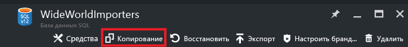

## Как архивировать базу данных SQL Azure в BACPAC-файл?

Чтобы создать BACPAC-файл из базы данных SQL, щелкните **Экспортировать** в колонке **База данных SQL**. Дополнительные сведения см. в статье [Архивация базы данных SQL Azure в BACPAC-файл с помощью портала Azure](sql-database-export.md).

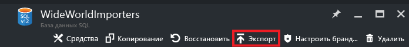

## Как восстановить состояние базы данных SQL до момента времени в прошлом?

Чтобы восстановить базу данных SQL, щелкните **Восстановить** в колонке **База данных SQL**. Дополнительные сведения см. в статье [Восстановление базы данных SQL Azure до момента времени в прошлом с помощью портала Azure](sql-database-point-in-time-restore-portal.md).

## Как создать базу данных SQL Azure из BACPAC-файла?

Чтобы создать базу данных SQL из BACPAC-файла, щелкните **Импорт базы данных** в колонке **Сервер SQL**. Дополнительные сведения см. в статье [Импорт BACPAC-файла для создания базы данных SQL Azure](sql-database-import.md).

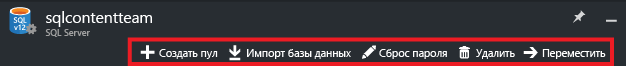

## Как восстановить удаленную базу данных SQL?

Чтобы восстановить удаленную базу данных SQL, щелкните **Удаленные базы данных** в колонке **Сервер SQL** (сервер SQL, содержащий удаленную базу данных). Дополнительные сведения см. в статье [Восстановление удаленной базы данных SQL Azure на портале Azure](sql-database-restore-deleted-database-portal.md).

## Как удалить базу данных SQL?

Чтобы удалить базу данных SQL, щелкните **Удалить** в колонке **База данных SQL**.

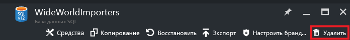

## Дополнительные ресурсы

- [База данных SQL](sql-database-technical-overview.md)
- [Мониторинг пула эластичных баз данных и управление им на портале Azure](sql-database-elastic-pool-manage-portal.md)

<!---HONumber=AcomDC_0921_2016-->