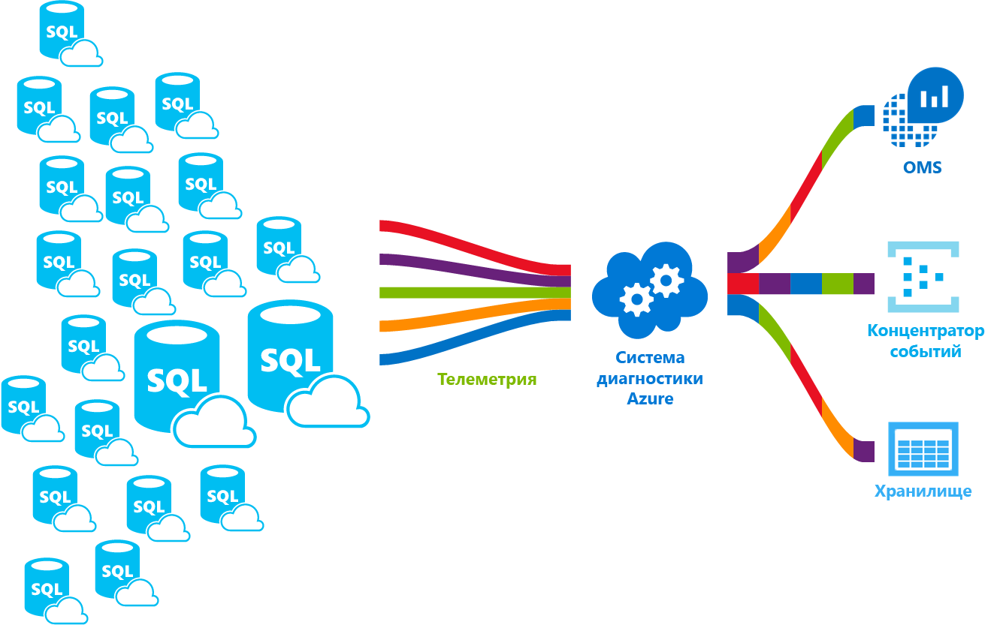

# <a name="azure-sql-database-metrics-and-diagnostics-logging"></a>Метрики и журналы диагностики базы данных SQL Azure 
База данных SQL Azure может выдавать значения метрик и журналы диагностики для упрощения мониторинга. Вы можете настроить базу данных SQL для хранения сведений об использовании ресурсов, о рабочих ролях и сеансах, а также настроить подключение к одному из этих ресурсов Azure:

* **Служба хранилища Azure**. Используется для архивации больших объемов телеметрии по оптимальной стоимости.
* **Концентраторы событий Azure**. Используются для интеграции телеметрии базы данных SQL с настраиваемым решением для мониторинга или горячими конвейерами.
* **Azure Log Analytics**. Используется для встроенного решения для мониторинга с возможностями предоставления отчетов, предупреждений и выполнения исправлений. Этот компонент входит в пакет [Operations Management Suite (OMS)](../operations-management-suite/operations-management-suite-overview.md).

    

## <a name="enable-logging"></a>Включение ведения журналов

Метрики и журналы диагностики не включены по умолчанию. Вы можете включить их и управлять ими, используя один из следующих методов:

- Портал Azure
- PowerShell
- Инфраструктура CLI Azure
- Azure Monitor REST API 
- Шаблон диспетчера ресурсов Azure

При включении метрик и журналов диагностики необходимо указать ресурс Azure, где собираются выбранные данные. Доступны следующие варианты.

- Log Analytics
- Концентраторы событий
- Служба хранилища 

Вы можете подготовить новый ресурс Azure или выбрать имеющийся. После выбора ресурса хранилища необходимо указать, какие данные нужно собирать. Доступны следующие варианты.

- [Все метрики](sql-database-metrics-diag-logging.md#all-metrics) содержат сведения о проценте использования DTU, ограничении DTU, проценте использования ЦП, проценте чтения физических данных, проценте записей в журнал, проценте успешных, неудачных или заблокированных подключений брандмауэра, проценте сеансов, проценте рабочих ролей, хранилище, проценте хранилища и проценте хранилища XTP.
- [QueryStoreRuntimeStatistics](sql-database-metrics-diag-logging.md#query-store-runtime-statistics) содержит сведения о статистике выполнения запросов, такие как данные об использовании ЦП и длительность запросов.
- [QueryStoreWaitStatistics](sql-database-metrics-diag-logging.md#query-store-wait-statistics) содержит сведения о статистике времени ожидания запросов, с помощью которых можно узнать, что ожидали запросы, например ЦП, журнал и блокировку.
- [Errors](sql-database-metrics-diag-logging.md#errors-dataset) содержит сведения об ошибках SQL, которые произошли в этой базе данных.
- [DatabaseWaitStatistics](sql-database-metrics-diag-logging.md#database-wait-statistics-dataset) содержит статистику по значениям времени ожидания различных типов для базы данных.
- [Time-outs](sql-database-metrics-diag-logging.md#time-outs-dataset). Содержит сведения о времени ожидания в базе данных.
- [Blockings](sql-database-metrics-diag-logging.md#blockings-dataset). Содержит сведения о блокирующих событиях, произошедших в базе данных.
- [SQLInsights](sql-database-metrics-diag-logging.md#intelligent-insights-dataset). Содержит Intelligent Insights. Дополнительные сведения об Intelligent Insights см. в [этой статье](sql-database-intelligent-insights.md).
- **Audit** / **SQLSecurityAuditEvents**: в настоящее время недоступна.

Если выбрать концентраторы событий или учетную запись хранения, можно указать политику хранения. Эта политика удаляет данные, которые хранятся дольше выбранного периода времени. При указании Log Analytics политика хранения определяется на основании выбранной ценовой категории. Дополнительные сведения см. на странице [цен на Log Analytics](https://azure.microsoft.com/pricing/details/log-analytics/). 

Чтобы научиться включать ведение журнала и узнать, какие метрики и категории журналов поддерживаются различными службами Azure, рекомендуется ознакомиться со следующими статьями: 

* [Обзор метрик в Microsoft Azure](../monitoring-and-diagnostics/monitoring-overview-metrics.md)
* [Сбор и использование данных журнала из ресурсов Azure](../monitoring-and-diagnostics/monitoring-overview-of-diagnostic-logs.md) 

### <a name="azure-portal"></a>Портал Azure

1. Чтобы включить сбор метрик и журналов диагностики на портале, перейдите на страницу базы данных SQL или эластичного пула и выберите **Параметры диагностики**.

   

2. Создайте новые или измените существующие параметры диагностики, выбрав целевой объект и данные телеметрии.

   

### <a name="powershell"></a>PowerShell

Чтобы включить метрики и журналы диагностики с помощью PowerShell, используйте следующие команды:

- Выполните приведенную ниже команду, чтобы включить отправку журналов диагностики в учетную запись хранения:

   ```powershell
   Set-AzureRmDiagnosticSetting -ResourceId [your resource id] -StorageAccountId [your storage account id] -Enabled $true
   ```

   StorageAccountId — это идентификатор ресурса учетной записи хранения, в которую будут отправляться журналы.

- Чтобы включить потоковую передачу журналов диагностики в концентратор событий, используйте следующую команду:

   ```powershell
   Set-AzureRmDiagnosticSetting -ResourceId [your resource id] -ServiceBusRuleId [your service bus rule id] -Enabled $true
   ```

   Идентификатор правила служебной шины Azure — это строка в формате:

   ```powershell
   {service bus resource ID}/authorizationrules/{key name}
   ``` 

- Чтобы включить отправку журналов диагностики в рабочую область Log Analytics, используйте следующую команду:

   ```powershell
   Set-AzureRmDiagnosticSetting -ResourceId [your resource id] -WorkspaceId [resource id of the log analytics workspace] -Enabled $true
   ```

- Идентификатор ресурса рабочей области Log Analytics можно получить с помощью следующей команды:

   ```powershell
   (Get-AzureRmOperationalInsightsWorkspace).ResourceId
   ```

Можно объединять эти параметры, чтобы получить несколько вариантов вывода.

### <a name="to-configure-multiple-azure-resources"></a>Настройка нескольких ресурсов Azure

Чтобы обеспечить поддержку нескольких подписок, используйте сценарий PowerShell. Дополнительные сведения см. в статье [Enable Azure resource metrics logging using PowerShell](https://blogs.technet.microsoft.com/msoms/2017/01/17/enable-azure-resource-metrics-logging-using-powershell/) (Включение ведения журнала метрик ресурсов Azure с помощью PowerShell).

Укажите идентификатор ресурса рабочей области &lt;$WSID&gt; в качестве параметра при выполнении скрипта (Enable-AzureRMDiagnostics.ps1) для отправки диагностических данных из нескольких ресурсов в рабочую область. Чтобы получить идентификатор рабочей области &lt;$WSID&gt;, в которую необходимо отправить данные диагностики, в следующем сценарии замените &lt;subID&gt; идентификатором подписки, &lt;RG_NAME&gt; — именем группы ресурсов, а &lt;WS_NAME&gt; — именем рабочей области.

- Для настройки нескольких ресурсов Azure используйте следующие команды:

    ```powershell
    PS C:\> $WSID = "/subscriptions/<subID>/resourcegroups/<RG_NAME>/providers/microsoft.operationalinsights/workspaces/<WS_NAME>"
    PS C:\> .\Enable-AzureRMDiagnostics.ps1 -WSID $WSID
    ```

### <a name="azure-cli"></a>Инфраструктура CLI Azure

Чтобы включить метрики и журналы диагностики с помощью Azure CLI, используйте следующие команды:

- Выполните приведенную ниже команду, чтобы включить отправку журналов диагностики в учетную запись хранения:

   ```azurecli-interactive
   azure insights diagnostic set --resourceId <resourceId> --storageId <storageAccountId> --enabled true
   ```

   StorageAccountId — это идентификатор ресурса учетной записи хранения, в которую будут отправляться журналы.

- Чтобы включить потоковую передачу журналов диагностики в концентратор событий, используйте следующую команду:

   ```azurecli-interactive
   azure insights diagnostic set --resourceId <resourceId> --serviceBusRuleId <serviceBusRuleId> --enabled true
   ```

   Идентификатор правила служебной шины — это строка в формате:

   ```azurecli-interactive
   {service bus resource ID}/authorizationrules/{key name}
   ```

- Чтобы включить отправку журналов диагностики в рабочую область Log Analytics, используйте следующую команду:

   ```azurecli-interactive
   azure insights diagnostic set --resourceId <resourceId> --workspaceId <resource id of the log analytics workspace> --enabled true
   ```

Можно объединять эти параметры, чтобы получить несколько вариантов вывода.

### <a name="rest-api"></a>ИНТЕРФЕЙС REST API

Сведения об изменении параметров диагностики с помощью REST API Azure Monitor см. в [этом документе](https://docs.microsoft.com/en-us/rest/api/monitor/diagnosticsettings). 

### <a name="resource-manager-template"></a>Шаблон Resource Manager

Сведения о включении параметров диагностики при создании ресурса из шаблона Resource Manager см. [здесь](../monitoring-and-diagnostics/monitoring-enable-diagnostic-logs-using-template.md). 

## <a name="stream-into-log-analytics"></a>Поток в службе Log Analytics 
Метрики и журналы диагностики базы данных SQL можно передать в Log Analytics с помощью встроенной возможности **Send to Log Analytics** (Отправить в Log Analytics) на портале. Log Analytics также можно включить с помощью параметра диагностики через командлеты PowerShell, Azure CLI или Azure Monitor REST API.

### <a name="installation-overview"></a>Обзор установки

Мониторинг транспортной карты базы данных SQL упрощен благодаря службе Log Analytics. Необходимо выполнить три шага:

1. Создать ресурс Log Analytics.

2. Настроить базы данных для записи метрик и журналов диагностики в созданный ресурс службы Log Analytics.

3. Установить решение **Аналитика SQL Azure** из коллекции в Log Analytics.

### <a name="create-a-log-analytics-resource"></a>Создание ресурса Log Analytics

1. В меню слева выберите **Создать ресурс**.

2. Выберите **Мониторинг и управление**.

3. Выберите **Log Analytics**.

4. В форме Log Analytics введите необходимые дополнительные сведения: имя рабочей области, подписки, группы ресурсов, расположения и ценовую категорию.

   

### <a name="configure-databases-to-record-metrics-and-diagnostics-logs"></a>Настройка баз данных для записи метрик и журналов диагностики

Проще всего настроить расположение, в которое базы данных будут записывать метрики, на портале Azure. На портале перейдите к ресурсу базы данных SQL и выберите **Параметры диагностики**. 

### <a name="install-the-sql-analytics-solution-from-the-gallery"></a>Установка решения SQL Analytics из коллекции

1. После создания ресурса Log Analytics и переноса данных в него установите решение SQL Analytics. На домашней странице в боковом меню выберите **Коллекция решений**. В коллекции выберите решение **Аналитика SQL Azure** и щелкните **Добавить**.

   

2. На домашней странице появится плитка **Аналитика SQL Azure**. Выберите эту плитку, чтобы открыть панель аналитики SQL.

### <a name="use-the-sql-analytics-solution"></a>Использование решения "Аналитика SQL"

Решение "Аналитика SQL" — это иерархическая панель мониторинга, которая позволяет перемещаться по иерархии ресурсов базы данных SQL. Дополнительные сведения об использовании решения "Аналитика SQL" см. в статье [Мониторинг базы данных SQL Azure с помощью служб анализа SQL Azure (предварительная версия) в Log Analytics](../log-analytics/log-analytics-azure-sql.md).

## <a name="stream-into-event-hubs"></a>Потоковая передача в концентраторы событий

Метрики и журналы диагностики базы данных SQL можно передать в концентратор событий с помощью встроенной возможности **Stream to an event hub** (Передать в концентратор событий) на портале. Можно также включить идентификатор правила служебной шины с помощью параметра диагностики через командлеты PowerShell, Azure CLI или Azure Monitor REST API. 

### <a name="what-to-do-with-metrics-and-diagnostics-logs-in-event-hubs"></a>Что делать с метриками и журналами диагностики в концентраторах событий
Выполнив потоковую передачу выбранных данных в концентраторы событий, вы становитесь на один шаг ближе к включению дополнительных сценариев мониторинга. Концентраторы событий выступают в качестве "двери" для конвейера событий. После сбора данных в концентраторе событий их можно преобразовывать и сохранять с помощью любого поставщика аналитики в реальном времени, а также с помощью адаптеров пакетной обработки или хранения. Концентрации событий отделяют производство потока событий от потребления этих событий. Таким образом потребители событий могут получать доступ к событиям по собственному расписанию. Дополнительные сведения о концентраторах событий см. в следующих статьях:

- [Что такое концентраторы событий?](../event-hubs/event-hubs-what-is-event-hubs.md)
- [Приступая к работе с концентраторами событий](../event-hubs/event-hubs-csharp-ephcs-getstarted.md)


Мы приведем лишь несколько примеров использования потоковой передачи:

* **Проверка работоспособности службы путем потоковой передачи данных критического пути в Power BI**. С помощью концентраторов событий, Stream Analytics и Power BI можно в близком к реальному времени получать аналитическую информацию о службах Azure на основе метрик и диагностических данных. Обзор настройки концентраторов событий, обработки данных в Stream Analytics и вывода информации через Power BI см. в статье [Stream Analytics и Power BI. Панель мониторинга для анализа потоковой передачи данных](../stream-analytics/stream-analytics-power-bi-dashboard.md).

* **Потоковая передача журналов в сторонние потоки ведения журналов и сбора телеметрии.** С помощью потоковой передачи концентраторов событий вы можете передать метрики и журналы диагностики в другие сторонние решения мониторинга и Log Analytics. 

* **Создание пользовательской платформы для телеметрии и ведения журнала**. Если у вас уже есть пользовательская платформа для телеметрии и ведения журнала или вы только планируете ее создать, высокая масштабируемость публикации и подписки концентраторов событий позволит вам гибко настраивать прием журналов диагностики. Ознакомьтесь с [руководством Дэна Росановы (Dan Rosanova) по использованию концентраторов событий для глобальной платформы телеметрии](https://azure.microsoft.com/documentation/videos/build-2015-designing-and-sizing-a-global-scale-telemetry-platform-on-azure-event-Hubs/).

## <a name="stream-into-storage"></a>Потоковая передача в хранилище

Метрики и журналы диагностики базы данных SQL могут храниться в хранилище с помощью встроенной возможности **Archive to a storage account** (Архивировать в учетной записи хранения) на портале. Хранилище также можно включить с помощью параметра диагностики через командлеты PowerShell, Azure CLI или Azure Monitor REST API.

### <a name="schema-of-metrics-and-diagnostics-logs-in-the-storage-account"></a>Схема метрик и журналов диагностики в учетной записи хранения

После настройки сбора метрик и журналов диагностики в выбранной учетной записи хранения создается контейнер хранилища, как только первые строки данных станут доступными. Вот как выглядит структура большого двоичного объекта:

```powershell
insights-{metrics|logs}-{category name}/resourceId=/SUBSCRIPTIONS/{subscription ID}/ RESOURCEGROUPS/{resource group name}/PROVIDERS/Microsoft.SQL/servers/{resource_server}/ databases/{database_name}/y={four-digit numeric year}/m={two-digit numeric month}/d={two-digit numeric day}/h={two-digit 24-hour clock hour}/m=00/PT1H.json
```
    
Или даже еще проще:

```powershell
insights-{metrics|logs}-{category name}/resourceId=/{resource Id}/y={four-digit numeric year}/m={two-digit numeric month}/d={two-digit numeric day}/h={two-digit 24-hour clock hour}/m=00/PT1H.json
```

Например, большой двоичный объект для всех метрик может иметь такое имя:

```powershell
insights-metrics-minute/resourceId=/SUBSCRIPTIONS/s1id1234-5679-0123-4567-890123456789/RESOURCEGROUPS/TESTRESOURCEGROUP/PROVIDERS/MICROSOFT.SQL/ servers/Server1/databases/database1/y=2016/m=08/d=22/h=18/m=00/PT1H.json
```

Если требуется записывать данные из эластичного пула, имя большого двоичного объекта немного отличается:

```powershell
insights-{metrics|logs}-{category name}/resourceId=/SUBSCRIPTIONS/{subscription ID}/ RESOURCEGROUPS/{resource group name}/PROVIDERS/Microsoft.SQL/servers/{resource_server}/ elasticPools/{elastic_pool_name}/y={four-digit numeric year}/m={two-digit numeric month}/d={two-digit numeric day}/h={two-digit 24-hour clock hour}/m=00/PT1H.json
```

### <a name="download-metrics-and-logs-from-storage"></a>Скачивание метрик и журналов из хранилища

Ознакомьтесь с разделом [Скачивание больших двоичных объектов](../storage/blobs/storage-quickstart-blobs-dotnet.md#download-the-sample-application).

## <a name="metrics-and-logs-available"></a>Доступные метрики и журналы

### <a name="all-metrics"></a>Все метрики

|**Ресурс**|**Метрики**|
|---|---|
|База данных|Сведения о проценте использования DTU, используемых единицах DTU, ограничении DTU, проценте использования ЦП, проценте чтения физических данных, проценте записей в журнал, проценте успешных, неудачных или заблокированных подключений брандмауэра, проценте сеансов, проценте рабочих ролей, хранилище, проценте хранилища, проценте хранилища XTP и взаимоблокировках. |
|Эластичный пул|Сведения о проценте использования DTU, используемых единицах DTU, ограничении DTU, проценте использования ЦП, проценте чтения физических данных, проценте записей в журнал, проценте сеансов, проценте рабочих ролей, хранилище, проценте хранилища, ограничении хранилища, проценте хранилища XTP. |
|||

### <a name="query-store-runtime-statistics"></a>Статистика среды выполнения хранилища запросов

|Свойство|ОПИСАНИЕ|
|---|---|
|TenantId|Идентификатор клиента.|
|SourceSystem|Всегда: Azure.|
|TimeGenerated [UTC]|Метка времени, когда был записан журнал.|
|type|Всегда: AzureDiagnostics.|
|ResourceProvider|Имя поставщика ресурсов. Всегда: MICROSOFT.SQL.|
|Категория|Имя категории. Всегда: QueryStoreRuntimeStatistics.|
|OperationName|Имя операции. Всегда: QueryStoreRuntimeStatisticsEvent.|
|Ресурс|Имя ресурса.|
|ResourceType|Имя типа ресурса. Всегда: SERVERS/DATABASES.|
|SubscriptionId|GUID подписки, к которой относится база данных.|
|ResourceGroup|Имя группы ресурсов, к которой принадлежит база данных.|
|LogicalServerName_s|Имя сервера, к которому принадлежит база данных.|
|ElasticPoolName_s|Имя эластичного пула, к которому принадлежит база данных (если она входит в пул).|
|DatabaseName_s|Имя базы данных.|
|ResourceId|Универсальный код ресурса (URI).|
|query_hash_s|Хэш запроса.|
|query_plan_hash_s|Хэш плана запроса.|
|statement_sql_handle_s|Дескриптор SQL инструкции.|
|interval_start_time_d|Начальное значение datetimeoffset интервала в тактах с 01.01.1900.|
|interval_end_time_d|Конечное значение datetimeoffset интервала в тактах с 01.01.1900.|
|logical_io_writes_d|Общее число логических операций записи ввода-вывода.|
|max_logical_io_writes_d|Максимальное число логических операций записи ввода-вывода при выполнении каждого запроса.|
|physical_io_reads_d|Общее число физических операций чтения ввода-вывода.|
|max_physical_io_reads_d|Максимальное число логических операций чтения ввода-вывода при выполнении каждого запроса.|
|logical_io_reads_d|Общее число логических операций чтения ввода-вывода.|
|max_logical_io_reads_d|Максимальное число логических операций чтения ввода-вывода при выполнении каждого запроса.|
|execution_type_d|Тип выполнения.|
|count_executions_d|Число выполнений запроса.|
|cpu_time_d|Общее процессорное время, затраченное на выполнение запроса, в микросекундах.|
|max_cpu_time_d|Максимальное потребление процессорного времени на выполнение одного запроса в микросекундах.|
|dop_d|Сумма степеней параллелизма.|
|max_dop_d|Максимальная степень параллелизма, используемая для выполнения одного запроса.|
|rowcount_d|Общее число возвращаемых строк.|
|max_rowcount_d|Максимальное число строк, возвращаемых при выполнении одного запроса.|
|query_max_used_memory_d|Общий объем используемой памяти в килобайтах.|
|max_query_max_used_memory_d|Максимальный объем памяти, используемой при выполнении одного запроса, в килобайтах.|
|duration_d|Общее время выполнения запроса в миллисекундах.|
|max_duration_d|Максимальное время выполнения одного запроса.|
|num_physical_io_reads_d|Общее число физических операций чтения.|
|max_num_physical_io_reads_d|Максимальное число физических операций чтения при выполнении каждого запроса.|
|log_bytes_used_d|Общий объем записанного журнала в байтах.|
|max_log_bytes_used_d|Максимальное число байтов журнала, используемых при выполнения каждого запроса.|
|query_id_d|Идентификатор запроса в хранилище запросов.|
|plan_id_d|Идентификатор плана в хранилище запросов.|

[Дополнительные сведения о статистических данных среды выполнения хранилища запросов.](https://docs.microsoft.com/sql/relational-databases/system-catalog-views/sys-query-store-runtime-stats-transact-sql)

### <a name="query-store-wait-statistics"></a>Статистика времени ожидания хранилища запросов

|Свойство|ОПИСАНИЕ|
|---|---|
|TenantId|Идентификатор клиента.|
|SourceSystem|Всегда: Azure.|
|TimeGenerated [UTC]|Метка времени, когда был записан журнал.|
|type|Всегда: AzureDiagnostics.|
|ResourceProvider|Имя поставщика ресурсов. Всегда: MICROSOFT.SQL.|
|Категория|Имя категории. Всегда: QueryStoreWaitStatistics.|
|OperationName|Имя операции. Всегда: QueryStoreWaitStatisticsEvent.|
|Ресурс|Имя ресурса.|
|ResourceType|Имя типа ресурса. Всегда: SERVERS/DATABASES.|
|SubscriptionId|GUID подписки, к которой относится база данных.|
|ResourceGroup|Имя группы ресурсов, к которой принадлежит база данных.|
|LogicalServerName_s|Имя сервера, к которому принадлежит база данных.|
|ElasticPoolName_s|Имя эластичного пула, к которому принадлежит база данных (если она входит в пул).|
|DatabaseName_s|Имя базы данных.|
|ResourceId|Универсальный код ресурса (URI).|
|wait_category_s|Категория времени ожидания.|
|is_parameterizable_s|Указывает, подлежит ли запрос параметризации.|
|statement_type_s|Тип инструкции.|
|statement_key_hash_s|Хэш ключа инструкции.|
|exec_type_d|Тип выполнения.|
|total_query_wait_time_ms_d|Общее время ожидания запроса в определенной категории времени ожидания.|
|max_query_wait_time_ms_d|Максимальное время ожидания запроса при отдельном выполнении в определенной категории времени ожидания.|
|query_param_type_d|0|
|query_hash_s|Хэш запроса в хранилище запросов.|
|query_plan_hash_s|Хэш плана запроса в хранилище запросов.|
|statement_sql_handle_s|Дескриптор инструкции в хранилище запросов.|
|interval_start_time_d|Начальное значение datetimeoffset интервала в тактах с 01.01.1900.|
|interval_end_time_d|Конечное значение datetimeoffset интервала в тактах с 01.01.1900.|
|count_executions_d|Количество выполнений запроса.|
|query_id_d|Идентификатор запроса в хранилище запросов.|
|plan_id_d|Идентификатор плана в хранилище запросов.|

Дополнительные сведения о [статистических данных времени ожидания хранилища запросов](https://docs.microsoft.com/sql/relational-databases/system-catalog-views/sys-query-store-wait-stats-transact-sql).

### <a name="errors-dataset"></a>Набор данных ошибок

|Свойство|ОПИСАНИЕ|
|---|---|
|TenantId|Идентификатор клиента.|
|SourceSystem|Всегда: Azure.|
|TimeGenerated [UTC]|Метка времени, когда был записан журнал.|
|type|Всегда: AzureDiagnostics.|
|ResourceProvider|Имя поставщика ресурсов. Всегда: MICROSOFT.SQL.|
|Категория|Имя категории. Всегда: Errors.|
|OperationName|Имя операции. Всегда: ErrorEvent.|
|Ресурс|Имя ресурса.|
|ResourceType|Имя типа ресурса. Всегда: SERVERS/DATABASES.|
|SubscriptionId|GUID подписки, к которой относится база данных.|
|ResourceGroup|Имя группы ресурсов, к которой принадлежит база данных.|
|LogicalServerName_s|Имя сервера, к которому принадлежит база данных.|
|ElasticPoolName_s|Имя эластичного пула, к которому принадлежит база данных (если она входит в пул).|
|DatabaseName_s|Имя базы данных.|
|ResourceId|Универсальный код ресурса (URI).|
|Сообщение|Сообщение об ошибке в виде обычного текста.|
|user_defined_b|Указывает, установлен ли бит ошибки пользователем.|
|error_number_d|Код ошибки.|
|Уровень серьезности|Серьезность ошибки.|
|state_d|Состояние ошибки.|
|query_hash_s|Хэш запроса, завершенного сбоем, если он доступен.|
|query_plan_hash_s|Хэш плана запроса для запроса, завершенного сбоем, если он доступен.|

Дополнительные сведения о [сообщениях об ошибках SQL Server](https://msdn.microsoft.com/library/cc645603.aspx).

### <a name="database-wait-statistics-dataset"></a>Набор данных статистики времени ожидания базы данных

|Свойство|ОПИСАНИЕ|
|---|---|
|TenantId|Идентификатор клиента.|
|SourceSystem|Всегда: Azure.|
|TimeGenerated [UTC]|Метка времени, когда был записан журнал.|
|type|Всегда: AzureDiagnostics.|
|ResourceProvider|Имя поставщика ресурсов. Всегда: MICROSOFT.SQL.|
|Категория|Имя категории. Всегда: DatabaseWaitStatistics.|
|OperationName|Имя операции. Всегда: DatabaseWaitStatisticsEvent.|
|Ресурс|Имя ресурса.|
|ResourceType|Имя типа ресурса. Всегда: SERVERS/DATABASES.|
|SubscriptionId|GUID подписки, к которой относится база данных.|
|ResourceGroup|Имя группы ресурсов, к которой принадлежит база данных.|
|LogicalServerName_s|Имя сервера, к которому принадлежит база данных.|
|ElasticPoolName_s|Имя эластичного пула, к которому принадлежит база данных (если она входит в пул).|
|DatabaseName_s|Имя базы данных.|
|ResourceId|Универсальный код ресурса (URI).|
|wait_type_s|Имя типа времени ожидания.|
|start_utc_date_t [UTC]|Время начала измеренного периода.|
|end_utc_date_t [UTC]|Время окончания измеренного периода.|
|delta_max_wait_time_ms_d|Максимальное время ожидания при выполнении одного запроса.|
|delta_signal_wait_time_ms_d|Общее время ожидания сигнала.|
|delta_wait_time_ms_d|Общее время ожидания в течение периода.|
|delta_waiting_tasks_count_d|Число ожидающих задач.|

Дополнительные сведения о [статистике времени ожидания базы данных](https://docs.microsoft.com/sql/relational-databases/system-dynamic-management-views/sys-dm-os-wait-stats-transact-sql).

### <a name="time-outs-dataset"></a>Набор данных времени ожидания

|Свойство|ОПИСАНИЕ|
|---|---|
|TenantId|Идентификатор клиента.|
|SourceSystem|Всегда: Azure.|
|TimeGenerated [UTC]|Метка времени, когда был записан журнал.|
|type|Всегда: AzureDiagnostics.|
|ResourceProvider|Имя поставщика ресурсов. Всегда: MICROSOFT.SQL.|
|Категория|Имя категории. Всегда: Timeouts.|
|OperationName|Имя операции. Всегда: TimeoutEvent.|
|Ресурс|Имя ресурса.|
|ResourceType|Имя типа ресурса. Всегда: SERVERS/DATABASES.|
|SubscriptionId|GUID подписки, к которой относится база данных.|
|ResourceGroup|Имя группы ресурсов, к которой принадлежит база данных.|
|LogicalServerName_s|Имя сервера, к которому принадлежит база данных.|
|ElasticPoolName_s|Имя эластичного пула, к которому принадлежит база данных (если она входит в пул).|
|DatabaseName_s|Имя базы данных.|
|ResourceId|Универсальный код ресурса (URI).|
|error_state_d|Код состояния ошибки.|
|query_hash_s|Хэш запроса, если он доступен.|
|query_plan_hash_s|Хэш плана запроса, если он доступен.|

### <a name="blockings-dataset"></a>Набор данных блокировки

|Свойство|ОПИСАНИЕ|
|---|---|
|TenantId|Идентификатор клиента.|
|SourceSystem|Всегда: Azure.|
|TimeGenerated [UTC]|Метка времени, когда был записан журнал.|
|type|Всегда: AzureDiagnostics.|
|ResourceProvider|Имя поставщика ресурсов. Всегда: MICROSOFT.SQL.|
|Категория|Имя категории. Всегда: Blocks.|
|OperationName|Имя операции. Всегда: BlockEvent.|
|Ресурс|Имя ресурса.|
|ResourceType|Имя типа ресурса. Всегда: SERVERS/DATABASES.|
|SubscriptionId|GUID подписки, к которой относится база данных.|
|ResourceGroup|Имя группы ресурсов, к которой принадлежит база данных.|
|LogicalServerName_s|Имя сервера, к которому принадлежит база данных.|
|ElasticPoolName_s|Имя эластичного пула, к которому принадлежит база данных (если она входит в пул).|
|DatabaseName_s|Имя базы данных.|
|ResourceId|Универсальный код ресурса (URI).|
|lock_mode_s|Режим блокировки, используемый для запроса.|
|resource_owner_type_s|Владелец блокировки.|
|blocked_process_filtered_s|Отчет о заблокированных процессах в формате XML.|
|duration_d|Длительность блокировки в микросекундах.|

### <a name="intelligent-insights-dataset"></a>Набор данных Intelligent Insights
Дополнительные сведения о [формате журнала Intelligent Insights](sql-database-intelligent-insights-use-diagnostics-log.md).

## <a name="next-steps"></a>Дополнительная информация

Чтобы научиться включать ведение журнала и узнать, какие метрики и категории журналов поддерживаются различными службами Azure, ознакомьтесь со следующими статьями:

 * [Обзор метрик в Microsoft Azure](../monitoring-and-diagnostics/monitoring-overview-metrics.md)
 * [Сбор и использование данных журнала из ресурсов Azure](../monitoring-and-diagnostics/monitoring-overview-of-diagnostic-logs.md)

Дополнительные сведения о концентраторах событий см. в статье:

* [Что такое концентраторы событий Azure?](../event-hubs/event-hubs-what-is-event-hubs.md)
* [Приступая к работе с концентраторами событий](../event-hubs/event-hubs-csharp-ephcs-getstarted.md)

Дополнительные сведения о хранилище см. в разделе [Скачивание больших двоичных объектов](../storage/blobs/storage-quickstart-blobs-dotnet.md#download-the-sample-application).
