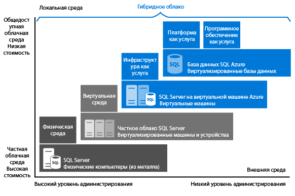

# Вы можете выбрать компонент SQL Server в облаке: база данных SQL Azure (PaaS) или SQL Server на виртуальных машинах Azure (IaaS)
Доступны два варианта размещения рабочих нагрузок SQL Server в Microsoft Azure:

* [База данных SQL Azure.](https://azure.microsoft.com/services/sql-database/) Собственная облачная база данных SQL, которая предоставляется по модели "платформа как услуга" (PaaS) или "база данных как услуга" (DBaaS). Она оптимизирована для разработки приложений "программное обеспечение как услуга" (SaaS). Эта база данных совместима с большинством функций SQL Server. См. дополнительные сведения о [возможностях PaaS](https://azure.microsoft.com/overview/what-is-paas/).
* [SQL Server на виртуальных машинах Azure.](https://azure.microsoft.com/services/virtual-machines/sql-server/) Сервер SQL Server, который установлен и работает на виртуальных машинах Windows Server в облаке Azure, предоставляется по модели "инфраструктура как услуга" (IaaS).
  Сервер SQL Server на виртуальных машинах Azure оптимизирован для переноса существующих приложений SQL Server. Поддерживаются все версии и выпуски SQL Server. Гарантируется полная совместимость с SQL Server, то есть вы можете разместить любое требуемое количество баз данных и выполнять транзакции между ними. Вы получите полный контроль над SQL Server и Windows.

Мы расскажем вам, как эти варианты сочетаются с платформой Microsoft Data, и поможем правильно выбрать решение, соответствующее потребностям вашей компании. Независимо от ваших приоритетов, будь то сокращение затрат или минимальное администрирование, эта статья поможет определить, какой подход отвечает самым важным требованиям вашей компании.

## Платформа Microsoft Data
Одна из первых вещей, которые нужно определить до обсуждения, — можете ли вы использовать базы данных Azure и локальные базы данных SQL Server совместно. Платформа Microsoft Data использует технологию SQL Server, поэтому она доступна для физических локальных компьютеров, частных облачных сред (в том числе для размещенных облачных сред сторонних поставщиков) и для общедоступного облака. SQL Server на виртуальных машинах Azure позволяет использовать стандартный набор серверных продуктов, средств разработки и опыт работы в разных средах для создания комбинаций локальных и облачных развертываний, которые удовлетворяют самые разные бизнес-потребности.

   

Как видно на схеме, каждый предложенный вариант можно охарактеризовать по уровню администрирования его инфраструктуры (по оси X) и по степени эффективности затрат, которая достигается за счет консолидации на уровне базы данных и автоматики, (по оси Y).

При разработке приложения доступны четыре основных параметра размещения части SQL Server приложения:

* SQL Server на невиртуализированных физических компьютерах;
* SQL Server в локальных виртуальных машинах (частное облако);
* SQL Server в виртуальной машине Azure (общедоступное облако Microsoft);
* база данных SQL Azure (общедоступное облако Microsoft).

В следующих разделах мы рассмотрим SQL Server в общедоступном облаке Microsoft, т. е. базу данных SQL Azure и SQL Server на виртуальных машинах Azure. Кроме того, вы изучите основные факторы, влияющие на выбор оптимального варианта для вашего приложения.

## Более детальный обзор базы данных SQL Azure и SQL Server на виртуальных машинах Azure
**База данных SQL Azure** — это реляционная база данных, которая предоставляется как услуга (DBaaS). Она размещается в облаке Azure и относится к отраслевым категориям *программное обеспечение как услуга (SaaS)* и *платформа как услуга (PaaS)*. [База данных SQL](sql-database-technical-overview.md) создана на основе стандартного аппаратного и программного обеспечения, которое принадлежит корпорации Майкрософт, а также размещается и обслуживается ею. Встроенные функции и функциональные возможности базы данных SQL позволяют разрабатывать приложения непосредственно в службе. При использовании базы данных SQL вы платите по мере использования и имеете возможность увеличивать масштаб базы данных или развертывать ее для повышения производительности без прерывания работы.

**SQL Server на виртуальных машинах Azure** относится к отраслевой категории *инфраструктура как услуга (IaaS)* и позволяет запускать SQL Server на виртуальной машине в облаке. Как и база данных SQL, он создан на основе стандартного аппаратного и программного обеспечения, которое принадлежит корпорации Майкрософт, размещается и обслуживается ею. Для SQL Server на виртуальной машине вы можете использовать включенную в образ SQL Server лицензию с оплатой по мере использования или уже имеющуюся у вас лицензию. Кроме того, вы можете легко увеличивать и уменьшать масштаб виртуальных машин, а также останавливать и вновь запускать их по мере необходимости.

Как правило, эти два варианта использования SQL оптимизированы для разных целей:

* **База данных SQL Azure** оптимизирована таким образом, чтобы уменьшить общие затраты на подготовку и администрирование нескольких баз данных. Она снижает затраты на текущее администрирование, поскольку вам не требуется управлять виртуальными машинами, операционными системами или программным обеспечением баз данных. Вам не придется управлять обновлениями, высокой доступностью и [резервными копиями](sql-database-automated-backups.md). В целом база данных SQL Azure позволяет значительно увеличить количество баз данных, которыми может управлять один сотрудник отдела ИТ или разработки.
* **Сервер SQL Server на виртуальных машинах Azure** оптимизирован для переноса существующих приложений в Azure или расширения существующих локальных приложений в облако в рамках гибридного развертывания. Кроме того, SQL Server на виртуальной машине можно применять для разработки и тестирования традиционных приложений SQL Server. Если SQL Server выполняется на виртуальных машинах Azure, вы обладаете всеми правами администратора в выделенном экземпляре SQL Server и облачной виртуальной машине. Это идеальный выбор, если в организации имеются ИТ-ресурсы для обслуживания виртуальных машин. Все это позволяет персонализировать систему с учетом требований конкретного приложения к производительности и доступности.

В следующей таблице представлены основные характеристики базы данных SQL и SQL Server на виртуальных машинах Azure.

| **Области предназначения** | **База данных SQL Azure;** | **SQL Server на виртуальной машине Azure** |
| --- | --- | --- |
|  |Новые облачные приложения с ограниченными сроками разработки и маркетинга. |Существующие приложения, которым требуется быстрая миграция в облако с минимальными изменениями. Сценарии быстрой разработки и тестирования без покупки оборудования для дополнительного локального сервера SQL Server. |
|  | Разработчики баз данных, для которых важны высокая доступность, аварийное восстановление и обновление. |Команды, способные настроить и поддерживать высокую доступность, аварийное восстановление и установку исправлений для SQL Server. Предлагаемые функции автоматизации позволяют значительно упростить эти процессы. | |
|  | Разработчики, которые не хотят тратить силы на настройку конфигурации и базовой операционной системы. |Вам потребуется настраиваемая среда со всеми правами администратора. | |
|  | Базы данных размером до 4 ТБ или более крупные базы данных, которые можно [секционировать горизонтально или вертикально](sql-database-elastic-scale-introduction.md#horizontal-and-vertical-scaling), используя шаблон сегментирования. |Экземпляры SQL Server с хранилищем объемом до 64 ТБ. Экземпляр может поддерживать любое необходимое количество баз данных. | |
|  | | |
| **Ресурсы:** |Вы не хотите нанимать ИТ-специалистов для настройки и обслуживания базовой инфраструктуры, а предпочитаете сосредоточиться на уровне приложений. |У вас есть ИТ-специалисты для настройки и управления. Предлагаемые функции автоматизации позволяют значительно упростить эти процессы. |
| **Совокупная стоимость владения** |Устраняет расходы на оборудование и уменьшает затраты на администрирование. |Сводит затраты на оборудование к нулю. |
| **Непрерывность бизнес-процессов** |Кроме встроенных возможностей отказоустойчивости инфраструктуры, база данных SQL Azure предоставляет такие функции для улучшения непрерывности бизнес-процессов, как [автоматическая архивация](sql-database-automated-backups.md), [восстановление до точки во времени](sql-database-recovery-using-backups.md#point-in-time-restore), [геовосстановление](sql-database-recovery-using-backups.md#geo-restore) и [активная георепликация](sql-database-geo-replication-overview.md). Дополнительные сведения см. в [обзоре непрерывности бизнес-процессов с помощью баз данных SQL](sql-database-business-continuity.md). |SQL Server на виртуальных машинах Azure позволяет создать решение с высоким уровнем доступности и возможностью аварийного восстановления с учетом потребностей конкретной базы данных. Таким образом, у вас может быть система, сильно оптимизированная для приложения. При необходимости вы можете выполнить тестирование и отработку отказа самостоятельно. Дополнительные сведения см. в статье [Высокий уровень доступности и аварийное восстановление для SQL Server на виртуальных машинах Azure](../virtual-machines/windows/sql/virtual-machines-windows-sql-high-availability-dr.md). |
| **Гибридное облако** |Локальное приложение получает доступ к данным в базе данных SQL Azure. |SQL Server на виртуальных машинах Azure позволяет создавать приложения, которые частично работают в облаке и частично — на локальных ресурсах. Например, вы можете расширить локальную сеть и домен Active Directory в облако через [виртуальную сеть Azure](../virtual-network/virtual-networks-overview.md). Кроме того, вы можете хранить локальные файлы данных в службе хранилища Azure с помощью [файлов данных SQL Server в Azure](http://msdn.microsoft.com/library/dn385720.aspx). Дополнительные сведения см. в статье [Приступая к работе с SQL Server в виртуальных машинах Azure](http://msdn.microsoft.com/library/dn606154.aspx). |
|  | Поддерживает [репликацию транзакций SQL Server](https://msdn.microsoft.com/library/mt589530.aspx) в качестве подписчика для репликации данных. |Полностью поддерживает [репликацию баз данных SQL](https://msdn.microsoft.com/library/mt589530.aspx), [высокий уровень доступности и аварийное восстановление для SQL Server на виртуальных машинах Azure](../virtual-machines/windows/sql/virtual-machines-windows-sql-high-availability-dr.md), службы интеграции и доставку журналов для репликации данных. Кроме того, полностью поддерживает традиционное резервное копирование SQL Server. | |
|  | | |

## Коммерческие критерии выбора между базой данных SQL Azure и SQL Server на виртуальных машинах Azure
### Стоимость
Определяющий фактор при выборе способа размещения базы данных — ограниченность в средствах, как для начинающих разработчиков, стесненных в деньгах, так и для групп в солидных организациях с ограниченным бюджетом. Из этого раздела вы узнаете основные сведения о выставлении счетов и лицензировании в Azure для двух вариантов размещения реляционных баз данных: базы данных SQL и SQL Server на виртуальных машинах Azure. Также вы ознакомитесь с расчетом общей стоимости приложений.

#### Основы лицензирования и выставления счетов
**База данных SQL** доступна для приобретения в качестве службы, а не по лицензии.  [SQL Server на виртуальных машинах Azure](../virtual-machines/windows/sql/virtual-machines-windows-sql-server-iaas-overview.md) содержит лицензию с поминутной оплатой за использование. Если у вас уже есть лицензия, вы можете применить ее.  

**База данных SQL** сейчас имеет несколько уровней службы. Для каждого уровня счета выставляются за каждый час использования по фиксированной ставке, которая зависит от выбранного уровня службы и уровня производительности. Кроме того, счета выставляются за исходящий интернет-трафик по обычным [тарифам на передачу данных](https://azure.microsoft.com/pricing/details/data-transfers/). Уровни служб "Базовый", "Стандартный", "Премиум", "Общего назначения" и "Критически важный для бизнеса" созданы, чтобы обеспечить прогнозируемую производительность нескольких уровней для удовлетворения максимальных требований приложения. Вы можете менять уровни служб и уровни производительности в соответствии с различными требованиями приложения к производительности. Последние сведения о текущих поддерживаемых уровнях служб см. в разделах [Модель приобретения на основе DTU для базы данных SQL Azure](sql-database-service-tiers-dtu.md) и [Модель приобретения на основе виртуальных ядер для базы данных SQL Azure (предварительная версия)](sql-database-service-tiers-vcore.md). Вы можете также создавать [эластичные пулы](sql-database-elastic-pool.md) для совместного использования ресурсов производительности экземплярами баз данных.

> [!IMPORTANT]
> Если в вашей базе данных выполняется большое количество транзакций и нужно поддерживать много пользователей одновременно, мы рекомендуем использовать уровень службы "Премиум" или "Критически важный для бизнеса". Чтобы свести к минимуму задержки между приложением и базой данных SQL, разместите приложение в том же регионе, что и база данных, и проверьте производительность, повышая уровень службы и уровень производительности по мере необходимости.

При использовании **базы данных SQL**корпорация Майкрософт автоматически настраивает, исправляет и обновляет программное обеспечение базы данных, что позволит вам сократить затраты на администрирование. Кроме того, [встроенные функции резервного копирования](sql-database-automated-backups.md) помогают значительно экономить средства, особенно при наличии большого количества баз данных.

При размещении **SQL Server на виртуальных машинах Azure** вы можете использовать любой образ SQL Server, предоставляемый платформой (все они содержат лицензию), или собственную лицензию SQL Server. Доступны все поддерживаемые версии (2008 R2, 2012, 2014, 2016) и выпуски (Developer, Express, Web, Standard, Enterprise) SQL Server. Кроме того, доступны версии образов с использованием собственной лицензии (BYOL). Стоимость использования образов, которые предоставляет Azure, зависит от размера виртуальной машины, а также от выбранного выпуска SQL Server. Независимо от размера виртуальной машины или выпуска SQL Server вы оплачиваете лицензии SQL Server и Windows Server, а также стоимость службы хранилища Azure для дисков виртуальной машины по поминутному тарифу. Поминутное выставление счетов позволяет использовать SQL Server ровно столько, сколько нужно, без приобретения дополнительных лицензий SQL Server. Если вы передаете в Azure собственную лицензию SQL Server, плата взимается только за Windows Server и хранение данных. Дополнительные сведения об использовании собственной лицензии см. в статье [Перемещение лицензий в рамках программы Software Assurance в Azure](https://azure.microsoft.com/pricing/license-mobility/).

#### Расчет общей стоимости приложений
Когда вы начинаете использовать облачную платформу, стоимость выполнения приложения включает затраты на разработку и администрирование, а также затраты на службу платформы в общедоступном облаке.

Ниже приведен подробный расчет стоимости выполнения вашего приложения в базе данных SQL Azure и в SQL Server на виртуальных машинах Azure.

**Для базы данных SQL Azure:**

*Общая стоимость приложения = минимальные затраты на администрирование + затраты на разработку программного обеспечения + затраты на службы базы данных SQL.*

**Для SQL Server на виртуальных машинах Azure:**

*Общая стоимость приложения = минимальные затраты на разработку программного обеспечения + затраты на администрирование + затраты на лицензирование SQL Server и Windows Server + затраты на службу хранилища Azure*

Дополнительную информацию см. в следующих ресурсах:

* [Цены на базы данных SQL](https://azure.microsoft.com/pricing/details/sql-database/)
* [Цены на виртуальные машины](https://azure.microsoft.com/pricing/details/virtual-machines/) для [SQL](https://azure.microsoft.com/pricing/details/virtual-machines/#sql) и [Windows](https://azure.microsoft.com/pricing/details/virtual-machines/#windows)
* [Калькулятор стоимости — оцените свои расходы](https://azure.microsoft.com/pricing/calculator/)

> [!NOTE]
> Существует несколько функций SQL Server, которые неприменимы или недоступны для баз данных SQL. Дополнительные сведения см. в статьях [Azure SQL Database features](sql-database-features.md) (Функции базы данных SQL Azure) и [Отличия Transact-SQL базы данных SQL Azure](sql-database-transact-sql-information.md). Если вы перемещаете существующее решение SQL Server в облако, см. статью [Миграция базы данных SQL Server в базу данных SQL в облаке](sql-database-cloud-migrate.md). При переносе существующего локального приложения SQL Server в базу данных SQL рекомендуем вам обновить приложение, чтобы воспользоваться преимуществами облачных служб. Например, вы можете разместить приложение в [службе веб-приложений Azure](https://azure.microsoft.com/services/app-service/web/) или в [облачных службах Azure](https://azure.microsoft.com/services/cloud-services/), чтобы сэкономить средства.
> 
> 

### Администрирование
Для многих компаний решение о переходе в облачную службу позволит уменьшить не только расходы, но и сложность администрирования системы. Для **базы данных SQL**управление базовым оборудованием выполняет корпорация Майкрософт. Также корпорация Майкрософт автоматически реплицирует все данные для обеспечения высокой доступности, настраивает и обновляет программное обеспечение базы данных, управляет балансировкой нагрузки и выполняет прозрачную отработку отказа при сбое сервера. Вы можете продолжать администрировать базу данных, но вам больше не нужно беспокоиться об управлении ядром СУБД, операционной системой или аппаратным оборудованием сервера.  Под вашим управлением остаются базы данных и учетные записи, индексы и оптимизация запросов, аудит и безопасность.

Решение **SQL Server на виртуальных машинах Azure** позволит полностью контролировать операционную систему и конфигурацию экземпляра SQL Server. Для виртуальной машины вы сами решаете, когда обновлять операционную систему и программное обеспечение базы данных, а также выбираете дополнительные программы (например, антивирусные) и время их установки. Некоторые предлагаемые функции автоматизации позволяют значительно упростить процессы исправления, резервного копирования и обеспечения высокой доступности. Кроме того, вы можете контролировать размер виртуальной машины, количество дисков и их конфигурации хранения. Azure позволяет изменять размер виртуальной машины по мере необходимости. Дополнительные сведения см. в статье [Размеры виртуальных машин в Azure](../virtual-machines/windows/sizes.md). 

### Соглашение об уровне обслуживания (SLA):
Для многих ИТ-отделов основным приоритетом является соблюдение обязательств по времени непрерывной работы, определенных в соглашении об уровне обслуживания (SLA). В этом разделе мы рассмотрим условия SLA для каждого варианта размещения базы данных.

Для уровней службы "Базовый", "Стандартный", "Премиум", "Общего назначения" и "Критически важный для бизнеса" **базы данных SQL** мы гарантируем уровень доступности 99,99 %. Последние сведения см. на странице [Соглашение об уровне обслуживания для базы данных SQL](https://azure.microsoft.com/support/legal/sla/sql-database/). Последние сведения об уровнях служб Базы данных SQL и поддерживаемых планах обеспечения непрерывности бизнес-процессов см. в разделах [Модель приобретения на основе DTU для базы данных SQL Azure](sql-database-service-tiers-dtu.md) и [Модель приобретения на основе виртуальных ядер для базы данных SQL Azure (предварительная версия)](sql-database-service-tiers-vcore.md).

Для **SQL Server на виртуальных машинах Azure** мы гарантируем уровень доступности 99,95 %, но только в отношении виртуальной машины. Это соглашение об уровне обслуживания не распространяется на процессы (например, SQL Server), запущенные на виртуальной машине, и предусматривает наличие по крайней мере двух экземпляров виртуальных машин в каждой группе доступности. Последние сведения см. на странице [Соглашение об уровне обслуживания для виртуальных машин](https://azure.microsoft.com/support/legal/sla/virtual-machines/). Чтобы обеспечить высокую доступность базы данных на виртуальных машинах, следует настроить один из поддерживаемых вариантов высокого уровня доступности на SQL Server, например [группы доступности AlwaysOn](http://blogs.technet.com/b/dataplatforminsider/archive/2014/08/25/sql-server-alwayson-offering-in-microsoft-azure-portal-gallery.aspx). Использование параметра высокой доступности не дает дополнительных гарантий уровня обслуживания, но позволяет достичь доступности базы данных на уровне более 99,99 %.

### Продолжительность цикла выпуска
**База данных SQL Azure** будет правильным выбором для приложений, разработанных для облачной среды, поскольку для них критически важными являются эффективность разработки и сокращение времени выхода на рынок. Благодаря функциональным возможностям, схожим с возможностями администратора базы данных, она идеально подходит для разработчиков облачных служб, так как позволяет уменьшить необходимость управления базовой операционной системой и базой данных. Например, вы можете использовать [REST API](http://msdn.microsoft.com/library/azure/dn505719.aspx) и [командлеты PowerShell](http://msdn.microsoft.com/library/mt740629.aspx) для автоматизации операций администрирования и управления для тысяч баз данных. Такие компоненты, как [эластичные пулы](sql-database-elastic-pool.md), позволяют уделить максимум внимания уровню приложений и быстрее вывести решение на рынок.

**SQL Server на виртуальных машинах Azure** идеально подходит для ситуации, когда существующим или новым приложениям требуются большие или взаимосвязанные базы данных либо доступ ко всем функциям SQL Server или Windows. Кроме того, это прекрасный вариант подходит для переноса в Azure существующих локальных приложений и баз данных в неизменном виде. Так как изменять уровень презентации, приложения и данных не нужно, вы экономите время и средства при повторном изменении имеющегося решения. Вместо этого вы можете уделить внимание переносу всех решений в Azure и оптимизации производительности, необходимой для платформы Azure. Дополнительные сведения см. в статье [Рекомендации по оптимизации производительности SQL Server в виртуальных машинах Azure](../virtual-machines/windows/sql/virtual-machines-windows-sql-performance.md).

## Сводка
В этой статье приведен обзор баз данных SQL и SQL Server на виртуальных машинах Azure, а также рассматриваются коммерческие факторы, которые могут повлиять на ваше решение. Ниже приводится краткий обзор рекомендаций.

Выберите **базу данных SQL Azure** , если:

* Вы создаете новые облачные приложения, чтобы воспользоваться возможностями облачных служб для экономии и оптимизации производительности. Такой подход предоставит преимущества полностью управляемой облачной службы, сократит время выхода на рынок и поможет оптимизировать затраты в долгосрочной перспективе.
* Вы хотите, чтобы корпорация Майкрософт выполняла стандартные операции по управлению в вашей базе данных, и вам требуется более высокий уровень доступности согласно соглашению об уровне обслуживания для баз данных.

Выберите **SQL Server на виртуальных машинах Azure** , если:

* У вас есть существующие локальные приложения, которые вы хотите перенести или расширить в облако, или вы планируете создавать корпоративные приложения объемом более 4 ТБ. Такой подход обеспечивает полную совместимость с SQL, большую емкость для хранения баз данных, полный контроль над SQL Server и Windows, а также безопасное туннелирование в локальную сеть. Это позволить минимизировать затраты на разработку и модификацию существующих приложений.
* У вас уже есть ИТ-специалисты, способные самостоятельно управлять процессами исправлений, резервного копирования и обеспечения доступности базы данных. Обратите внимание, что некоторые функции автоматизации позволяют значительно упростить эти операции. 

## Дополнительная информация
* Чтобы начать работу с Базой данных SQL, см. статью [Краткое руководство. Начало работы с базой данных SQL Azure](sql-database-get-started-portal.md).
* См. страницу с [ценами на базы данных SQL](https://azure.microsoft.com/pricing/details/sql-database/).
* Чтобы приступить к работе с SQL Server в виртуальной машине Azure, см. статью [Подготовка виртуальной машины SQL Server на портале Azure](../virtual-machines/windows/sql/virtual-machines-windows-portal-sql-server-provision.md).

