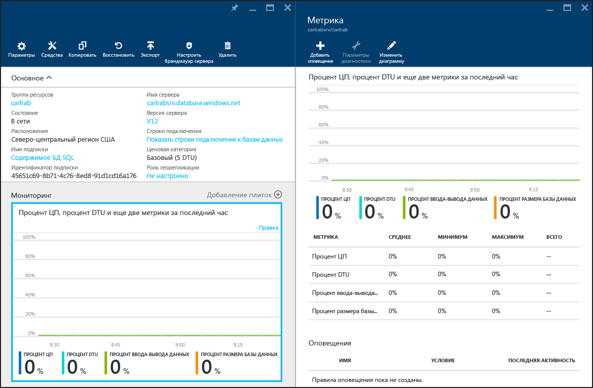

# Мониторинг производительности базы данных в базе данных SQL Azure
Мониторинг производительности базы данных SQL в Azure начинается с мониторинга использования ресурсов в соответствии с выбранным уровнем производительности базы данных. С помощью мониторинга можно определить, является ли емкость базы данных избыточной или же проблема возникает из-за того, что ресурсы используются на пределе возможностей. Затем при необходимости можно изменить уровень производительности и [уровень службы](sql-database-service-tiers.md) такой базы данных. Вы можете выполнять мониторинг базы данных с помощью графических средств на [портале Azure](https://portal.azure.com) или с использованием [динамических административных представлений](https://msdn.microsoft.com/library/ms188754.aspx).

## Мониторинг баз данных с помощью портала Azure
На [портале Azure](https://portal.azure.com/) можно отслеживать использование отдельной базы данных. Для этого нужно выбрать базу данных и щелкнуть диаграмму **Мониторинг**. Появится окно **Метрика**, которое можно изменить, нажав кнопку **Изменить диаграмму**. Добавьте следующие метрики:

* Процент использования ЦП
* Процент использования DTU
* Процент операций ввода/вывода данных
* Размер базы данных в процентах

После добавления этих метрик можно продолжить наблюдение за ними на диаграмме **Мониторинг** с более подробными сведениями в окне **Метрика**. Все четыре метрики показывают средний процент использования в соответствии с количеством единиц **DTU** для вашей базы данных. Дополнительные сведения о единицах DTU см. в статье, посвященной [уровням служб](sql-database-service-tiers.md).

Также можно настроить оповещения для метрик производительности. В окне **Метрика** нажмите кнопку **Добавить оповещение**. Следуйте инструкциям мастера для настройки оповещения. Можно настроить предупреждение, информирующее либо о превышении показателями определенного порога, либо о падении показателей ниже определенного порога.

Например, если предполагается, что рабочая нагрузка базы данных будет расти, можно настроить отправку оповещения по электронной почте каждый раз, когда любой из показателей производительности для вашей базы данных достигнет 80%. Это оповещение можно использовать как предварительное предупреждение о том, что необходимо перейти на следующий, более высокий уровень производительности.

Метрики производительности также помогут определить, можете ли вы перейти на более низкий уровень производительности. Предположим, вы используете базу данных размера S2 уровня Стандартный, и все метрики производительности показывают, что база данных никогда не используется более чем на 10%. Вполне вероятно, что эта база данных будет хорошо работать с размером S1 уровня Стандартный. Однако перед переходом на более низкий уровень производительности следует учитывать скачки и колебания рабочих нагрузок.

## Мониторинг баз данных с помощью динамических административных представлений
Метрики, которые отображаются на портале, доступны также в системных представлениях: [sys.resource_stats](https://msdn.microsoft.com/library/dn269979.aspx) — в логической базе данных **master** вашего сервера, а также [sys.dm_db_resource_stats](https://msdn.microsoft.com/library/dn800981.aspx) — в пользовательской базе данных. Используйте **sys.resource_stats**, если необходимо отслеживать менее детализированные данные для длительного периода времени. Используйте **sys.dm_db_resource_stats**, если необходимо отслеживать более детализированные данные для менее длительного периода времени. Дополнительные сведения см. в статье [База данных SQL Azure и производительность отдельных баз данных](sql-database-performance-guidance.md#monitor-resource-use).

> [!NOTE]
> При использовании в базах данных устаревших выпусков Web Edition и Business Edition **sys.dm_db_resource_stats** возвращает пустой результирующий набор.
>
>

Для эластичных пулов можно отслеживать отдельные базы данных в пуле с помощью способов, описанных в этом разделе. Но также можно отслеживать и пул в целом. Дополнительные сведения см. в статье [Мониторинг пула эластичных баз данных и управление им на портале Azure](sql-database-elastic-pool-manage-portal.md).

