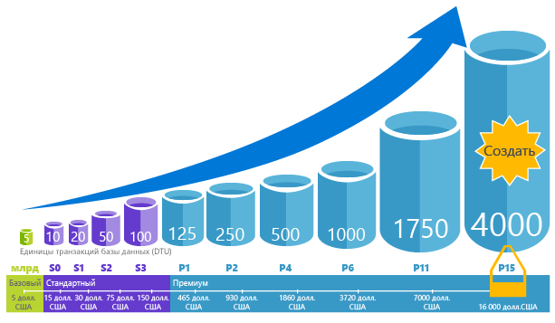
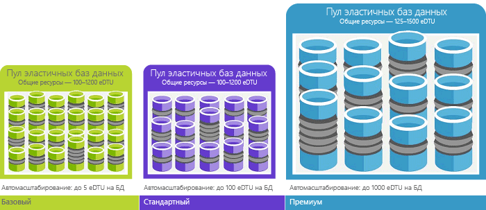

# Единицы транзакций базы данных (DTU) и единицы транзакций эластичной базы данных (eDTU)
Эта статья содержит информацию об обычных единицах передачи данных (DTU) и единицах передачи данных в эластичной базе данных (eDTU), а также о том, что происходит, когда достигается их максимальное количество.  

## Что такое единицы транзакций базы данных (DTU)?
Для одной базы данных Azure SQL с определенным уровнем производительности на [ уровне обслуживания ](sql-database-single-database-resources.md) Майкрософт гарантирует определенный уровень ресурсов (независимо от любой другой базы данных в облаке Azure) и обеспечивает предсказуемый уровень производительности. Этот объем ресурсов рассчитывается как количество единиц транзакций базы данных или DTU и является комплексной оценкой вычислительных ресурсов, ресурсов хранилища и ресурсов для операций ввода-вывода. Коэффициент этих ресурсов первоначально определялся по [тестовой рабочей нагрузке OLTP](sql-database-benchmark-overview.md), отражающей фактические рабочие нагрузки OLTP. Если рабочая нагрузка превышает объем любого из этих ресурсов, пропускная способность регулируется, что приводит к снижению производительности и простоям. Ресурсы, используемые вашей рабочей нагрузкой, не влияют на ресурсы, доступные для других баз данных SQL в облаке Azure, а ресурсы, используемые другими рабочими нагрузками, не влияют на ресурсы, доступные вашей базе данных SQL.

DTU лучше всего помогают определить относительный объем ресурсов баз данных SQL Azure с разными уровнями производительности и обслуживания. Например, повысить производительность базы данных (через удвоение DTU) означает удвоить количество ресурсов, доступных для этой базы данных. Например, база данных P11 уровня "Премиум" с 1750 единицами DTU обеспечивает в 350 раз больше вычислительной мощи, чем база данных уровня "Базовый" с 5 единицами DTU.  

Чтобы узнать, как используются ресурсы (DTU) в вашей рабочей нагрузке, см. статью [Анализ производительности запросов базы данных Azure SQL](sql-database-query-performance.md). После этого вы сможете:

- Выявлять запросы, максимально использующие ресурсы процессора, имеющие максимальную длительность или число выполнений, которые потенциально можно настроить, чтобы повысить производительность. Например, запрос на большое число операций ввода-вывода может выполняться быстрее за счет [методов оптимизации в памяти](sql-database-in-memory.md). Так вы сможете оптимизировать использование доступной памяти на определенном уровне обслуживания и производительности.
- Перейти к подробным сведениям о запросе, просмотреть его текст и журнал использования ресурсов.
- Получать доступ к рекомендациям по настройке производительности, отображающим действия [Помощника по базам данных SQL](sql-database-advisor.md).

Вы можете [изменять уровни службы](sql-database-service-tiers.md) в любое время. Это приведет лишь к минимальному простою приложения (обычно в среднем не более четырех секунд). Для многих организаций и приложений достаточно иметь возможность создавать и уменьшать или увеличивать производительность баз данных по запросу, особенно если закономерности использования базы данных относительно хорошо прогнозируются. Но если закономерности использования непредсказуемы, это может усложнить управление расходами и бизнес-моделью. В этом сценарии вы используете эластичный пул с определенным числом единиц eDTU, распределенных между несколькими базами данных в пуле.

## Что такое единицы транзакций эластичной базы данных (eDTU)?
Вместо выделения определенного набора ресурсов (DTU) базе данных SQL, доступных вне зависимости от того, нужны они или нет, вы можете поместить базы данных в [эластичные пулы](sql-database-elastic-pool.md) на сервере базы данных SQL, а распределяющий пул ресурсов между базами данных. Общие ресурсы в эластичном пуле измеряются в единицах транзакций эластичных баз данных или eDTU. Пулы эластичных БД обеспечивают простое и экономически выгодное решение для управления целевыми показателями производительности для нескольких баз данных с совершенно разными и непредсказуемыми моделями функционирования. Вы можете быть уверены, что базе данных в эластичном пуле всегда доступен минимальный объем ресурсов, и ни одна из них не использует все ресурсы пула. 

Пулу предоставляется заданное количество единиц eDTU по фиксированной цене. Отдельным базам данных в пуле эластичных баз данных предоставляется возможность гибкого автоматического масштабирования в рамках заданных границ. Базы данных, на которые приходится значительная нагрузка, могут потреблять больше eDTU, чтобы обслужить имеющийся спрос, при этом базы данных с меньшей нагрузкой смогут потреблять меньше eDTU, а базы данных, которые не обслуживают никакой нагрузки, не будут потреблять eDTU. Благодаря подготовке ресурсов для всего пула, а не одной базы данных, задачи управления упрощаются и вы можете спрогнозировать затраты на пул.

Добавить дополнительные единицы eDTU в имеющийся пул можно без простоя баз данных в пуле или снижения их производительности. Точно так же, если eDTU больше не нужны, их можно удалить из имеющегося пула в любой момент времени. Вы можете добавить базы данных в пул или удалить их либо ограничить количество eDTU, которые базы данных могут использовать в условиях интенсивной нагрузки, чтобы сохранить eDTU для остальных баз данных. Если у базы данных прогнозируемо низкие показатели использования ресурсов, ее можно переместить из пула и настроить в качестве отдельной базы данных с прогнозируемым объемом ресурсов, который ей необходим.

## Как определить, сколько единиц DTU нужно для моей рабочей нагрузки
Если нужно перенести существующую локальную рабочую нагрузку или нагрузку виртуальной машины SQL Server в базу данных SQL Azure, вы можете приблизительно вычислить нужное количество единиц DTU с помощью [калькулятора DTU](http://dtucalculator.azurewebsites.net/) . Чтобы узнать, как используются ресурсы (DTU) в существующей рабочей нагрузке базы данных SQL Azure, и понять, как оптимизировать эту нагрузку, вы можете использовать [анализ производительности запросов в базе данных SQL](sql-database-query-performance.md) . Кроме того, с помощью динамического административного представления [sys.dm_db_ resource_stats](https://msdn.microsoft.com/library/dn800981.aspx) вы можете получить сведения об использовании ресурсов за последний час. Кроме того, можно отправить запрос к представлению каталога [sys.resource_stats](http://msdn.microsoft.com/library/dn269979.aspx), чтобы получить эти же сведения, но только за последние 14 дней, причем с менее точными средними значениями за пять минут.

## Как понять, что мне нужен пул эластичных БД?
Пулы подходят для большого числа баз данных с конкретными закономерностями использования. Для заданной базы данных эта закономерность характеризуется низким средним использованием с относительно редкими пиками использования. База данных SQL автоматически оценивает историю использования ресурсов баз данных на существующем сервере баз данных SQL и рекомендует подходящую конфигурацию пула в портале Azure. Дополнительные сведения см. в статье [Когда следует использовать пул эластичных баз данных?](sql-database-elastic-pool.md)

## Что происходит, когда количество единиц DTU становится максимальным?
Уровни производительности определяются и регулируются, чтобы обеспечить необходимые ресурсы для работы базы данных в условиях максимальной нагрузки, предусмотренной вашим уровнем служб или производительности. Если ваша нагрузка достигнет предела по одному из показателей (ЦП, ввод-вывод данных, ввод-вывод журнала), вы продолжите получать ресурсы на максимально допустимом уровне, но может увеличиться задержка обработки ваших запросов. Превышение одного из этих ограничений ведет не к возникновению ошибок, а к замедлению работы (за исключением случаев, когда работа идет настолько медленно, что время ожидания запросов начинает истекать). Когда количество параллельных пользовательских сеансов или запросов (рабочих потоков) достигает максимально допустимого уровня, отображаются явные ошибки. Сведения об ограничениях на использование ресурсов, отличных от ЦП, памяти, ввода-вывода данных и ввода-вывода журнала см. в [этом разделе]( sql-database-dtu-resource-limits.md#what-happens-when-database-and-elastic-pool-resource-limits-are-reached).

## Дополнительная информация
* Ознакомьтесь со статьей об [уровнях служб](sql-database-service-tiers.md), чтобы получить сведения о количестве DTU и eDTU, доступных для отдельных баз данных и эластичных пулов, а также об ограничениях ресурсов, отличных от ресурсов ЦП, памяти, ввода-вывода данных и ввода-вывода журнала транзакций.
* Чтобы понять, как используются единицы DTU в вашей среде, см. статью [Анализ производительности запросов базы данных SQL Azure](sql-database-query-performance.md).
* Чтобы понять методологию, лежащую в основе тестовой рабочей нагрузки OLTP, которая определяет наполнение единиц DTU, см. статью [Общие сведения об измерении производительности базы данных SQL Azure](sql-database-benchmark-overview.md).
