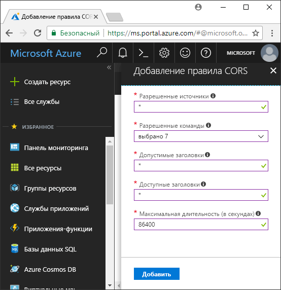

<!-- Customer intent: As a web application developer I want to interface with Azure Blob storage entirely on the client so that I can build a SPA application that is able to upload and delete files on blob storage. -->

# <a name="quickstart-upload-list-and-delete-blobs-using-javascripthtml-in-the-browser"></a>Краткое руководство. Отправка, получение списка и удаление больших двоичных объектов с помощью JavaScript и HTML в браузере
В этом кратком руководстве описано, как управлять BLOB-объектами из кода, выполняемого в браузере. Этот подход позволяет реализовать требуемые меры безопасности, чтобы обеспечить безопасный доступ к вашей учетной записи хранилища больших двоичных объектов. Для работы с этим кратким руководством вам потребуется [подписка Azure](https://azure.microsoft.com/free/?WT.mc_id=A261C142F).

[!INCLUDE [storage-quickstart-tutorial-create-account-portal](../../../includes/storage-quickstart-tutorial-create-account-portal.md)]

## <a name="setting-up-storage-account-cors-rules"></a>Настройка учетных записей хранения CORS 
Прежде чем веб-приложение сможет получить доступ к хранилищу BLOB-объектов из клиента, в учетной записи следует включить [совместное использование ресурсов между серверами](https://docs.microsoft.com/rest/api/storageservices/cross-origin-resource-sharing--cors--support-for-the-azure-storage-services) или CORS. 

Вернитесь на портал Azure и выберите вашу учетную запись хранения. Чтобы определить новое правило CORS, нужно вернуться в раздел **Параметры** и выбрать ссылку **CORS**. Далее нажмите кнопку **Добавить**, чтобы открыть окно **Добавление правила CORS**. В этом руководстве создается открытое правило CORS:



В следующей таблице описывается каждый параметр CORS и объясняются значения, используемые для определения правила.

|Параметр  |Значение  | ОПИСАНИЕ |
|---------|---------|---------|
| Разрешенные источники | * | Принимает список доменов, разделенных запятыми, как допустимые источники. При установке значения `*` разрешает всем доменам получать доступ к учетной записи хранения. |
| Допустимые команды     | DELETE, GET, HEAD, MERGE, POST, OPTIONS и PUT | Список HTTP-команд, которые можно выполнять в учетной записи хранения. В этом руководстве установите все доступные параметры. |
| Допустимые заголовки | * | Определяет список заголовков запросов (включая заголовки с префиксами), разрешенные учетной записью хранения. При установке значения `*` допустимы все заголовки. |
| Предоставляемые заголовки | * | Список допустимых заголовков в учетной записи. При установке значения `*` позволяет учетной записи отправлять любой заголовок.  |
| Максимальная длительность (в секундах) | 86400 | Максимальное количество времени, в течение которого обозреватель кэширует предварительный запрос OPTIONS. Значение *86400* позволяет ему оставаться в кэше целый день. |

> [!IMPORTANT]
> Убедитесь, что все параметры, которые вы используете в рабочей среде, предоставляют минимальный объем доступа, необходимый для вашей учетной записи хранения, для обеспечения безопасного доступа. Описанные здесь параметры CORS подходят для краткого руководства, так как задается мягкая политика безопасности. Тем не менее эти параметры не рекомендуются для реального контекста.

Затем используйте оболочку облака Azure для создания маркера безопасности.

[!INCLUDE [Open the Azure cloud shell](../../../includes/cloud-shell-try-it.md)]

## <a name="create-a-shared-access-signature"></a>Создание подписанного URL-адреса
Подписанный URL-адрес (SAS) используется кодом, запущенным в браузере, для проверки подлинности запросов в хранилище BLOB-объектов. Используя SAS, клиент может выполнять проверку подлинности без ключа доступа к учетной записи или строки подключения. Дополнительные сведения см. в статье [Использование подписанных URL-адресов (SAS)](../common/storage-dotnet-shared-access-signature-part-1.md).

Можно создать подписанный URL-адрес с помощью Azure CLI с использованием Azure Cloud Shell или с помощью Обозревателя службы хранилища Azure Ниже перечислены параметры, для которых необходимо указать значения, чтобы создать SAS с помощью CLI.

| Параметр      |ОПИСАНИЕ  | Placeholder |
|----------------|-------------|-------------|
| *expiry*       | Дата окончания срока действия маркера доступа в формате ГГГГ-ММ-ДД. Введите завтрашнюю дату для использования в этом руководстве. | *FUTURE_DATE* |
| *account-name* | имя учетной записи хранения. Используйте имя из предыдущего шага. | *YOUR_STORAGE_ACCOUNT_NAME* |
| *account-key*  | Ключ учетной записи хранения. Используйте ключ из предыдущего шага. | *YOUR_STORAGE_ACCOUNT_KEY* |

Следующий скрипт используется в Azure CLI для создания SAS, который можно передать в JavaScript службы BLOB-объектов.

> [!NOTE]
> Для достижения наилучших результатов удалите лишние пробелы между параметрами, прежде чем вставлять команду в оболочку облака Azure.

```bash
az storage account generate-sas
                    --permissions racwdl
                    --resource-types sco
                    --services b
                    --expiry FUTURE_DATE
                    --account-name YOUR_STORAGE_ACCOUNT_NAME
                    --account-key YOUR_STORAGE_ACCOUNT_KEY
```
Ряд значений после некоторых параметров могут показаться немного странными. Эти значения параметров берутся из первой буквы соответствующего разрешения. В следующей таблице поясняется, откуда берутся значения: 

| Параметр        | Значение   | ОПИСАНИЕ  |
|------------------|---------|---------|
| *permissions*    | racwdl  | Этот SAS позволяет выполнять *чтение*, *добавление*, *создание*, *запись*, *удаление* и *перечисление*. |
| *resource-types* | SCO     | SAS влияет на такие ресурсы, как *службы*, *контейнеры* и *объекты*. |
| *services*       | b       | SAS влияет на службу *BLOB-объектов*. |

Теперь, когда создан SAS, скопируйте в текстовый редактор значение, возвращаемое в консоли. Это значение используется на следующем шаге.

> [!IMPORTANT]
> В рабочей среде всегда передавайте маркеры SAS с помощью SSL. Кроме того, маркеры SAS должны создаваться на сервере и отправляться на страницу HTML, чтобы вернуться обратно в хранилище BLOB-объектов Azure. Как вариант, для создания маркеров SAS можно использовать бессерверные функции. Портал Azure содержит шаблоны функций, которые имеют возможность создавать SAS с помощью функции JavaScript.

## <a name="implement-the-html-page"></a>Реализация страницы HTML

### <a name="set-up-the-web-application"></a>Настройка веб-приложения
Клиентские библиотеки JavaScript службы хранилища Azure не будут работать непосредственно из файловой системы и должны обрабатываться с веб-сервера. Таким образом, в следующих шагах подробно описывается, как использовать простой локальный веб-сервер с Node.js.

> [!NOTE]
> В этом разделе показано, как создать локальный веб-сервер с Node.js, установленным на компьютере. Если вы не хотите устанавливать Node.js, вы можете использовать любые другие способы запуска локального веб-сервера.

Сначала создайте папку для проекта и назовите ее *azure-blobs-javascript*. Далее откройте командную строку в папке *azure-blobs-javascript* и подготовьте приложение для установки модуля веб-сервера, введя следующую команду:

```bash
npm init -y
```
Выполнение *init* добавляет файлы, необходимые для установки модуля веб-сервера. Чтобы установить модуль, введите такую команду:

```bash
npm i http-server
```
Далее следует изменить *package.json* и заменить имеющееся определение *скриптов* с помощью следующего фрагмента кода:

```javascript
"scripts": {
    "start": "http-server"
}
```
Наконец, в командной строке введите `npm start` для запуска веб-сервера:

```bash
npm start
```

### <a name="get-the-blob-storage-client-library"></a>Получение клиентской библиотеки хранилища BLOB-объектов
[Загрузите клиентские библиотеки JavaScript](https://aka.ms/downloadazurestoragejs), извлеките содержимое ZIP-файла и поместите файлы скриптов из папки *bundle* в папку с именем *scripts*.

### <a name="add-the-client-script-reference-to-the-page"></a>Добавление ссылки на скрипт клиента на страницу
Создайте HTML-страницу в корне папки *azure-blobs-javascript* и назовите ее *index.html*. После создания страницы добавьте на нее следующую разметку.

```html
<!DOCTYPE html>
<html>
    <body>
        <button id="create-button">Create Container</button>

        <input type="file" id="fileinput" />
        <button id="upload-button">Upload</button>

        <button id="list-button">List</button>
        
        <button id="delete-button">Delete</button>
    </body>
    <script src="scripts/azure-storage.blob.min.js"></script>
    <script>
        // Blob-related code goes here
    </script>
</html>
```
При этом на страницу добавляется следующее:

- ссылка на *scripts/azure-storage.blob.js*;
- кнопка для создания контейнера, отправки, перечисления и удаления больших двоичных объектов;
- элемент *INPUT*, используемый для отправки файла;
- заполнитель для кода хранилища.

### <a name="create-an-instance-of-blobservice"></a>Создание экземпляра BlobService 
[BlobService](https://azure.github.io/azure-storage-node/BlobService.html) предоставляет интерфейс для хранилища BLOB-объектов. Для создания экземпляра службы необходимо указать имя учетной записи хранения и SAS, созданный на предыдущем шаге.

```javascript
const account = {
    name: YOUR_STORAGE_ACCOUNT_NAME,
    sas:  YOUR_SAS
};

const blobUri = 'https://' + account.name + '.blob.core.windows.net';
const blobService = AzureStorage.Blob.createBlobServiceWithSas(blobUri, account.sas);
```

### <a name="create-a-blob-container"></a>Создание контейнера BLOB-объектов
В новой службе BLOB-объектов создайте контейнер для хранения переданного большого двоичного объекта. Метод [createContainerIfNotExists](https://azure.github.io/azure-storage-node/BlobService.html#createContainerIfNotExists__anchor) создает контейнер и не возвращает ошибку, если контейнер уже существует.

```javascript
document.getElementById('create-button').addEventListener('click', () => {

    blobService.createContainerIfNotExists('mycontainer',  (error, container) => {
        if (error) {
            // Handle create container error
        } else {
            console.log(container.name);
        }
    });

});
```

### <a name="upload-a-blob"></a>Передача больших двоичных объектов
Чтобы отправить большой двоичный объект из формы HTML, получите ссылку на выбранный файл из элемента *INPUT*. Выбранный файл доступен через массив `files`, когда для *type* установлено значение *file*.

Из скрипта вы можете ссылаться на элемент HTML и передавать выбранный файл в службу BLOB-объектов.

```javascript
document.getElementById('upload-button').addEventListener('click', () => {

    const file = document.getElementById('fileinput').files[0];

    blobService.createBlockBlobFromBrowserFile('mycontainer', 
                                                file.name, 
                                                file, 
                                                (error, result) => {
                                                    if(error) {
                                                        // Handle blob error
                                                    } else {
                                                        console.log('Upload is successful');
                                                    }
                                                });

});
```

Метод [createBlockBlobFromBrowserFile](https://azure.github.io/azure-storage-node/BlobService.html#createBlockBlobFromBrowserFile__anchor) использует файл браузера напрямую для передачи в контейнер больших двоичных объектов.

### <a name="list-blobs"></a>Отображение списка больших двоичных объектов
Отправив файл в контейнер больших двоичных объектов, вы получите доступ к списку блоков в контейнере с помощью метода [listBlobsSegmented](https://azure.github.io/azure-storage-node/BlobService.html#listBlobsSegmented__anchor).

```javascript
document.getElementById('list-button').addEventListener('click', () => {

    blobService.listBlobsSegmented('mycontainer', null, (error, results) => {
        if (error) {
            // Handle list blobs error
        } else {
            results.entries.forEach(blob => {
                console.log(blob.name);
            });
        }
    });
    
});
```

Метод *ListBlobsSegmented* возвращает коллекцию больших двоичных объектов. По умолчанию коллекция включает 5000 больших двоичных объектов. Но это значение можно изменить в соответствии с потребностями. В [следующем примере](https://github.com/Azure/azure-storage-node/blob/master/examples/samples/continuationsample.js#L132) показано, как работать с большим числом больших двоичных объектов и как клиентская библиотека поддерживает разбиение по страницам. 


### <a name="delete-blobs"></a>Удаление blob-объектов
Вы можете удалить переданный большой двоичный объект, вызвав метод [deleteBlobIfExists](https://azure.github.io/azure-storage-node/BlobService.html#deleteBlobIfExists__anchor).

```javascript
document.getElementById('delete-button').addEventListener('click', () => {

    var blobName = YOUR_BLOB_NAME;
    blobService.deleteBlobIfExists('mycontainer', blobName, (error, result) => {
        if (error) {
            // Handle delete blob error
        } else {
            console.log('Blob deleted successfully');
        }
    });
    
});
```
> [!WARNING]
> Чтобы этот пример кода работал, необходимо указать строковое значение для параметра *blobName*.

## <a name="clean-up-resources"></a>Очистка ресурсов
Чтобы очистить ресурсы, созданные в этом руководстве, вернитесь на [портал Azure](https://portal.azure.com) и выберите свою учетную запись хранения. После выбора учетной записи хранения ее можно удалить, щелкнув: **Обзор > Удалить учетную запись хранения**.

## <a name="next-steps"></a>Дополнительная информация
Изучите примеры, чтобы узнать, как отправлять большие двоичные объекты и отслеживать процесс выполнения во время отправки файлов.

> [!div class="nextstepaction"]
> [Azure Storage JavaScript Client Library for Browsers](https://github.com/Azure/azure-storage-node/tree/master/browser) (Клиентская библиотека JavaScript службы хранилища Azure для браузеров)
