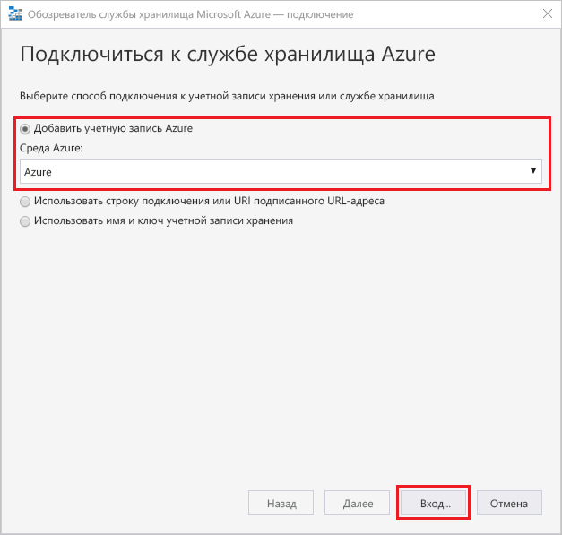
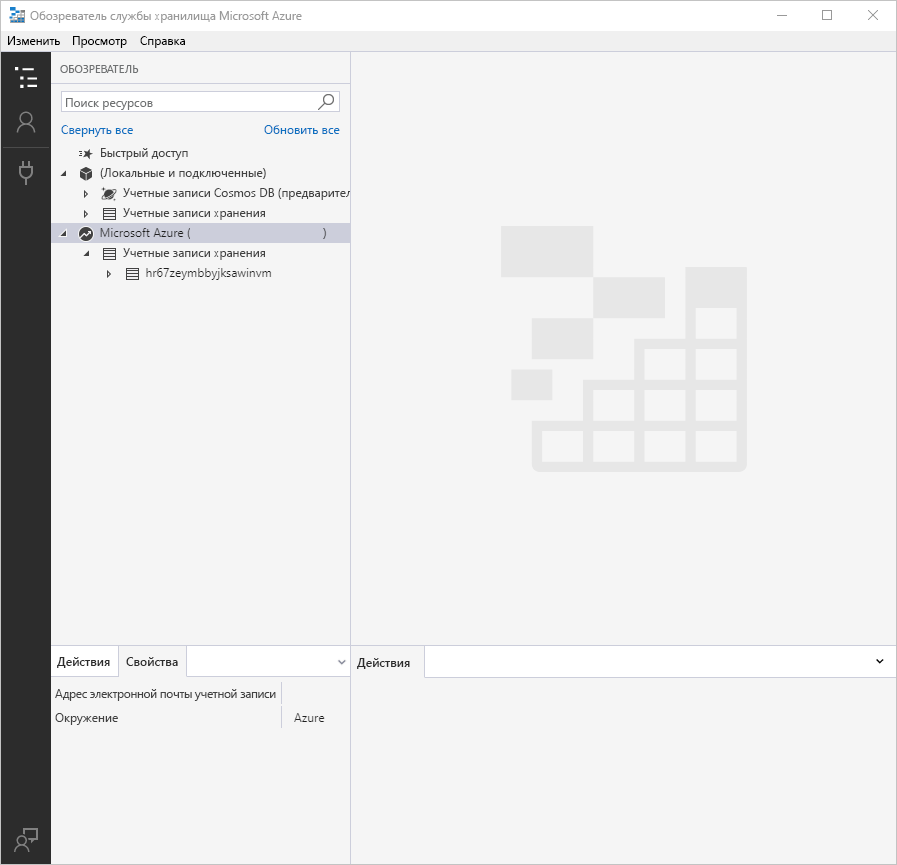
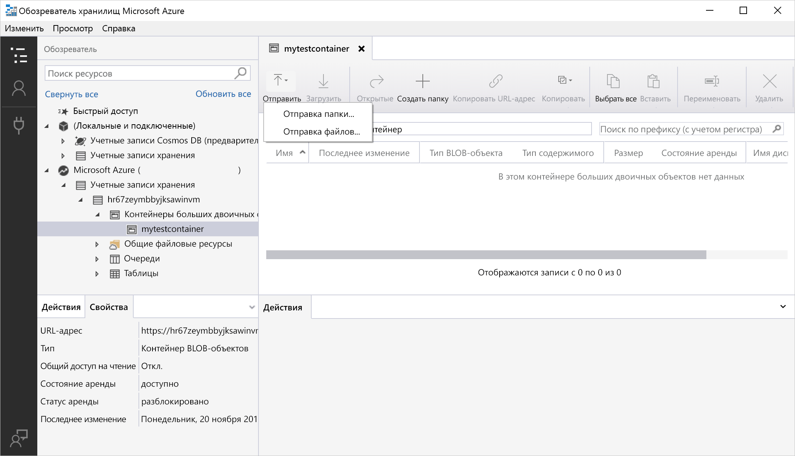
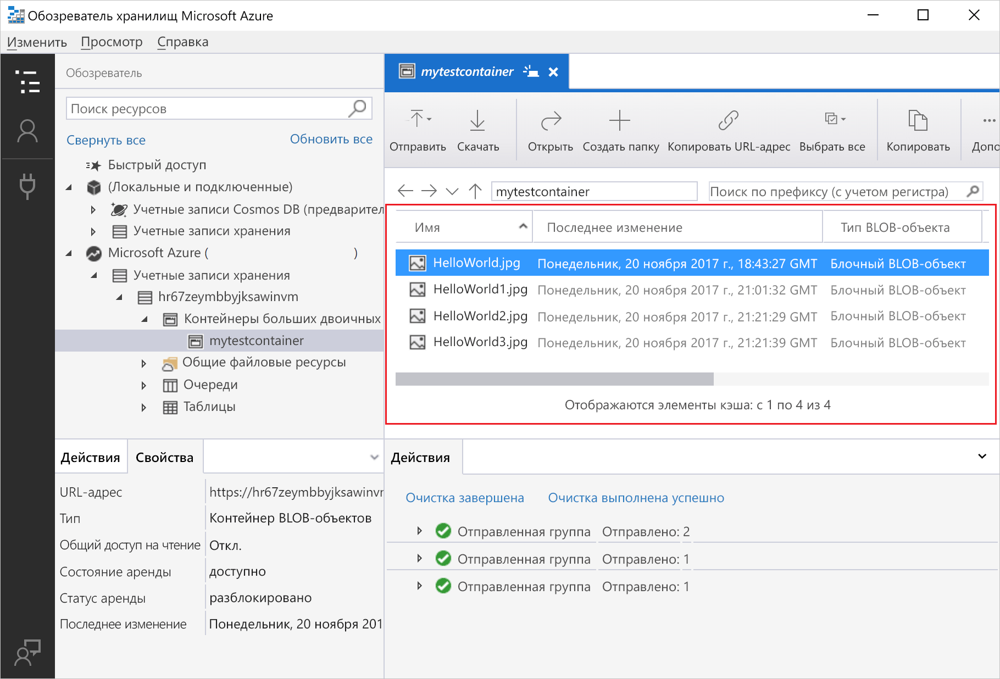
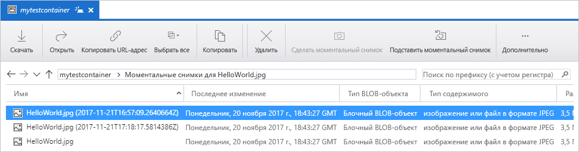
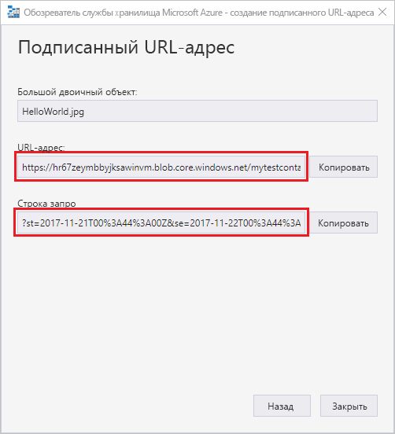

# Краткое руководство по передаче, скачиванию и составлению списка больших двоичных объектов с помощью Обозревателя службы хранилища Azure

[Обозреватель службы хранилища Azure](https://azure.microsoft.com/features/storage-explorer/) — это кроссплатформенный пользовательский интерфейс, с помощью которого можно управлять содержимым учетных записей хранения. В этом руководстве рассматривается использование обозревателя службы хранилища Azure для передачи файлов между локальным диском и хранилищем BLOB-объектов Azure.

Если у вас еще нет подписки Azure, [создайте бесплатную учетную запись Azure](https://azure.microsoft.com/free/?WT.mc_id=A261C142F), прежде чем начинать работу.

Для работы с этим кратким руководством необходимо установить обозреватель службы хранилища Azure. Если вы еще не установили его, на странице [обозревателя службы хранилища Azure](https://azure.microsoft.com/features/storage-explorer/) можно скачать версию для Windows, Macintosh или Linux.

[!INCLUDE [storage-quickstart-tutorial-create-account-portal](../../../includes/storage-quickstart-tutorial-create-account-portal.md)]

## Вход в обозреватель службы хранилища

При первом запуске откроется окно **подключения обозревателя службы хранилища Microsoft Azure**. Обозреватель службы хранилища предоставляет несколько способов подключения к учетным записям хранения. В следующей таблице перечислены различные способы подключения.

|Задача|Назначение|
|---|---|
|Добавление учетной записи Azure | Перенаправляет вас на страницу входа организации для аутентификации в Azure. |
|Создание строки подключения или URI подписанного URL-адреса | Можно использовать для прямого доступа к контейнеру или учетной записи хранения с токеном SAS или общей строкой подключения. |
|Использование имени и ключа учетной записи хранения| Имя учетной записи хранения и ключ учетной записи хранения используются для подключения к службе хранилища Azure.|

Выберите **Добавить учетную запись Azure** и нажмите кнопку **Войти**. Следуйте указаниям на экране, чтобы войти в учетную запись Azure.

После подключения загружается обозреватель службы хранилища Azure с вкладкой **Обозреватель**. В этом представлении вы можете просматривать сведения обо всех учетных записях хранения Azure, а также о локальном хранилище, настроенном с помощью учетных записей [эмулятора службы хранилища Azure](../common/storage-use-emulator.md?toc=%2fazure%2fstorage%2fblobs%2ftoc.json), [Cosmos DB](../../cosmos-db/storage-explorer.md?toc=%2fazure%2fstorage%2fblobs%2ftoc.json) или сред [Azure Stack](../../azure-stack/user/azure-stack-storage-connect-se.md?toc=%2fazure%2fstorage%2fblobs%2ftoc.json).

## Создание контейнера

Большие двоичные объекты всегда отправляются в контейнер. Это позволяет упорядочивать группы BLOB-объектов аналогично организации файлов в папки на компьютере.

Чтобы создать контейнер, разверните учетную запись хранения, созданную на предыдущем шаге. Щелкните правой кнопкой мыши элемент **Контейнеры больших двоичных объектов** и выберите пункт **Создать контейнер BLOB-объектов**. Введите имя контейнера больших двоичных объектов. В разделе о [создании контейнера и настройке разрешений ](storage-quickstart-blobs-dotnet.md#create-the-container-and-set-permissions) см. список правил и ограничений для именования контейнеров больших двоичных объектов. Нажмите клавишу **ВВОД**, чтобы создать контейнер больших двоичных объектов. После успешного создания контейнера больших двоичных объектов он отобразится в папке **Контейнеры больших двоичных объектов** выбранной учетной записи хранения.

## Отправка BLOB-объектов в контейнер

Хранилище BLOB-объектов поддерживает блочные, добавочные и страничные BLOB-объекты. VHD-файлы, используемые для резервных виртуальных машин IaaS, являются страничными BLOB-объектами. Добавочные BLOB-объекты используются для ведения журнала, например если требуется выполнить запись в файл и затем добавлять дополнительные сведения. Большинство файлов, находящихся в хранилище BLOB-объектов, представляют собой блочные BLOB-объекты.

На ленте контейнера выберите **Передать**. Эта операция позволяет передать папку или файл.

Выберите файлы или папку для передачи. Выберите **тип большого двоичного объекта**. Допустимые варианты больших двоичных объектов: **добавочный**, **страничный** или **блочный**.

Если вы передаете VHD- или VHDX-файл, выберите **Upload .vhd/.vhdx files as page blobs (recommended)** (Передать VHD- или VHDX-файлы как страничные BLOB-объекты (рекомендуется)).

В поле **Upload to folder (optional)** (Передача в папку (необязательно)) укажите папку для хранения файлов или папок в папке контейнера. Если папка не выбрана, файлы передаются прямо в контейнер.

Если нажать кнопку **ОК**, выбранные файлы помещаются в очередь для передачи, а затем каждый файл передается. После завершения передачи результаты отображаются в окне **Действия**.

## Просмотр больших двоичных объектов в контейнере

В приложении **Обозреватель службы хранилища Azure** выберите контейнер в учетной записи хранения. На основной панели отображается список больших двоичных объектов в выбранном контейнере.

## Скачивание больших двоичных объектов

Чтобы скачать большие двоичные объекты с помощью **обозревателя службы хранилища Azure**, выберите большой двоичный объект, а затем на ленте нажмите кнопку **Скачать**. Откроется диалоговое окно, в котором можно ввести имя файла. Нажмите кнопку **Сохранить** чтобы начать скачивание большого двоичного объекта в локальную папку.

## Управление моментальными снимками

С помощью обозревателя службы хранилища Azure можно создавать [моментальные снимки](storage-blob-snapshots.md) больших двоичных объектов и управлять ими. Чтобы сделать снимок большого двоичного объекта, щелкните его правой кнопкой мыши и выберите **Make Snapshot** (Создать моментальный снимок). Чтобы просмотреть моментальные снимки большого двоичного объекта, щелкните его правой кнопкой мыши и выберите **Manage Snapshots** (Управлять моментальными снимками). На текущей вкладке отобразится список моментальных снимков больших двоичных объектов.

## Управление политиками доступа

В пользовательским интерфейсе обозревателя службы хранилища можно управлять политиками доступа к контейнерам. Есть два типа политик безопасного доступа: политика уровня обслуживания и политика уровня учетной записи. Политика безопасного доступа уровня учетной записи предназначена для учетной записи хранения и может быть применена к нескольким службам и ресурсам. Политика безопасного доступа уровня обслуживания определяется в ресурсе конкретной службы. Чтобы создать политику уровня обслуживания, щелкните контейнер правой кнопкой мыши, а затем выберите **Manage Access Policies** (Управлять политиками доступа). Чтобы создать политику уровня учетной записи, щелкните правой кнопкой мыши учетную запись хранения.

Нажмите кнопку **Добавить**, чтобы добавить политику доступа и определить для нее разрешения. Нажмите кнопку **Сохранить**, чтобы сохранить политику доступа. Эту политику теперь можно использовать при настройке подписанного URL-адреса.

## Работа с подписанными URL-адресами

Подписанные URL-адреса (SAS) можно получить с помощью обозревателя службы хранилища. Щелкните правой кнопкой мыши учетную запись хранения, контейнер или большой двоичный объект и выберите **Get Shared Access Signature** (Получить подписанный URL-адрес). Выберите время начала и окончания срока действия и разрешения для URL-адреса SAS, а затем нажмите кнопку **Создать**. На следующем экране отобразятся полный URL-адрес со строкой запроса, а также сама строка запроса. Их можно скопировать.

## Дополнительная информация

Из этого краткого руководства вы узнали, как передавать файлы между локальным диском и хранилищем BLOB-объектов Azure с помощью **обозревателя службы хранилища Azure**. Дополнительные сведения о работе с хранилищем BLOB-объектов см. в соответствующем практическом руководстве.

> [!div class="nextstepaction"]
> [Практическое руководство по операциям в хранилище BLOB-объектов](storage-how-to-use-blobs-powershell.md)
