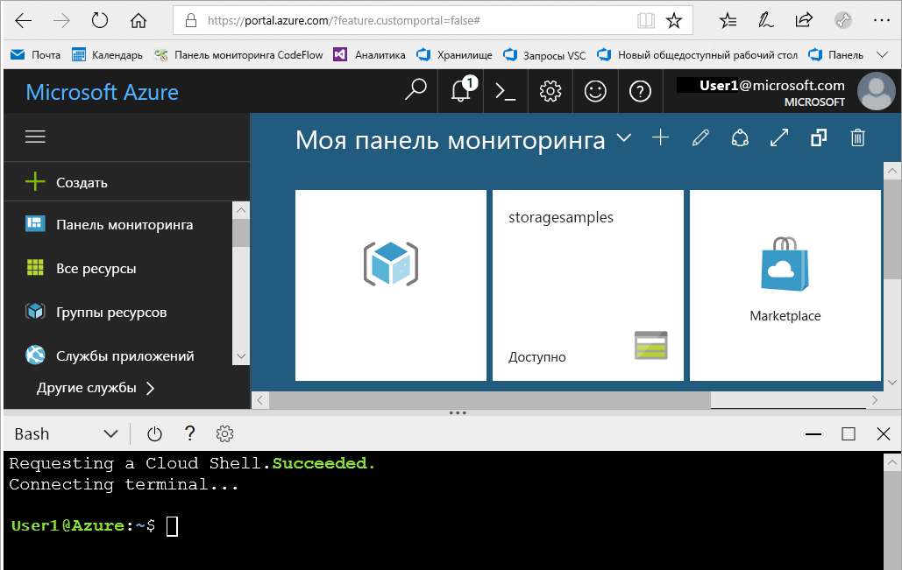
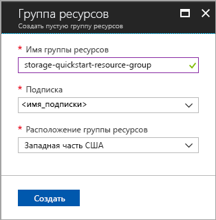
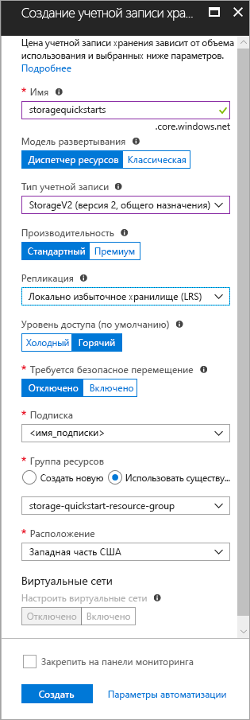

# <a name="create-a-new-storage-account"></a>Создание новой учетной записи хранения

Учетная запись хранения Azure предоставляет уникальное пространство имен на облаке для хранения объектов данных в службе хранилища Azure и доступа к ним. Учетная запись хранения содержит все большие двоичные объекты, файлы, очереди, таблицы и диски, созданные при работе с ней. 

Чтобы начать работу со службой хранилища Azure, сначала необходимо создать учетную запись хранения. Ее можно создать с помощью [портала Azure](https://portal.azure.com/), [Azure PowerShell](https://docs.microsoft.com/powershell/azure/overview) или [интерфейса командной строки Azure](https://docs.microsoft.com/cli/azure/overview?view=azure-cli-latest). В этом кратком руководстве показано, как создать учетную запись хранения каждым из этих способов. 


## <a name="prerequisites"></a>предварительным требованиям

Если у вас еще нет подписки Azure, [создайте бесплатную учетную запись Azure](https://azure.microsoft.com/free/), прежде чем начинать работу.

# <a name="portaltabportal"></a>[Портал](#tab/portal)

Отсутствует.

# <a name="powershelltabpowershell"></a>[PowerShell](#tab/powershell)

Для работы с этим кратким руководством требуется модуль Azure PowerShell 3.6 или более поздней версии. Чтобы узнать, какая версия используется сейчас, выполните команду `Get-Module -ListAvailable AzureRM`. Если вам необходимо выполнить установку или обновление, см. статью [об установке модуля Azure PowerShell](/powershell/azure/install-azurerm-ps).

# <a name="azure-clitabazure-cli"></a>[интерфейс командной строки Azure](#tab/azure-cli)

Вы можете войти в Azure и выполнить команды Azure CLI одним из двух способов:

- Выполнить команды CLI на портале Azure в Azure Cloud Shell. 
- Установить CLI и выполнить команды CLI локально.  

### <a name="use-azure-cloud-shell"></a>Использование Azure Cloud Shell

Azure Cloud Shell — это бесплатная оболочка Bash, которую можно запускать непосредственно на портале Azure. Она включает предварительно установленный интерфейс Azure CLI и настроена для использования с вашей учетной записью. Нажмите кнопку меню **Cloud Shell** в правом верхнем углу окна портала Azure.

[](https://portal.azure.com)

Эта кнопка запускает интерактивную оболочку, с помощью которой можно выполнять действия, описанные в этом кратком руководстве:

[](https://portal.azure.com)

### <a name="install-the-cli-locally"></a>Установка CLI локально

Azure CLI также можно установить и применять локально. Для этого руководства требуется Azure CLI версии 2.0.4 или более поздней. Чтобы узнать версию, выполните команду `az --version`. Если вам необходимо выполнить установку или обновление, см. статью [Установка Azure CLI 2.0](/cli/azure/install-azure-cli). 

---

## <a name="log-in-to-azure"></a>Вход в Azure

# <a name="portaltabportal"></a>[Портал](#tab/portal)

Войдите на [портал Azure](https://portal.azure.com).

# <a name="powershelltabpowershell"></a>[PowerShell](#tab/powershell)

Чтобы выполнить проверку подлинности, войдите в подписку Azure с помощью команды `Login-AzureRmAccount` и следуйте инструкциям на экране.

```powershell
Login-AzureRmAccount
```

# <a name="azure-clitabazure-cli"></a>[интерфейс командной строки Azure](#tab/azure-cli)

Чтобы запустить Azure Cloud Shell, войдите на [портал Azure](https://portal.azure.com).

Чтобы войти в локальную установку CLI, выполните команду входа:

```cli
az login
```

---

## <a name="create-a-resource-group"></a>Создание группы ресурсов

Группа ресурсов Azure является логическим контейнером, в котором происходит развертывание ресурсов Azure и управление ими. Дополнительные сведения о группах ресурсов см. в статье [Общие сведения об Azure Resource Manager](../../azure-resource-manager/resource-group-overview.md).

# <a name="portaltabportal"></a>[Портал](#tab/portal)

Чтобы создать группу ресурсов на портале Azure, сделайте следующее:

1. На портале Azure разверните меню слева, чтобы открыть меню служб, и выберите **Resource Groups** (Группы ресурсов).
2. Нажмите кнопку **Add** (Добавить), чтобы добавить новую группу ресурсов.
3. Введите имя для группы ресурсов.
4. Выберите подписку, в которой нужно создать группу ресурсов.
5. Выберите расположение группы ресурсов.
6. Нажмите кнопку **Создать** .  



# <a name="powershelltabpowershell"></a>[PowerShell](#tab/powershell)

Чтобы создать группу ресурсов с помощью PowerShell, выполните команду [New-AzureRmResourceGroup](/powershell/module/azurerm.resources/new-azurermresourcegroup). 

```powershell
# put resource group in a variable so you can use the same group name going forward,
# without hardcoding it repeatedly
$resourceGroup = "storage-quickstart-resource-group"
New-AzureRmResourceGroup -Name $resourceGroup -Location $location 
```

Если вы не уверены, какой регион необходимо задать для параметра `-Location`, вы можете получить список поддерживаемых регионов для своей подписки, выполнив команду [Get-AzureRmLocation](/powershell/module/azurerm.resources/get-azurermlocation).

```powershell
Get-AzureRmLocation | select Location 
$location = "westus"
```

# <a name="azure-clitabazure-cli"></a>[интерфейс командной строки Azure](#tab/azure-cli)

Чтобы создать группу ресурсов с помощью Azure CLI, используйте команду [az group create](/cli/azure/group#create). 

```azurecli-interactive
az group create \
    --name storage-quickstart-resource-group \
    --location westus
```

Если вы не уверены, какой регион необходимо задать для параметра `--location`, вы можете получить список поддерживаемых регионов для своей подписки, выполнив команду [az account list-locations](/cli/azure/account#list).

```azurecli-interactive
az account list-locations \
    --query "[].{Region:name}" \
    --out table
```

---

# <a name="create-a-general-purpose-storage-account"></a>Создание учетной записи хранения общего назначения

Учетная запись хранения общего назначения предоставляет доступ ко всем службам хранилища Azure (большим двоичным объектам, файлам, очередям и таблицам). Учетная запись хранения общего назначения может создаваться на уровне Standard или Premium. В этой статье показано, как создать учетную запись хранения общего назначения на уровне Standard (по умолчанию). Дополнительные сведения о параметрах учетной записи хранения см. в статье [Введение в хранилище Microsoft Azure](storage-introduction.md).

Помните о следующих правилах при назначении имени учетной записи хранения.

- Имя учетной записи хранения должно содержать от 3 до 24 символов и состоять только из цифр и строчных букв.
- Имя учетной записи хранения должно быть уникальным в Azure. Две учетные записи хранения не могут иметь одно имя.

# <a name="portaltabportal"></a>[Портал](#tab/portal)

Чтобы создать учетную запись хранения общего назначения на портале Azure, сделайте следующее:

1. На портале Azure разверните меню слева, чтобы открыть меню служб, и выберите **Больше служб**. Прокрутите вниз до пункта **Хранилище** и выберите **Учетные записи хранения**. В появившемся окне **Учетные записи хранения** выберите **добавить**.
2. Выберите имя для своей учетной записи хранения.
3. В полях **Модель развертывания**, **Тип учетной записи**, **Performance** (Производительность), **Replication** (Репликация), **Требуется безопасное перемещение** оставьте значения по умолчанию.
4. Выберите подписку, в которой нужно создать учетную запись хранения.
5. В разделе **Resource group** (Группа ресурсов) щелкните **Use existing** (Использовать имеющуюся), а затем выберите группу ресурсов, созданную в предыдущем разделе.
6. Выберите расположение для новой учетной записи хранения.
7. Щелкните **Создать** , чтобы создать учетную запись хранения.      



# <a name="powershelltabpowershell"></a>[PowerShell](#tab/powershell)

Чтобы создать учетную запись хранения общего назначения с помощью PowerShell, примените команду [New-AzureRmStorageAccount](/powershell/module/azurerm.storage/New-AzureRmStorageAccount): 

```powershell
New-AzureRmStorageAccount -ResourceGroupName $resourceGroup `
  -Name "storagequickstart" `
  -Location $location `
  -SkuName Standard_LRS `
  -Kind Storage 
```

# <a name="azure-clitabazure-cli"></a>[интерфейс командной строки Azure](#tab/azure-cli)

Чтобы создать учетную запись хранения общего назначения с помощью Azure CLI, примените команду [az storage account create](/cli/azure/storage/account#create).

```azurecli-interactive
az storage account create \
    --name storagequickstart \
    --resource-group storage-quickstart-resource-group \
    --location westus \
    --sku Standard_LRS 
```

---

## <a name="clean-up-resources"></a>Очистка ресурсов

Если нужно очистить ресурсы, созданные при работе с этим кратким руководством, можно просто удалить группу ресурсов. При этом удаляется связанная учетная запись хранения и другие ресурсы, связанные с этой группой ресурсов.

# <a name="portaltabportal"></a>[Портал](#tab/portal)

Чтобы удалить группу ресурсов с помощью портала Azure, сделайте следующее:

1. На портале Azure разверните меню слева, чтобы открыть меню служб, и выберите **Resource Groups** (Группы ресурсов), чтобы просмотреть список групп ресурсов.
2. Найдите группу ресурсов, которую нужно удалить, и щелкните правой кнопкой мыши кнопку **More** (Дополнительно) (**...**) справа от списка.
3. Выберите **Удалить группу ресурсов** и подтвердите выбор.

# <a name="powershelltabpowershell"></a>[PowerShell](#tab/powershell)

Чтобы удалить группу ресурсов и связанные с ней ресурсы, включая новую учетную запись хранения, используйте команду [Remove-AzureRmResourceGroup](/powershell/module/azurerm.resources/remove-azurermresourcegroup): 

```powershell
Remove-AzureRmResourceGroup -Name $resourceGroup
```

# <a name="azure-clitabazure-cli"></a>[интерфейс командной строки Azure](#tab/azure-cli)

Чтобы удалить группу ресурсов и связанные с ней ресурсы, включая новую учетную запись хранения, используйте команду [az group delete](/cli/azure/group#delete).

```azurecli-interactive
az group delete --name myResourceGroup
```

---

## <a name="next-steps"></a>Дополнительная информация

В этом кратком руководстве вы создали стандартную учетную запись хранения общего назначения. Сведения об отправке и скачивании больших двоичных объектов в учетную запись хранения и обратно см. в кратком руководстве по хранилищу BLOB-объектов.

# <a name="portaltabportal"></a>[Портал](#tab/portal)

> [!div class="nextstepaction"]
> [Отправка объектов в хранилище BLOB-объектов Azure и обратно с помощью портала Azure](../blobs/storage-quickstart-blobs-portal.md)

# <a name="powershelltabpowershell"></a>[PowerShell](#tab/powershell)

> [!div class="nextstepaction"]
> [Transfer objects to/from Azure Blob storage using Azure PowerShell](../blobs/storage-quickstart-blobs-powershell.md) (Передача объектов в хранилище BLOB-объектов Azure и обратно с помощью Azure PowerShell)

# <a name="azure-clitabazure-cli"></a>[интерфейс командной строки Azure](#tab/azure-cli)

> [!div class="nextstepaction"]
> [Отправка объектов в хранилище BLOB-объектов Azure и обратно с помощью Azure CLI](../blobs/storage-quickstart-blobs-cli.md)

---