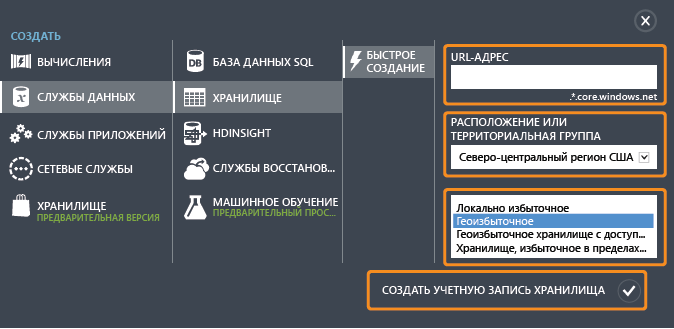
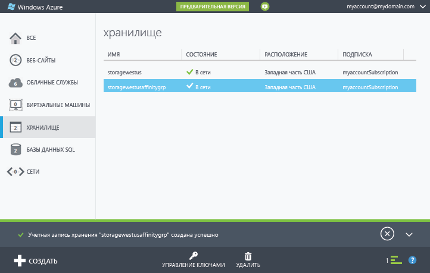
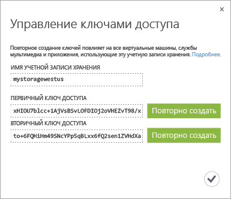

<properties
	pageTitle="Создание и удаление учетной записи хранения, а также управление ею на классическом портале Azure | Microsoft Azure"
	description="Создание учетной записи хранения, управление ключами доступа к учетной записи и удаление учетной записи хранения на портале Azure. Дополнительные сведения об учетных записях хранения класса Standard и Premium."
	services="storage"
	documentationCenter=""
	authors="robinsh"
	manager="carmonm"
	editor="tysonn"/>

<tags
	ms.service="storage"
	ms.workload="storage"
	ms.tgt_pltfrm="na"
	ms.devlang="na"
	ms.topic="get-started-article"
	ms.date="07/26/2016"
	ms.author="micurd;robinsh"/>

# Об учетных записях хранения Azure

[AZURE.INCLUDE [storage-selector-portal-create-storage-account](../../includes/storage-selector-portal-create-storage-account.md)]   [AZURE.INCLUDE [storage-try-azure-tools](../../includes/storage-try-azure-tools.md)]

## Обзор

Учетная запись хранения Azure предоставляет доступ к службам больших двоичных объектов, очередей, таблиц и файлов в службе хранилища Azure. Учетная запись хранения предоставляет уникальное пространство имен для ваших объектов данных в службе хранилища Azure. По умолчанию данные в учетной записи доступны только владельцу учетной записи.

Существует два типа учетных записей хранения:

- Стандартная учетная запись хранения включает в себя хранилище для больших двоичных объектов, таблиц, очередей и файлов.
- Учетная запись хранения класса Premium в настоящее время поддерживает только диски виртуальных машин Azure. Подробный обзор хранилища класса Premium см. в статье [Хранилище Premium: высокопроизводительное хранилище для рабочих нагрузок виртуальных машин Azure](storage-premium-storage.md).

## Выставление счетов за использование учетной записи хранения

За пользование услугами службы хранилища Azure вам будет выставлен счет согласно вашей учетной записи хранения. Затраты на хранение основываются на четырех факторах: емкость хранилища, схема репликации, транзакции хранилища и передача данных.

- Объем хранилища определяет, какая часть выделенного объема учетной записи хранения используется для хранения данных. Стоимость простого хранения данных определяется в зависимости от объема хранящихся данных и способа их репликации.
- Репликация определяет, какое количество копий ваших данных следует хранить и где.
- Транзакции – это все операции чтения и записи в хранилище Azure.
- Передача данных означает данные, переданные из региона Azure. Когда к данным вашей учетной записи хранения обращается приложение, выполняемое в другом регионе, то независимо от типа приложения (облачная служба или приложение другого типа) вам начисляется плата за исходящие данные. (Для служб Azure можно сгруппировать данные и службы в одном центре обработки данных, чтобы уменьшить или исключить плату за передачу данных.)

На странице [Цены на хранилища Azure](https://azure.microsoft.com/pricing/details/storage) представлена подробная информация о ценах на объемы хранилища, репликацию и транзакции. Подробные сведения о стоимости передачи данных см. на странице [Сведения о ценах — передача данных](https://azure.microsoft.com/pricing/details/data-transfers/).

Дополнительную информацию о емкости и пропускной способности учетной записи хранения см. в разделе [Целевые показатели масштабируемости и производительности службы хранилища Azure](storage-scalability-targets.md).

> [AZURE.NOTE] При работе с виртуальной машиной Azure учетная запись хранения создается автоматически в месте развертывания, если в этом расположении еще нет учетной записи хранения. Таким образом нет необходимости выполнять описанные ниже шаги для создания учетной записи хранения для дисков вашей виртуальной машины. Имя учетной записи хранения основывается на имени виртуальной машины. Дополнительную информацию см. в статье [Документация по виртуальным машинам Azure](https://azure.microsoft.com/documentation/services/virtual-machines/).

## Создайте учетную запись хранения.

1. Войдите на [классический портал Azure](https://manage.windowsazure.com).

2. В нижней части страницы на панели задач щелкните **Создать**. Последовательно щелкните **Службы данных**, **Хранилище** и **Быстрое создание**.

	

3. В поле **URL-адрес** введите имя своей учетной записи хранения.

	> [AZURE.NOTE] Имя учетной записи хранения должно содержать от 3 до 24 символов и состоять только из цифр и строчных букв.
	>  
	> Имя учетной записи хранения должно быть уникальным в Azure. Классический портал Azure сообщит, если выбранное имя учетной записи хранения уже занято.

	Сведения об использовании имени учетной записи хранения для доступа к объектам в службе хранилища Azure см. в разделе [Конечные точки учетной записи хранения](#storage-account-endpoints) ниже.

4. С помощью поля **Расположение или территориальная группа** выберите расположение своей учетной записи хранения, наиболее близкое к вам или вашим клиентам. Если необходимо, чтобы данные из вашей учетной записи хранения были доступны для другой службы Azure (например, виртуальной машины или облачной службы Azure), рекомендуется выбирать территориальную группу, которая совпадает с территориальной группой вашей учетной записи хранения, чтобы данные и службы Azure, которые их обрабатывают, хранились в одном центре обработки данных, так как это позволит повысить производительность и снизить расходы.

	Обратите внимание, что территориальная группа выбирается во время создания учетной записи хранения. Переместить существующую учетную запись в другую территориальную группу невозможно. Дополнительную информацию о территориальных группах см. в разделе [Совместное размещение служб с помощью территориальной группы](#service-co-location-with-an-affinity-group) ниже.

	>[AZURE.IMPORTANT] Чтобы узнать, какие расположения доступны для вашей подписки, вызовите операцию [List all resource providers](https://msdn.microsoft.com/library/azure/dn790524.aspx). Чтобы определить, какие расположения доступны для подписки, вы можете вызвать операцию [Get-AzureLocation](https://msdn.microsoft.com/library/azure/dn757693.aspx). В .NET используйте метод [List](https://msdn.microsoft.com/library/azure/microsoft.azure.management.resources.provideroperationsextensions.list.aspx) класса ProviderOperationsExtensions.
	>
	>Кроме того, в разделе [Регионы Azure](https://azure.microsoft.com/regions/#services) представлены дополнительные сведения о доступности служб в разных регионах.

5. При наличии нескольких подписок Azure отображается поле **Подписка**. В поле **Подписка** введите подписку Azure, которую требуется использовать вместе с учетной записью хранения.

6. В поле **Репликация** выберите желаемый уровень репликации для своей учетной записи хранения. Рекомендуется использовать геоизбыточную репликацию, так как она обеспечивает наибольшую сохранность ваших данных. Дополнительные сведения о репликации службы хранилища Azure см. в статье [Репликация службы хранилища Azure](storage-redundancy.md).

6. Щелкните **Создать учетную запись хранения**.

	На создание учетной записи хранения может уйти несколько минут. Для проверки состояния можно использовать уведомления в нижней части классического портала Azure. После создания учетной записи хранения ваша новая учетная запись хранения переходит в состояние **В сети** и становится готовой к использованию.

### Конечные точки учетной записи хранения

Каждый объект, который хранится в службе хранилища Azure, имеет уникальный URL-адрес. Имя учетной записи хранения образует поддомен этого адреса. Имя поддомена и доменное имя, уникальное для каждой службы, вместе образуют *конечную точку* учетной записи хранения.

Например, если учетная запись хранения имеет имя *mystorageaccount*, конечной точкой для учетной записи хранения будет:

- Служба BLOB-объектов: http://*mystorageaccount*.blob.core.windows.net

- Служба таблиц: http://*mystorageaccount*.table.core.windows.net

- Служба очередей: http://*mystorageaccount*.queue.core.windows.net

- Служба файлов: http://*mystorageaccount*.file.core.windows.net

Конечные точки вашей учетной записи хранения можно увидеть на панели мониторинга [классического портала Azure](https://manage.windowsazure.com) сразу после создания учетной записи.

URL-адрес для доступа к объекту в учетной записи хранения строится путем добавления местоположения объекта в учетной записи хранения к конечной точке. Например, адрес большого двоичного объекта может иметь следующий формат: http://*mystorageaccount*.blob.core.windows.net/*mycontainer*/*myblob*.

Для своей учетной записи хранения вы можете настроить имя домена. Подробные сведения см. в статье [Настройка пользовательского доменного имени для конечной точки хранилища BLOB-объектов](storage-custom-domain-name.md).

### Совместное размещение служб с помощью территориальной группы

*Территориальная группа* — это географическое группирование облачных служб и ВМ для учетных записей хранения в Azure. Территориальная группа может повысить производительность служб, если расположить нагрузку, связанную с вычислениями и хранением данных, в одном центре обработки данных или рядом с целевой аудиторией пользователей. Кроме того, плата за передачу данных не взимается, если доступ к данным в учетной записи хранения предоставляется через службу, работающую в той же территориальной группе.

> [AZURE.NOTE]  Чтобы создать территориальную группу, на [классическом портале Azure](https://manage.windowsazure.com) откройте раздел <b>Параметры</b>, перейдите на страницу <b>Территориальные группы</b>, а затем нажмите кнопку <b>Добавить территориальную группу</b> или <b>Добавить</b>. Вы также можете создавать территориальные группы и управлять ими с помощью API управления службами Azure. Дополнительные сведения см. в статье <a href="http://msdn.microsoft.com/library/azure/ee460798.aspx">Операции с территориальными группами</a>.

## Просмотр, копирование и повторное создание ключей доступа к хранилищу

При создании учетной записи хранения Azure создает два 512-битных кода доступа к хранилищу, которые используются для проверки подлинности при доступе к учетной записи хранения. Предоставляя два ключа доступа к хранилищу, Azure позволяет повторно создавать ключи без прерывания предоставления службы хранилища или доступа к этой службе.

> [AZURE.NOTE] Рекомендуем никому не сообщать свои ключи доступа к хранилищу. Чтобы предоставить доступ к ресурсам хранилища. не сообщая свои ключи доступа, можно использовать *подпись коллективного доступа*. Подпись коллективного доступа обеспечивает доступ к ресурсам вашей учетной записи на срок и с разрешениями, которые вы сами определяете. Дополнительные сведения см. в статье об [использовании подписанных URL-адресов (SAS)](storage-dotnet-shared-access-signature-part-1.md).

Войдите на [классический портал Azure](https://manage.windowsazure.com) и на панели мониторинга или странице **Хранилище** щелкните **Управление ключами**. Так вы сможете просмотреть, скопировать или повторно создать ключи доступа к хранилищу (ключи, которые используются для получения доступа к службам BLOB-объектов, таблиц и очередей).

### Копирование ключа доступа к хранилищу  

Можно также использовать функцию **Управление ключами** для копирования ключа доступа к хранилищу с целью использования этой функции в строке подключения. Для строки подключения требуется имя учетной записи хранения и ключ, которые задействуются в проверке подлинности. Сведения о настройке строк подключения для доступа к службам хранилища Azure см. в статье [Настройка строк подключения службы хранилища Azure](storage-configure-connection-string.md).

1. На [классическом портале Azure](https://manage.windowsazure.com) щелкните **Хранилище**, а затем щелкните имя учетной записи хранения, чтобы открыть панель мониторинга.

2. Щелкните **Управление ключами**.

 	Откроется окно **Управление ключами доступа**.

	

3. Чтобы скопировать ключ доступа к хранилищу, выберите текст ключа. Затем щелкните его правой кнопкой и выберите пункт **Копировать**.

### Повторное создание ключей доступа к хранилищу
Мы рекомендуем периодически изменять ключи доступа к учетной записи хранения, чтобы обеспечить безопасность при подключении к хранилищу. Назначаются два ключа доступа, которые позволяют обслуживать подключения к учетной записи хранения с помощью одного ключа доступа во время переназначения другого.

> [AZURE.WARNING] Повторное создание ключей доступа влияет на службы Azure, равно как и на ваши собственные приложения, которые зависят от учетной записи хранения. Все клиенты, использующие ключ доступа к учетной записи хранения, должны быть обновлены для использования нового ключа.

**Службы мультимедиа**. Если у вас есть службы мультимедиа, которые зависят от учетной записи хранения, повторно созданные ключи доступа необходимо еще раз синхронизировать со службой мультимедиа.

**Приложения**. Если у вас есть веб-приложения или облачные службы, использующие учетную запись хранения, повторно созданные ключи необходимо обновить, иначе подключения будут разорваны.

**Обозреватели хранилищ**. Если вы используете [приложения обозревателей хранилищ](storage-explorers.md), возможно, вам понадобится обновить ключ к хранилищу данных, используемый этими приложениями.

Далее описан полный процесс смены ключей доступа.

1. Обновите строки подключения в коде приложения, чтобы ссылаться на дополнительный ключ доступа учетной записи хранения.

2. Повторное создание основного ключа доступа для вашей учетной записи хранения. На [классическом портале Azure](https://manage.windowsazure.com) перейдите на панель мониторинга или страницу **Настройка** и щелкните **Управление ключами**. В разделе основного ключа доступа щелкните **Создать повторно**, а затем нажмите кнопку **Да**, чтобы подтвердить создание нового ключа.

3. Обновите строки подключения в коде, чтобы они ссылались на новый основной ключ доступа.

4. Повторно создайте дополнительный ключ доступа.

## Удаление учетной записи хранения

Чтобы удалить учетную запись хранения, которая больше не используется, воспользуйтесь командой **Удалить** на панели мониторинга или странице **Настройка**. Команда **Удалить** удаляет всю учетную запись хранения, включая все BLOB-объекты, таблицы и очереди учетной записи.

> [AZURE.WARNING] Восстановить удаленную учетную запись хранения или ее содержимое невозможно. Создайте резервные копии нужных данных, прежде чем удалять учетную запись. Это касается также любых ресурсов в учетной записи. Восстановить удаленный BLOB-объект, таблицу, очередь или файл невозможно.
>
> Если ваша учетная запись хранения содержит VHD-файлы для виртуальной машины Azure, то необходимо удалить все образы и диски, использующие эти VHD-файлы, прежде чем удалять учетную запись хранения. Сначала остановите виртуальную машину, если она работает, затем удалите ее. Чтобы удалить диски, перейдите на вкладку **Диски** и удалите все диски, содержащиеся в учетной записи хранения. Чтобы удалить образы, перейдите на вкладку **Образы** и удалите все образы, содержащиеся в учетной записи.

1. На [классическом портале Azure](https://manage.windowsazure.com) щелкните **Хранилище**.

2. Щелкните любое место учетной записи хранения, за исключением имени, и выберите пункт **Удалить**.

	 -Или-

	Щелкните имя учетной записи хранения, чтобы открыть панель мониторинга, затем щелкните **Удалить**.

3. Нажмите **Да**, чтобы подтвердить удаление учетной записи хранения.

## Дальнейшие действия

- Дополнительные сведения о службе хранилища Azure см. в [соответствующей документации](https://azure.microsoft.com/documentation/services/storage/).
- Посетите [блог команды разработчиков хранилища Azure](http://blogs.msdn.com/b/windowsazurestorage/).
- [Приступая к работе со служебной программой командной строки AzCopy](storage-use-azcopy.md)

<!---HONumber=AcomDC_0928_2016-->