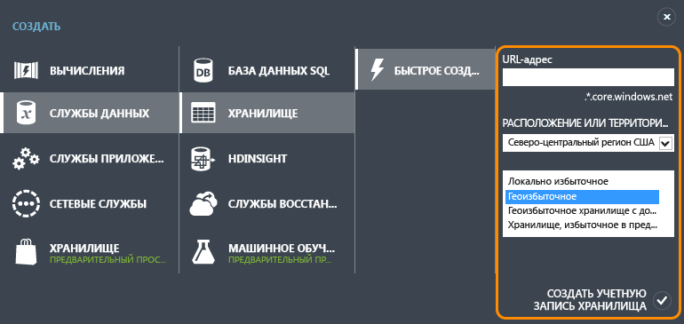
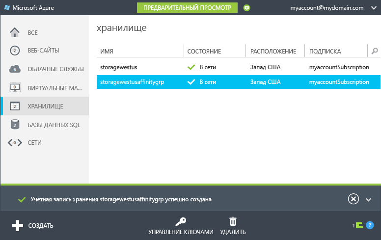
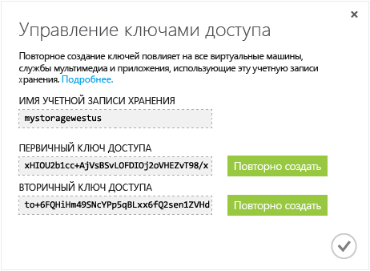

<properties
	pageTitle="Практическое руководство. Создание и удаление учетной записи хранения, а также управление ею | Azure"
	description="Узнайте, как на портале управления Azure создать или удалить учетную запись хранения, а также управлять ею."
	services="storage"
	documentationCenter=""
	authors="tamram"
	manager="adinah"
	editor=""/>

<tags
	ms.service="storage"
	ms.workload="storage"
	ms.tgt_pltfrm="na"
	ms.devlang="na"
	ms.topic="get-started-article" 
	ms.date="07/16/2015"
	ms.author="tamram"/>

# Об учетных записях хранения Azure

## Обзор

Учетная запись хранения Azure — это безопасная учетная запись, которая предоставляет доступ к службам больших двоичных объектов, очередей, таблиц и файлов в хранилище Azure. Учетная запись хранения предоставляет уникальное пространство имен для ваших объектов данных в службе хранилища Azure. По умолчанию данные в учетной записи доступны только владельцу учетной записи.

Существует два типа учетных записей хранения:

- Стандартная учетная запись хранения включает в себя хранилище для больших двоичных объектов, таблиц и очередей. Хранилище файлов доступно по запросу со страницы [предварительной версии Azure](http://azure.microsoft.com/services/preview/).
- Учетная запись хранения Premium в настоящее время поддерживает только диски виртуальных машин Azure. См. раздел [Хранилище Premium: высокопроизводительное хранилище для рабочих нагрузок виртуальных машин Azure](storage-premium-storage-preview-portal.md), чтобы ознакомиться с подробным обзором хранилища Premium.

## Выставление счетов за использование учетной записи хранения

За пользование услугами службы хранилища Azure вам будет выставлен счет согласно вашей учетной записи хранения. Затраты на хранение основываются на четырех факторах: емкость хранилища, схема репликации, транзакции хранилища и передача данных.

- Объем хранилища определяет, какая часть выделенного объема учетной записи хранения используется для хранения данных. Стоимость простого хранения данных определяется в зависимости от объема хранящихся данных и способа их репликации.
- Репликация определяет, какое количество копий ваших данных следует хранить и где.
- Транзакции — это все операции чтения и записи в службе хранилища Azure.
- Передача данных означает данные, переданные из региона Azure. Когда к данным вашей учетной записи хранения обращается приложение, выполняемое в другом регионе, то независимо от типа приложения (облачная служба или приложение другого типа) вам начисляется плата за исходящие данные. (Для служб Azure можно сгруппировать данные и службы в одном центре обработки данных, чтобы уменьшить или исключить плату за передачу данных.)  

Подробные сведения о ценах на объем хранилища, репликацию и транзакции см. на странице [Сведения о ценах на хранилище](http://azure.microsoft.com/pricing/details/#storage). Подробные сведения о ценах на исходящие данные см. на странице [Сведения о ценах на передачу данных](http://azure.microsoft.com/pricing/details/data-transfers/).

Дополнительную информацию о емкости и пропускной способности учетной записи хранения см. в разделе [Целевые показатели масштабируемости и производительности службы хранилища Azure](http://msdn.microsoft.com/library/azure/dn249410.aspx).

> [AZURE.NOTE]При работе с виртуальной машиной Azure учетная запись хранения создается автоматически в месте развертывания, если в этом расположении еще нет учетной записи хранения. Таким образом нет необходимости выполнять описанные ниже шаги для создания учетной записи хранения для дисков вашей виртуальной машины. Имя учетной записи хранения основывается на имени виртуальной машины. Дополнительную информацию см. в статье [Документация по виртуальным машинам Azure](http://azure.microsoft.com/documentation/services/virtual-machines/).

## Создайте учетную запись хранения.

1. Выполните вход на [Портал управления](https://manage.windowsazure.com).

2. Щелкните **Создать**, затем **Хранилище**, и **Быстрое создание**.

	

3. В поле **URL-адрес** введите имя своей учетной записи хранения.
	
	> [AZURE.NOTE]Имя учетной записи хранения должно содержать от 3 до 24 символов и состоять только из цифр и букв нижнего регистра.
	>  
	> Имя учетной записи хранения должно быть уникальным в Azure. Портал укажет, если выбранное имя учетной записи хранения уже занято.

	Сведения об использовании имени учетной записи хранения для адресации объектов в хранилище Azure можно найти в разделе [Конечные точки учетной записи хранения](#storage-account-endpoints) ниже.

4. С помощью поля **Расположение или территориальная группа** выберите расположение своей учетной записи хранения, наиболее близкое к вам или вашим клиентам. Если необходимо, чтобы данные из вашей учетной записи хранения были доступны для другой службы Azure (например, виртуальной машины или облачной службы Azure), рекомендуется выбирать территориальную группу, которая совпадает с территориальной группой вашей учетной записи хранения, чтобы данные и службы Azure, которые их обрабатывают, хранились в одном центре обработки данных, так как это позволит повысить производительность и снизить расходы.

	Обратите внимание, что территориальная группа определяется при создании учетной записи хранения и потом не может быть изменена. Дополнительную информацию о территориальных группах см. в разделе [Совместное размещение служб с помощью территориальной группы](#service-co-location-with-an-affinity-group) ниже.

5. При наличии нескольких подписок Azure отображается поле **Подписка**. В поле **Подписка** введите подписку Azure, которую требуется использовать вместе с учетной записью хранения.

6. В поле **Репликация** выберите желаемый уровень репликации для своей учетной записи хранения. Рекомендуется использовать геоизбыточную репликацию, так как она обеспечивает наибольшую сохранность ваших данных. Дополнительную информацию о параметрах репликации службы хранилища Azure см. в разделе [Параметры репликации учетной записи хранения](storage-redundancy.md).

6. Щелкните **Создать учетную запись хранения**.

	На создание учетной записи хранения может уйти несколько минут. Для проверки состояния можно отслеживать уведомления в нижней части портала. После создания учетной записи хранения ваша новая учетная запись хранения переходит в состояние **В сети** и становится готовой к использованию.

### Конечные точки учетной записи хранения

Каждый объект службы хранилища Azure имеет уникальный URL-адрес; имя учетной записи хранения формирует поддомен этого адреса. Поддомен вместе с доменным именем, уникальным для каждой службы, формирует *конечную точку* вашей учетной записи хранения.

Например, если учетная запись хранения имеет имя *mystorageaccount*, конечной точкой для учетной записи хранения будет:

- Служба BLOB-объектов: http://*mystorageaccount*.blob.core.windows.net

- Служба таблиц: http://*mystorageaccount*.table.core.windows.net

- Служба очередей: http://*mystorageaccount*.queue.core.windows.net

- Служба файлов: http://*mystorageaccount*.file.core.windows.net

Конечные точки вашей учетной записи хранения можно увидеть на панели мониторинга портала управления Azure сразу после создания учетной записи.

URL-адрес для доступа к объекту в учетной записи хранения строится путем добавления местоположения объекта в учетной записи хранения к конечной точке. Например, адрес большого двоичного объекта может иметь следующий формат: http://*mystorageaccount*.blob.core.windows.net/*mycontainer*/*myblob*.

Для своей учетной записи хранения вы можете настроить имя домена. Дополнительную информацию см. в разделе [Настройка имени домена для BLOB-данных в учетной записи хранения](storage-custom-domain-name.md).

### Совместное размещение служб с помощью территориальной группы

*Территориальная группа* — это географическое группирование облачных служб и ВМ для учетных записей хранения в Azure. Территориальная группа может повысить производительность служб, если расположить нагрузку, связанную с вычислениями и хранением данных, в одном центре обработки данных или рядом с целевой аудиторией пользователей. Кроме того, плата за передачу данных не взимается, если доступ к данным в учетной записи хранения предоставляется через службу, работающую в той же территориальной группе.

> [AZURE.NOTE]Чтобы создать территориальную группу, откройте раздел <b>Параметры</b> на портале управления, перейдите на страницу <b>Территориальные группы</b> и затем щелкните либо <b>Добавить территориальную группу</b>, либо <b>Добавить</b>. Можно также создавать территориальные группы и управлять ими с помощью API управления службами Azure. Дополнительную информацию см. в разделе <a href="http://msdn.microsoft.com/library/azure/ee460798.aspx">Операции с территориальными группами</a>.

## Просмотр, копирование и повторное создание ключей доступа к хранилищу

При создании учетной записи хранения Azure создает два 512-битных кода доступа к хранилищу, которые используются для проверки подлинности при доступе к учетной записи хранения. Предоставляя два ключа доступа к хранилищу, Azure позволяет повторно создавать ключи без прерывания предоставления службы хранилища или доступа к этой службе.

> [AZURE.NOTE]Рекомендуем никому не сообщать свои ключи доступа к учетной записи хранения. Чтобы предоставить доступ к ресурсам хранилища. не сообщая свои ключи доступа, можно использовать *подпись коллективного доступа*. Подпись коллективного доступа обеспечивает доступ к ресурсам вашей учетной записи на срок и с разрешениями, которые вы сами определяете. Для получения дополнительной информации см. [учебник по подписи коллективного доступа](storage-dotnet-shared-access-signature-part-1.md).

На [портале управления](http://manage.windowsazure.com) используйте **Управление ключами** на панели мониторинга или странице **Хранилище** для просмотра, копирования и повторного создания ключей доступа к хранилищу, которые используются для получения доступа к таблице BLOB-объектов и службам очередей.

### Копирование ключа доступа к хранилищу  

Можно также использовать функцию **Управление ключами** для копирования ключа доступа к хранилищу с целью использования этой функции в строке подключения. Для строки подключения требуется имя учетной записи хранения и ключ, которые задействуются в проверке подлинности. Сведения о настройке строк подключения для доступа к службам хранилища Azure см. в разделе [Настройка строк подключения](http://msdn.microsoft.com/library/azure/ee758697.aspx).

1. На [Портале мониторинга](http://manage.windowsazure.com) выберите **Хранилище**, а затем щелкните имя учетной записи хранения, чтобы открыть для нее панель мониторинга.

2. Щелкните **Управление ключами**.

 	Откроется окно **Управление ключами доступа**.

	

3. Чтобы скопировать ключ доступа к хранилищу, выберите текст ключа. Затем щелкните его правой кнопкой и выберите пункт **Копировать**.

### Повторное создание ключей доступа к хранилищу
Необходимо периодически изменять ключи доступа к хранилищу, чтобы подключения к хранилищу были более безопасными. Назначены два ключа доступа, которые позволяют обслуживать подключения к учетной записи хранения с помощью одного ключа доступа во время переназначения другого ключа доступа.

> [AZURE.WARNING]Повторное создание ключей доступа влияет на виртуальные машины, службы мультимедиа и любые приложения, которые зависят от учетной записи хранения. Все клиенты, использующие ключ доступа к учетной записи хранения, должны быть обновлены для использования нового ключа.

**Виртуальные машины** Если учетная запись хранения содержит какие-либо работающие виртуальные машины, необходимо будет повторно развернуть все виртуальные машины после повторного создания ключей доступа. Чтобы избежать повторного развертывания, завершите работу виртуальных машин, прежде чем повторно создавать ключи доступа.

**Службы мультимедиа** Если у вас используются службы мультимедиа, зависящие от учетной записи хранения, необходимо повторно синхронизировать ключи доступа со службой мультимедиа после повторного создания ключей.

**Приложения** Если у вас имеются веб-приложения или облачные службы, которые используют учетную запись хранения, после повторного создания ключей подключения будут утрачены, если только ключи не будут переключены. Процесс приведен ниже.

1. Обновите строки подключения в коде приложения, чтобы ссылаться на дополнительный ключ доступа учетной записи хранения.

2. Повторное создание основного ключа доступа для вашей учетной записи хранения. На [портале управления](http://manage.windowsazure.com) перейдите на панель мониторинга или страницу **Настройка**, щелкните **Управление ключами**. Щелкните **Создать повторно** в разделе основного ключа доступа, затем щелкните **Да**, чтобы подтвердить создание нового ключа.

3. Обновите строки подключения в коде, чтобы они ссылались на новый основной ключ доступа.

4. Повторно создайте дополнительный ключ доступа.

## Удаление учетной записи хранения

Чтобы удалить учетную запись хранения, которая больше не используется, воспользуйтесь командой **Удалить** на панели мониторинга или странице **Настройка**. Команда **Удалить** удаляет всю учетную запись хранения, включая все BLOB-объекты, таблицы и очереди учетной записи.

> [AZURE.WARNING]Восстановить удаленную учетную запись хранения или ее содержимое невозможно. Создайте резервные копии нужных данных, прежде чем удалять учетную запись. Это касается также любых ресурсов в учетной записи: в случае удаления большого двоичного объекта, таблицы, очереди или файла их восстановление невозможно.
>
> Если ваша учетная запись хранения содержит VHD-файлы или диски для виртуальной машины Azure, то необходимо удалить все образы и диски, использующие эти VHD-файлы, прежде чем удалять учетную запись хранения. Сначала остановите виртуальную машину, если она работает, затем удалите ее. Чтобы удалить диски, перейдите на вкладку **Диски** и удалите все диски, содержащиеся в учетной записи хранения. Чтобы удалить образы, перейдите на вкладку **Образы** и удалите все образы, содержащиеся в учетной записи.

1. На [Портале управления](http://manage.windowsazure.com) выберите **Хранилище**.

2. Щелкните любое место учетной записи хранения, за исключением имени, и выберите пункт **Удалить**.

	 -Или-

	Щелкните имя учетной записи хранения, чтобы открыть панель мониторинга, затем щелкните **Удалить**.

3. Щелкните **Да**, чтобы подтвердить удаление учетной записи хранения.

## Дальнейшие действия

- Дополнительные сведения о хранилище Azure см. в документации хранилища на следующих ресурсах: [azure.com](http://azure.microsoft.com/documentation/services/storage/) и [MSDN](http://msdn.microsoft.com/library/azure/gg433040.aspx).

- Посетите [блог команды разработчиков хранилища Azure](http://blogs.msdn.com/b/windowsazurestorage/).
 

<!---HONumber=July15_HO4-->