<properties
	pageTitle="Приступая к работе с хранилищем файлов Azure в Windows | Microsoft Azure"
	description="Хранение данных (файлов) в облаке в хранилище файлов Azure и подключение к общей облачной папке из виртуальной машины Azure или из локального приложения под управлением Windows."
	services="storage"
	documentationCenter=".net"
	authors="mine-msft"
	manager="aungoo"
	editor="tysonn" />

<tags ms.service="storage"
	ms.workload="storage"
	ms.tgt_pltfrm="na"
	ms.devlang="dotnet"
	ms.topic="hero-article"
	ms.date="07/26/2016"
	ms.author="minet;robinsh" />

# Приступая к работе с хранилищем файлов Azure в Windows

[AZURE.INCLUDE [storage-selector-file-include](../../includes/storage-selector-file-include.md)]
 
[AZURE.INCLUDE [storage-try-azure-tools-files](../../includes/storage-try-azure-tools-files.md)]

## Обзор

Хранилище файлов Azure — это служба, которая предлагает доступ к общим папкам в облаке с использованием стандартного [протокола SMB](https://msdn.microsoft.com/library/windows/desktop/aa365233.aspx). Поддерживаются версии SMB 2.1 и SMB 3.0. Хранилище файлов Azure позволяет быстро и без дорогостоящей перезаписи выполнить перенос приложений прежних версий, связанных с общими папками. Приложения, работающие на виртуальных машинах Azure, в облачных службах или на локальных клиентах, могут подключать общую папку в облаке так же, как настольное приложение подключает обычную общую папку SMB. Любое количество компонентов приложений может одновременно подключаться и получать доступ к ресурсам хранилища файлов.

Так как ресурсы хранилища файлов представляют собой стандартные файловые ресурсы SMB, приложения, работающие в Azure, могут получать к ним доступ через API ввода-вывода. Таким образом, разработчики могут использовать имеющиеся у них коды и навыки для миграции существующих приложений. IT-специалисты получают возможность использовать командлеты PowerShell для создания и подключения ресурсов хранилища файлов, а также управления им в качестве части администрирования приложений Azure.

Вы можете создавать общие папки Azure с помощью [портала Azure](https://portal.azure.com), командлетов PowerShell службы хранилища Azure, клиентских библиотек службы хранилища Azure и интерфейса REST API службы хранилища Azure. Кроме того, так как для этих общих папок используется протокол SMB, вы можете получать к ним доступ с помощью стандартных и знакомых API-интерфейсов файловой системы.

Дополнительные сведения об использовании хранилища файлов в ОС Linux см. в статье [Использование хранилища файлов Azure в Linux](storage-how-to-use-files-linux.md).

Дополнительные сведения о целевых показателях масштабируемости и производительности хранилища файлов см. в статье [Целевые показатели масштабируемости и производительности службы хранилища Azure](storage-scalability-targets.md#scalability-targets-for-blobs-queues-tables-and-files).

[AZURE.INCLUDE [storage-dotnet-client-library-version-include](../../includes/storage-dotnet-client-library-version-include.md)]

[AZURE.INCLUDE [storage-file-concepts-include](../../includes/storage-file-concepts-include.md)]

## Видео. Использование хранилища файлов Azure в Windows

В этом видео показано создание и использование общих папок Azure в ОС Windows.

> [AZURE.VIDEO azure-file-storage-with-windows]

## О данном учебнике

В этом учебнике по началу работы продемонстрированы основы использования хранилища файлов Microsoft Azure. В этом учебнике мы выполним следующее:

- Воспользуйтесь порталом Azure или оболочкой PowerShell, чтобы создать новую общую папку Azure, добавить каталог, передать локальный файл в эту общую папку и вывести список файлов в каталоге.
- Общие папки подключаются так же, как и любые другие общие папки SMB.
- Получите доступ к общей папке из локального приложения с помощью клиентской библиотеки службы хранилища Azure для .NET. Создайте консольное приложение и выполните эти действия с общей папкой.
	- Впишите содержимое файла из общей папки в консольное окно
	- Задайте квоту (максимальный размер) для общей папки
	- Создайте подпись общего доступа для файла, который использует политику общего доступа, определенную в общей папке
	- Скопируйте файл в другой файл в той же учетной записи хранения
	- Скопируйте файл в BLOB-объект в той же учетной записи хранения
- Используйте метрики службы хранилища Azure как средство устранения неполадок.

Хранение файлов теперь поддерживается для всех учетных записей хранения. Вы можете использовать существующую учетную запись хранения или создать новую. Сведения о создании учетной записи хранения см. в этом [разделе](storage-create-storage-account.md#create-a-storage-account).

## Управление файловым ресурсом с помощью портала Azure

На [портале Azure](https://portal.azure.com) общими папками можно управлять с помощью пользовательского интерфейса. На портале вы можете выполнять следующие действия:

- создавать общие папки;
- передавать файлы в общую папку и скачивать файлы из нее;
- отслеживать фактическое использование каждой общей папки;
- изменять квоты на размер общих папок;
- использовать команду `net use` для подключения файлового ресурса с клиентского компьютера Windows.

### Создание общей папки

1. Войдите на портал Azure.

2. В меню навигации щелкните **Учетные записи хранения** или **Учетные записи хранения (классика)**.

	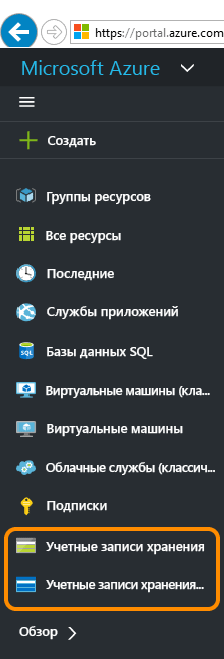

3. Выберите учетную запись хранения.

	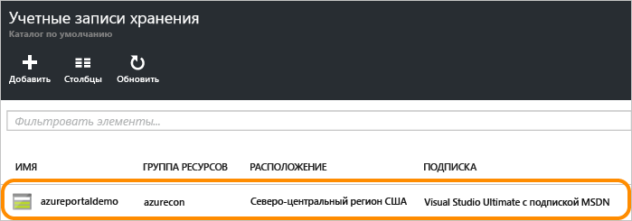

4. Выберите службу "Файлы".

	

5. Щелкните "Общие папки" и перейдите по ссылке для создания первой общей папки.

	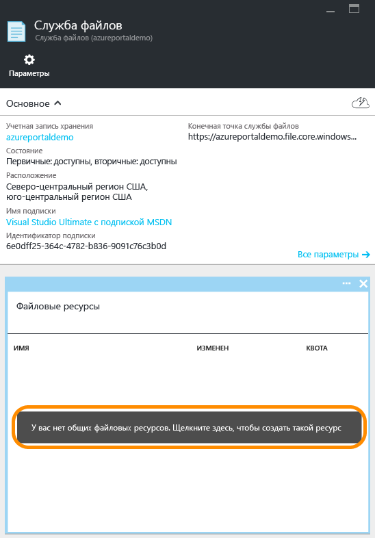

6. Чтобы завершить создание своей первой общей папки, укажите ее имя и размер (до 5120 ГБ). После создания общей папки необходимо подключить ее из любой файловой системы, поддерживающей SMB 2.1 или SMB 3.0.

	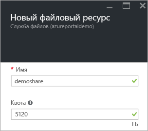

### Отправка и загрузка файлов

1. Выберите ранее созданную общую папку.

	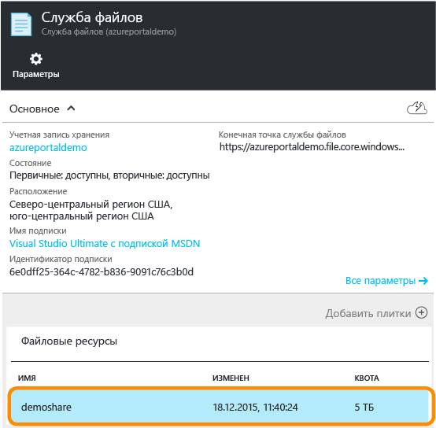

2. Щелкните **Загрузить**, чтобы открыть пользовательский интерфейс для отправки файлов.

	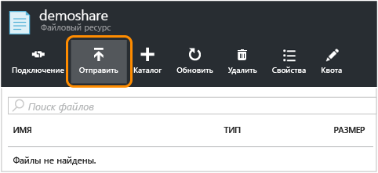

3. Щелкните файл правой кнопкой мыши и выберите **Скачать**, чтобы скачать его в локальное расположение.

	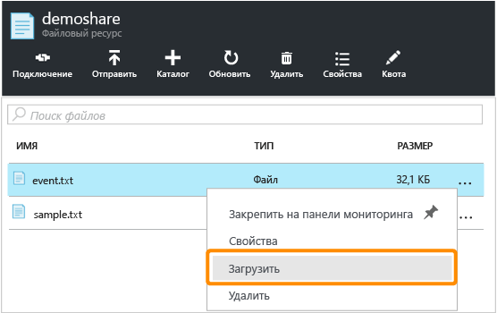

### Управление общей папкой

1. Щелкните **Квота**, чтобы изменить размер общей папки (до 5120 ГБ).

	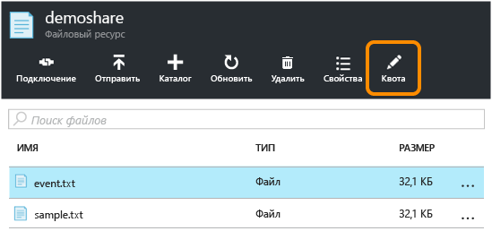

2. Щелкните **Подключить**, чтобы вызвать командную строку для подключения общей папки из Windows.

	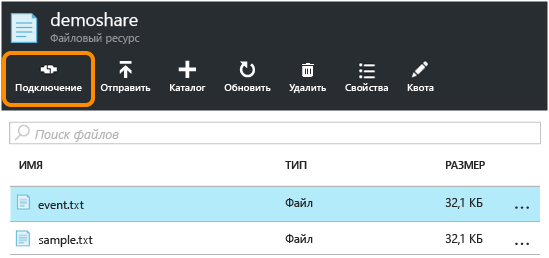

	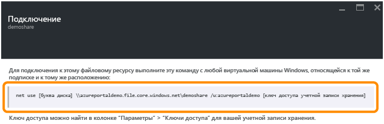

	>[AZURE.TIP] Чтобы найти ключ доступа к учетной записи хранения для подключения, щелкните **Параметры** в своей учетной записи хранения и выберите **Ключи доступа**.

	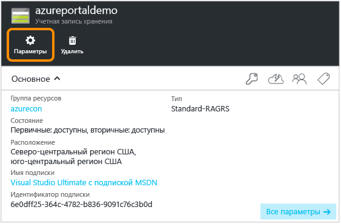

	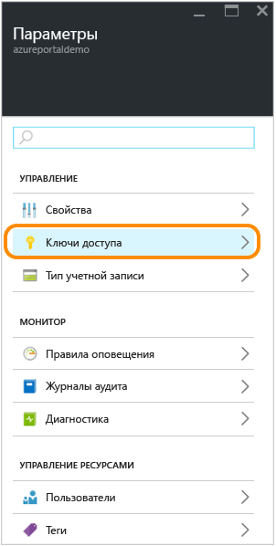

## Управление общей папкой с помощью PowerShell

Кроме того, вы можете использовать Azure PowerShell для создания общих папок и управления ими.

### Установите командлеты PowerShell для хранилища Azure

Для подготовки к использованию PowerShell загрузите и установите командлеты Azure PowerShell. См. раздел [Установка и настройка Azure PowerShell](../powershell-install-configure.md) в качестве начальной точки и инструкций по установке.

> [AZURE.NOTE] Рекомендуется загрузить и установить или обновить версию модуля Azure PowerShell.

Откройте окно Azure PowerShell. Для этого нажмите кнопку **Пуск** и введите **Windows PowerShell**. Окно PowerShell выполнит загрузку модуля Azure PowerShell.

### Создание объекта контекста и ключа для учетной записи хранения

Создайте объект контекста учетной записи хранения. Контекст включает имя учетной записи хранения и ключ. Инструкции по копированию ключа учетной записи с [портала Azure](https://portal.azure.com) см. в разделе [Просмотр и копирование ключей доступа к хранилищу](storage-create-storage-account.md#view-and-copy-storage-access-keys).

В следующем примере вместо `storage-account-name` и `storage-account-key` используйте имя и ключ своей учетной записи хранения.

	# create a context for account and key
	$ctx=New-AzureStorageContext storage-account-name storage-account-key

### Создание нового ресурса совместно используемых файлов

Затем создайте новый файловый ресурс с именем `logs`.

	# create a new share
	$s = New-AzureStorageShare logs -Context $ctx

У вас появится новый общий ресурс в хранилище файлов. Далее мы добавим каталог и файл.

> [AZURE.IMPORTANT] Имя общей папки должно состоять из символов в нижнем регистре. Дополнительную информацию о присвоении имен общим папкам и файлам см. в разделе [Именование общих ресурсов, каталогов, файлов и метаданных и ссылка на них](https://msdn.microsoft.com/library/azure/dn167011.aspx).

### Создание каталога в ресурсе совместно используемых файлов

Затем создайте каталог в ресурсе совместно используемых файлов. В данном примере используется каталог с именем `CustomLogs`:

    # create a directory in the share
    New-AzureStorageDirectory -Share $s -Path CustomLogs

### Отправка локального файла в каталог

Затем загрузите локальный файл в хранилище файлов. В данном примере файл передается из `C:\temp\Log1.txt`. Отредактируйте путь к файлу, чтобы он соответствовал пути к существующему файлу на локальном компьютере:

    # upload a local file to the new directory
    Set-AzureStorageFileContent -Share $s -Source C:\temp\Log1.txt -Path CustomLogs

### Просмотр списка файлов в каталоге

Чтобы просмотреть файлы в каталоге, можно вывести список файлов. Эта команда возвращает файлы и подкаталоги (если таковые имеются) в каталоге CustomLogs.

	# list files in the new directory
	Get-AzureStorageFile -Share $s -Path CustomLogs | Get-AzureStorageFile

Get-AzureStorageFile возвращает список файлов и каталогов в каталоге, в который отправлен объект. Get-AzureStorageFile -Share $s возвращает список файлов и каталогов в корневой папке. Чтобы получить список файлов в подкаталоге, необходимо передать подкаталог команде Get-AzureStorageFile. Как это работает: первая часть команды возвращает экземпляр каталога подкаталога CustomLogs. Затем этот экземпляр передается команде Get-AzureStorageFile, которая возвращает файлы и каталоги в CustomLogs.

### Копирование файлов

Начиная с версии 0.9.7 Azure PowerShell, можно скопировать файл в другой файл, файл в большой двоичный объект или BLOB-объект в файл. Ниже показано, как выполнить копирование с помощью командлетов PowerShell.

	# copy a file to the new directory
    Start-AzureStorageFileCopy -SrcShareName srcshare -SrcFilePath srcdir/hello.txt -DestShareName destshare -DestFilePath destdir/hellocopy.txt -Context $srcCtx -DestContext $destCtx

    # copy a blob to a file directory
    Start-AzureStorageFileCopy -SrcContainerName srcctn -SrcBlobName hello2.txt -DestShareName hello -DestFilePath hellodir/hello2copy.txt -DestContext $ctx -Context $ctx

## Подключение общей папки

Хранилище файлов теперь поддерживает протокол SMB 3.0, в том числе шифрование и устойчивые дескрипторы при работе с клиентами SMB 3.0. Поддержка шифрования позволяет клиентам SMB 3.0 подключить общую папку из любых расположений, в том числе из следующих:

- виртуальные машины Azure в том же регионе (доступно также для SMB 2.1);
- виртуальные машины Azure в другом регионе (только для SMB 3.0);
- локальные клиентские приложения (только для SMB 3.0).

Когда клиент обращается к хранилищу файлов, используется та версия SMB, которая поддерживается операционной системой. В таблице ниже перечислены версии, поддерживаемые клиентами Windows. Дополнительные сведения о версиях SMB см. в [этом блоге](http://blogs.technet.com/b/josebda/archive/2013/10/02/windows-server-2012-r2-which-version-of-the-smb-protocol-smb-1-0-smb-2-0-smb-2-1-smb-3-0-or-smb-3-02-you-are-using.aspx).

| Клиент Windows | Поддерживаемая версия SMB |
|:-----------------------|:----------------------|
| Windows 7 | SMB 2.1 |
| Windows Server 2008 R2 | SMB 2.1 |
| Windows 8 | SMB 3.0 |
| Windows Server 2012 | SMB 3.0 |
| Windows Server 2012 R2 | SMB 3.0 |
| Windows 10 | SMB 3.0 |

### Подключение общей папки из виртуальной машины Azure под управлением Windows

Для демонстрации подключения общей папки с файлами Azure создадим виртуальную машину Azure под управлением Windows и удаленно подключимся к ней для подключения общей папки.

1. Сначала создайте виртуальную машину Azure, выполнив действия, описанные в статье [Создание виртуальной машины Windows на портале Azure](../virtual-machines/virtual-machines-windows-hero-tutorial.md).
2. Затем установите удаленное подключение к виртуальной машине, следуя инструкциям из статьи, посвященной [входу на виртуальную машину Windows с помощью портала Azure](../virtual-machines/virtual-machines-windows-connect-logon.md).
3. Откройте окно PowerShell на виртуальной машине.

### Ввод данных учетной записи хранения в виртуальной машине.

Перед монтированием общего ресурса введите данные учетной записи хранения в виртуальной машине. Это позволит Windows автоматически восстанавливать подключение к общему ресурсу файлов при перезагрузке виртуальной машины. Чтобы сохранить учетные данные, выполните команду `cmdkey` в окне PowerShell на виртуальной машине. Вместо `<storage-account-name>` укажите имя учетной записи хранения, а вместо `<storage-account-key>` — ключ учетной записи хранения.

	cmdkey /add:<storage-account-name>.file.core.windows.net /user:<storage-account-name> /pass:<storage-account-key>

Windows автоматически восстановит подключение к общему ресурсу файлов при перезагрузке виртуальной машины. Вы можете проверить восстановление подключения к файловому ресурсу, выполнив команду `net use` в окне PowerShell.

Обратите внимание, что учетные данные сохраняются только в том контексте, в котором выполняется команда `cmdkey`. Если ваше приложение будет выполняться как служба, следует сохранить учетные данные также в этом контексте.

### Монтирование общего ресурса файлов с использованием введенных данных учетной записи

Установив удаленное подключение к виртуальной машине, вы можете подключить файловый ресурс с помощью команды `net use`, используя синтаксис из примера ниже. Замените `<storage-account-name>` именем учетной записи хранения, а `<share-name>` именем вашего ресурса хранилища файлов.

    net use <drive-letter>: \<storage-account-name>.file.core.windows.net<share-name>

	example :
	net use z: \\samples.file.core.windows.net\logs

Так как вы сохранили данные учетной записи хранения на предыдущем этапе, нет необходимости вводить их повторно с помощью команды `net use`. Если вы еще не сохранили учетные данные, включите их в параметры вызова команды `net use`, как показано в следующем примере.

    net use <drive-letter>: \<storage-account-name>.file.core.windows.net<share-name> /u:<storage-account-name> <storage-account-key>

	example :
	net use z: \\samples.file.core.windows.net\logs /u:samples <storage-account-key>

Теперь можно работать с общим ресурсом хранилища файлов из виртуальной машины, как с обычным диском. Можно выполнять стандартные команды для работы с файлами из интерфейса командной строки, либо просматривать монтированный ресурс и его содержимое с помощью Проводника. Также можно запускать на виртуальной машине код, который получит доступ к ресурсу с использованием стандартных API ввода-вывода Windows, так как они предоставляются [пространствами имен System.IO](http://msdn.microsoft.com/library/gg145019.aspx) в .NET Framework.

Также можно монтировать общий ресурс файлов из роли, запущенной в облачной службе Azure с помощью удаленного подключения к роли.

### Подключение общей папки из локального клиента под управлением Windows

Чтобы подключить общую папку из локального клиента, выполните следующие действия.

- Установите версию Windows, которая поддерживает протокол SMB 3.0. ОС Windows будет использовать шифрование SMB 3.0 для безопасной передачи данных между локальным клиентом и общей папкой Azure в облаке.
- Разрешите передачу в Интернет TCP-трафика через порт 445 из локальной сети. Это необходимо для работы протокола SMB.

> [AZURE.NOTE] Некоторые поставщики услуг Интернета блокируют порт 445. Уточните этот момент у своего поставщика.

## Разработка с использованием хранилища файлов

Для написания кода, вызывающего хранилище файлов, можно использовать клиентские библиотеки хранилища для .NET и Java или REST API службы хранилища Azure. В этом разделе приведен пример работы с общей папкой с использованием [клиентской библиотеки службы хранилища Azure для .NET](https://msdn.microsoft.com/library/mt347887.aspx) из простого консольного приложения на настольном компьютере.

### Создание консольного приложения и получение сборки

Создать консольное приложение в Visual Studio и установить пакет NuGet, содержащий клиентскую библиотеку службы хранилища Azure, можно так.

1. В Visual Studio последовательно выберите элементы **Файл -> Создать проект**, а затем в списке шаблонов Visual C# выберите **Windows -> Консольное приложение**.
2. Укажите имя консольного приложения и нажмите кнопку **ОК**.
3. После создания проекта щелкните правой кнопкой мыши на проекте в обозревателе решений и выберите **Управление пакетами NuGet**. Выполните поиск в Интернете по запросу WindowsAzure.Storage и нажмите кнопку **Установить**, чтобы установить клиентскую библиотеку службы хранилища Azure для пакета .NET и зависимости.

В примерах кода в этой статье [библиотека диспетчера конфигураций Microsoft Azure](https://msdn.microsoft.com/library/azure/mt634646.aspx) также используется для получения строки подключения к хранилищу из файла app.config в консольном приложении. С помощью диспетчера конфигураций Azure можно получить строку подключения во время выполнения независимо от того, выполняется ли приложение в Microsoft Azure или как классическое, мобильное или веб-приложение.

Чтобы установить пакет диспетчера конфигураций Azure, щелкните правой кнопкой мыши проект в обозревателе решений и выберите пункт **Управление пакетами NuGet**. Выполните поиск в Интернете по запросу ConfigurationManager и щелкните **Установить**, чтобы установить пакет.

Использование диспетчера конфигураций Azure не является обязательным. Вы также можете использовать API, например [класс ConfigurationManager](https://msdn.microsoft.com/library/system.configuration.configurationmanager.aspx) для .NET Framework.

### Сохранение данных учетной записи хранения в файле app.config.

Затем сохраните данные учетной записи хранения в файле app.config вашего проекта. Замените содержимое файла app.config текстом из следующего примера: введите вместо `myaccount` имя учетной записи хранения, а вместо `mykey` — ключ учетной записи хранения.

	<?xml version="1.0" encoding="utf-8" ?>
	<configuration>
	    <startup>
	        <supportedRuntime version="v4.0" sku=".NETFramework,Version=v4.5" />
	    </startup>
	    <appSettings>
	        <add key="StorageConnectionString" value="DefaultEndpointsProtocol=https;AccountName=myaccount;AccountKey=StorageAccountKeyEndingIn==" />
	    </appSettings>
	</configuration>

> [AZURE.NOTE] Последняя версия эмулятора хранения Azure не поддерживает хранилище файлов. Для работы с хранилищем файлов необходимо, чтобы строка подключения указывала на учетную запись хранения Azure в облаке.

### Добавление объявлений пространств имен

В обозревателе решений откройте файл `program.cs` и добавьте следующие объявления пространств имен в начало файла.

	using Microsoft.Azure; // Namespace for Azure Configuration Manager
	using Microsoft.WindowsAzure.Storage; // Namespace for Storage Client Library
	using Microsoft.WindowsAzure.Storage.Blob; // Namespace for Blob storage
	using Microsoft.WindowsAzure.Storage.File; // Namespace for File storage

[AZURE.INCLUDE [storage-cloud-configuration-manager-include](../../includes/storage-cloud-configuration-manager-include.md)]

### Доступ к общей папке программным путем

Затем, чтобы получить строку подключения, добавьте в метод `Main()` после указанного выше кода приведенный ниже код. Этот код получает ссылку на ранее созданный файл и выводит его содержимое в окне консоли.

	// Create a CloudFileClient object for credentialed access to File storage.
	CloudFileClient fileClient = storageAccount.CreateCloudFileClient();

	// Get a reference to the file share we created previously.
	CloudFileShare share = fileClient.GetShareReference("logs");

	// Ensure that the share exists.
	if (share.Exists())
	{
	    // Get a reference to the root directory for the share.
	    CloudFileDirectory rootDir = share.GetRootDirectoryReference();

	    // Get a reference to the directory we created previously.
	    CloudFileDirectory sampleDir = rootDir.GetDirectoryReference("CustomLogs");

	    // Ensure that the directory exists.
	    if (sampleDir.Exists())
	    {
	        // Get a reference to the file we created previously.
	        CloudFile file = sampleDir.GetFileReference("Log1.txt");

	        // Ensure that the file exists.
	        if (file.Exists())
	        {
	            // Write the contents of the file to the console window.
	            Console.WriteLine(file.DownloadTextAsync().Result);
	        }
	    }
	}

Запустите консольное приложение и получите вывод.

### Установка максимального размера для файлового ресурса

Клиентская библиотека хранилища Azure версии 5.x и выше позволяет задавать квоту (или максимальный размер) в файловом ресурсе в гигабайтах. Можно также проверить, какой объем данных хранится в настоящее время в общей папке.

Задав квоту для файлового ресурса, можно ограничить общий размер файлов, хранящихся в общей папке. Если общий размер файлов в файловом ресурсе превышает установленную квоту, клиенты не смогут увеличить размер существующих файлов или создать новые файлы, только если они не являются пустыми.

В приведенном ниже примере показано, как проверить текущее использование данных в файловом ресурсе, а также задать для него квоту.

    // Parse the connection string for the storage account.
    CloudStorageAccount storageAccount = CloudStorageAccount.Parse(
        Microsoft.Azure.CloudConfigurationManager.GetSetting("StorageConnectionString"));

    // Create a CloudFileClient object for credentialed access to File storage.
    CloudFileClient fileClient = storageAccount.CreateCloudFileClient();

    // Get a reference to the file share we created previously.
    CloudFileShare share = fileClient.GetShareReference("logs");

    // Ensure that the share exists.
    if (share.Exists())
    {
        // Check current usage stats for the share.
		// Note that the ShareStats object is part of the protocol layer for the File service.
        Microsoft.WindowsAzure.Storage.File.Protocol.ShareStats stats = share.GetStats();
        Console.WriteLine("Current share usage: {0} GB", stats.Usage.ToString());

        // Specify the maximum size of the share, in GB.
        // This line sets the quota to be 10 GB greater than the current usage of the share.
        share.Properties.Quota = 10 + stats.Usage;
        share.SetProperties();

        // Now check the quota for the share. Call FetchAttributes() to populate the share's properties.
        share.FetchAttributes();
        Console.WriteLine("Current share quota: {0} GB", share.Properties.Quota);
    }

### Создание подписи общего доступа для файла или файлового ресурса

Начиная с версии 5.x клиентской библиотеки хранилища Azure можно создать подпись общего доступа (SAS) для файлового ресурса или отдельного файла. Также можно создать политики общего доступа на файловом ресурсе, чтобы управлять подписями общего доступа. Создание политики общего доступа рекомендуется, так как она позволяет отменить SAS, если она скомпрометирована.

В приведенном ниже примере создаются политики общего доступа в общей папке, а затем используются для обеспечения ограничения SAS для файла в общей папке.

    // Parse the connection string for the storage account.
    CloudStorageAccount storageAccount = CloudStorageAccount.Parse(
        Microsoft.Azure.CloudConfigurationManager.GetSetting("StorageConnectionString"));

    // Create a CloudFileClient object for credentialed access to File storage.
    CloudFileClient fileClient = storageAccount.CreateCloudFileClient();

    // Get a reference to the file share we created previously.
    CloudFileShare share = fileClient.GetShareReference("logs");

    // Ensure that the share exists.
    if (share.Exists())
    {
        string policyName = "sampleSharePolicy" + DateTime.UtcNow.Ticks;

        // Create a new shared access policy and define its constraints.
        SharedAccessFilePolicy sharedPolicy = new SharedAccessFilePolicy()
            {
                SharedAccessExpiryTime = DateTime.UtcNow.AddHours(24),
                Permissions = SharedAccessFilePermissions.Read | SharedAccessFilePermissions.Write
            };

        // Get existing permissions for the share.
        FileSharePermissions permissions = share.GetPermissions();

        // Add the shared access policy to the share's policies. Note that each policy must have a unique name.
        permissions.SharedAccessPolicies.Add(policyName, sharedPolicy);
        share.SetPermissions(permissions);

        // Generate a SAS for a file in the share and associate this access policy with it.
        CloudFileDirectory rootDir = share.GetRootDirectoryReference();
        CloudFileDirectory sampleDir = rootDir.GetDirectoryReference("CustomLogs");
        CloudFile file = sampleDir.GetFileReference("Log1.txt");
        string sasToken = file.GetSharedAccessSignature(null, policyName);
        Uri fileSasUri = new Uri(file.StorageUri.PrimaryUri.ToString() + sasToken);

        // Create a new CloudFile object from the SAS, and write some text to the file.
        CloudFile fileSas = new CloudFile(fileSasUri);
        fileSas.UploadText("This write operation is authenticated via SAS.");
        Console.WriteLine(fileSas.DownloadText());
    }

Дополнительные сведения см. в статьях [Подписанные URL-адреса. Часть 1: общие сведения о модели SAS](storage-dotnet-shared-access-signature-part-1.md) и [Подписанные URL-адреса. Часть 2: создание и использование подписанного URL-адреса в службе BLOB-объектов](storage-dotnet-shared-access-signature-part-2.md).

### Копирование файлов

Начиная с версии 5.x клиентской библиотеки хранилища Azure можно скопировать файл в другой файл, файл в большой двоичный объект или BLOB-объект в файл. В следующих разделах демонстрируется выполнение этих операций копирования программными средствами.

AzCopy можно использовать для копирования одного файла в другой, а также копирования большого двоичного объекта в файл или наоборот. См. статью [Приступая к работе со служебной программой командной строки AzCopy](storage-use-azcopy.md).

> [AZURE.NOTE] При копировании большого двоичного объекта в файл или файла в большой двоичный объект необходимо использовать подпись общего доступа (SAS) для проверки подлинности исходного объекта, даже если копирование производится внутри одной и той же учетной записи хранения.

**Копирование файла в другой файл**

В приведенном ниже примере файл копируется в другой файл в той же общей папке. Так как эта операция копирования осуществляет копирование между файлами в одной учетной записи хранения, для выполнения копирования можно использовать проверку подлинности Shared Key.

    // Parse the connection string for the storage account.
    CloudStorageAccount storageAccount = CloudStorageAccount.Parse(
        Microsoft.Azure.CloudConfigurationManager.GetSetting("StorageConnectionString"));

    // Create a CloudFileClient object for credentialed access to File storage.
    CloudFileClient fileClient = storageAccount.CreateCloudFileClient();

    // Get a reference to the file share we created previously.
    CloudFileShare share = fileClient.GetShareReference("logs");

    // Ensure that the share exists.
    if (share.Exists())
    {
        // Get a reference to the root directory for the share.
        CloudFileDirectory rootDir = share.GetRootDirectoryReference();

        // Get a reference to the directory we created previously.
        CloudFileDirectory sampleDir = rootDir.GetDirectoryReference("CustomLogs");

        // Ensure that the directory exists.
        if (sampleDir.Exists())
        {
            // Get a reference to the file we created previously.
            CloudFile sourceFile = sampleDir.GetFileReference("Log1.txt");

            // Ensure that the source file exists.
            if (sourceFile.Exists())
            {
                // Get a reference to the destination file.
                CloudFile destFile = sampleDir.GetFileReference("Log1Copy.txt");

                // Start the copy operation.
                destFile.StartCopy(sourceFile);

                // Write the contents of the destination file to the console window.
                Console.WriteLine(destFile.DownloadText());
            }
        }
    }

**Копирование файла в большой двоичный объект**

В приведенном ниже примере файл создается и копируется в большой двоичный объект в пределах одной и той же учетной записи хранения. В примере для исходного файла создается SAS, которую служба использует для проверки подлинности при доступе к исходному файлу во время операции копирования.

    // Parse the connection string for the storage account.
    CloudStorageAccount storageAccount = CloudStorageAccount.Parse(
        Microsoft.Azure.CloudConfigurationManager.GetSetting("StorageConnectionString"));

    // Create a CloudFileClient object for credentialed access to File storage.
    CloudFileClient fileClient = storageAccount.CreateCloudFileClient();

    // Create a new file share, if it does not already exist.
    CloudFileShare share = fileClient.GetShareReference("sample-share");
    share.CreateIfNotExists();

    // Create a new file in the root directory.
    CloudFile sourceFile = share.GetRootDirectoryReference().GetFileReference("sample-file.txt");
    sourceFile.UploadText("A sample file in the root directory.");

    // Get a reference to the blob to which the file will be copied.
    CloudBlobClient blobClient = storageAccount.CreateCloudBlobClient();
    CloudBlobContainer container = blobClient.GetContainerReference("sample-container");
    container.CreateIfNotExists();
    CloudBlockBlob destBlob = container.GetBlockBlobReference("sample-blob.txt");

    // Create a SAS for the file that's valid for 24 hours.
    // Note that when you are copying a file to a blob, or a blob to a file, you must use a SAS
    // to authenticate access to the source object, even if you are copying within the same
    // storage account.
    string fileSas = sourceFile.GetSharedAccessSignature(new SharedAccessFilePolicy()
    {
        // Only read permissions are required for the source file.
        Permissions = SharedAccessFilePermissions.Read,
        SharedAccessExpiryTime = DateTime.UtcNow.AddHours(24)
    });

    // Construct the URI to the source file, including the SAS token.
    Uri fileSasUri = new Uri(sourceFile.StorageUri.PrimaryUri.ToString() + fileSas);

    // Copy the file to the blob.
    destBlob.StartCopy(fileSasUri);

    // Write the contents of the file to the console window.
    Console.WriteLine("Source file contents: {0}", sourceFile.DownloadText());
    Console.WriteLine("Destination blob contents: {0}", destBlob.DownloadText());

Таким же образом можно скопировать BLOB-объект в файл. Если исходным объектом является BLOB-объект, создайте SAS для проверки подлинности доступа к BLOB-объекту во время операции копирования.

## Устранение неполадок хранилища файлов с помощью метрик

Аналитика службы хранилища Azure теперь поддерживает метрики для хранилища файлов. Данные метрик позволяют отслеживать запросы и диагностировать проблемы.

Метрики для хранилища файлов можно включить на [портале Azure](https://portal.azure.com). Кроме того, вы можете включить метрики программным путем. Для этого используйте операцию Set File Service Properties через интерфейс REST API или любой ее аналог из имеющихся в клиентской библиотеке хранилища.

В следующем примере кода показано, как использовать клиентскую библиотеку хранилища для .NET, чтобы включить метрики для хранилища файлов.

Сначала добавьте в файл program.cs приведенные ниже инструкции `using` в дополнение к указанным выше.

	using Microsoft.WindowsAzure.Storage.File.Protocol;
	using Microsoft.WindowsAzure.Storage.Shared.Protocol;

Обратите внимание, что хранилища BLOB-объектов, таблиц и очередей применяют общий тип `ServiceProperties` в пространстве имен `Microsoft.WindowsAzure.Storage.Shared.Protocol`, однако хранилище файлов использует собственный тип `FileServiceProperties` в пространстве имен `Microsoft.WindowsAzure.Storage.File.Protocol`. Однако для обеспечения компиляции приведенного ниже кода ваш код должен ссылаться на оба этих пространства имен.

    // Parse your storage connection string from your application's configuration file.
    CloudStorageAccount storageAccount = CloudStorageAccount.Parse(
            Microsoft.Azure.CloudConfigurationManager.GetSetting("StorageConnectionString"));
    // Create the File service client.
    CloudFileClient fileClient = storageAccount.CreateCloudFileClient();

    // Set metrics properties for File service.
    // Note that the File service currently uses its own service properties type,
    // available in the Microsoft.WindowsAzure.Storage.File.Protocol namespace.
    fileClient.SetServiceProperties(new FileServiceProperties()
    {
        // Set hour metrics
        HourMetrics = new MetricsProperties()
        {
            MetricsLevel = MetricsLevel.ServiceAndApi,
            RetentionDays = 14,
            Version = "1.0"
        },
        // Set minute metrics
        MinuteMetrics = new MetricsProperties()
        {
            MetricsLevel = MetricsLevel.ServiceAndApi,
            RetentionDays = 7,
            Version = "1.0"
        }
    });

    // Read the metrics properties we just set.
    FileServiceProperties serviceProperties = fileClient.GetServiceProperties();
    Console.WriteLine("Hour metrics:");
    Console.WriteLine(serviceProperties.HourMetrics.MetricsLevel);
    Console.WriteLine(serviceProperties.HourMetrics.RetentionDays);
    Console.WriteLine(serviceProperties.HourMetrics.Version);
    Console.WriteLine();
    Console.WriteLine("Minute metrics:");
    Console.WriteLine(serviceProperties.MinuteMetrics.MetricsLevel);
    Console.WriteLine(serviceProperties.MinuteMetrics.RetentionDays);
    Console.WriteLine(serviceProperties.MinuteMetrics.Version);

## Часто задаваемые вопросы по хранилищу файлов

1. **Поддерживает ли хранилище файлов проверку подлинности на основе Active Directory?**

	Сейчас мы не поддерживаем проверку подлинности на основе AD и списки управления доступом, но запросы на добавление этих функций включены в наш список. Сейчас проверка подлинности запросов к общей папке выполняется по ключам учетной записи службы хранилища Azure. Мы можем предложить временное решение: использовать подписанные URL-адреса (SAS) через интерфейс REST API или клиентские библиотеки. SAS позволяет создавать маркеры с определенными разрешениями, действующими в течение указанного периода. Например, вы можете создать маркер с доступом только для чтения к одному конкретному файлу. Право на чтение этого файла в течение срока действия маркера получит любой пользователь, обладающий этим маркером.

	Использование SAS возможно только через интерфейс REST API или клиентские библиотеки. При подключении общей папки по протоколу SMB нельзя использовать подписанный URL-адрес для делегирования доступа к содержимому папки.

2. **Открыты ли общие папки Azure для общего доступа в Интернете или они доступны только из Azure?**

	Если разрешен исходящий TCP-трафик через порт 445 и клиент (*например*, Windows 8 или Windows Server 2012) поддерживает протокол SMB 3.0, доступ к общей папке можно получить через Интернет.

3. **Включается ли сетевой трафик между виртуальной машиной Azure и общими папками в тарифицируемый трафик подписки?**

	Если общая папка и виртуальная машина находятся в разных регионах, трафик между ними будет тарифицирован как внешний трафик.

4. **Будет ли бесплатным сетевой трафик между виртуальной машиной и общей папкой в одном и том же регионе?**

	Да. Трафик в пределах одного региона будет бесплатным.

5. **Обязательно ли использовать Azure ExpressRoute для подключения к хранилищу файлов Azure с локальных виртуальных машин?**

	Нет. Доступ к общей папке из локальной сети можно получить и без ExpressRoute, если открыт исходящий TCP-трафик в Интернет через порт 445. Но при желании вы можете работать с хранилищем файлов через ExpressRoute.

6. **Можно ли использовать хранилище файлов Azure совместно с «файловым ресурсом-свидетелем» для создания отказоустойчивого кластера?**

	Сейчас такая возможность не поддерживается.

7. **Хранилище файлов сейчас реплицируется только через LRS и GRS, не так ли?**

	Мы планируем добавить поддержку RA-GRS, но пока не можем назвать точные сроки.

8. **Когда я смогу использовать хранилище файлов Azure с существующей учетной записью хранения?**

	Хранилище файлов Azure уже можно использовать со всеми учетными записями хранения.

9. **Будет ли добавлена операция переименования к интерфейсу REST API?**

	Переименование пока не поддерживается в нашем REST API.

10. **Можно ли использовать вложенные общие папки, то есть создавать общую папку в другой общей папке?**

	Нет. Общая папка является виртуальным драйвером для подключения, поэтому вложенные общие папки не поддерживаются.

11. **Можно ли задать разрешения только для чтения или только для записи в отдельных папках внутри общей папки?**

	Такой уровень контроля над разрешениями недоступен при подключении общей папки по протоколу SMB. Но вы можете создать такую схему с использованием подписанных URL-адресов (SAS) через интерфейс REST API или клиентские библиотеки.

12. **При попытке распаковать файлы в хранилище файлов производительность упала. Что делать?**

	Для передачи большого числа файлов в хранилище файлов мы рекомендуем использовать AzCopy, Azure Powershell (для Windows) или интерфейс командной строки Azure (для Linux и Unix). Эти средства хорошо оптимизированы для передачи файлов по сети.

13. **Выпущено исправление, устраняющее проблему низкой производительности службы файлов Azure.**

	Группа разработчиков Windows недавно выпустила исправление, устраняющее проблему с низкой производительностью, которая возникает, когда клиент обращается к хранилищу файлов Azure с компьютера под управлением Windows 8.1 или Windows Server 2012 R2. Дополнительные сведения можно найти в соответствующей статье базы знаний [Slow performance when you access Azure files storage from Windows 8.1 or Server 2012 R2](https://support.microsoft.com/ru-RU/kb/3114025) (Снижение производительности при доступе к хранилищу файлов Azure из Windows 8.1 или Server 2012 R2).

14. **Использование хранилища файлов Azure с IBM MQ.**

	Компания IBM выпустила руководство по настройке хранилища файлов Azure в службе, которую используют пользователи IBM MQ. Дополнительные сведения см. в статье [How to setup IBM MQ Multi instance queue manager with Microsoft Azure File Service](https://github.com/ibm-messaging/mq-azure/wiki/How-to-setup-IBM-MQ-Multi-instance-queue-manager-with-Microsoft-Azure-File-Service) (Настройка службы файлов Microsoft Azure в многоэкземплярном диспетчере очередей IBM MQ).

## Дальнейшие действия

Дополнительную информацию о хранилище файлов Azure см. по этим ссылкам.

### Тематические статьи и видео

- [Хранилище файлов Azure: удобная облачная файловая система SMB для Windows и Linux](https://azure.microsoft.com/documentation/videos/azurecon-2015-azure-files-storage-a-frictionless-cloud-smb-file-system-for-windows-and-linux/)
- [Использование хранилища файлов Azure в Linux](storage-how-to-use-files-linux.md)

### Средства для работы с хранилищем файлов

- [Использование Azure PowerShell со службой хранилища Azure](storage-powershell-guide-full.md)
- [Использование AzCopy со службой хранилища Microsoft Azure](storage-use-azcopy.md)
- [Использование интерфейса командной строки (CLI) Azure со службой хранилища Azure](storage-azure-cli.md#create-and-manage-file-shares)

### Справочные материалы

- [Справочник по клиентской библиотеке хранилища для .NET](https://msdn.microsoft.com/library/azure/dn261237.aspx)
- [Справочник по REST API службы файлов](http://msdn.microsoft.com/library/azure/dn167006.aspx)

### Записи блога

- [Хранилище файлов Azure стало общедоступным](https://azure.microsoft.com/blog/azure-file-storage-now-generally-available/)
- [Inside Azure File Storage (Хранилище файлов Azure: взгляд изнутри)](https://azure.microsoft.com/blog/inside-azure-file-storage/)
- [Введение в службы файлов Microsoft Azure](http://blogs.msdn.com/b/windowsazurestorage/archive/2014/05/12/introducing-microsoft-azure-file-service.aspx)
- [Сохраняемые подключения к файлам Microsoft Azure](http://blogs.msdn.com/b/windowsazurestorage/archive/2014/05/27/persisting-connections-to-microsoft-azure-files.aspx)

<!----HONumber=AcomDC_0921_2016-->