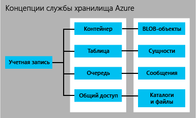

# Введение в хранилище Microsoft Azure
## Обзор
Хранилище Azure — это облачное решение для хранения современных приложений, обеспечивающее устойчивость, доступность и масштабируемость для удовлетворения потребностей клиентов. Прочитав эту статью, разработчики, ИТ-специалисты и лица, принимающие коммерческие решения, смогут узнать ответы на следующие вопросы.

* Что такое хранилище Azure и как его можно использовать в облаке, на мобильном устройстве, сервере и в настольных приложениях
* С какими типами данных работают службы хранилища Azure: данные BLOB-объектов, данные таблиц NoSQL, очереди сообщений и общие файловые ресурсы.
* Как осуществляется управление доступом к данным в хранилище Azure
* Как осуществляется защита данных хранилища Azure посредством избыточности и репликации
* Каковы дальнейшие шаги для создания вашего первого приложения Azure

Чтобы быстро начать работу с хранилищем Azure, см. статью [Начните работать с хранилищем Azure за пять минут](storage-getting-started-guide.md).

Дополнительные сведения о средствах, библиотеках и других ресурсах по работе с хранилищем Azure см. в разделе [Дальнейшие действия](#next-steps) ниже.

## Что такое хранилище Azure?
Благодаря облачным вычислениям появилась возможность использовать новые сценарии для приложений, требующих масштабируемого, долговечного и высокодоступного хранилища для данных. Именно поэтому корпорацией Майкрософт было создано хранилище Azure. Хранилище Azure не только позволяет разработчикам создавать масштабные приложения для поддержки новых сценариев, но и предоставляет основу хранилища для виртуальных машин Azure как еще одно свидетельство его надежности.

Хранилище Azure обладает высокой степенью масштабируемости, позволяя хранить и обрабатывать сотни терабайт данных для поддержки сценариев с данными большого размера, которые необходимы для исследовательских, аналитических финансовых и мультимедийных приложений. Можно также хранить небольшие объемы данных, необходимые для веб-сайта компании малого бизнеса. Когда ваши потребности снижаются, вы оплачиваете только те данные, которые храните. В настоящее время в хранилище Azure хранятся десятки триллионов уникальных клиентских объектов и обрабатываются в среднем миллионы запросов в секунду.

Хранилище Azure обладает гибкостью, позволяя проектировать приложения для широкой аудитории, а затем масштабировать их при необходимости как в плане объема хранилища, так и по количеству необходимых транзакций. Вы платите только за те ресурсы, которые используете, и только тогда, когда вы их используете.

В хранилище Azure используется система автоматического разбиения, которая автоматически балансирует нагрузку, исходя из трафика данных. Это означает, что по мере роста потребностей вашего приложения хранилище Azure автоматически выделяет соответствующие ресурсы.

Хранилище Azure доступно из любой точки мира и из приложения любого типа, независимо от того, где оно выполняется: в облаке, на рабочем столе, локальном сервере, мобильном или планшетном устройстве. Хранилище Azure можно использовать в мобильных сценариях, когда приложение хранит подмножество данных на устройстве и синхронизирует их с полным набором данных, хранящихся в облаке.

Чтобы обеспечить удобство в разработке, хранилище Azure поддерживает клиенты, использующие разные операционные системы (включая Windows и Linux) и языки программирования (включая .NET, Java, Node.js, Python, Ruby, PHP, C++, а также языки для программирования мобильных приложений). Хранилище Azure также предоставляет ресурсы данных через простые интерфейсы API REST, которые доступны для любого клиента, имеющего возможность отправлять и получать данные через HTTP или HTTPS.

Служба хранилища Azure Premium предоставляет высокую производительность с низкой задержкой для дисковых операций высоконагруженных рабочих нагрузок, выполняемых на виртуальных машинах Azure. С помощью службы хранилища Azure Premium вы можете подключить к виртуальной машине множество постоянных дисков с данными и настроить их должным образом для удовлетворения ваших потребностей в производительности. За каждым диском с данными стоит SSD-диск службы хранения Azure Premium для достижения максимальной производительности для операций ввода-вывода. Дополнительную информацию см. в статье [Хранилище Premium: высокопроизводительное хранилище для рабочих нагрузок виртуальных машин Azure](storage-premium-storage.md).

## Введение в службы хранилища Azure
Службы хранилища Azure включают хранилище BLOB-объектов, а также хранилища таблиц, очередей и файлов.

* Хранилище BLOB-объектов хранит объекты с неструктурированными данными. BLOB-объект может представлять собой текстовые или двоичные данные любого типа, такие как документ, файл мультимедиа или установщик приложения. Хранилище BLOB-объектов иногда также называют хранилищем объектов.
* Хранилище таблиц хранит структурированные наборы данных. Табличное хранилище представляет собой хранилище данных NoSQL типа "ключ-атрибут", которое позволяет ускорить разработку и доступ к большим объемам данных.
* Хранилище очередей обеспечивает надежный обмен сообщениями, поддерживая рабочие процессы обработки и обеспечивая взаимодействие между компонентами облачных служб.
* Хранилище файлов — это совместно используемое хранилище для старых приложений, доступ к которому осуществляется на основе стандартного протокола SMB. Виртуальные машины и облачные службы Azure могут использовать файловые данные компонентов приложений через подключенные ресурсы, а локальные приложения получают доступ к этим данным совместно с помощью службы файлов API REST.

Учетная запись хранения Azure — это безопасная учетная запись, которая предоставляет доступ к службам хранилища Azure. Учетная запись хранения предоставляет уникальное пространство имен для хранения ваших ресурсов. На рисунке ниже показана схема взаимодействия ресурсов службы хранилища Azure в рамках стандартной учетной записи хранения.

[!INCLUDE [storage-account-types-include](../../includes/storage-account-types-include.md)]

[!INCLUDE [storage-versions-include](../../includes/storage-versions-include.md)]

## Хранилище BLOB-объектов
Хранилище BLOB-объектов предлагает экономичное и масштабируемое решение для пользователей, хранящих большое количество объектов с неструктурированными данными в облаке. Хранилище BLOB-объектов можно использовать для хранения следующего контента:

* Документы
* Социальные данные, например фотографии, видеозаписи, музыка и блоги
* Резервные копии файлов, баз данных, компьютеров и устройств
* Изображения и текст для веб-приложений
* Данные конфигурации для облачных приложений
* Данные большого размера, например журналы и другие большие наборы данных

Все BLOB-объекты организованы в контейнеры. Контейнеры также предоставляют удобный способ назначения политик безопасности группам объектов. Учетная запись хранения может содержать любое количество контейнеров, а контейнер может содержать любое количество BLOB-объектов. Емкость учетной записи хранения ограничена до 500 ТБ.

Хранилище больших двоичных объектов предлагает три типа больших двоичных объектов: блочные, добавочные и страничные (диски).

* Блочные BLOB-объекты оптимизированы для потоковой передачи и хранения облачных объектов и отлично подходят для хранения документов, файлов мультимедиа, резервных копий и т. д.
* Добавочные большие двоичные объекты схожи с блочными BLOB-объектами, однако они оптимизированы для операций добавления. Добавочный большой двоичный объект можно обновить только путем добавления в его конец нового блока. Эти большие двоичные объекты — хороший вариант для таких сценариев, как ведение журнала, в которых новые данные должны записываться только в конец большого двоичного объекта.
* BLOB-объекты страничного типа оптимизированы для представления дисков IaaS и поддержки произвольных записей и могут иметь размер до 1 ТБ. Сетевой диск IaaS, присоединенный к виртуальной машине Azure, представляет собой виртуальный жесткий диск (VHD), хранящийся в виде BLOB-объекта страничного типа.

При использовании очень больших наборов данных, когда данные просто нереально отправить или загрузить в хранилище BLOB-объектов по сети, можно передать жесткий диск в Майкрософт для импорта или экспорта данных непосредственно в центре обработки данных. Подробнее см. в статье [Использование службы импорта и экспорта Azure для передачи данных в хранилище BLOB-объектов](storage-import-export-service.md).

## Хранилище таблиц
Современным приложениям часто требуются хранилища данных с большей степенью масштабируемости и гибкости, чем предыдущим поколениям программного обеспечения. Табличное хранилище предлагает высокую степень доступности и масштабируемости, позволяя приложению автоматически осуществлять масштабирование в соответствии с пользовательским спросом. Предоставляемое корпорацией Майкрософт табличное хранилище представляет собой хранилище NoSQL типа "ключ-атрибут", имеющее бессхемную конструкцию в отличие от традиционных реляционных баз данных. С помощью бессхемного хранилища данных можно легко адаптировать данные по мере развития потребностей приложения. Простое в использовании табличное хранилище позволяет разработчикам быстро создавать приложения. Быстрый и экономичный доступ к данным предоставляется приложениям всех видов.  Табличное хранилище обычно значительно дешевле, чем традиционная база данных SQL для тех же объемов данных.

Табличное хранилище является хранилищем типа "ключ-атрибут", то есть каждая сущность в таблице хранится вместе с типовым именем свойства. Это имя свойства может использоваться для фильтрации и указания критериев выбора. Коллекция свойств с их значениями представляют собой сущность. Поскольку табличное хранилище является бессхемным, две сущности в одной и той же таблице могут содержать разные коллекции свойств, и эти свойства могут относиться к разным типам.

Табличное хранилище можно использовать для хранения гибких наборов данных, например пользовательских данных для веб-приложений, адресных книг, сведений об устройстве, а также метаданных любого другого типа, которые требуются вашей службе.  В таблице можно хранить любое количество сущностей, а учетная запись хранения может содержать любое количество таблиц в пределах емкости учетной записи.

Аналогично BLOB-объектам и очередям разработчики могут управлять табличным хранилищем с помощью стандартных протоколов REST, однако табличные хранилища поддерживают также подмножество протокола OData, что упрощает расширенную работу с запросами и позволяет использовать форматы JSON и AtomPub (на основе XML).

Для современных интернет-приложений базы данных NoSQL, такие как табличное хранилище, являются распространенной альтернативой традиционным реляционным базам данных.

## Хранилище очередей
При разработке приложений для масштабирования компоненты приложения часто не связаны между собой, так что они могут масштабироваться независимо друг от друга. Хранилище очередей обеспечивает надежное решение по обмену сообщениями для асинхронного взаимодействия между компонентами приложения, независимо от того, где они выполняются: в облаке, на рабочем столе, локальном сервере или мобильном устройстве. Хранилище очередей также поддерживает управление асинхронными задачами и построение рабочих процессов.

Учетная запись хранения может содержать любое количество очередей. Очередь может содержать любое количество сообщений в пределах емкости учетной записи хранения. Отдельные сообщения могут иметь размер до 64 КБ.

## Хранилище файлов
В хранилище файлов Azure доступны облачные общие папки с файлами SMB, благодаря чему можно быстро и без дорогостоящей перезаписи выполнить перенос приложений прежних версий, связанных с общими папками. Благодаря хранилищу файлов Azure приложения, работающие на виртуальных машинах Azure или облачных службах, могут подключить общую папку в облаке, подобно настольному приложению при подключении обычной общей папки SMB. Любое количество компонентов приложений может одновременно подключаться и получать доступ к ресурсам хранилища файлов.

Так как ресурсы хранилища файлов представляют собой стандартные файловые ресурсы SMB, приложения, работающие в Azure, могут получать к ним доступ через API ввода-вывода. Таким образом, разработчики могут использовать имеющиеся у них коды и навыки для миграции существующих приложений. IT-специалисты получают возможность использовать командлеты PowerShell для создания и подключения ресурсов хранилища файлов, а также управления им в качестве части администрирования приложений Azure.

Так же как и другие службы хранения Azure, хранилища файлов используют REST API для доступа к данным ресурсов. Локальные приложения могут вызывать REST API хранилищ файлов для доступа к файловым ресурсам. Благодаря этому предприятие может принять решение выполнить миграцию некоторых старых приложений на платформу Azure и продолжить использовать остальные внутри своей организации. Обратите внимание, что подключение файлового ресурса возможно только для приложений, работающих в Azure. Локальные приложения могут получать доступ к файловым ресурсам только через API REST.

Распределенные приложения также могут использовать хранилища файлов для хранения и совместного доступа к данным полезных приложений, а также средствам разработки и тестирования. Например, приложение может сохранять файлы конфигурации и данные диагностики, такие как журналы, метрики и аварийные дампы, в ресурсах хранилища файлов, доступ к которым могут иметь несколько виртуальных машин или ролей. Разработчики и администраторы могут хранить там служебные программы. С их помощью они получают возможность создавать приложения (и управлять ими) в ресурсах хранилища файлов, которые доступны всем компонентам, вместо того, чтобы устанавливать их на каждую виртуальную машину или экземпляр роли.

## Доступ к ресурсам BLOB-объектов, таблиц, очередей и файлов
По умолчанию только владелец учетной записи хранения имеет доступ к ресурсам в учетной записи хранения. Для обеспечения безопасности данных каждый запрос к ресурсам в вашей учетной записи должен пройти проверку подлинности. Проверка подлинности основывается на модели общего ключа. BLOB-объекты можно также настроить на поддержку анонимной проверки подлинности.

При создании вашей учетной записи хранения назначаются два закрытых ключа доступа, которые используются для проверки подлинности. Наличие двух ключей гарантирует, что приложение остается доступным при периодическом повторном создании ключей, характерном для обычной практики управления ключами безопасности.

Если требуется разрешить пользователям управляемый доступ к ресурсам хранилища, можно создать подписанный URL-адрес. Подписанный URL-адрес (SAS) — это маркер, который можно добавить к URL-адресу, который разрешает делегированный доступ к ресурсу хранилища. Любой пользователь, обладающий маркером, может получить доступ к ресурсу, на который указывает маркер, с определяемыми им разрешениями на период времени, в течение которого он действителен. Начиная с версии 2015-04-05, служба хранилища Azure поддерживает два типа подписанных URL-адресов: SAS службы и SAS учетной записи.

SAS службы делегирует доступ к ресурсу только в одной из служб хранения: службе BLOB-объектов, очередей, таблиц или файлов.

SAS учетной записи делегирует доступ к ресурсам в одной или нескольких службах хранилища. Вы можете делегировать доступ к операциям уровня службы, которые недоступны с использованием SAS службы. Вы также можете делегировать доступ к операциям чтения, записи и удаления в контейнерах больших двоичных объектов, таблицах, очередях и общих папках, которые запрещены в SAS службы.

Наконец, можно указать, что контейнер и входящие в него BLOB-объекты или определенный BLOB-объект доступны для открытого доступа. Если вы указываете, что контейнер или BLOB-объект является общедоступным, любой пользователь может читать его анонимно, и проверка подлинности при этом не требуется.  Общедоступные контейнеры и BLOB-объекты полезны при предоставлении ресурсов, таких как мультимедийные объекты и документы, размещаемые на веб-сайтах.  Чтобы уменьшить задержку в сети для широкой аудитории, можно кэшировать данные BLOB-объекта, используемые веб-сайтами, с помощью Azure CDN.

Дополнительные сведения см. в статье об [использовании подписанных URL-адресов (SAS)](storage-dotnet-shared-access-signature-part-1.md). Дополнительную информацию о безопасном доступе к своей учетной записи хранения см. в статьях [Управление анонимным доступом на чтение к контейнерам и большим двоичным объектам](storage-manage-access-to-resources.md) и [Authentication for the Azure Storage Services](https://msdn.microsoft.com/library/azure/dd179428.aspx) (Проверка подлинности для служб хранилища Azure).

## Репликация для долговечности и высокой доступности
Данные в учетной записи хранения Microsoft Azure всегда реплицируются, обеспечивая устойчивость и высокий уровень доступности. При репликации данные копируются в пределах того же центра обработки данных или в другой центр обработки данных в зависимости от выбранного варианта репликации. Репликация обеспечивает защиту данных и бесперебойную работу приложений при временных сбоях оборудования. При репликации данных в другой центр обработки данных также обеспечивается их защита в случае масштабных сбоев в основном расположении.

Репликация гарантирует соответствие учетной записи хранения [соглашению об уровне обслуживания относительно хранения данных](https://azure.microsoft.com/support/legal/sla/storage/) даже при сбоях. Сведения о гарантиях службы хранилища Azure в вопросах устойчивости и доступности см. в соглашении об уровне обслуживания.

При создании учетной записи хранения можно выбрать один из следующих вариантов репликации:

* **Локально избыточное хранилище (LRS).**  Локально избыточное хранилище обслуживает три копии ваших данных. LRS реплицируется три раза в пределах одного ЦОД в одном регионе. LRS защищает ваши данные от стандартных сбоев оборудования, но не от сбоев ЦОД.

    LRS предлагается со скидкой. Для максимальной устойчивости рекомендуется использовать геоизбыточное хранилище, описанное ниже.
* **Хранилище, избыточное в пределах зоны (ZRS).**  Хранилище, избыточное в пределах зоны, обслуживает три копии ваших данных. ZRS реплицируется три раза в двух или трех зданиях в одном регионе или в двух регионах, предоставляя более высокую устойчивость по сравнению с LRS. ZRS обеспечивает устойчивость данных в одном регионе.

    Уровень устойчивости ZRS выше, чем в LRS, однако для максимальной устойчивости рекомендуется использовать геореплицированное хранилище, описанное ниже.

  > [!NOTE]
  > Сейчас ZRS доступно только для блочных BLOB-объектов и поддерживается только в версии 2014-02-14 и более поздних версиях.
  >
  > После создания учетной записи хранения и выбора ZRS преобразовать его для использования другого типа репликации невозможно. Невозможна и противоположная ситуация.
  >
  >
* **Геоизбыточное хранилище (GRS)**. GRS хранит шесть копий ваших данных. С GRS ваши данные реплицируются три раза в первичном регионе, а также три раза во вторичном регионе, который находится с сотнях километров от первичного, для самого высокого уровня устойчивости. В случае сбоя в первичном регионе хранилище Azure выполнит отработку отказа во вторичном регионе. GRS гарантирует устойчивость данных в двух отдельных регионах.

    Дополнительные сведения о связывании основных и дополнительных регионов см. в статье о [регионах Azure](https://azure.microsoft.com/regions/).
* **Геоизбыточное хранилище с доступом для чтения (RA-GRS)** Геоизбыточное хранилище с доступом для чтения служит для репликации ваших данных в дополнительное географическое местоположение, а также обеспечивает доступ для чтения к вашим данным в дополнительном местоположении. Геоизбыточное хранилище с доступом для чтения позволяет получать доступ к данным из основного или дополнительного расположения в случае, если одно из расположений становится недоступным. Геоизбыточное хранилище с доступом для чтения предоставляется по умолчанию для учетной записи хранения при ее создании.

  > [!IMPORTANT]
  > Вы можете изменить способ репликации данных после создания учетной записи хранения, если вы не указали ZRS при создании учетной записи. Обратите внимание, что если вы переключаетесь с LRS на GRS или RA-GRS, то это может привести к дополнительной одноразовой оплате за передачу данных.
  >
  >

Дополнительные сведения о вариантах репликации службы хранилища Azure см. в статье [Репликация службы хранилища Azure](storage-redundancy.md).

Сведения о ценах на репликацию учетной записи хранения см. на странице [Цены на хранилища Azure](https://azure.microsoft.com/pricing/details/storage/). Дополнительные сведения о том, какие службы доступны в разных регионах, см. на странице [Регионы Azure](https://azure.microsoft.com/regions/#services).

Сведения об архитектуре, которая обеспечивает устойчивость службы хранилища Azure, см. в записи блога [SOSP Paper — Windows Azure Storage: A Highly Available Cloud Storage Service with Strong Consistency](http://blogs.msdn.com/b/windowsazurestorage/archive/2011/11/20/windows-azure-storage-a-highly-available-cloud-storage-service-with-strong-consistency.aspx) (Документ SOSP. Служба хранилища Microsoft Azure: высокодоступная облачная служба хранилища со строгой согласованностью).

## Перемещение данных в службу хранилища Azure и обратно
Для копирования данных BLOB-объектов, файлов и таблиц в вашей учетной записи хранилища или между учетными записями хранения можно использовать служебную программу командной строки AzCopy. Дополнительные сведения см. в статье [Приступая к работе со служебной программой командной строки AzCopy](storage-use-azcopy.md).

Программа AzCopy построена на основе [библиотеки перемещения данных Azure](https://www.nuget.org/packages/Microsoft.Azure.Storage.DataMovement/), которая сейчас доступна в предварительной версии.

Служба импорта и экспорта Azure позволяет импортировать и экспортировать данные BLOB-объектов из вашей учетной записи хранения путем отправки вашего жесткого диска по почте в центр обработки данных Azure. Дополнительные сведения о службе импорта и экспорта см. в статье [Использование службы импорта и экспорта Azure для передачи данных в хранилище BLOB-объектов](storage-import-export-service.md).

## Цены
[!INCLUDE [storage-account-billing-include](../../includes/storage-account-billing-include.md)]

## API-интерфейсы, библиотеки и средства хранилища
Для доступа к ресурсам хранилища Azure можно воспользоваться любым языком, позволяющим отправлять запросы HTTP или HTTPS. Кроме того, хранилище Azure предлагает библиотеки программирования для нескольких распространенных языков. Эти библиотеки упрощают многие аспекты работы с хранилищем Azure, обрабатывая такие процессы, как синхронное и асинхронное инициирование, пакетная обработка операций, управление исключениями, автоматические повторы, рабочие характеристики и т. д. В настоящее время доступны библиотеки для следующих языков и платформ (другие находятся на стадии подготовки):

### Службы данных хранилища Azure
* [API-интерфейс REST служб хранилища](http://msdn.microsoft.com/library/azure/dd179355.aspx)
* [Клиентская библиотека хранилища для .NET, Windows Phone и среды выполнения Windows](https://www.nuget.org/packages/WindowsAzure.Storage/)
* [Клиентская библиотека хранилища для C++](https://github.com/Azure/azure-storage-cpp)
* [Клиентская библиотека хранилища для Java/Android](/develop/java/)
* [Клиентская библиотека хранилища для Node.js](http://dl.windowsazure.com/nodestoragedocs/index.html)
* [Клиентская библиотека хранилища для PHP](/develop/php/)
* [Клиентская библиотека хранилища для Ruby](/develop/ruby/)
* [Клиентская библиотека хранилища для Python](/develop/python/)
* [Командлеты хранилища для PowerShell 1.0](https://msdn.microsoft.com/library/azure/mt269418.aspx)

### Службы управления хранилищем Azure
* [Справочник API REST поставщика ресурсов хранилища](https://msdn.microsoft.com/library/azure/mt163683.aspx)
* [Клиентская библиотека поставщика ресурсов хранилища для .NET](https://msdn.microsoft.com/library/azure/mt131037.aspx)
* [Командлеты поставщика ресурсов хранилища для PowerShell 1.0](https://msdn.microsoft.com/library/azure/mt607151.aspx)
* [Интерфейс API REST управления службой хранилища (классический)](https://msdn.microsoft.com/library/azure/ee460790.aspx)

### Службы перемещения данных хранилища Azure
* [Интерфейсы API REST службы импорта и экспорта хранилища](https://msdn.microsoft.com/library/azure/dn529096.aspx)
* [Клиентская библиотека перемещения хранилища данных для .NET](https://www.nuget.org/packages/Microsoft.Azure.Storage.DataMovement/)

### Средства и служебные программы
* [Azure Storage Explorer;](http://go.microsoft.com/fwlink/?LinkID=822673&clcid=0x409)
* [Клиентские инструменты службы хранилища Azure](storage-explorers.md)
* [Пакеты SDK для Azure и инструменты](https://azure.microsoft.com/tools/)
* [Эмулятор хранения Azure](http://www.microsoft.com/download/details.aspx?id=43709)
* [Azure PowerShell](/powershell/azureps-cmdlets-docs)
* [Служебная программа командной строки AzCopy](http://aka.ms/downloadazcopy)

## Дальнейшие действия
Для получения дополнительных сведений о службе хранилища Azure изучите следующие ресурсы:

### Документация
* [Документация по хранилищу Azure](https://azure.microsoft.com/documentation/services/storage/)

### Для администраторов
* [Использование Azure PowerShell со службой хранилища Azure](storage-powershell-guide-full.md)
* [Использование интерфейса командной строки (CLI) Azure со службой хранилища Azure](storage-azure-cli.md)

### Для разработчиков .NET
* [Приступая к работе с хранилищем BLOB-объектов Azure с помощью .NET](storage-dotnet-how-to-use-blobs.md)
* [Приступая к работе с хранилищем таблиц Azure с помощью .NET](storage-dotnet-how-to-use-tables.md)
* [Приступая к работе с хранилищем очередей Azure с помощью .NET](storage-dotnet-how-to-use-queues.md)
* [Приступая к работе с хранилищем файлов Azure в Windows](storage-dotnet-how-to-use-files.md)

### Для разработчиков Java/Android
* [Использование хранилища BLOB-объектов из Java](storage-java-how-to-use-blob-storage.md)
* [Использование табличного хранилища из Java](storage-java-how-to-use-table-storage.md)
* [Использование хранилища очередей из Java](storage-java-how-to-use-queue-storage.md)
* [Использование хранилища файлов из Java](storage-java-how-to-use-file-storage.md)

### Для разработчиков Node.js
* [Использование хранилища больших двоичных объектов из Node.js](storage-nodejs-how-to-use-blob-storage.md)
* [Использование табличного хранилища из Node.js](storage-nodejs-how-to-use-table-storage.md)
* [Использование хранилища очередей из Node.js](storage-nodejs-how-to-use-queues.md)

### Для разработчиков PHP
* [Использование хранилища BLOB-объектов из PHP](storage-php-how-to-use-blobs.md)
* [Использование табличного хранилища из PHP](storage-php-how-to-use-table-storage.md)
* [Использование хранилища очередей из PHP](storage-php-how-to-use-queues.md)

### Для разработчиков Ruby
* [Использование хранилища BLOB-объектов из Ruby](storage-ruby-how-to-use-blob-storage.md)
* [Использование табличного хранилища из Ruby](storage-ruby-how-to-use-table-storage.md)
* [Использование хранилища очередей из Ruby](storage-ruby-how-to-use-queue-storage.md)

### Для разработчиков Python
* [Использование хранилища больших двоичных объектов из Python](storage-python-how-to-use-blob-storage.md)
* [Использование табличного хранилища из Python](storage-python-how-to-use-table-storage.md)
* [Использование хранилища очередей из Python](storage-python-how-to-use-queue-storage.md)
* [Использование хранилища файлов из Python](storage-python-how-to-use-file-storage.md)

## Дальнейшие действия

* [Создание учетной записи хранения](storage-create-storage-account.md)
* [Начните работать с хранилищем Azure за пять минут](storage-getting-started-guide.md)

<!--HONumber=Dec16_HO2-->

