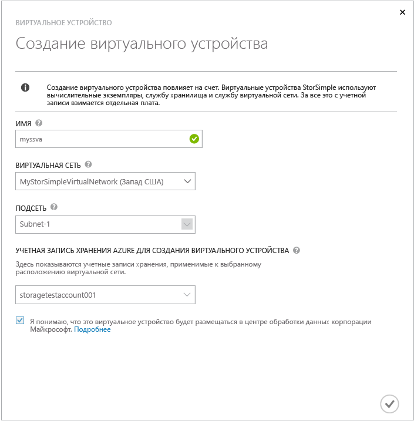
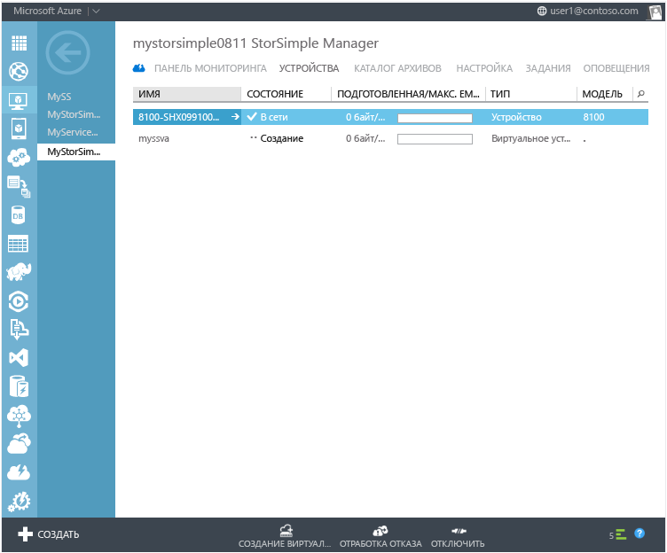
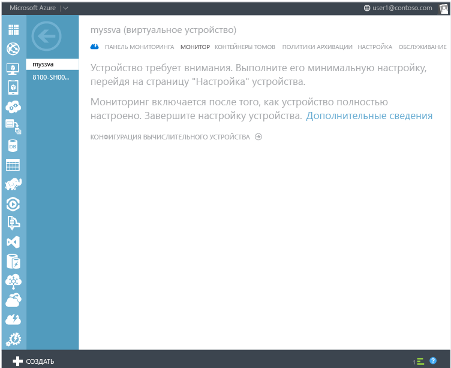
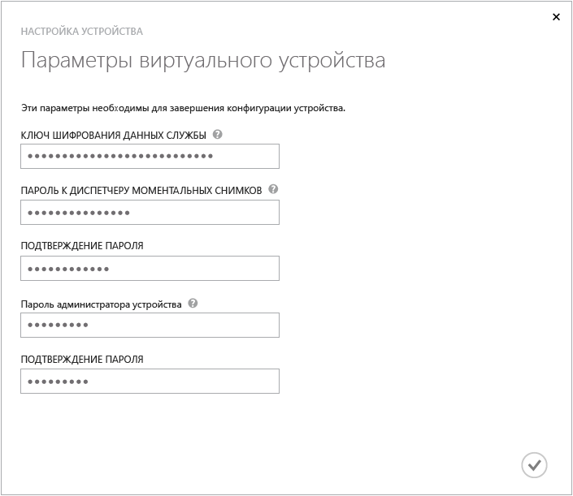

<properties
   pageTitle="Виртуальное устройство StorSimple в Azure | Microsoft Azure"
	description="Описание способов создания, развертывания виртуального устройства StorSimple в виртуальной сети Microsoft Azure и управления им. (Применимо к StorSimple 3 и более ранних версий.)"
	services="storsimple"
	documentationCenter=""
	authors="alkohli"
	manager="carolz"
	editor=""/>
<tags
   ms.service="storsimple"
	ms.devlang="NA"
	ms.topic="hero-article"
	ms.tgt_pltfrm="NA"
	ms.workload="NA"
	ms.date="09/02/2015"
	ms.author="alkohli"/>

# Развертывание виртуального устройства StorSimple в Azure и управление им

[AZURE.INCLUDE [storsimple-version-selector-sva](../../includes/storsimple-version-selector-sva.md)]

## Обзор

Виртуальное устройство StorSimple — это дополнительная функция, поставляемая вместе с решением Microsoft Azure StorSimple. Виртуальное устройство StorSimple работает в виртуальной машине в виртуальной сети Microsoft Azure, и вы можете использовать его для резервного копирования и клонирования данных с узлов. В следующих разделах этой статьи представлены сведения о виртуальном устройстве StorSimple, его настройке и использовании.

- Отличия виртуального устройства от физического.

- Рекомендации по безопасности при использовании виртуального устройства.

- Предварительные условия (и необходимые компоненты) для виртуального устройства.

- Создание и настройка виртуального устройства.

- Работа с виртуальным устройством.

- Отработка отказа для виртуального устройства.

- Завершение работы или удаление виртуального устройства.

## Отличия виртуального устройства от физического

Виртуальное устройство StorSimple — это программная версия StorSimple, которая выполняется на одном узле в виртуальной машине Microsoft Azure. Виртуальное устройство поддерживает сценарии аварийного восстановления, в которых физическое устройство недоступно; кроме того оно подходит для использования в сценариях разработки и тестирования облака.

Ниже приведены основные различия между виртуальным и физическим устройствами StorSimple.

- Виртуальное устройство содержит только один сетевой интерфейс — DATA 0. Физическое устройство включает шесть сетевых интерфейсов: от DATA 0 до DATA 5.
- Виртуальное устройство регистрируется во время настройки, а не в рамках отдельной задачи.
- На виртуальном устройстве невозможно повторно создать ключ шифрования данных службы. Во время смены ключей ключ будет повторно создан на физическом устройстве, а затем потребуется обновить виртуальное устройство с использованием нового ключа.
- Во время применения обновлений к виртуальному устройству оно будет некоторое время простаивать, тогда как физическое устройство — нет.

## Рекомендации по безопасности при использовании виртуального устройства

При использовании виртуального устройства StorSimple учитывайте следующие рекомендации по безопасности.

- Защита виртуального устройства обеспечивается в рамках подписки Microsoft Azure. Это означает, что, если при использовании виртуального устройства подписка Azure будет скомпрометирована, данные, сохраненные на виртуальном устройстве, также будут уязвимы.

- Открытый ключ сертификата, использующийся для шифрования данных, сохраненных в Azure StorSimple, безопасно предоставляется на портале Azure, а закрытый ключ хранится на устройстве StorSimple. На виртуальном устройстве StorSimple и открытый, и закрытый ключи хранятся в Azure.

- Виртуальное устройство размещено в центре обработки данных Microsoft Azure.

## Предварительные условия (и необходимые компоненты) для виртуального устройства

Разделы, представленные ниже, помогут вам подготовиться к использованию виртуального устройства StorSimple.

### Требования Azure

Перед подготовкой виртуального устройства вам необходимо будет сделать следующее в среде Azure.

- [Настройте виртуальную сеть в Azure](virtual-networks-create-vnet.md) для виртуального устройства.
- Рекомендуется использовать DNS-сервер по умолчанию, предоставленный Azure, вместо того, чтобы указывать имя собственного DNS-сервера. Если имя DNS-сервера недопустимо, произойдет сбой создания виртуального устройства.
- Подключения типа "точка-сеть" и "сеть-сеть" являются необязательными. При необходимости можно настроить эти параметры для более сложных сценариев.

>[AZURE.IMPORTANT]**Убедитесь, что виртуальная сеть находится в том же регионе, что и облачные учетные записи хранения, которые вы будете использовать совместно с виртуальным устройством.**

- Вы можете создать [виртуальные машины Azure](../virtual-machines/virtual-machines-about.md) (серверы узла) в виртуальной сети, которая может использовать тома, предоставляемые виртуальным устройством. Эти серверы должны соответствовать следующим требованиям.
	- Они должны являться виртуальными машинами Windows или Linux с установленным программным обеспечением инициатора iSCSI.
	- Они должны работать в той же виртуальной сети, что и виртуальное устройство.
	- Они должны иметь возможность подключения к платформе iSCSI виртуального устройства по внутреннему IP-адресу виртуального устройства.

- Убедитесь, что вы настроили поддержку iSCSI и облачный трафик в одной виртуальной сети.

### Требования StorSimple

Внесите следующие изменения в службу Azure StorSimple перед созданием виртуального устройства.

- Добавьте [записи контроля доступа](storsimple-manage-acrs.md) для виртуальных машин, которые будут серверами узла для виртуального устройства.

- Убедитесь, что ваша [учетная запись хранения](storsimple-manage-storage-accounts.md#add-a-storage-account) находится в том же регионе, что и виртуальное устройство. Если учетные записи хранения находятся в разных регионах, это может привести к сильному понижению производительности.

- Для создания виртуального устройства необходимо использовать учетную запись хранения, отличную от той, которая используется для ваших данных. Использование той же учетной записи хранения может привести к сильному понижению производительности.

Перед началом работы убедитесь, что у вас есть следующие сведения.

- У вас есть учетная запись портала Azure с учетными данными для доступа.

- У вас есть учетные данные для доступа к учетной записи хранения Azure.

- У вас есть копия ключа шифрования данных службы, полученная с физического устройства.

- У вас есть копия ключа шифрования облачной службы для каждого контейнера томов.

## Создание и настройка виртуального устройства

Перед выполнением этих процедур убедитесь, что соблюдены [предварительные условия для виртуального устройства](#prerequisites-for-the-virtual-device).

После завершения этих процедур вы сможете [работать с виртуальным устройством](#work-with-the-storsimple-virtual-device).

### Создание виртуального устройства

После создания виртуальной сети, настройки службы диспетчера StorSimple и регистрации физического устройства StorSimple в службе вы можете выполнить следующие действия для создания виртуального устройства StorSimple.

Выполните указанные ниже действия для создания виртуального устройства StorSimple.

1.  На портале Azure перейдите в службу **диспетчера StorSimple**.

2. Откройте страницу **Устройства**.

3. В диалоговом окне **Создание виртуального устройства** укажите следующие данные.

	

	1. **Имя** — уникальное имя виртуального устройства.

	2. **Виртуальная сеть** — имя виртуальной сети, которую следует использовать для виртуального устройства.

	3. **Подсеть** — подсеть в виртуальной сети для использования на виртуальном устройстве.

	4. **Учетная запись хранения для создания виртуального устройства** — учетная запись хранения, которая будет использоваться для хранения образа виртуального устройства во время подготовки. Эта учетная запись хранения должна находиться в том же регионе, что и виртуальное устройство и виртуальная сеть. Она не должна использоваться для хранения данных физическим или виртуальным устройством. По умолчанию для этой цели будет создана новая учетная запись хранения. Однако если у вас уже есть подходящая учетная запись хранения, вы можете выбрать ее в списке.

4. Установите флажок, чтобы указать, что вы понимаете, что данные, сохраненные на виртуальном устройстве, будут размещены в центре обработки данных Майкрософт. Будет создано виртуальное устройство. Для создания виртуального устройства может потребоваться от 45 минут до 1 часа.

При использовании только физического устройства ваш ключ шифрования сохраняется на устройстве, следовательно, Майкрософт не может расшифровать его. При использовании виртуального устройства ключ шифрования и ключ расшифровки хранятся в Microsoft Azure. Дополнительные сведения см. в статье [Рекомендации по безопасности при использовании виртуального устройства](#security-considerations-for-using-a-virtual-device).

### Настройка и регистрация виртуального устройства

Перед тем, как начать эту процедуру, убедитесь, что у вас есть копия ключа шифрования данных службы. Ключ шифрования данных службы был создан при настройке первого физического устройства StorSimple, и его рекомендовалось сохранить в защищенном месте. Если у вас нет копии ключа шифрования данных службы, следует [обратиться в службу поддержки Майкрософт](storsimple-contact-microsoft-support.md) за помощью.

Выполните следующие действия, чтобы настроить и зарегистрировать виртуальное устройство StorSimple.

1. Выберите **Виртуальное устройство StorSimple**, созданное на странице **Устройства**.

2. Нажмите кнопку **Завершить настройку устройства**. Запустится мастер настройки устройства.

	

1. В мастере настройки устройства выполните следующие действия:

	1. Введите **Ключ шифрования данных службы** в соответствующем поле.
	2. Введите **пароль диспетчера моментальных снимков**. Длина **пароля диспетчера моментальных снимков** должна составлять 14–15 символов, при этом пароль должен содержать комбинацию букв в верхнем и нижнем регистре, цифр и специальных символов.
	3. Введите **пароль администратора устройства**. Длина **пароля администратора устройства** должна составлять 8–15 символов, при этом пароль должен содержать комбинацию букв в верхнем и нижнем регистре, цифр и специальных символов.
	4. Щелкните значок галочки, чтобы завершить первоначальную настройку и регистрацию виртуального устройства.

		

После завершения настройки и регистрации устройство будет подключено к сети. Для подключения устройства может потребоваться несколько минут.

### Изменение параметров конфигурации устройства

В следующем разделе описываются параметры конфигурации, которые нужно настроить для виртуального устройства StorSimple. К этим параметрам относятся настройки протокола CHAP, пароль диспетчера моментальных снимков StorSimple или пароль администратора устройства.

#### Настройка инициатора CHAP (необязательно)

Этот параметр содержит учетные данные, которые виртуальное устройство (целевое устройство) ожидает от инициаторов (серверов), пытающихся получить доступ к томам. Инициаторы предоставят имя пользователя и пароль CHAP для собственной идентификации на устройстве во время проверки подлинности.

#### Настройка целевого объекта CHAP (необязательно)

Этот параметр содержит учетные данные, которые виртуальное устройство использует при запросе взаимной или двунаправленной проверки подлинности инициатором с поддержкой CHAP. Ваше виртуальное устройство будет использовать обратные имя пользователя и пароль CHAP для собственной идентификации в инициаторе во время проверки подлинности. Обратите внимание, что параметры целевого устройства CHAP являются глобальными. При их применении все тома, подключенные к виртуальному устройству для хранения данных, будут использовать проверку подлинности CHAP.

#### Настройка диспетчера моментальных снимков StorSimple (необязательно)

Программное обеспечение диспетчера моментальных снимков StorSimple находится на узле Windows и позволяет администраторам управлять созданием резервных копий для устройства StorSimple в виде локальных и облачных моментальных снимков.

>[AZURE.NOTE]Для виртуального устройства узел Windows — это виртуальная машина Azure.

При настройке устройства в диспетчере моментальных снимков StorSimple вас попросят указать IP-адрес и пароль устройства StorSimple для проверки подлинности устройства для хранения данных. Этот пароль сначала настраивается в интерфейсе Windows PowerShell.

Выполните указанные ниже действия, чтобы изменить настройки диспетчера моментальных снимков StorSimple при его использовании с виртуальным устройством StorSimple.

1. На виртуальном устройстве последовательно выберите **Устройства > Настройка**.

- Прокрутите экран вниз, к разделу **Диспетчер моментальных снимков**. Введите пароль длиной 14–15 символов. Убедитесь, что пароль включает в себя буквы в верхнем и нижнем регистре, цифры и специальные символы.

- Подтвердите пароль.

- В нижней части страницы нажмите кнопку **Сохранить**.

Пароль диспетчера моментальных снимков StorSimple теперь изменен, и его можно использовать при проверке подлинности узлов Windows.

#### Настройка пароля администратора устройства

При использовании интерфейса Windows PowerShell для доступа к виртуальному устройству вам потребуется ввести пароль администратора устройства. Для обеспечения безопасности ваших данных необходимо изменить этот пароль перед тем, как использовать виртуальное устройство.

Выполните следующие действия, чтобы изменить пароль администратора виртуального устройства StorSimple.

1. На виртуальном устройстве последовательно выберите **Устройства > Настройка**.

1. Прокрутите экран вниз, к разделу **Пароль администратора устройства**. Укажите пароль администратора длиной от 8 до 15 символов. Пароль должен содержать буквы в верхнем и нижнем регистре, цифры и специальные символы.

1. Подтвердите пароль.

1. В нижней части страницы нажмите кнопку **Сохранить**.

Теперь пароль администратора устройства изменен. Этот новый пароль будет использоваться для доступа к интерфейсу Windows PowerShell на виртуальном устройстве.

#### Настройка удаленного управления (необязательно)

Удаленный доступ к виртуальному устройству в интерфейсе Windows PowerShell по умолчанию отключен. Необходимо сначала включить удаленное управление на виртуальном устройстве, а затем включить его в клиенте, который будет использоваться для доступа к виртуальному устройству.

Вы можете подключиться по протоколу HTTP или HTTPS. По соображениям безопасности для подключения к виртуальному устройству рекомендуется использовать HTTPS с самозаверяющим сертификатом.

Выполните следующие действия, чтобы настроить удаленное управление для виртуального устройства StorSimple.

1. На виртуальном устройстве последовательно выберите **Устройства > Настройка**.

2. Прокрутите экран вниз, к разделу **Удаленное управление**.

3. Задайте для пункта **Включить удаленное управление** значение **Да**.

4. Теперь вы можете выбрать подключение по HTTP. По умолчанию выбрано подключение по HTTPS. Подключение по HTTP допустимо только в доверенных сетях.

5. Щелкните **Скачать сертификат удаленного управления**, чтобы скачать сертификат удаленного управления. Необходимо будет указать расположение, в котором следует сохранить этот файл. Затем этот сертификат потребуется установить на клиентском компьютере или хост-компьютере, который будет использоваться для подключения к виртуальному устройству.

6. В нижней части страницы нажмите кнопку **Сохранить**.

## Работа с виртуальным устройством StorSimple

После создания и настройки виртуального устройства StorSimple вы можете начать работу с ним. Работа с контейнерами томов, томами и политиками резервного копирования на виртуальном устройстве аналогична работе с ними на физическом устройстве StorSimple. Единственное отличие состоит в том, что нужно убедиться, что вы выбрали виртуальное устройство из списка устройств. Инструкции по этим задачам см. в следующих разделах:

- [Контейнеры томов](storsimple-manage-volume-containers.md)

- [Тома](storsimple-manage-volumes.md)

- [Политики резервного копирования](storsimple-manage-backup-policies.md)

В следующих разделах рассматриваются некоторые отличия, с которыми вы столкнетесь при работе с виртуальным устройством.

### Обслуживание виртуального устройства StorSimple

Так как это программное устройство, обслуживание виртуального устройства сведено к минимуму по сравнению с обслуживанием физического устройства. Доступны следующие варианты:

- **Обновления программного обеспечения** — вы можете просмотреть дату последнего обновления программного обеспечения, а также все сообщения о состоянии обновления. Вы можете нажать кнопку "Проверить наличие обновлений" в нижней части страницы для выполнения проверки вручную, если необходимо проверить наличие обновлений.
- **Пакет поддержки** — вы можете создать и отправить пакет поддержки, чтобы помочь службе поддержки Майкрософт в устранении неполадок на виртуальном устройстве.

### Учетные записи хранения для виртуального устройства

Учетные записи хранения используются в службе диспетчера StorSimple, на виртуальных и физических устройствах. При создании учетных записей хранения в понятном имени рекомендуется использовать идентификатор региона, чтобы упростить обеспечение использования одного и тот же региона во всех компонентах системы. Для виртуального устройства важно, чтобы все компоненты находились в одном регионе, чтобы предотвратить понижение производительности.

### Деактивация виртуального устройства StorSimple

При деактивации виртуального устройства будет удалена виртуальная машина и ресурсы, созданные при ее подготовке. После деактивации виртуального устройства его невозможно вернуть в предыдущее состояние. Перед деактивацией виртуального устройства убедитесь, что остановили или удалили клиенты и узлы, зависящие от него.

Деактивация виртуального устройства приведет к следующим действиям:

- Виртуальное устройство будет удалено.

- OSDisk и диски с данными, созданные для виртуального устройства, будут удалены.

- Размещенная служба и виртуальная сеть, созданные во время подготовки, будут сохранены. Если вы не используете их, удалите их вручную.

- Облачные моментальные снимки, созданные для виртуального устройства, будут сохранены.

После того, как устройство отобразится на странице службы диспетчера StorSimple как деактивированное, вы сможете удалить виртуальное устройство из списка устройств службы диспетчера StorSimple.

### Удаленный доступ к виртуальному устройству StorSimple

После включения его на странице конфигурации устройства StorSimple вы можете использовать удаленное взаимодействие Windows PowerShell для подключения к виртуальному устройству с другой виртуальной машины в той же виртуальной сети; например, вы можете подключиться с виртуальной машины-хоста, которую вы настроили и использовали для подключения iSCSI. В большинстве развертываний у вас уже есть открытая общедоступная конечная точка для доступа к виртуальной машине-хосту, которую можно использовать для доступа к виртуальному устройству.

>[AZURE.WARNING]Для повышения уровня безопасности настоятельно рекомендуется использовать протокол HTTPS при подключении к конечным точкам и удалении конечных точек после завершения удаленного сеанса PowerShell.

Процедуры настройки удаленного взаимодействия на виртуальном устройстве описаны в статье [Удаленное подключение к устройству StorSimple](storsimple-remote-connect.md).

Однако если вы хотите подключиться напрямую к виртуальному устройству с другого компьютера, находящегося за пределами виртуальной сети или за пределами среды Microsoft Azure, необходимо создать дополнительные конечные точки, как описано в следующей процедуре.

Выполните следующие действия, чтобы создать общедоступную конечную точку на виртуальном устройстве.

1. Войдите на портал Azure.

- Щелкните **Виртуальные машины**, а затем выберите виртуальную машину, которая используется как виртуальное устройство.

- Нажмите кнопку **Конечные точки**. На странице "Конечные точки" перечислены все конечные точки для виртуальной машины.

- Щелкните **Добавить**. Откроется диалоговое окно Добавить конечную точку. Щелкните стрелку для продолжения.

- В поле **Имя** введите следующее имя конечной точки: **WinRMHttps**.

- В поле **Протокол** укажите **TCP**.

- В поле **Общий порт** введите номера порта, которые хотите использовать для подключения.

- В поле **Частный порт** введите **5986**.

- Чтобы создать конечную точку, поставьте галочку.

После создания конечной точки вы можете просмотреть ее сведения, чтобы определить общедоступный виртуальный IP-адрес. Запишите этот адрес.

Рекомендуется подключиться с другой виртуальной машины внутри той же виртуальной сети, так как это минимизирует число общедоступных конечных точек в виртуальной сети. При использовании этого метода вы просто подключаетесь к виртуальной машине с помощью сеанса удаленного рабочего стола, а затем настраиваете виртуальную машину так же, как любой другой клиент Windows в локальной сети. Вам не нужно добавлять номер общедоступного порта, так как порт будет уже известен.

### Остановка и перезапуск

В отличие от физического устройства StorSimple на виртуальном устройстве StorSimple нет кнопки включения и выключения питания. Однако иногда возникают ситуации, когда необходимо остановить и перезапустить виртуальное устройство. Например, для завершения некоторых обновлений может потребоваться перезапуск виртуальной машины. Самый простой способ запуска, остановки и перезапуска виртуального устройства — использовать консоль управления виртуальными машинами.

Состояние виртуального устройства в консоли управления — **Работает**, так как оно запускается по умолчанию после создания. Вы можете остановить и перезапустить виртуальную машину в любое время.

Чтобы остановить виртуальное устройство, щелкните его имя, а затем выберите **Завершить работу**. Во время завершения работы виртуального устройства его состояние будет **Идет остановка**. После остановки виртуального устройства его состояние будет **Остановлено**.

Если виртуальное устройство работает и вы хотите перезапустить его, выберите его имя и щелкните **Перезапустить**. Во время перезапуска виртуального устройства его состояние будет **Идет перезапуск**. Когда виртуальное устройство будет готово к использованию, его состояние будет **Работает**.

Кроме того, для запуска, остановки и перезапуска виртуального устройства можно использовать следующие командлеты Windows PowerShell. Для каждого командлета приведен пример.

`Start-AzureVMC:\PS>Start-AzureVM -ServiceName "MyStorSimpleservice1" -Name "MyStorSimpleDevice"`

`Stop-AzureVMC:\PS>Stop-AzureVM -ServiceName "MyStorSimpleservice1" -Name "MyStorSimpleDevice"`

`Restart-AzureVMC:\PS>Restart-AzureVM -ServiceName "MyStorSimpleservice1" -Name "MyStorSimpleDevice"`

### Сброс к параметрам по умолчанию

Если вы хотите заново настроить виртуальное устройство, просто деактивируйте и удалите его, а затем создайте новое. Как и при сбросе физического устройства на новом виртуальном устройстве не будут установлены обновления, поэтому прежде чем использовать его, проверьте их наличие.

## Отработка отказа для виртуального устройства

Аварийное восстановление — это один из основных сценариев, для которых разработано виртуальное устройство StorSimple. В этом сценарии физическое устройство StorSimple или весь центр обработки данных могут быть недоступны. Однако вы можете использовать виртуальное устройство для восстановления операций в другом местоположении. Во время аварийного восстановления контейнеры томов из исходного устройства сменят владельца и будут перемещены на виртуальное устройство. Предварительные требования для аварийного восстановления включают создание и настройку виртуального устройства, отключение всех томов в контейнере томов и связь контейнера томов с облачным моментальным снимком.

### Восстановление физического устройства на виртуальном устройстве StorSimple

1. Убедитесь, что контейнер томов, для которого необходимо выполнить отработку отказа, имеет связанные с собой облачные моментальные снимки.

- Откройте страницу **Устройство**, а затем выберите вкладку **Контейнеры томов**.

- Выберите контейнер томов, для которого следует выполнить отработку отказа на виртуальное устройство. Щелкните контейнер томов, чтобы открыть список томов в контейнере. Выберите том и щелкните **Отключить**, чтобы отключить том. Повторите эту процедуру для всех томов в контейнере томов.

- Повторите предыдущий шаг для всех контейнеров томов, для которых следует выполнить отработку отказа на виртуальное устройство.

- На странице **Устройство** выберите устройство, для которого необходимо выполнить отработку отказа, а затем щелкните **Отработка отказа**, чтобы открыть мастер **отработки отказа устройства**.

- В поле **Выберите контейнер томов для отработки отказа** укажите контейнеры томов, для которых следует выполнить отработку отказа. Чтобы контейнер томов отображался в этом списке, он должен иметь связанный с собой облачный моментальный снимок и быть отключенным. Если ожидаемый контейнер томов отсутствует, закройте мастер и убедитесь, что он отключен.

- На следующей странице в поле **Выберите целевое устройство для томов** для выделенных контейнеров укажите виртуальное устройство из раскрывающегося списка доступных устройств. В списке отображаются только устройства с доступной емкостью.

- Просмотрите параметры отработки отказа на странице **Подтверждение отработки отказа**. Если они правильные, установите флажок.

Начнется процесс отработки отказа. По завершении отработки отказа перейдите на страницу "Устройства" и выберите виртуальное устройство, которое использовалось как целевое для отработки отказа. Перейдите на страницу "Контейнеры томов". Должны отобразиться все контейнеры томов, а также тома со старого устройства.

>[AZURE.NOTE]Поддерживаемый объем доступного места для хранения данных на виртуальном устройстве — 30 ТБ.

## Завершение работы или удаление виртуального устройства

Если вы ранее настроили и использовали виртуальное устройство StorSimple, но сейчас хотите остановить выставление счетов за вычисления, связанные с его использованием, можно завершить работу виртуального устройства. При завершении работы виртуального устройства его операционная система и диски с данными в хранилище не удаляются. Начисление расходов для подписки останавливается, но плата за хранилище для ОС и дисков с данными продолжит взиматься.

При удалении или завершении работы виртуального устройства оно отобразится на странице "Устройства" службы диспетчера StorSimple как **Автономное**. Вы можете деактивировать или удалить устройство, если необходимо также удалить резервные копии, созданные виртуальным устройством. Дополнительные сведения см. в статье [Деактивация устройства](storsimple-deactivate-and-delete-device.md#deactivate-a-device).

### Завершение работы виртуального устройства StorSimple

1. Войдите на портал Azure.

2. Щелкните **Виртуальные машины** и выберите виртуальное устройство.

3. Щелкните **Завершить работу**.

### Удаление виртуального устройства StorSimple

1. Войдите на портал Azure.

- Щелкните **Виртуальные машины** и выберите виртуальное устройство.

- Щелкните **Удалить** и удалите все диски виртуальной машины.

## Дальнейшие действия

Чтобы администрировать виртуальное устройство, см. подробный список рабочих процессов в статье [Администрирование устройства StorSimple с помощью службы диспетчера StorSimple](storsimple-manager-service-administration.md#administer-storsimple-device-using-storsimple-manager-service).

<!---HONumber=September15_HO1-->