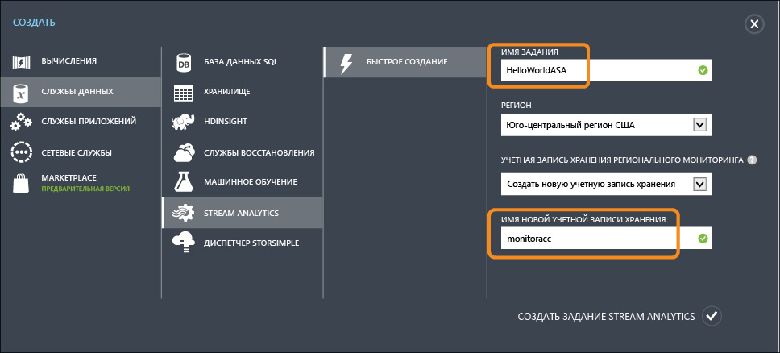
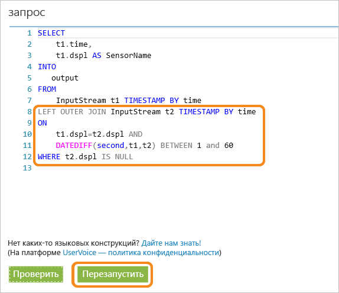
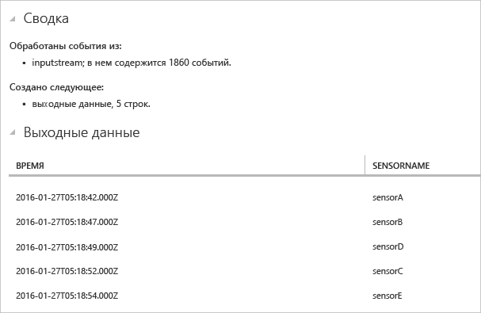

# Начало работы с Azure Stream Analytics для обработки данных с устройств IoT
В этом руководстве вы узнаете, как создать логическую схему обработки потоков для сбора данных с устройств Интернета вещей. Мы рассмотрим сценарии использования Интернета вещей из реальной жизни, чтобы продемонстрировать, как быстро создать решение без лишних затрат.

## Предварительные требования
* [Подписка Azure.](https://azure.microsoft.com/pricing/free-trial/)
* пример запроса и файлов данных, который можно скачать на сайте [GitHub](https://aka.ms/azure-stream-analytics-get-started-iot)

## Сценарий
Компания Contoso, специализирующаяся в области промышленной автоматизации, полностью автоматизировала свой процесс производства. Оборудование этой компании оснащено датчиками, которые передают потоки данных в режиме реального времени. В этом сценарии руководителю производственного участка необходимо в реальном времени получать аналитические данные с датчиков, чтобы определять шаблоны и предпринимать соответствующие действия. Для поиска интересных шаблонов во входящем потоке данных мы будем использовать для передаваемых датчиками данных язык запросов Stream Analytics (SAQL).

В этой статье описываются данные, созданные с помощью устройства Texas Instruments SensorTag.

Полезные данные хранятся в формате JSON и выглядят следующим образом:

    {
        "time": "2016-01-26T20:47:53.0000000",  
        "dspl": "sensorE",  
        "temp": 123,  
        "hmdt": 34  
    }  

В реальном сценарии у вас могут быть сотни таких датчиков, создающих события в виде потока. В идеале необходимо устройство шлюза, выполняющее код для отправки этих событий в [концентраторы событий Azure](https://azure.microsoft.com/services/event-hubs/) или [центры Интернета вещей Azure](https://azure.microsoft.com/services/iot-hub/). Задание Stream Analytics будет принимать эти события из концентраторов событий и выполнять аналитику в режиме реального времени с помощью запросов. Затем результаты можно отправить в [поддерживаемое место назначения выходных данных](stream-analytics-define-outputs.md).

Для удобства в этом руководстве по началу работы приведен пример файла данных, полученных с реальных устройств SensorTag. На основе этого примера можно выполнять различные запросы и просматривать их результаты. В последующих руководствах вы узнаете, как подключить задание к источникам входных данных и местам назначения выходных данных, а также развернуть его в службе Azure.

## Создание задания Stream Analytics
1. На [портале Azure](http://manage.windowsazure.com) щелкните **Stream Analytics** и в левом нижнем углу страницы нажмите кнопку **Создать**, чтобы создать задание аналитики.
   
    
2. Щелкните **Быстрое создание**.
3. Для параметра **Учетная запись хранения регионального мониторинга** выберите **Создать новую учетную запись хранения** и присвойте ей уникальное имя. С помощью этой учетной записи Azure Stream Analytics будет хранить сведения о наблюдении за всеми последующими заданиями.
   
   > [!NOTE]
   > Для каждого региона необходимо создать только одну учетную запись хранения. Она будет совместно использоваться для всех заданий Stream Analytics, созданных в этом регионе.
   > 
   > 
4. В нижней части страницы щелкните **Создать задание Stream Analytics** .
   
    

## Запрос Azure Stream Analytics
Чтобы перейти к редактору запросов, откройте вкладку **Запрос**. Вкладка **Запрос** содержит запрос T-SQL, который преобразует данные входящих событий.

## Архивация необработанных данных
Запрос к серверу — это самая простая форма запроса, который архивирует все входные данные в место назначения выходных данных.

Скачайте пример файла данных на портале [GitHub](https://aka.ms/azure-stream-analytics-get-started-iot) в папку на компьютере. Скопируйте и вставьте запрос из файла PassThrough.txt. Нажмите кнопку **Проверить** и выберите файл данных HelloWorldASA-InputStream.json в папке, где вы сохранили скачанный файл.

Просмотреть результаты запроса можно в браузере, как показано на следующем снимке экрана.

## Фильтрация данных по условию
Давайте попробуем отфильтровать результаты по условию. Нам требуется отобразить результаты только тех событий, которые получены из датчика sensorA. Запрос находится в файле Filtering.txt.

Обратите внимание, что здесь сравнивается строковое значение, в котором учитывается регистр. Нажмите кнопку **Выполнить снова**, чтобы выполнить запрос. Из 1860 строк событий запрос должен вернуть 389 строк.

## Оповещение для активации рабочего бизнес-процесса
Теперь давайте детализируем наш запрос. Если требуется отслеживать среднее значение температуры за 30-секундный промежуток времени и отображать результаты только в том случае, если это значение превышает 100 градусов, для каждого типа датчика нужно написать запрос, как показано ниже, и нажать кнопку **Выполнить снова**, чтобы просмотреть результаты. Запрос находится в файле ThresholdAlerting.txt.

Теперь результаты содержат всего 245 строк. В них указаны датчики, для которых среднее значение температуры превышает 100. В этом запросе поток событий сгруппирован по свойству **dspl**, представляющему собой имя датчика, в **"переворачивающемся" окне** длительностью 30 секунд. Во время создания таких временных запросов важно задать способ учета отметок времени. С помощью предложения **TIMESTAMP BY** мы настроили использование столбца **OUTPUTTIME**, чтобы связать время со всеми временными вычислениями. Дополнительные сведения см. в статьях MSDN об [управлении временем](https://msdn.microsoft.com/library/azure/mt582045.aspx) и [функциях для работы с окнами](https://msdn.microsoft.com/library/azure/dn835019.aspx).

## Обнаружение отсутствия событий
Как написать запрос, чтобы обнаружить отсутствие входящих событий? Давайте выясним, когда последний раз отправка данных с датчика была приостановлена на минуту. Запрос находится в файле AbsenseOfEvent.txt.

Здесь используется **LEFT OUTER JOIN** (левое внешнее соединение) для одного и того же потока данных (самосоединение). При **внутреннем соединении** результат возвращается, только если обнаружено совпадение.  Но если событие с левой стороны соединения не сопоставлено при использовании **левого внешнего соединения**, для всех столбцов справа возвращается строка со значением NULL. Этот метод очень удобно использовать для поиска отсутствия событий. Дополнительные сведения об условии [JOIN](https://msdn.microsoft.com/library/azure/dn835026.aspx) см. в документации MSDN.

## Заключение
Цель этого руководства — показать, как писать различные запросы на языке запросов Stream Analytics и просматривать результаты в браузере. Тем не менее, это только начало работы. С помощью Stream Analytics можно сделать множество других действий. Обработчик Stream Analytics поддерживает разнообразные входные и выходные данные и может даже использовать функции машинного обучения Azure. Благодаря этому он является надежным средством для анализа потоков данных. Чтобы продолжить исследование возможностей Stream Analytics, воспользуйтесь [схемой обучения](https://azure.microsoft.com/documentation/learning-paths/stream-analytics/). Дополнительные сведения о написании запросов см. в статье [Примеры запросов для распространенных шаблонов использования Stream Analytics](stream-analytics-stream-analytics-query-patterns.md).

<!--HONumber=Oct16_HO2-->

