# <a name="get-started-with-azure-stream-analytics-to-process-data-from-iot-devices"></a>Начало работы с Azure Stream Analytics для обработки данных с устройств IoT
В этом руководстве вы узнаете, как создать логическую схему обработки потоков для сбора данных с устройств Интернета вещей. Мы рассмотрим сценарии использования Интернета вещей из реальной жизни, чтобы продемонстрировать, как быстро создать решение без лишних затрат.

## <a name="prerequisites"></a>предварительным требованиям
* [Подписка Azure.](https://azure.microsoft.com/pricing/free-trial/)
* пример запроса и файлов данных, который можно скачать на сайте [GitHub](https://aka.ms/azure-stream-analytics-get-started-iot)

## <a name="scenario"></a>Сценарий
Компания Contoso, специализирующаяся в области промышленной автоматизации, полностью автоматизировала свой процесс производства. Оборудование этой компании оснащено датчиками, которые передают потоки данных в режиме реального времени. В этом сценарии руководителю производственного участка необходимо в реальном времени получать аналитические данные с датчиков, чтобы определять шаблоны и предпринимать соответствующие действия. Для поиска интересных шаблонов во входящем потоке данных мы будем использовать для передаваемых датчиками данных язык запросов Stream Analytics (SAQL).

В этой статье описываются данные, созданные с помощью устройства Texas Instruments SensorTag. Полезные данные хранятся в формате JSON и выглядят следующим образом:

```json
{
    "time": "2016-01-26T20:47:53.0000000",  
    "dspl": "sensorE",  
    "temp": 123,  
    "hmdt": 34  
}  
```

В реальном сценарии у вас могут быть сотни таких датчиков, создающих события в виде потока. В идеале необходимо устройство шлюза, выполняющее код для отправки этих событий в [концентраторы событий Azure](https://azure.microsoft.com/services/event-hubs/) или [центры Интернета вещей Azure](https://azure.microsoft.com/services/iot-hub/). Задание Stream Analytics будет принимать эти события из концентраторов событий и выполнять аналитику в режиме реального времени с помощью запросов. Затем результаты можно отправить в [поддерживаемое место назначения выходных данных](stream-analytics-define-outputs.md).

Для удобства в этом руководстве по началу работы приведен пример файла данных, полученных с реальных устройств SensorTag. На основе этого примера можно выполнять различные запросы и просматривать их результаты. В последующих руководствах вы узнаете, как подключить задание к источникам входных данных и местам назначения выходных данных, а также развернуть его в службе Azure.

## <a name="create-a-stream-analytics-job"></a>Создание задания Stream Analytics
1. На [портале Azure](https://portal.azure.com) щелкните знак "плюс", а затем в текстовом поле справа введите **Stream Analytics** и в появившемся списке результатов выберите **Задание Stream Analytics**.
   
    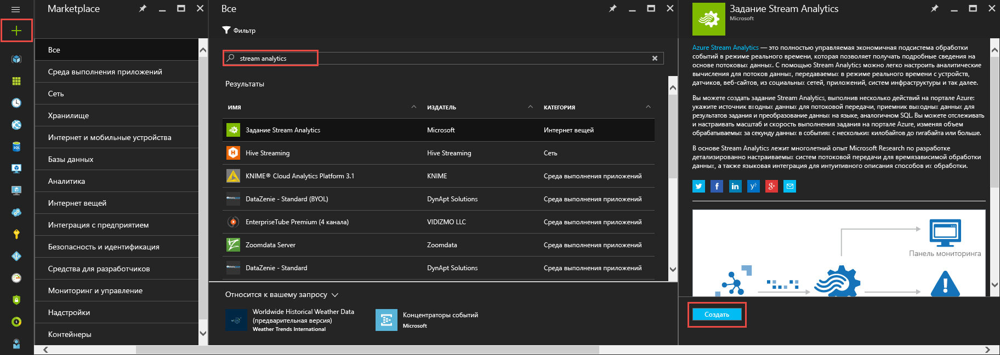
2. Введите уникальное имя задания и убедитесь, что отображается правильная подписка. Затем создайте новую группу ресурсов или выберите существующую в вашей подписке.
3. После этого выберите расположение для вашего задания. Для повышения скорости обработки данных и сокращения затрат при передаче данных мы советуем выбрать то же расположение, что и для группы ресурсов, а также предполагаемую учетную запись хранения.
   
    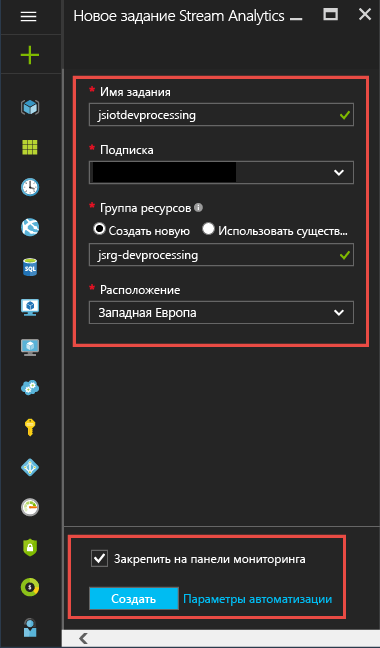
   
   > [!NOTE]
   > Для каждого региона необходимо создать только одну учетную запись хранения. Она будет совместно использоваться для всех заданий Stream Analytics, созданных в этом регионе.
   > 
   > 
4. Установите флажок, чтобы закрепить задание на панели мониторинга, и нажмите кнопку **Создать**.
   
    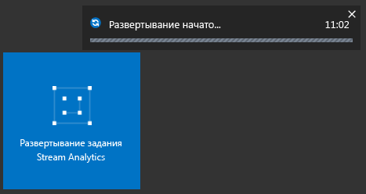
5. В правом верхнем углу окна браузера отобразится надпись "Развертывание начато...". Вскоре вместо него отобразится окно завершения, как показано ниже.
   
    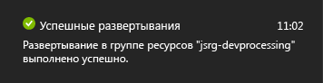

## <a name="create-an-azure-stream-analytics-query"></a>Создание запроса Azure Stream Analytics
После создания задания нужно открыть его и создать запрос. Чтобы получить доступ к заданию, просто щелкните соответствующую плитку.

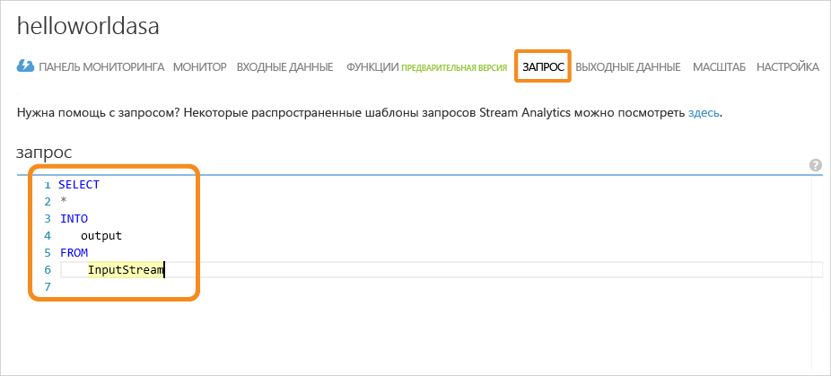

В области **Топология задания** щелкните поле **Запрос**, чтобы перейти в редактор запросов. В **редакторе запросов** можно ввести запрос T-SQL, который преобразует данные входящих событий.

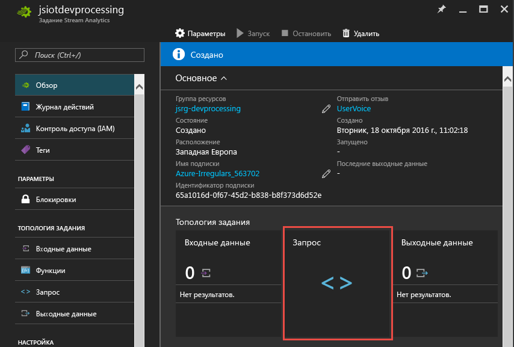

### <a name="query-archive-your-raw-data"></a>Запрос: архивация необработанных данных
Запрос к серверу — это самая простая форма запроса, который архивирует все входные данные в место назначения выходных данных. Скачайте пример файла данных на сайте [GitHub](https://aka.ms/azure-stream-analytics-get-started-iot) в расположение на компьютере. 

1. Скопируйте и вставьте запрос из файла PassThrough.txt. 
   
    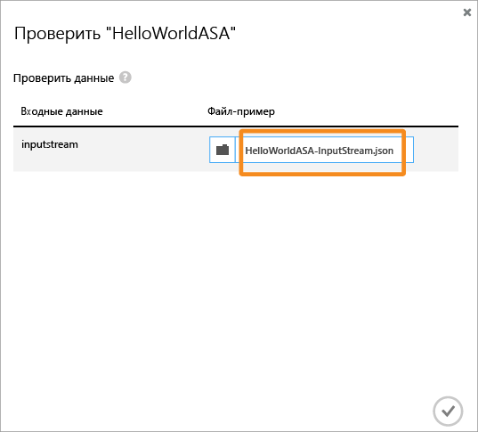
2. Щелкните многоточие рядом с входными данными и выберите пункт **Отправить образец данных из файла**.
   
    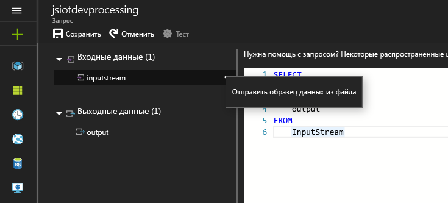
3. После этого справа откроется панель, где нужно выбрать файл данных HelloWorldASA-InputStream.json (из расположения, куда он был скачан) и нажать кнопку **ОК** в нижней части панели.
   
    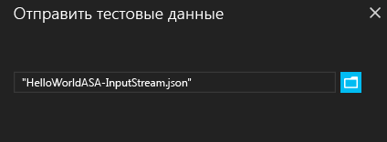
4. Щелкните **Проверить** (значок в виде шестеренки) в верхней левой области окна и проверьте запрос, используя пример набора данных. По завершении проверки под запросом появится окно результатов.
   
    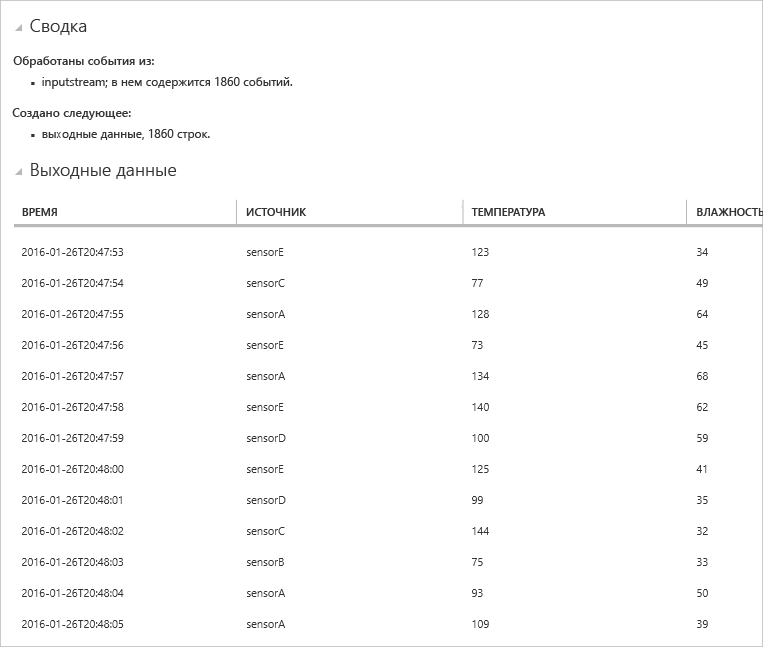

### <a name="query-filter-the-data-based-on-a-condition"></a>Запрос: фильтрация данных по условию
Давайте попробуем отфильтровать результаты по условию. Нам требуется отобразить результаты только тех событий, которые получены из датчика sensorA. Запрос находится в файле Filtering.txt.

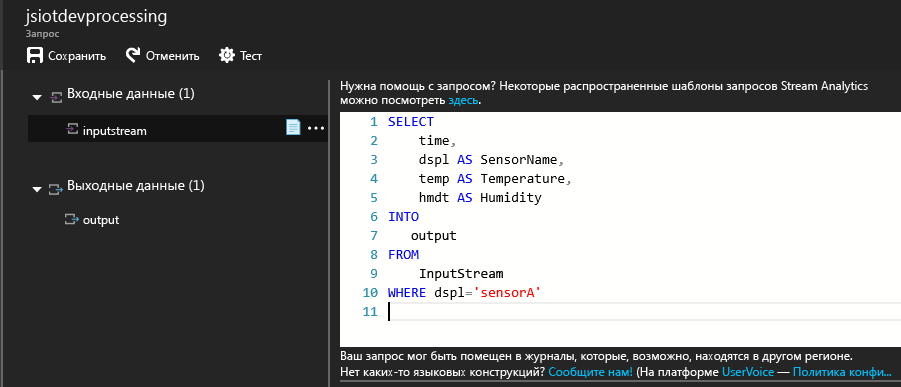

Обратите внимание, что здесь сравнивается строковое значение, в котором учитывается регистр. Чтобы выполнить запрос снова, щелкните значок **Проверить** в виде шестеренки. Из 1860 строк событий запрос должен вернуть 389 строк.

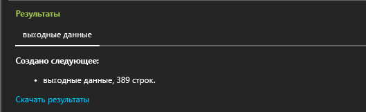

### <a name="query-alert-to-trigger-a-business-workflow"></a>Запрос: оповещение для активации рабочего бизнес-процесса
Теперь давайте детализируем наш запрос. Если требуется отслеживать среднее значение температуры за 30-секундный промежуток времени и отображать результаты только в том случае, если это значение превышает 100 градусов, Для каждого типа датчика нужно написать запрос, как показано ниже, и щелкнуть **Проверить**, чтобы просмотреть результаты. Запрос находится в файле ThresholdAlerting.txt.

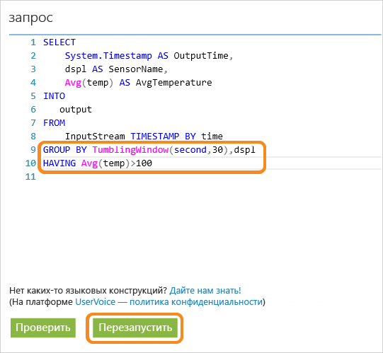

Теперь результаты содержат всего 245 строк. В них указаны датчики, для которых среднее значение температуры превышает 100. В этом запросе поток событий сгруппирован по свойству **dspl**, представляющему собой имя датчика, в **"переворачивающемся" окне** длительностью 30 секунд. Во время создания таких временных запросов важно задать способ учета отметок времени. С помощью предложения **TIMESTAMP BY** мы настроили использование столбца **OUTPUTTIME**, чтобы связать время со всеми временными вычислениями. Дополнительные сведения см. в статьях MSDN об [управлении временем](https://msdn.microsoft.com/library/azure/mt582045.aspx) и [функциях для работы с окнами](https://msdn.microsoft.com/library/azure/dn835019.aspx).

### <a name="query-detect-absence-of-events"></a>Запрос: обнаружение отсутствия событий
Как написать запрос, чтобы обнаружить отсутствие входящих событий? Давайте выясним, когда последний раз отправка данных с датчика была приостановлена на 5 секунд. Запрос находится в файле AbsenseOfEvent.txt.

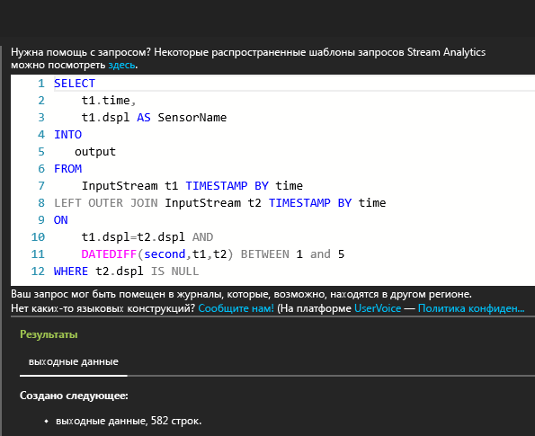

Здесь используется **LEFT OUTER JOIN** (левое внешнее соединение) для одного и того же потока данных (самосоединение). При **внутреннем соединении** результат возвращается, только если обнаружено совпадение.  Но если событие с левой стороны соединения не сопоставлено при использовании **левого внешнего соединения**, для всех столбцов справа возвращается строка со значением NULL. Этот метод очень удобно использовать для поиска отсутствия событий. Дополнительные сведения об условии [JOIN](https://msdn.microsoft.com/library/azure/dn835026.aspx) см. в документации MSDN.

## <a name="conclusion"></a>Заключение
Цель этого руководства — показать, как писать различные запросы на языке запросов Stream Analytics и просматривать результаты в браузере. Тем не менее, это только начало работы. С помощью Stream Analytics можно сделать множество других действий. Обработчик Stream Analytics поддерживает разнообразные входные и выходные данные и может даже использовать функции машинного обучения Azure. Благодаря этому он является надежным средством для анализа потоков данных. Чтобы продолжить исследование возможностей Stream Analytics, воспользуйтесь [схемой обучения](https://azure.microsoft.com/documentation/learning-paths/stream-analytics/). Дополнительные сведения о написании запросов см. в статье [Примеры запросов для распространенных шаблонов использования Stream Analytics](stream-analytics-stream-analytics-query-patterns.md).

