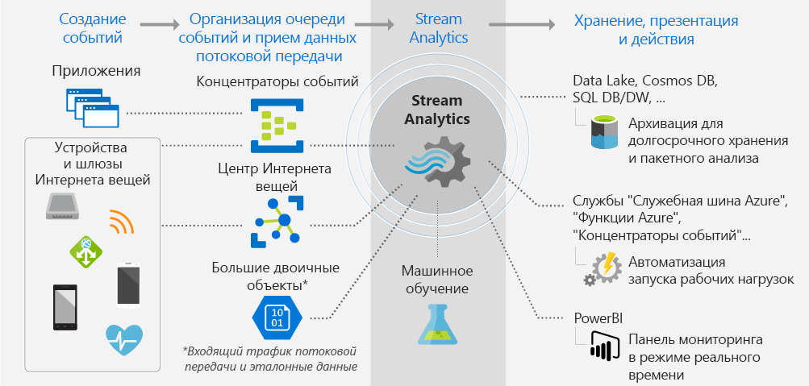
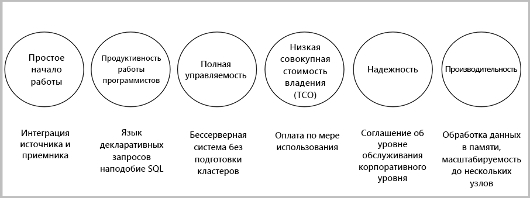

# Что такое Stream Analytics?

Azure Stream Analytics — это модуль обработки событий, который позволяет проверять большие потоки данных из устройств. Данные могут поступать из устройств, датчиков, веб-сайтов, каналов социальных сетей, приложений и других источников. Эта служба также поддерживает извлечение информации из потоков данных, определение шаблонов и связей. Эти шаблоны можно использовать для активации других подчиненных действий, таких как оповещения, отправки информации в средства создания отчетов или хранения данных для последующего использования.

Ниже приведены некоторые примеры использования Azure Stream Analytics: 

* интеграция данных датчика Интернета вещей и аналитика в реальном времени на основе телеметрии устройства;
* анализ веб-журналов и сведений о посещении сайта;
* геопространственная аналитика для управления транспортной системой и автономными транспортными средствами;
* удаленный мониторинг и прогнозное обслуживание высокоценных ресурсов;
* аналитика данных точки продаж в режиме реального времени для контроля запасов и обнаружения аномалий.

## Как работает Stream Analytics?

Azure Stream Analytics запускается с источником данных потоковой передачи, которые принимает концентратор событий Azure или Центр Интернета вещей и которые могут передаваться из хранилища данных, например хранилища BLOB-объектов Azure. Чтобы изучить потоки, создайте задание Stream Analytics, указывающее источник входных данных, выполняющий потоковую передачу. Задание также указывает запрос преобразования, который определяет, как выполнять поиск данных, шаблонов или связей. Запрос преобразования использует SQL-подобный язык запросов, который используется для фильтрации, сортировки, вычисления и объединения потоковых данных за определенный период времени. Для задания можно настроить параметры упорядочения событий и продолжительность временных окон при выполнении операций вычисления.

После завершения анализа входящих данных укажите место вывода для преобразованных данных. Вы можете контролировать, что делать в ответ на информацию, которую вы проанализировали. Например, можно выполнять такие действия:

* отправлять данные в контролируемую очередь для запуска подчиненных пользовательских рабочих потоков;
* отправлять данные на панель мониторинга Power BI для визуализации в режиме реального времени;
* архивировать данные в других службах хранения Azure.

На следующем рисунке показан конвейер Stream Analytics. Задание Stream Analytics может использовать все входные и выходные данные или выбранный набор. На рисунке показано, как данные отправляются в Stream Analytics, анализируются и направляются для выполнения других действий, например хранения или отображения:

## Основные возможности и преимущества

Служба Azure Stream Analytics должна быть простой в использовании, гибкой, надежной и масштабируемой до любого размера задания. Она доступна в нескольких центрах обработки данных, а также национальных облаках. На рисунке ниже показаны ключевые возможности Azure Stream Analytics.

## Простое начало работы

С Azure Stream Analytics легко начать работу. Для подключения к нескольким источникам, приемникам и создания конвейера требуется всего несколько щелчков. Stream Analytics можно подключить к [концентраторам событий Azure](https://docs.microsoft.com/azure/event-hubs/) и [Центру Интернета вещей](https://docs.microsoft.com/azure/iot-hub/) для приема потоковых данных. Ее также можно подключить к службе [Хранилище BLOB-объектов Azure](https://docs.microsoft.com/azure/storage/storage-introduction), чтобы принимать данные журнала. Stream Analytics может объединять данные из концентраторов событий с другими источниками данных и модулями обработки. Входные данные задания также могут содержать эталонные данные, которые являются статическими или медленно меняющимися. Для выполнения операций поиска к эталонным датам можно подсоединить потоковые данные.

Stream Analytics может направлять выходные данные задания к нескольким системам хранения, таким как [хранилище BLOB-объектов](https://docs.microsoft.com/azure/storage/storage-introduction), [база данных SQL Azure](https://docs.microsoft.com/azure/sql-database/), [Azure Data Lake Store](https://docs.microsoft.com/azure/data-lake-store/) или [Azure Cosmos DB](https://docs.microsoft.com/azure/cosmos-db/introduction). После сохранения можно выполнить пакетную аналитику с Azure HDInsight или отправить выходные данные в другую службу, например, концентраторы событий для потребления или в [Power BI](https://docs.microsoft.com/power-bi/) для визуализации в режиме реального времени с помощью API потоковой передачи Power BI.

## Продуктивность работы программиста

Azure Stream Analytics использует простой язык запросов на основе SQL, который был дополнен мощными временными ограничениями для анализа перемещаемых данных. Для определения преобразований задания используется простой, декларативный [язык запросов Stream Analytics](https://msdn.microsoft.com/library/azure/dn834998.aspx), который позволяет создавать сложные временные запросы и аналитику с использованием простых конструкций SQL. Язык запросов Stream Analytics соответствует языку SQL. Знания языка SQL достаточно, чтобы приступить к созданию заданий. Также задания можно создавать с помощью инструментов разработчика, таких как Azure PowerShell, [средства Stream Analytics Visual Studio](stream-analytics-tools-for-visual-studio-install.md), или шаблонов Azure Resource Manager. С помощью инструментов разработчика можно создавать запросы на преобразование автономно и использовать [конвейер непрерывной интеграции и поставки](stream-analytics-tools-for-visual-studio-cicd.md) для отправки заданий в Azure. 

Язык запросов Stream Analytics предлагает широкий набор функций для анализа и обработки данных потоковой передачи. Этот язык запросов поддерживает простое управление данными, функции статического вычисления и сложные геопространственные функции. На портале можно редактировать запросы и тестировать их с использованием примера данных, который извлекается из потока в реальном времени.

Вы можете расширить возможности языка запросов. Для этого нужно определить или вызвать дополнительные функции. Вызовы функций можно определить в службе "Машинное обучение Azure", чтобы воспользоваться преимуществами решений этой службы и интегрировать определяемые пользователем функции или статистические выражения JavaScript для выполнения сложных вычислений как часть запроса Stream Analytics.

## Полная управляемость 

Azure Stream Analytics является полностью управляемым независимым от сервера предложением (PaaS) в Azure. Это означает, что не нужно подготавливать все оборудование или управлять кластерами для запуска заданий. Azure Stream Analytics полностью управляет заданием, настраивая сложные вычислительные кластеры в облаке и производительность, необходимую для выполнения задания. Благодаря интеграции с концентраторами событий Azure и Центром Интернета вещей Azure задачи могут принимать за секунду миллионы событий от подключенных устройств, посещений ресурсов, файлов журналов и т. п. С помощью функции секционирования концентраторов событий вы можете разделять вычисления на логические шаги, каждый из которых может быть дополнительно разделен для повышения масштабируемости.

## Низкая совокупная стоимость владения

Облачная служба Stream Analytics оптимизирована для затрат. Первоначальные затраты отсутствуют, вы платите только за [использованные единицы потоковой передачи](stream-analytics-streaming-unit-consumption.md) и объем обработанных данных. Не требуется никаких обязательств или подготовки кластеров. Задания потоковой передачи можно масштабировать с учетом бизнес-требований. 

## Надежность 

Будучи управляемой службой, Stream Analytics гарантирует обработку событий с доступностью на уровне 99,9 %, позволяет предотвратить потерю данных и обеспечивает непрерывность бизнес-процессов. Дополнительные сведения см. на странице [Соглашение об уровне обслуживания для Stream Analytics](https://azure.microsoft.com/support/legal/sla/stream-analytics/v1_0/). Stream Analytics может обрабатывать миллионы событий в секунду и предоставлять результаты с низкой задержкой.
Она гарантирует обработку событий только один раз и по крайней мере одну доставку событий. Она имеет встроенные возможности восстановления в случае сбоя доставки события. Stream Analytics может внутренне поддерживать состояние задания, позволяет запустить задание с момента последнего вывода данных и генерирует всегда одинаковые воспроизводимые результаты. Эта функция Stream Analytics позволяет вернуться назад во времени и изучить вычисления в рамках анализа основных причин. 

## Производительность

Azure Stream Analytics оптимизирована для высокой производительности, она может обрабатывать данные потоковой передачи и выполнять расчеты в памяти. Это позволяет выполнять масштабирование для обработки сложных событий и событий в реальном времени в приложениях. Stream Analytics поддерживает производительность с помощью секционирования. Сложный запрос может быть параллелизован и выполнен в нескольких узлах потоковой передачи. 

## Дополнительная информация

Теперь у вас есть общие сведения об Azure Stream Analytics. Теперь вы можете вникнуть в детали и создать свое первое задание Stream Analytics:

* [Руководство по созданию задания Stream Analytics с помощью портала Azure](stream-analytics-quick-create-portal.md)
* [Руководство по созданию задания Stream Analytics с помощью Azure PowerShell](stream-analytics-quick-create-powershell.md)
