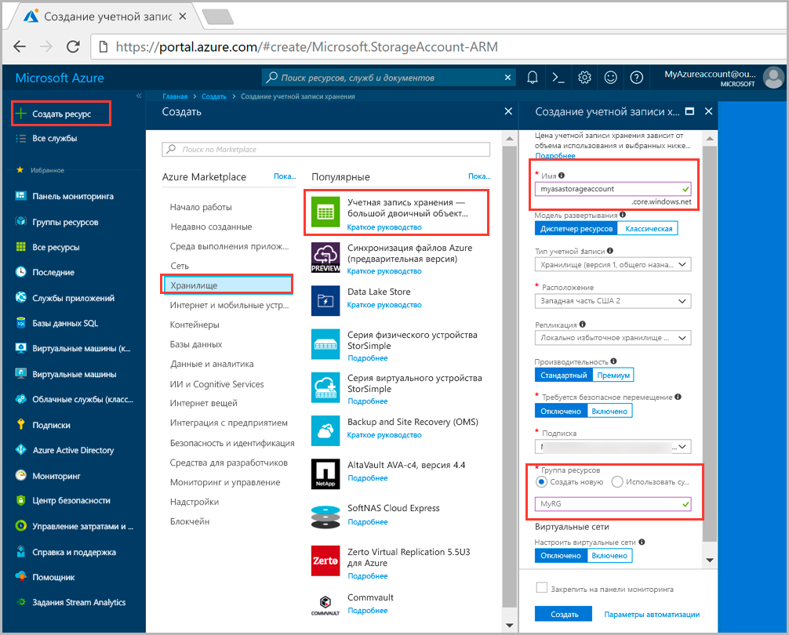
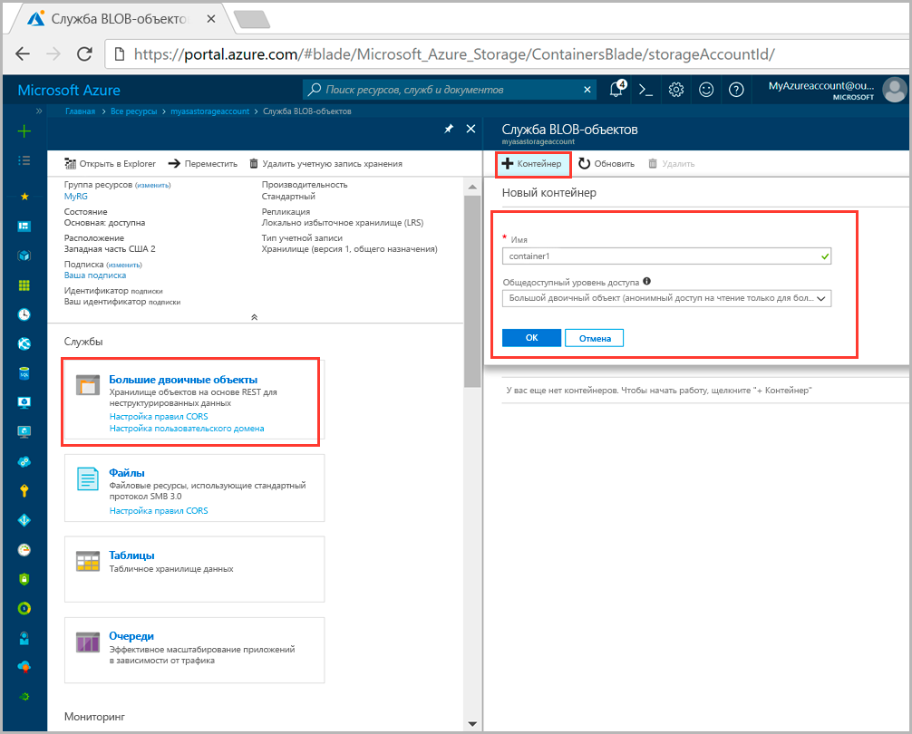
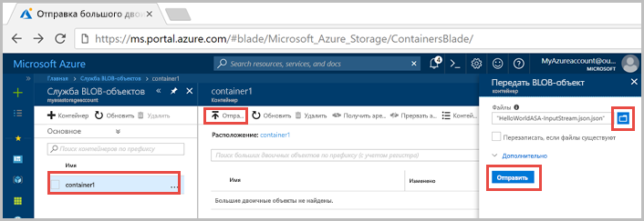
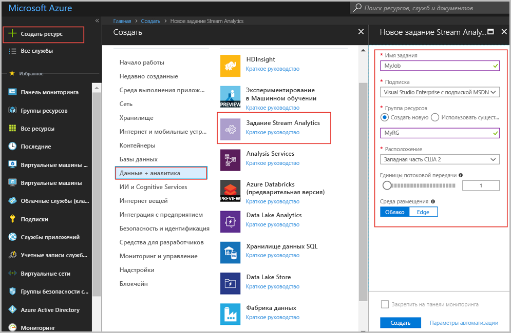
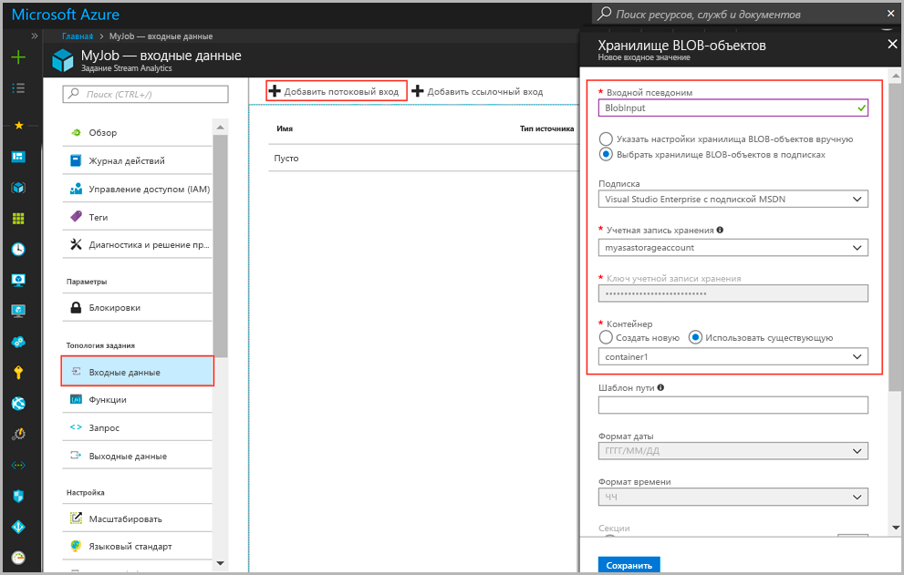
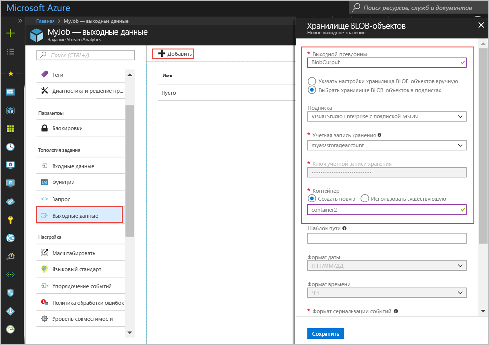
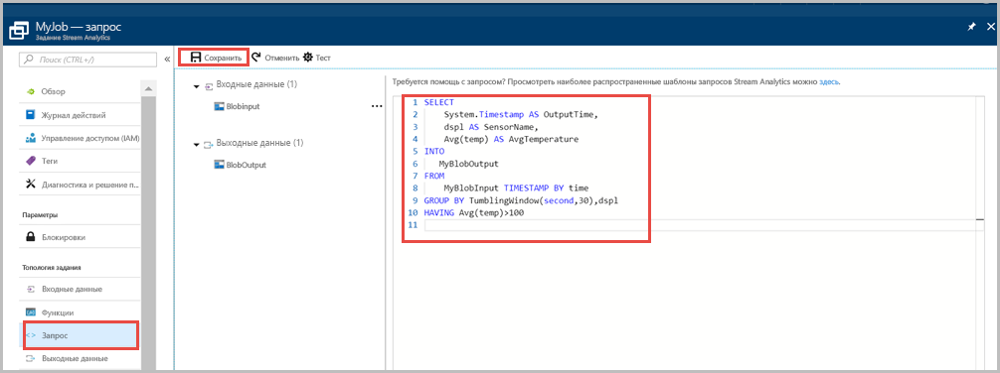
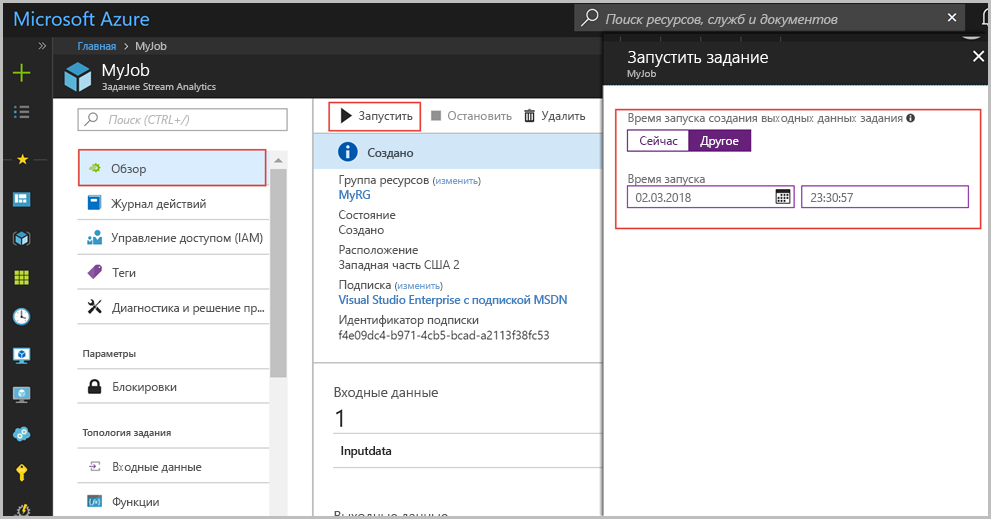
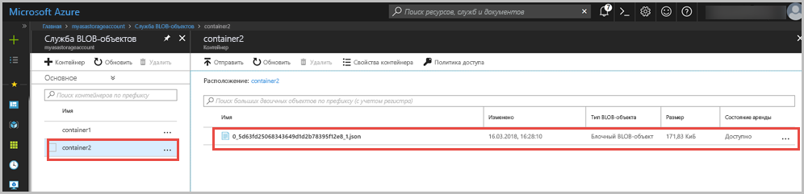

# <a name="quickstart-create-a-stream-analytics-job-by-using-the-azure-portal"></a>Краткое руководство по созданию задания Stream Analytics с помощью портала Azure

В этом кратком руководстве описано, как приступить к созданию заданий Stream Analytics. Здесь вы определите задание Stream Analytics, которое считывает пример данных датчика и фильтрует строки со значениями средней температуры выше 100 каждые 30 секунд. В этой статье описывается чтение данных из хранилища BLOB-объектов, их преобразование и запись обратно в другой контейнер в аналогичном хранилище. Файл входных данных, используемый в этом кратком руководстве, содержит статические данные только для демонстрации. В реальной ситуации используйте потоковые входные данные для задания Stream Analytics.

## <a name="before-you-begin"></a>Перед началом работы

* Если у вас еще нет подписки Azure, создайте [бесплатную учетную запись Azure](https://azure.microsoft.com/free/).

* Войдите на [портале Azure](https://portal.azure.com/).

## <a name="prepare-the-input-data"></a>Подготовка входных данных

Прежде чем определить задание Stream Analytics, необходимо подготовить данные, которые настроены как входные данные задания. Для подготовки входных данных, необходимых для задания, выполните следующие шаги:

1. Загрузите [пример данных датчика](https://raw.githubusercontent.com/Azure/azure-stream-analytics/master/Samples/GettingStarted/HelloWorldASA-InputStream.json) с сайта GitHub. Пример данных содержит данные датчика в следующем формате JSON:  

   ```json
   {
     "time": "2018-01-26T21:18:52.0000000",
     "dspl": "sensorC",
     "temp": 87,
     "hmdt": 44
   }
   ```
2. Войдите на портал Azure.  

3. В верхнем левом углу окна портала Azure выберите **Создать ресурс** > **Хранилище** > **Учетная запись хранения**. На странице задания учетной записи хранения для параметра **Имя** введите значение myasastorageaccount, для параметра **Расположение** — "западная часть США 2", для параметра **Группа ресурсов** — MyRG (для повышения производительности разместите учетную запись хранения в той же группе ресурсов, что и задание потоковой передачи). Для остальных параметров можно оставить значения по умолчанию.  

   

4. На странице **Все ресурсы** найдите учетную запись хранения, созданную на предыдущем шаге. Откройте страницу **Обзор**, а затем щелкните плитку **Большие двоичные объекты**.  

5. На странице **Служба BLOB-объектов** щелкните **Контейнер**, укажите **имя** вашего контейнера, например *container1*, и укажите для параметра **Общедоступный уровень доступа** значение Blob (anonymous read access for blobs only) (Большой двоичный объект (анонимный доступ на чтение только для больших двоичных объектов)), а затем нажмите кнопку **ОК**.  

   

6. Перейдите к контейнеру, созданному на предыдущем шаге. Выберите **Отправить** и отправьте данные датчика, полученные на первом шаге.  

   

## <a name="create-a-stream-analytics-job"></a>Создание задания Stream Analytics

1. Войдите на портал Azure.

2. Щелкните **Создать ресурс** в верхнем левом углу окна портала Azure.  

3. В списке результатов выберите **Данные+аналитика** > **Задание Stream Analytics**.  

4. Заполните страницу задания Stream Analytics такими значениями:

   |**Параметр**  |**Рекомендуемое значение**  |**Описание**  |
   |---------|---------|---------|
   |Имя задания   |  myJob   |   Введите имя для определения задания Stream Analytics. Имя задания Stream Analytics может содержать только буквенно-цифровые символы, дефисы и знаки подчеркивания. Длина должна составлять от 3 до 63 символов. |
   |Подписка  | \<Ваша подписка\> |  Выберите подписку Azure, которую вы хотите использовать для этого задания. |
   |Группа ресурсов   |   myResourceGroup  |   Выберите **Создать** и введите новое имя группы ресурсов для учетной записи. |
   |Расположение  |  \<Выберите ближайший к пользователям регион\> | Выберите географическое местоположение, в котором вы можете разместить задание Stream Analytics. Используйте расположение, наиболее близкое к вашим пользователям, для повышения производительности и снижения стоимости передачи данных. |
   |Единицы потоковой передачи  | 1  |   Единица потоковой передачи предоставляет вычислительные ресурсы, которые необходимы для выполнения задания. По умолчанию установлено значение 1. Чтобы узнать о масштабировании единиц потоковой передачи, ознакомьтесь со статьей [Обзор и настройка единиц потоковой передачи](stream-analytics-streaming-unit-consumption.md).   |
   |Среда размещения  |  Облако  |   Задания Stream Analytics можно развернуть в облаке или на граничных устройствах. Значение "Облако" позволяет выполнять развертывание в облако Azure, а "Edge" — в пограничное устройство Центра Интернета вещей. |

   

5. Установите флажок **Закрепить на панели мониторинга**, чтобы закрепить задание на панели мониторинга, и нажмите кнопку **Создать**.  

6. В правом верхнем углу окна браузера отобразится надпись Deployment in progress... (Идет развертывание...). 

## <a name="configure-input-to-the-job"></a>Настройка входных данных для задания

В этом разделе вы настроите хранилище BLOB-объектов в качестве входных данных задания Stream Analytics. Перед настройкой входных данных создайте учетную запись хранилища BLOB-объектов.  

### <a name="add-the-input"></a>Добавление входных данных 

1. Перейдите в задание Stream Analytics.  

2. Выберите **Входные данные** > **Add Stream input** (Добавить потоковые входные данные)  > **Хранилище BLOB-объектов**.  

3. Заполните страницу **Хранилище BLOB-объектов** следующими значениями:

   |**Параметр**  |**Рекомендуемое значение**  |**Описание**  |
   |---------|---------|---------|
   |Псевдоним входных данных  |  BlobInput   |  Введите имя для определения входных данных задания.   |
   |Подписка   |  \<Ваша подписка\> |  Выберите подписку Azure, в которой создана учетная запись хранения. Учетная запись хранения может находиться в той же или в другой подписке. В этом примере предполагается, что вы создали учетную запись хранения в одной и той же подписке. |
   |Учетная запись хранения  |  myasastorageaccount |  Выберите или введите имя учетной записи хранения. Имена учетных записей автоматически обнаруживаются, если они создаются в одной и той же подписке. |
   |Контейнер  | container1 | Выберите имя контейнера с примером данных. Имена контейнеров автоматически обнаруживаются, если они создаются в одной и той же подписке. |

4. Оставьте значения по умолчанию для других параметров и нажмите кнопку **Сохранить**, чтобы сохранить параметры.  

   
 
## <a name="configure-output-to-the-job"></a>Настройка выходных данных для задания

1. Перейдите к заданию Stream Analytics, которое вы создали ранее.  

2. Щелкните **Выходные данные > Добавить > Хранилище BLOB-объектов**.  

3. Заполните страницу **Хранилище BLOB-объектов** следующими значениями:

   |**Параметр**  |**Рекомендуемое значение**  |**Описание**  |
   |---------|---------|---------|
   |Псевдоним выходных данных |   BlobOutput   |   Введите имя для определения выходных данных задания. |
   |Подписка  |  \<Ваша подписка\>  |  Выберите подписку Azure, в которой создана учетная запись хранения. Учетная запись хранения может находиться в той же или в другой подписке. В этом примере предполагается, что вы создали учетную запись хранения в одной и той же подписке. |
   |Учетная запись хранения |  myasastorageaccount |   Выберите или введите имя учетной записи хранения. Имена учетных записей автоматически обнаруживаются, если они создаются в одной и той же подписке.       |
   |Контейнер |   container2  |  Создайте новый контейнер в той же учетной записи хранения, которую вы использовали для входных данных.   |

4. Оставьте значения по умолчанию для других параметров и нажмите кнопку **Сохранить**, чтобы сохранить параметры.  

   
 
## <a name="define-the-transformation-query"></a>Определение запроса преобразования

1. Перейдите к заданию Stream Analytics, которое вы создали ранее.  

2. Щелкните **Запрос** и обновите запрос следующим образом:  

   ```sql
   SELECT 
   System.Timestamp AS OutputTime,
   dspl AS SensorName,
   Avg(temp) AS AvgTemperature
   INTO
     BlobOutput
   FROM
     BlobInput TIMESTAMP BY time
   GROUP BY TumblingWindow(second,30),dspl
   HAVING Avg(temp)>100
   ```

3. В этом примере запрос считывает данные из большого двоичного объекта и копирует его в новый файл в этом же объекте. Нажмите кнопку **Сохранить**.  

   

## <a name="start-the-stream-analytics-job-and-check-the-output"></a>Запуск задания Stream Analytics и просмотр выходных данных

1. Вернитесь на страницу обзора задания и нажмите кнопку **Запуск**.

2. В колонке **Запуск задания** выберите **Пользовательское** для параметра **времени начала**. Выберите `2018-01-24` в качестве начальной даты, но не изменяйте время. Эта дата начала выбирается, так как она предшествует отметке времени для события из демонстрационных данных. Когда все будет готово, нажмите кнопку **Запуск**.

   

3. Через несколько минут на портале найдите учетную запись хранения и контейнер, который вы настроили в качестве выходных данных для задания. Теперь вы можете увидеть выходной файл в контейнере. Задание запустится через несколько минут и после запуска будет продолжать работать по мере поступления данных.  

   

## <a name="clean-up-resources"></a>Очистка ресурсов

Ставшие ненужными группу ресурсов, задание потоковой передачи и все связанные ресурсы можно удалить. При удалении задания будет прекращена тарификация за единицы потоковой передачи, потребляемые заданием. Если вы планируете использовать это задание в будущем, вы можете остановить и перезапустить его позже. Если вы не собираетесь использовать это задание дальше, удалите все ресурсы, созданные в ходе работы с этим руководством, выполнив следующие шаги:

1. В меню слева на портале Azure выберите **Группы ресурсов**, а затем выберите имя созданного ресурса.  

2. На странице группы ресурсов выберите **Удалить**, в текстовом поле введите имя ресурса для удаления и щелкните **Удалить**.

## <a name="next-steps"></a>Дополнительная информация

В этом кратком руководстве вы развернули простое задание Stream Analytics. Дополнительные сведения о настройке других источников входных данных и обнаружении в режиме реального времени см. в следующей статье:

> [!div class="nextstepaction"]
> [Приступая к работе с Azure Stream Analytics: выявление мошенничества в режиме реального времени](stream-analytics-real-time-fraud-detection.md)

