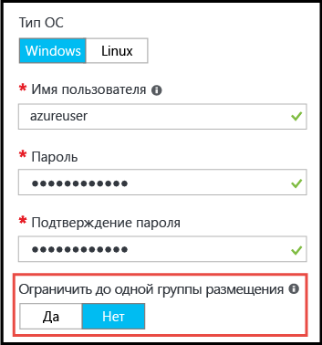

# <a name="working-with-large-virtual-machine-scale-sets"></a>Работа с крупными масштабируемыми наборами виртуальных машин
Теперь вы можете создавать [масштабируемые наборы виртуальных машин](/azure/virtual-machine-scale-sets/) Azure, включающие до 1000 виртуальных машин. В этом документе под _крупным масштабируемым набором виртуальных машин_ подразумевается масштабируемый набор, в который можно добавить более 100 виртуальных машин. Эта возможность задается с помощью свойства масштабируемого набора (_singlePlacementGroup=False_). 

Поведение некоторых компонентов, например балансировки нагрузки и доменов сбоя, в крупных масштабируемых наборах отличается по сравнению со стандартными масштабируемыми наборами. В этом документе рассматриваются особенности крупных масштабируемых наборов и приведены сведения, которые необходимо знать, чтобы успешно использовать эти наборы в приложениях. 

Распространенный метод развертывания облачной инфраструктуры в крупных масштабах — создать набор _единиц масштабирования_, например путем создания нескольких масштабируемых наборов виртуальных машин в нескольких виртуальных сетях и учетных записях хранения. Этот метод обеспечивает более удобное управление, чем при использовании отдельных виртуальных машин. Кроме того, несколько единиц масштабирования полезны для многих приложений, особенно тех, которым требуются другие наращиваемые компоненты, например несколько виртуальных сетей и конечных точек. Однако если приложению требуется один большой кластер, проще развернуть один масштабируемый набор, включающий до 1000 виртуальных машин. К примерам сценариев относятся централизованные развертывания больших данных или сетки вычислений, требующие простого управления крупным пулом рабочих узлов. При использовании [подключенных дисков с данными](virtual-machine-scale-sets-attached-disks.md) крупные масштабируемые наборы позволяют развернуть масштабируемую инфраструктуру, включающую несколько тысяч виртуальных ЦП и петабайты пространства для хранения, в рамках одной операции.

## <a name="placement-groups"></a>Группы размещения 
Главное в _крупном_ масштабируемом наборе не число виртуальных машин, а число содержащихся в нем _групп размещения_. Группа размещения — это конструкция, подобная группе доступности Azure, с собственными доменами сбоя и доменами обновления. По умолчанию масштабируемый набор содержит одну группу размещения максимум со 100 виртуальными машинами. Если для свойства _singlePlacementGroup_ масштабируемого набора задано значение _false_, масштабируемый набор может состоять из нескольких групп размещения и содержать от 0 до 1000 виртуальных машин. Если задано значение _true_ (по умолчанию), масштабируемый набор состоит из одной группы размещения и может содержать от 0 до 100 виртуальных машин.

## <a name="checklist-for-using-large-scale-sets"></a>Контрольный список для использования крупных масштабируемых наборов
Чтобы определить, целесообразно ли использовать для приложения крупные масштабируемые наборы, рассмотрите следующие требования:

- Крупные масштабируемые наборы необходимо создавать с управляемыми дисками Azure. В противном случае для них требуется несколько учетных записей хранения (по одной на каждые 20 виртуальных машин). Крупные масштабируемые наборы предназначены для работы исключительно с управляемыми дисками. Это позволяет снизить расходы на управление хранилищем и избежать риска достичь ограничений подписки для учетных записей хранения. Если не использовать управляемые диски, масштабируемый набор ограничивается 100 виртуальными машинами.
- Масштабируемые наборы, созданные на основе образов Azure Marketplace, можно масштабировать до 1000 виртуальных машин.
- Масштабируемые наборы, созданные на базе пользовательских образов (образов виртуальных машин, которые вы создаете и передаете самостоятельно), сейчас можно масштабировать до 300 виртуальных машин.
- Для масштабируемых наборов, состоящих из нескольких групп, размещения требуется балансировка нагрузки уровня 4 с помощью [Azure Load Balancer с номером SKU "Стандартный"](../load-balancer/load-balancer-standard-overview.md). Подсистема балансировки нагрузки с номером SKU "Стандартный" обеспечивает дополнительные преимущества, включая возможность распределять нагрузку между несколькими масштабируемыми наборами. Для номера SKU "Стандартный" также необходимо, чтобы масштабируемый набор был связан с группой безопасности сети. В противном случае пулы NAT работают неправильно. Если вам необходимо использовать Azure Load Balancer с номером SKU "Базовый", масштабируемый набор должен быть настроен для использования одной группы размещения, что является настройкой по умолчанию.
- Балансировка нагрузки уровня 7 с использованием шлюза приложений Azure не поддерживается для всех масштабируемых наборов.
- Масштабируемый набор определяется с одной подсетью, поэтому она должна иметь достаточное адресное пространство для необходимого числа виртуальных машин. По умолчанию масштабируемый набор выполняет избыточную подготовку (создает дополнительные виртуальные машины, плата за которые не взимается, во время развертывания или при масштабировании) для повышения надежности и производительности развертывания. Настройте адресное пространство так, чтобы оно было на 20 % больше, чем количество виртуальных машин, которые планируете развернуть.
- Если вы планируете развернуть много виртуальных машин, может потребоваться увеличить квоту на виртуальные ЦП.
- Домены сбоя и домены обновления согласованы только в пределах группы размещения. Эта архитектура не влияет на общую доступность масштабируемого набора, потому что виртуальные машины равномерно распределяются между отдельным физическим оборудованием. Однако это означает, что если необходимо гарантировать размещение двух виртуальных машин на разном оборудовании, они должны находиться в разных доменах сбоя в одной группе размещения. Идентификатор домена сбоя и группы размещения можно просмотреть в _представлении экземпляра_ виртуальной машины масштабируемого набора. Представление экземпляра виртуальной машины масштабируемого набора доступно в [обозревателе ресурсов Azure](https://resources.azure.com/).


## <a name="creating-a-large-scale-set"></a>Создание крупного масштабируемого набора
При создании масштабируемого набора на портале Azure можно разрешить использование нескольких групп размещения. Для этого в колонке _Основные сведения_ нужно задать для параметра _Limit to a single placement group_ (Ограничить до одной группы размещения) значение _Нет_. Задав для этого параметра значение _Нет_, для _числа экземпляров_ можно задать до 1000.



Крупный масштабируемый набор виртуальных машин можно создать с помощью команды [Azure CLI](https://github.com/Azure/azure-cli) _az vmss create_. Эта команда задает интеллектуальные значения по умолчанию, такие как размер подсети, на основе аргумента _instance-count_:

```bash
az group create -l southcentralus -n biginfra
az vmss create -g biginfra -n bigvmss --image ubuntults --instance-count 1000
```
Команда _vmss create_ задаст определенные значения конфигурации по умолчанию, если их не указать. Чтобы узнать, какие параметры можно переопределить, используйте следующую команду:
```bash
az vmss create --help
```

Если для создания крупного масштабируемого набора используется шаблон Azure Resource Manager, он должен создавать масштабируемый набор на основе управляемых дисков Azure. Вы можете задать для свойства _singlePlacementGroup_ значение _false_ в разделе _properties_ ресурса _Microsoft.Compute/virtualMAchineScaleSets_. В следующем фрагменте JSON показано начало шаблона масштабируемого набора, включая параметры "capacity": 1000 и _"singlePlacementGroup": false_:
```json
{
  "type": "Microsoft.Compute/virtualMachineScaleSets",
  "location": "australiaeast",
  "name": "bigvmss",
  "sku": {
    "name": "Standard_DS1_v2",
    "tier": "Standard",
    "capacity": 1000
  },
  "properties": {
    "singlePlacementGroup": false,
    "upgradePolicy": {
      "mode": "Automatic"
    }
```
Полный пример шаблона крупного масштабируемого набора доступен по адресу [https://github.com/gbowerman/azure-myriad/blob/master/bigtest/bigbottle.json](https://github.com/gbowerman/azure-myriad/blob/master/bigtest/bigbottle.json).

## <a name="converting-an-existing-scale-set-to-span-multiple-placement-groups"></a>Преобразование существующего масштабируемого набора для поддержки нескольких групп размещения
Чтобы существующий масштабируемый набор виртуальных машин мог масштабироваться до более 100 виртуальных машин, необходимо задать для свойства _singlePlacementGroup_ значение _false_ в модели масштабируемого набора. Вы можете попробовать изменить это свойство в [обозревателе ресурсов Azure](https://resources.azure.com/). Найдите существующий масштабируемый набор, выберите _Изменить_ и измените свойство _singlePlacementGroup_. Если вы не видите это свойство, возможно, вы открыли масштабируемый набор в более старой версии Microsoft.Compute API.

>[!NOTE] 
Масштабируемый набор с поддержкой одной группы размещения (по умолчанию) можно преобразовать в масштабируемый набор с поддержкой нескольких групп размещения, но не наоборот. Поэтому прежде чем выполнять преобразование, разберитесь со свойствами крупных масштабируемых наборов.


