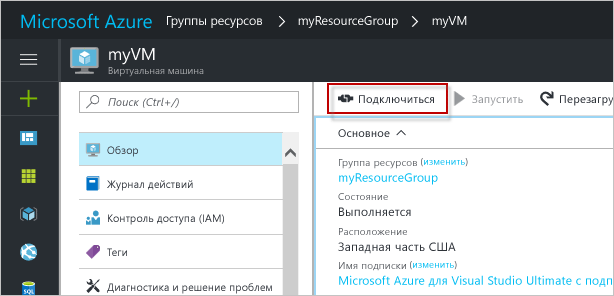

# <a name="create-a-linux-virtual-machine-with-the-azure-portal"></a>Создание виртуальной машины Linux с помощью портала Azure

Виртуальные машины Azure можно создать на портале Azure. В этом случае для создания и настройки виртуальных машин и всех связанных ресурсов Azure используется пользовательский интерфейс на основе браузера. В этом кратком руководстве содержатся пошаговые инструкции по созданию виртуальной машины и установке на ней веб-сервера.

Если у вас еще нет подписки Azure, [создайте бесплатную учетную запись Azure](https://azure.microsoft.com/free/?WT.mc_id=A261C142F), прежде чем начинать работу.

## <a name="create-ssh-key-pair"></a>Создание пары ключей SSH

Для работы с этим руководством по быстрому запуску вам понадобится пара ключей SSH. Если у вас уже есть пара ключей SSH, этот шаг можно пропустить.

Из оболочки Bash выполните следующую команду, а затем следуйте отображаемым на экране инструкциям. Выходные данные команды включают имя файла открытого ключа. Скопируйте содержимое файла открытого ключа (`cat ~/.ssh/id_rsa.pub`) в буфер обмена. Если вы используете подсистему Windows для Linux, убедитесь, что вы не скопировали символы разрыва строки из выходных данных. Запомните имя файла закрытого ключа для дальнейшего использования.

```bash
ssh-keygen -t rsa -b 2048
```

Дополнительные сведения об этом процессе см. [здесь](https://docs.microsoft.com/azure/virtual-machines/linux/mac-create-ssh-keys).

## <a name="log-in-to-azure"></a>Вход в Azure 

Войдите на портал Azure по адресу http://portal.azure.com.

## <a name="create-virtual-machine"></a>Создание виртуальной машины

1. Щелкните **Создать ресурс** в верхнем левом углу окна портала Azure.

2. Выберите **Вычисления**, а затем — **Сервер Ubuntu 16.04 LTS**. 

3. Введите сведения о виртуальной машине. Для параметра **Тип проверки подлинности** выберите значение **Открытый ключ SSH**. При вставке открытого ключа SSH обязательно удалите из него начальные и конечные пробелы. По завершении нажмите кнопку **ОК**.

    

4. Выберите размер виртуальной машины. Чтобы просмотреть дополнительные размеры, выберите **Просмотреть все** или измените фильтр **Supported disk type** (Поддерживаемые типы диска). 

      

5. В разделе **Параметры** оставьте значения по умолчанию и нажмите кнопку **ОК**.

6. На странице сводки нажмите кнопку **OК**, чтобы начать развертывание виртуальной машины.

7. Виртуальная машина будет закреплена на панели мониторинга портала Azure. Когда развертывание завершится, автоматически отобразятся сводные сведения о виртуальной машине.


## <a name="connect-to-virtual-machine"></a>Подключение к виртуальной машине

Создайте SSH-подключение к виртуальной машине.

1. Нажмите кнопку **Подключиться** в свойствах виртуальной машины. Кнопка "Подключение" отображает строку подключения по протоколу SSH, которая может использоваться для подключения к виртуальной машине.

     

2. Чтобы создать сеанс SSH, выполните следующую команду. Замените строку подключения содержимым строки подключения, скопированным на портале Azure.

```bash 
ssh azureuser@40.112.21.50
```

## <a name="install-nginx"></a>Установка nginx

Чтобы обновить источники пакетов и установить последнюю версию пакета nginx, используйте следующий bash-скрипт: 

```bash 
#!/bin/bash

# update package source
sudo apt-get -y update

# install NGINX
sudo apt-get -y install nginx
```

После этого завершите сеанс SSH и вернитесь на страницу свойств виртуальной машины на портале Azure.


## <a name="open-port-80-for-web-traffic"></a>Открытие порта 80 для веб-трафика 

Группа безопасности сети (NSG) защищает входящий и исходящий трафик. При создании виртуальной машины на портале Azure правило для входящего трафика создается через порт 22 для SSH-подключений. Так как на этой виртуальной машине размещается веб-сервер, необходимо создать правило NSG для порта 80.

1. На виртуальной машине щелкните имя **группы ресурсов**.
2. Выберите **группу безопасности сети**. NSG можно определить с помощью столбца **Тип**. 
3. В меню слева в разделе параметров щелкните **Правила безопасности для входящего трафика**.
4. Щелкните **Добавить**.
5. В поле **Имя** введите **http**. Убедитесь, что для параметра **Диапазон исходных портов** задано значение `*`, для параметра **Диапазон портов назначения** — значение *80*, а для параметра **Действие** — значение *Разрешить*. 
6. Последовательно выберите **ОК**.


## <a name="view-the-nginx-welcome-page"></a>Просмотр страницы приветствия nginx

Установив NGINX и открыв порт 80 для виртуальной машины, вы можете получить доступ к веб-серверу через Интернет. Откройте веб-браузер и введите общедоступный IP-адрес виртуальной машины. Общедоступный IP-адрес можно найти в колонке "Свойства виртуальной машины" на портале Azure.

 

## <a name="clean-up-resources"></a>Очистка ресурсов

Ставшие ненужными группу ресурсов, виртуальную машину и все связанные ресурсы можно удалить, выполнив следующую команду. Для этого выберите группу ресурсов для виртуальной машины и нажмите кнопку **Удалить**.

## <a name="next-steps"></a>Дополнительная информация

Из этого краткого руководства вы узнали о том, как развернуть простую виртуальную машину, о правилах группы безопасности сети и об установке веб-сервера. Дополнительные сведения о виртуальных машинах Azure см. в руководстве для виртуальных машин Linux.

> [!div class="nextstepaction"]
> [Создание виртуальных машин Linux и управление ими с помощью Azure CLI](./tutorial-manage-vm.md)
