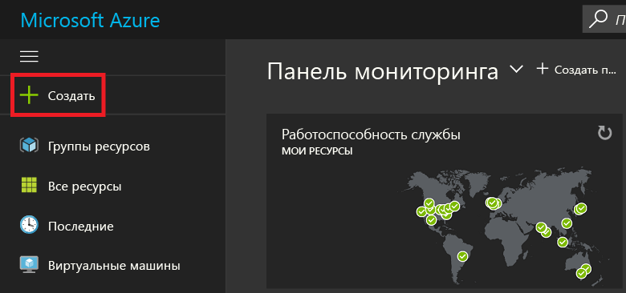
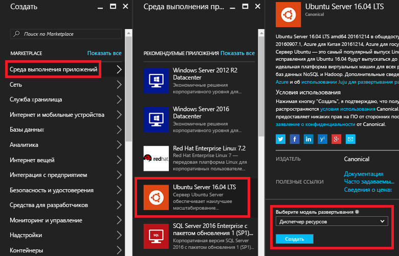
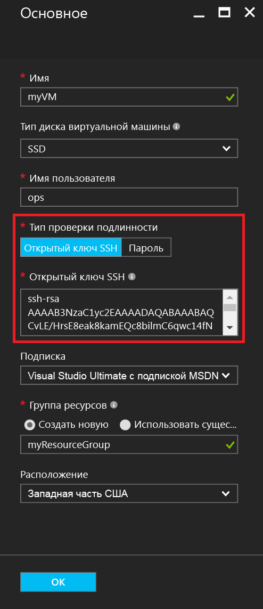
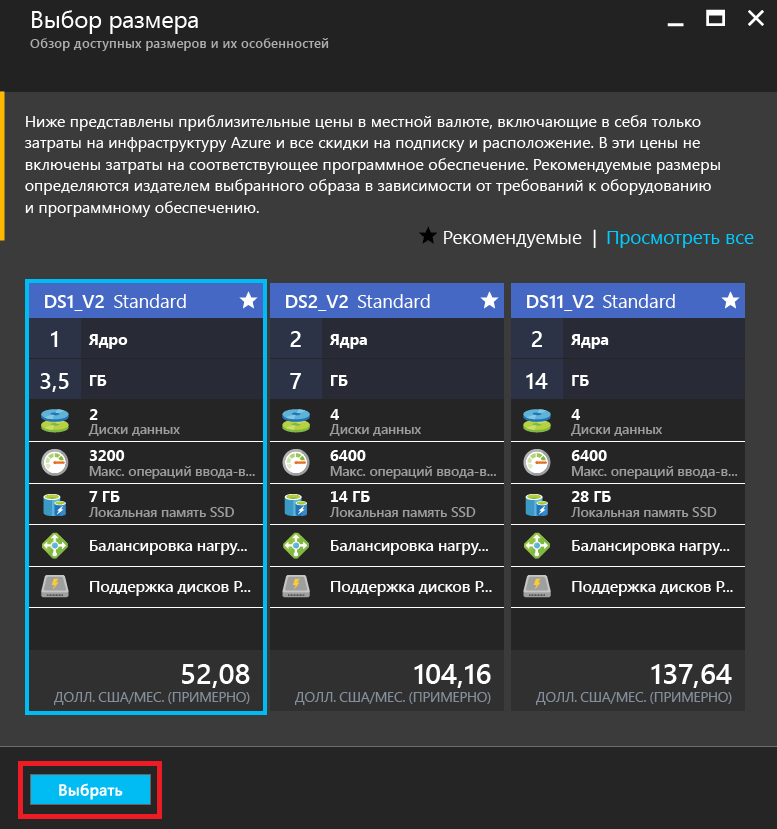
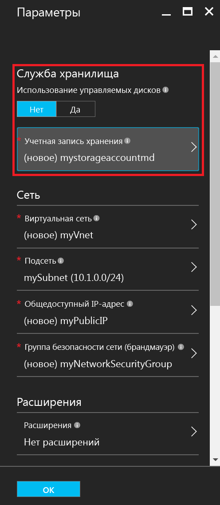
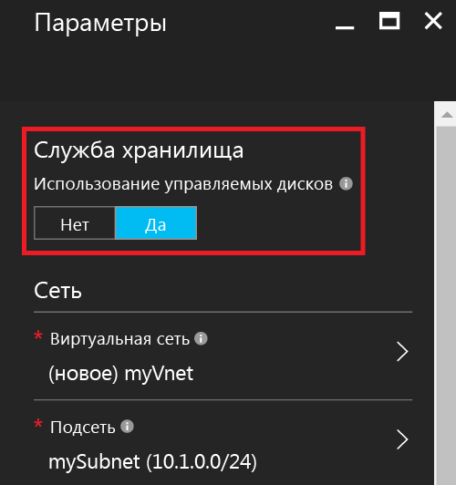
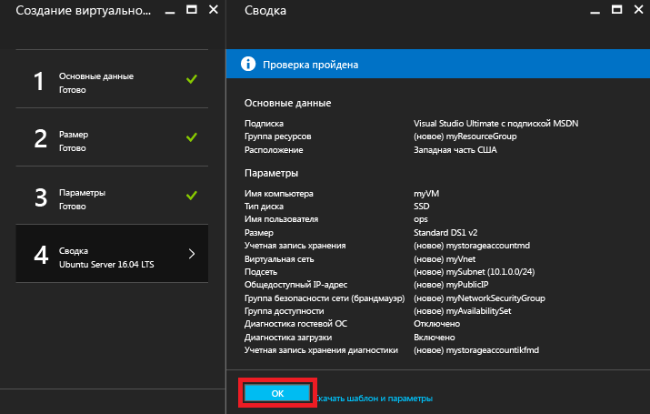
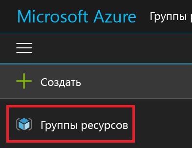
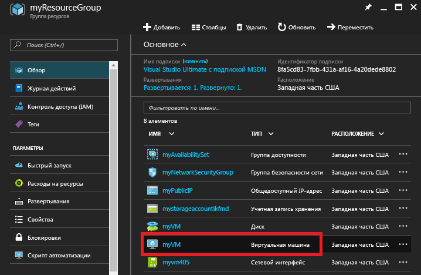
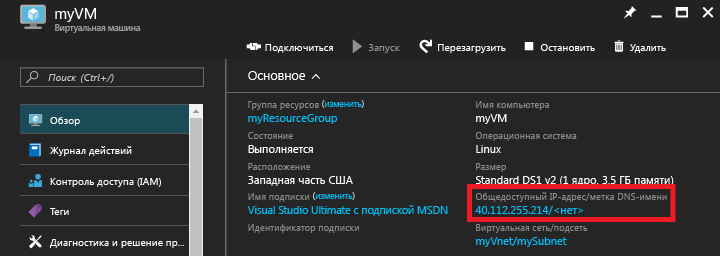

# <a name="create-a-linux-vm-on-azure-using-the-portal"></a>Создание виртуальной машины Linux в Azure с помощью портала
В этой статье показано, как создать виртуальную машину Linux с помощью [портала Azure](https://portal.azure.com/).

Для этого необходимы следующие компоненты:

* [учетная запись Azure](https://azure.microsoft.com/pricing/free-trial/);
* [файлы открытого и закрытого ключа SSH](virtual-machines-linux-mac-create-ssh-keys.md?toc=%2fazure%2fvirtual-machines%2flinux%2ftoc.json).

## <a name="sign-in"></a>Вход
Войдите на портал Azure с помощью удостоверения учетной записи Azure. В верхнем левом углу щелкните **+ Создать**.



## <a name="choose-vm"></a>Выбор виртуальной машины
В разделе **Marketplace** щелкните **Вычисления**, а затем в списке образов **Рекомендуемые приложения** выберите **Ubuntu Server 16.04 LTS** (Сервер Ubuntu 16.04 LTS).  Внизу страницы проверьте модель развертывания (должна быть указана модель `Resource Manager` ) и нажмите кнопку **Создать**.



## <a name="enter-vm-options"></a>Ввод параметров виртуальной машины
На странице **Основные сведения** укажите следующие данные:

* имя виртуальной машины;
* тип диска виртуальной машины (SSD по умолчанию или жесткий диск);
* имя пользователя-администратора;
* в поле **Тип проверки подлинности** выберите **Открытый ключ SSH**;
* открытый ключ SSH в виде строки (строка из каталога `~/.ssh/`);
* имя группы ресурсов (создайте новую или выберите существующую).

Чтобы продолжить, нажмите кнопку **ОК**. Колонка должна выглядеть примерно так, как показано ниже.



## <a name="choose-vm-size"></a>Выбор размера виртуальной машины
Выберите размер виртуальной машины. В примерах ниже используется **DS1_V2 Standard**, устанавливающий Ubuntu на диск SSD категории "Премиум". **S** в размере виртуальной машины обозначает поддержку диска SSD. Щелкните **Выбрать**, чтобы настроить параметры.



## <a name="storage-and-network"></a>Хранилище и сеть
В колонке **Параметры** вы можете выбрать, нужно ли использовать управляемые диски Azure для виртуальной машины. По умолчанию задано использование неуправляемых дисков. Управляемые диски Azure обрабатываются платформой Azure и не требуют подготовки или расположения для хранения. Дополнительные сведения об управляемых дисках Azure см. в [этой статье](../storage/storage-managed-disks-overview.md). При использовании неуправляемых дисков необходимо создать или выбрать учетную запись хранения для виртуальных жестких дисков.



Если вы выберете использование управляемых дисков Azure, дополнительные параметры хранилища не будут отображаться, как видно в примере ниже.



Оставьте значения сетевых параметров по умолчанию.

## <a name="confirm-vm-settings-and-launch"></a>Проверка параметров виртуальной машины и запуск
Проверьте параметры для новой виртуальной машины Ubuntu и нажмите кнопку **ОК**.



## <a name="select-the-vm-resource"></a>Выбор ресурсов виртуальной машины
Откройте домашнюю страницу портала и в левом верхнем углу меню выберите **Группы ресурсов**. При необходимости щелкните три полосы в верхней части меню, чтобы развернуть весь список:



Выберите группу ресурсов, а затем щелкните новую виртуальную машину.



## <a name="find-the-public-ip"></a>Поиск общедоступного IP-адреса
Просмотрите **общедоступный IP-адрес**, присвоенный виртуальной машине.



## <a name="ssh-to-the-vm"></a>Подключение к виртуальной машине по протоколу SSH
Подключитесь к общедоступному IP-адресу по протоколу SSH, используя открытый ключ SSH.  На рабочей станции Mac или Linux можно установить подключение по протоколу SSH прямо из терминала. Если используется рабочая станция Windows, для установки такого подключения к Linux необходимо использовать PuTTY, MobaXTerm или Cygwin.  Ниже приведено практическое руководство, которое поможет вам настроить рабочую станцию Windows для подключения к Linux по протоколу SSH, если вы еще этого не сделали.

[Использование ключей SSH с Windows в Azure](virtual-machines-linux-ssh-from-windows.md?toc=%2fazure%2fvirtual-machines%2flinux%2ftoc.json)

```
ssh -i ~/.ssh/azure_id_rsa ops@40.112.255.214
```

## <a name="next-steps"></a>Дальнейшие действия
Вы быстро создали виртуальную машину Linux для использования в целях тестирования или демонстрации. Чтобы создать виртуальную машину Linux, настроенную для вашей инфраструктуры, выполните инструкции, приведенные в любой из следующих статей:

* [Развертывание виртуальных машин и управление ими с помощью шаблонов Azure Resource Manager и интерфейса командной строки Azure.](virtual-machines-linux-cli-deploy-templates.md?toc=%2fazure%2fvirtual-machines%2flinux%2ftoc.json)
* [Создание защищенной виртуальной машины Linux с помощью шаблона Azure.](virtual-machines-linux-create-ssh-secured-vm-from-template.md?toc=%2fazure%2fvirtual-machines%2flinux%2ftoc.json)
* [Создание виртуальной машины Linux с нуля с помощью Azure CLI.](virtual-machines-linux-create-cli-complete.md?toc=%2fazure%2fvirtual-machines%2flinux%2ftoc.json)


<!--HONumber=Feb17_HO3-->


