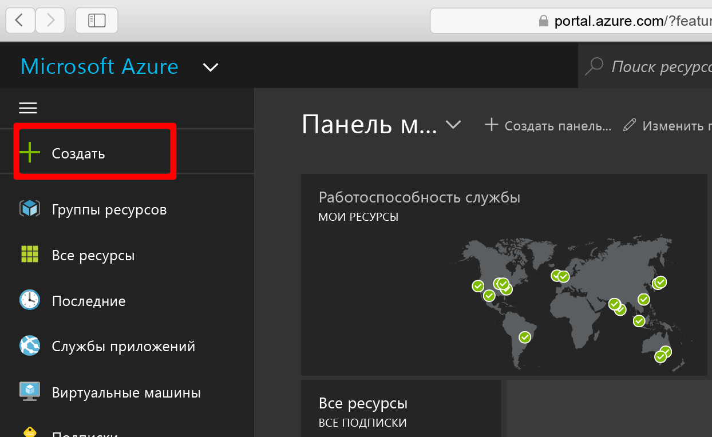
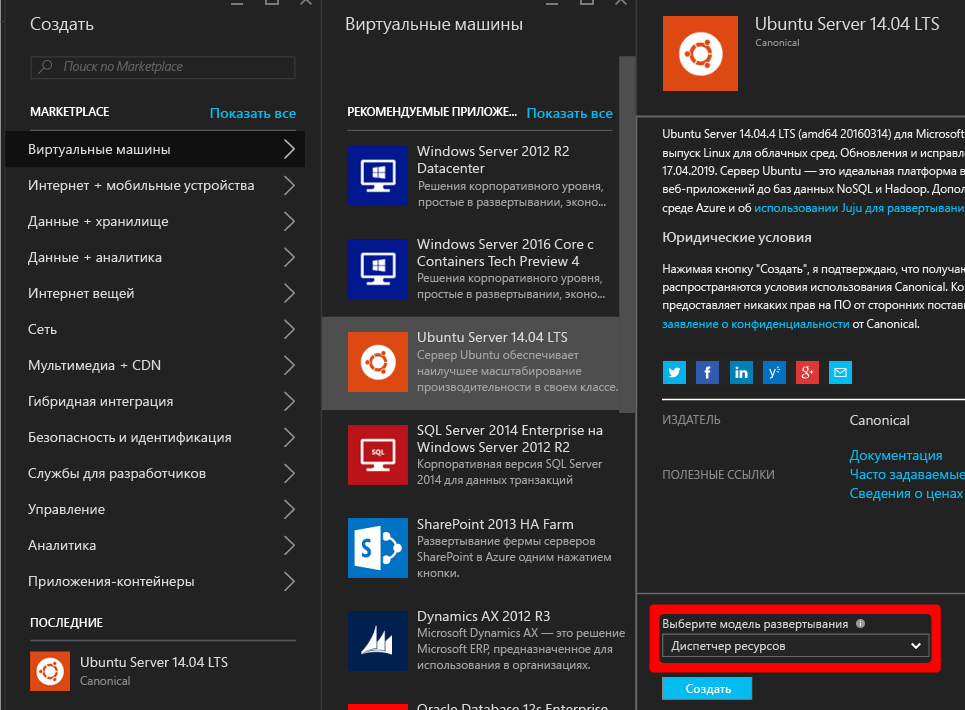
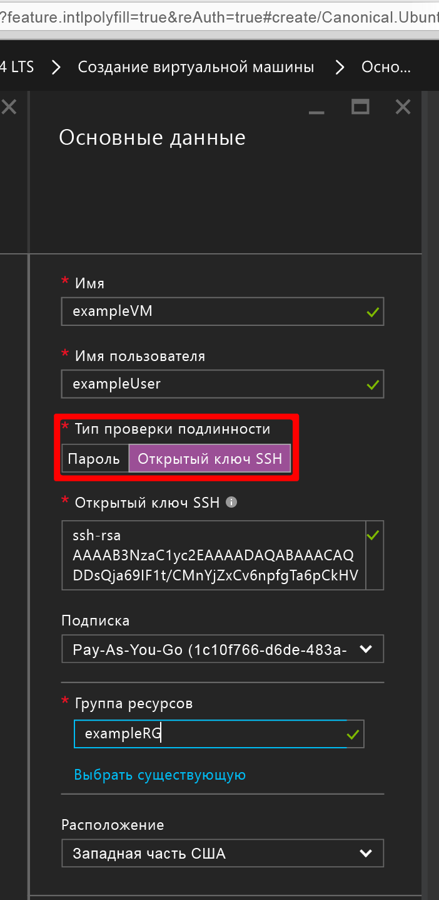
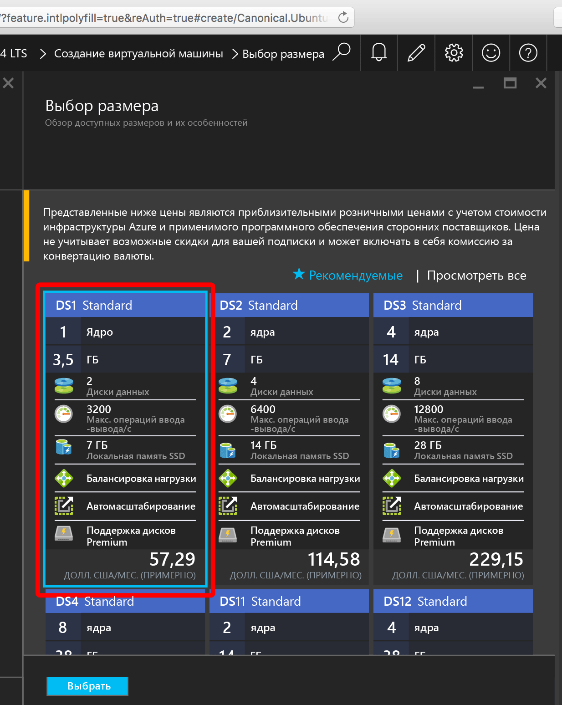
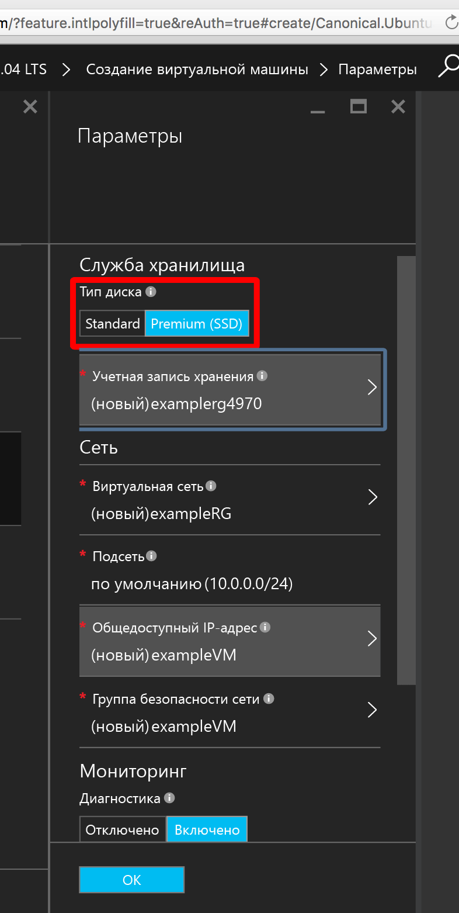
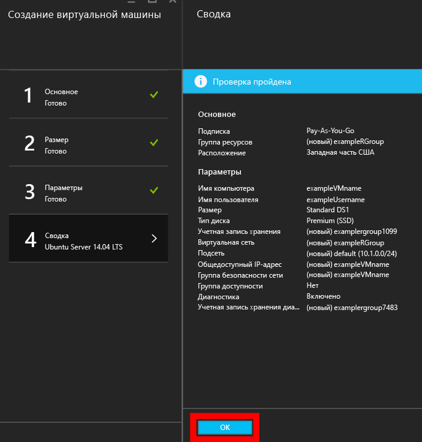
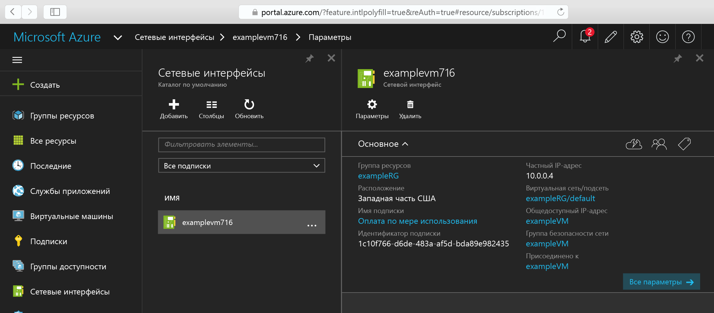
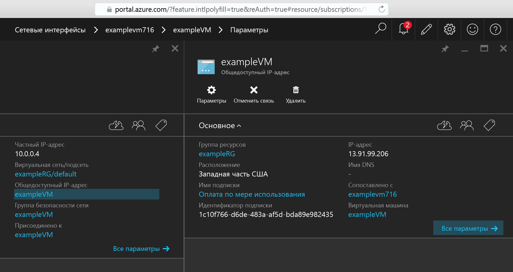

.<properties
    pageTitle="Создание виртуальной машины Linux с помощью портала Azure | Microsoft Azure"
    description="Создание виртуальной машины Linux с помощью портала Azure."
    services="virtual-machines-linux"
    documentationCenter=""
    authors="vlivech"
    manager="timlt"
    editor=""
    tags="azure-resource-manager"
/>

<tags
    ms.service="virtual-machines-linux"
    ms.workload="infrastructure-services"
    ms.tgt_pltfrm="vm-linux"
    ms.devlang="na"
    ms.topic="hero-article"
    ms.date="08/18/2016"
    ms.author="v-livech"
/>

# Создание виртуальной машины Linux в Azure с помощью портала

> [AZURE.NOTE] Если у вас есть несколько минут, помогите нам улучшить качество документации по виртуальным машинам Linux в Azure, поделившись своими впечатлениями в этом [небольшом опросе](https://aka.ms/linuxdocsurvey). Каждый ваш ответ помогает нам совершенствовать средства, необходимые вам для работы.

В этой статье показано, как быстро создать виртуальную машину Linux с помощью [портала Azure](https://portal.azure.com/). Для этого вам понадобится только [учетная запись Azure](https://azure.microsoft.com/pricing/free-trial/) и [файлы открытого и закрытого ключей SSH](virtual-machines-linux-mac-create-ssh-keys.md).


1. Войдя на портал Azure с помощью удостоверения учетной записи Azure, щелкните **+ Создать** в левом верхнем углу.

    

2. В **Marketplace** щелкните элемент **Виртуальные машины**, а затем выберите в списке образов **Рекомендуемые приложения** пункт **Ubuntu Server 14.04 LTS**. Внизу страницы проверьте модель развертывания (должна быть указана модель `Resource Manager`) и нажмите кнопку **Создать**.

    .

3. На странице **Основные сведения** укажите следующие данные:
    - имя виртуальной машины;
    - имя пользователя-администратора;
    - тип проверки подлинности (следует выбрать **Открытый ключ SSH**);
    - открытый ключ SSH в виде строки (строка из каталога `~/.ssh/`);
    - имя группы ресурсов (или выберите существующую).

    Нажмите кнопку **ОК**, чтобы продолжить и выбрать размер виртуальной машины. Вы должны увидеть примерно следующее:

    .

4. Выберите размер **DS1**, чтобы установить Ubuntu на твердотельном накопителе категории "Премиум", а затем нажмите кнопку **Выбрать** для настройки параметров.

    

5. В разделе **Параметры** оставьте настройки по умолчанию для хранилища и сети, а затем нажмите кнопку **ОК**, чтобы просмотреть сводку. Обратите внимание, что при выборе DS1 устанавливается тип диска категории "Премиум". Буква **S** обозначает именно SSD.

    

6. Проверьте параметры для новой виртуальной машины Ubuntu и нажмите кнопку **ОК**.

    .

7. На портале откройте панель мониторинга, а затем в разделе **Сетевые интерфейсы** выберите нужный сетевой адаптер.

    .

8. Откройте меню общедоступных IP-адресов в параметрах сетевого адаптера.

    .

9. Подключитесь к общедоступному IP-адресу по протоколу SSH, используя открытый ключ SSH.

```
ssh -i ~/.ssh/azure_id_rsa ubuntu@13.91.99.206
```

## Дальнейшие действия

Вы быстро создали виртуальную машину Linux для использования в целях тестирования или демонстрации. Чтобы создать виртуальную машину Linux, настроенную для вашей инфраструктуры, выполните инструкции, приведенные в любой из следующих статей:

- [Развертывание виртуальных машин и управление ими с помощью шаблонов Azure Resource Manager и интерфейса командной строки Azure](virtual-machines-linux-cli-deploy-templates.md).
- [Создание защищенной виртуальной машины Linux с помощью шаблона Azure](virtual-machines-linux-create-ssh-secured-vm-from-template.md).
- [Создание виртуальной машины Linux с нуля с помощью Azure CLI.](virtual-machines-linux-create-cli-complete.md)

<!---HONumber=AcomDC_0824_2016-->