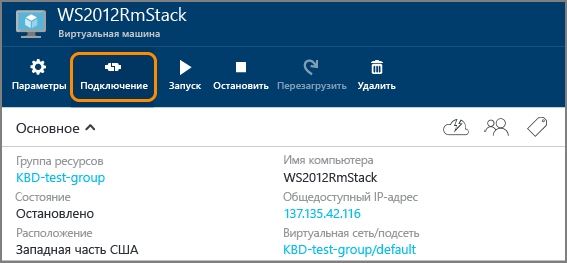

<properties
	pageTitle="Вход в виртуальную машину Windows Server | Microsoft Azure"
	description="Узнайте, как войти в виртуальную машину Windows Server с помощью портала Azure и модели развертывания на основе диспетчера ресурсов."
	services="virtual-machines-windows"
	documentationCenter=""
	authors="cynthn"
	manager="timlt"
	editor="tysonn"
	tags="azure-resource-manager"/>

<tags
	ms.service="virtual-machines-windows"
	ms.workload="infrastructure-services"
	ms.tgt_pltfrm="vm-windows"
	ms.devlang="na"
	ms.topic="get-started-article"
	ms.date="01/21/2016"
	ms.author="cynthn"/>

# Вход в виртуальную машину под управлением Windows Server 

[AZURE.INCLUDE [learn-about-deployment-models](../../includes/learn-about-deployment-models-rm-include.md)] [classic deployment model](virtual-machines-windows-classic-connect-logon.md).

Для запуска сеанса удаленного рабочего стола используйте кнопку **Подключиться** на портале Azure. Сначала вы подключитесь к виртуальной машине, а затем сможете войти в систему.

## Подключение к виртуальной машине

1. Перейдите на [портал Azure](https://portal.azure.com/), если вы еще этого не сделали.

2.	В меню концентратора щелкните **Виртуальные машины**.

3.	Затем выберите виртуальную машину из списка.

4. В колонке виртуальной машины щелкните **Подключить**.

	

## Вход на виртуальную машину

[AZURE.INCLUDE [virtual-machines-log-on-win-server](../../includes/virtual-machines-log-on-win-server.md)]

## Устранение неполадок

Если советы по входу не помогли решить проблему или они вам не подходят, см. статью [Устранение неполадок с подключением к удаленному рабочему столу виртуальной машины Windows в службе Azure](virtual-machines-windows-troubleshoot-rdp-connection.md). В ней описывается процесс диагностики и решения распространенных проблем.

<!----HONumber=AcomDC_0323_2016-->