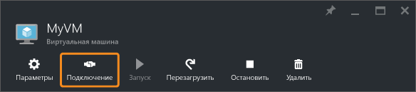

<properties
	pageTitle="Подключение к виртуальной машине Windows Server | Microsoft Azure"
	description="Узнайте, как подключиться к виртуальной машине Windows и войти на нее с помощью портала Azure и модели развертывания Resource Manager."
	services="virtual-machines-windows"
	documentationCenter=""
	authors="cynthn"
	manager="timlt"
	editor="tysonn"
	tags="azure-resource-manager"/>

<tags
	ms.service="virtual-machines-windows"
	ms.workload="infrastructure-services"
	ms.tgt_pltfrm="vm-windows"
	ms.devlang="na"
	ms.topic="get-started-article"
	ms.date="05/05/2016"
	ms.author="cynthn"/>

# Как подключиться к виртуальной машине Azure под управлением Windows и войти на нее 

Чтобы запустить сеанс удаленного рабочего стола, на портале Azure нажмите кнопку **Подключиться**. Сначала вы подключитесь к виртуальной машине, а затем сможете войти на нее.

## Подключение к виртуальной машине

1. Перейдите на [портал Azure](https://portal.azure.com/), если вы еще этого не сделали.

2.	В главном меню щелкните **Виртуальные машины**.

3.	Затем выберите виртуальную машину из списка.

4. В колонке виртуальной машины щелкните **Подключить**.

	

## Вход на виртуальную машину

[AZURE.INCLUDE [virtual-machines-log-on-win-server](../../includes/virtual-machines-log-on-win-server.md)]

## Дальнейшие действия

Если при попытке подключения возникает ошибка, см. статью [Устранение неполадок с подключением к удаленному рабочему столу на виртуальной машине Azure под управлением Windows](virtual-machines-windows-troubleshoot-rdp-connection.md). В ней описывается процесс диагностики и решения распространенных проблем.

<!---HONumber=AcomDC_0511_2016-->