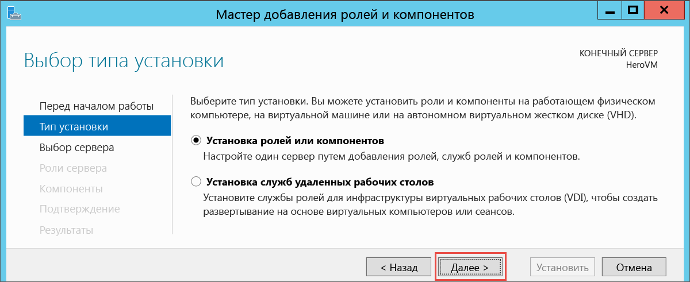
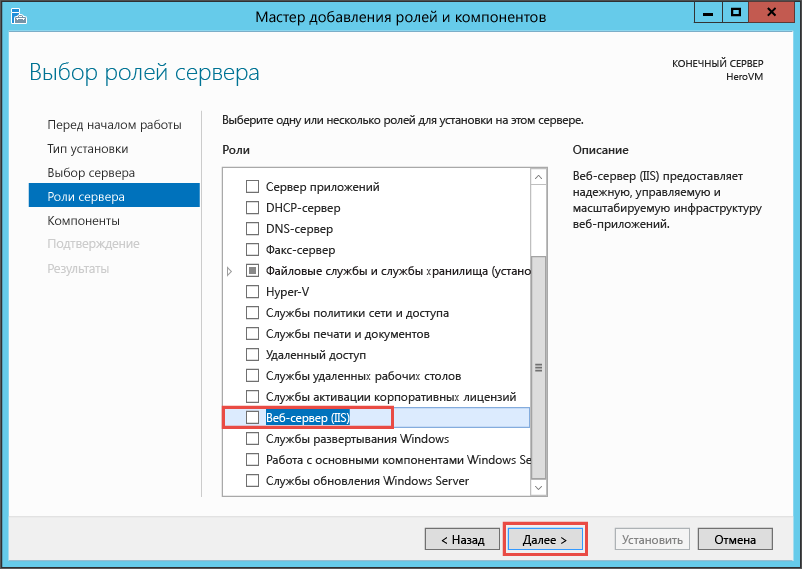
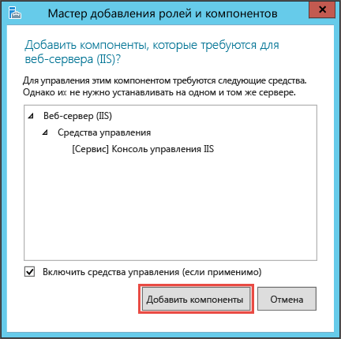
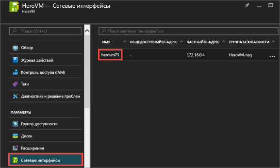
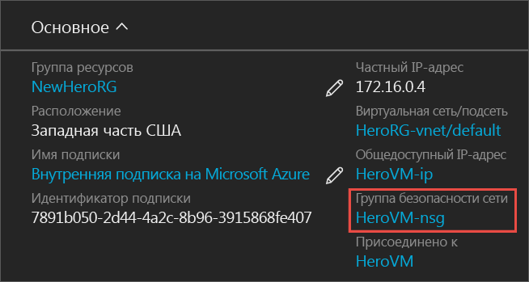
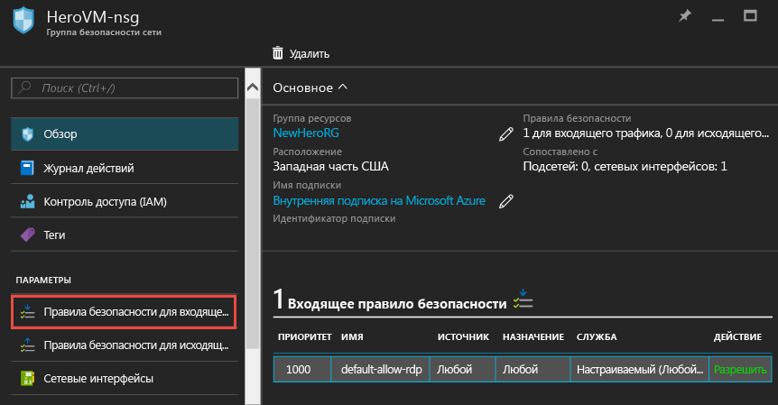
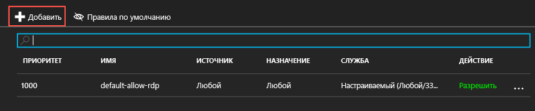
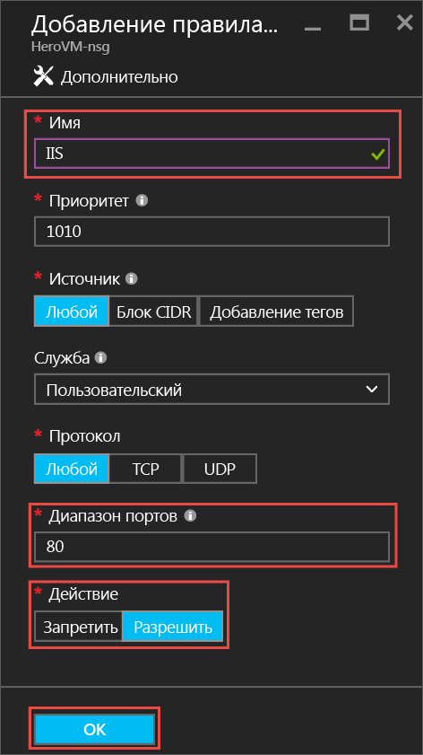
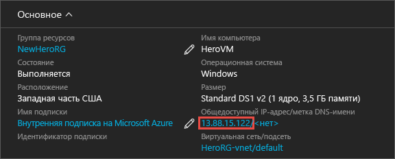
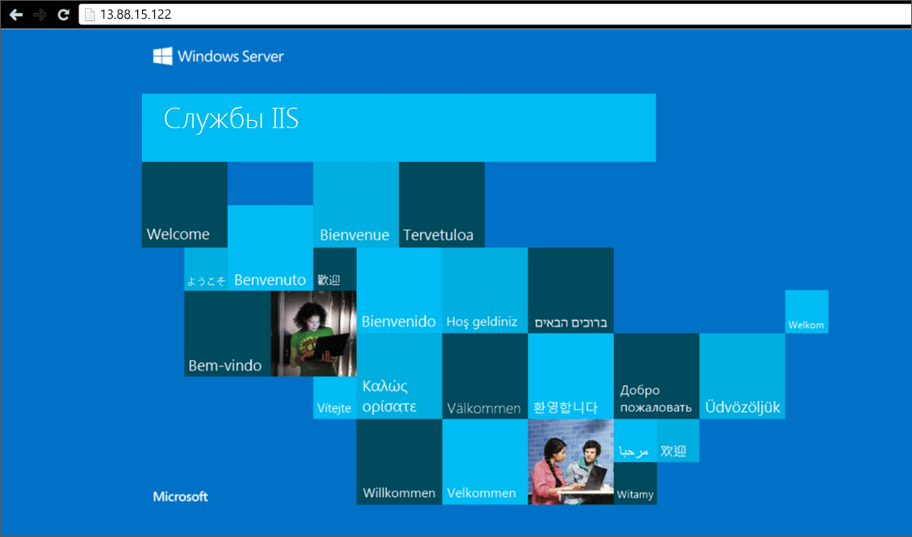

<properties
	pageTitle="Установка IIS на вашу первую виртуальную машину Windows | Microsoft Azure"
	description="Поэкспериментируйте со своей первой виртуальной машиной Windows, установив на нее IIS и открыв порт 80 с помощью портала Azure."
	keywords=""
	services="virtual-machines-windows"
	documentationCenter=""
	authors="cynthn"
	manager="timlt"
	editor=""
	tags="azure-resource-manager"/>
<tags
	ms.service="virtual-machines-windows"
	ms.workload="infrastructure-services"
	ms.tgt_pltfrm="vm-windows"
	ms.devlang="na"
	ms.topic="article"
	ms.date="09/06/2016"
	ms.author="cynthn"/>

# Эксперимент с установкой роли на виртуальной машине Windows
	
После создания и запуска своей первой виртуальной машины можно перейти к установке программного обеспечения и служб. В этом учебнике мы установим службы IIS на виртуальную машину Windows Server с помощью диспетчера сервера. Затем мы создадим группу безопасности сети с помощью портала Azure, чтобы открыть порт 80 для трафика IIS.

Если вы еще не создали свою первую виртуальную машину, то вам следует вернуться к разделу [Создание первой виртуальной машины Windows на портале Azure](virtual-machines-windows-hero-tutorial.md), прежде чем продолжить работу с этим учебником.

## Проверка состояния виртуальной машины

1. Откройте [портал Azure](https://portal.azure.com).
2. В главном меню щелкните **Виртуальные машины**. Затем выберите виртуальную машину из списка.
3. Если состояние — **Остановлена (освобождена)**, то нажмите кнопку "Запустить" в колонке **Основные компоненты** виртуальной машины. Если состояние — **Работает*, то можно перейти к следующему шагу.

## Подключение к виртуальной машине и вход в нее

1.	В главном меню щелкните **Виртуальные машины**. Затем выберите виртуальную машину из списка.

3. В колонке виртуальной машины щелкните **Подключить**. В результате этого будет создан и скачан RDP-файл в виде ярлыка, с помощью которого можно подключиться к компьютеру. Этот файл можно сохранить на рабочем столе для быстрого доступа. **Откройте** этот файл, чтобы подключиться к виртуальной машине.

	

4. Появится предупреждение, что издатель RDP-файла неизвестен. Это нормально. Чтобы продолжить, в окне удаленного рабочего стола нажмите кнопку **Подключить**.

	

5. В окне "Безопасность Windows" введите имя пользователя и пароль локальной учетной записи, созданной при создании виртуальной машины. Введите имя пользователя в формате *имя виртуальной машины*&#92;*имя пользователя*, а затем нажмите кнопку **ОК**.

	
 	
6.	Вы получите предупреждение о том, что сертификат невозможно проверить. Это нормально. Щелкните **Да** для проверки удостоверения виртуальной машины и завершения входа в систему.

	

Если при попытке подключения возникает ошибка, см. сведения в статье [Устранение неполадок с подключением к удаленному рабочему столу на виртуальной машине Azure под управлением Windows](virtual-machines-windows-troubleshoot-rdp-connection.md).

## Установка служб IIS на виртуальной машине

Войдя на виртуальную машину, мы в порядке эксперимента установим роль сервера.

1. Откройте **диспетчер серверов**, если он еще не открыт. Откройте меню **Пуск** и выберите **Диспетчер сервера**.
2. В **диспетчере серверов**, выберите **Локальный сервер** в области слева.
3. В меню выберите **Управление** > **Добавить роли и компоненты**.
4. В мастере добавления ролей и компонентов на странице выбора **типа установки** щелкните **Установка ролей или компонентов** и нажмите кнопку **Далее**.

	

5. Выберите виртуальную машину в пуле серверов и нажмите кнопку **Далее**.
6. На странице **Роли сервера** выберите **Веб-сервер (IIS)**.

	

7. Во всплывающем окне добавления компонентов, необходимых для IIS, установите флажок **Включить средства управления**, а затем щелкните **Добавить компоненты**. Закрыв всплывающее окно, нажмите кнопку **Далее** в мастере.

	

8. На странице компонентов щелкните **Далее**.
9. На странице **Роль веб-сервера (IIS)** щелкните **Далее**.
10. На странице **Службы ролей** щелкните **Далее**.
11. На странице **подтверждения** нажмите кнопку **Установить**.
12. После завершения установки нажмите кнопку **Закрыть** в мастере.

## Открытие порта 80 

Чтобы виртуальная машина могла принимать входящий трафик через порт 80, в группу безопасности сети необходимо добавить правило для входящего трафика.

1. Откройте [портал Azure](https://portal.azure.com).
2. В разделе **Виртуальные машины** выберите созданную виртуальную машину.
3. В разделе параметров виртуальных машин выберите **Сетевые интерфейсы**, а затем выберите существующий сетевой интерфейс.

	

4. В разделе **Основные компоненты** для сетевого интерфейса щелкните **Группа безопасности сети**.

	

5. В колонке **Основные компоненты** для группы безопасности сети должно быть указано одно существующее правило по умолчанию для входящего трафика **default-allow-rdp**, разрешающее вход на виртуальную машину. Добавьте еще одно правило для входящего трафика, разрешающее трафик IIS. Щелкните **Правило безопасности для входящего трафика**.

	

6. В разделе **Правила безопасности для входящего трафика** щелкните **Добавить**.

	

7. В разделе **Правила безопасности для входящего трафика** щелкните **Добавить**. Введите **80** в поле "Диапазон портов" и убедитесь, что установлен переключатель **Разрешить**. Когда все будет готово, нажмите кнопку **ОК**.

	
 
Дополнительные сведения о группах безопасности сети, а также о правилах для входящего и исходящего трафика см. в статье [Разрешение внешнего доступа к виртуальной машине с помощью портала Azure](virtual-machines-windows-nsg-quickstart-portal.md).
 
## Подключение к веб-сайту IIS по умолчанию

1. На портале Azure щелкните **Виртуальные машины** и выберите нужную виртуальную машину.
2. В колонке **Основные компоненты** скопируйте **общедоступный IP-адрес**.

	

2. Откройте браузер, введите в адресную строку общедоступный IP-адрес в формате http://<общедоступный\_IP-адрес> и нажмите клавишу **ВВОД**, чтобы перейти к этому адресу.
3. В браузере должна открыться веб-страница службы IIS по умолчанию. Она имеет следующий вид.

	
	
	
	## Дальнейшие действия

- Вы также можете попробовать [подключить диск данных](virtual-machines-windows-attach-disk-portal.md) к виртуальной машине. Диски данных предоставляют дополнительное хранилище для виртуальной машины.

<!---HONumber=AcomDC_0907_2016-->