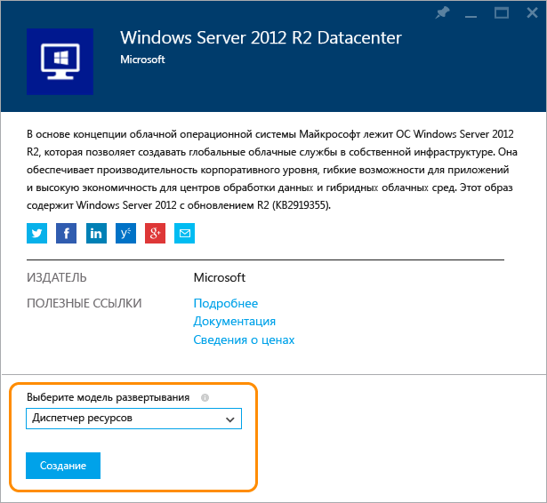
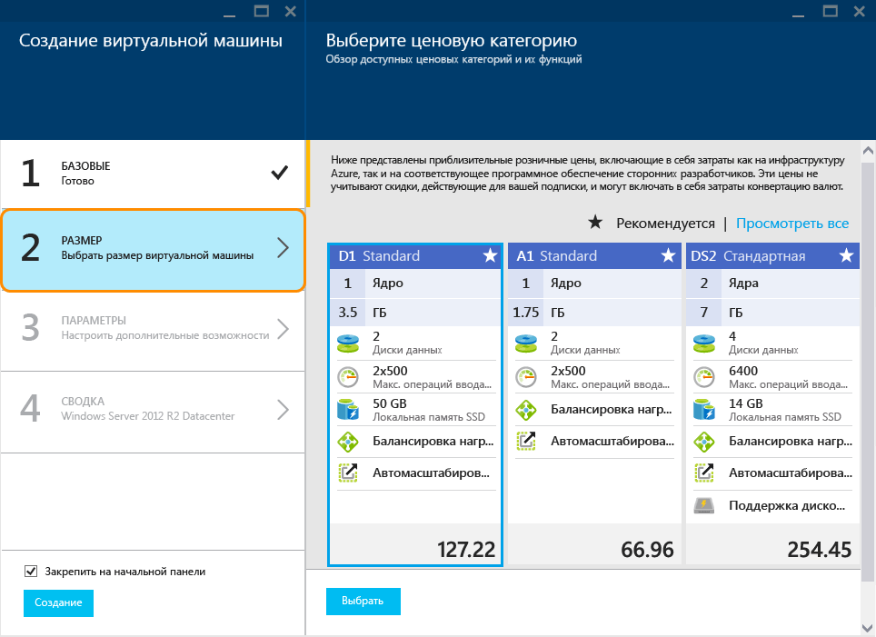
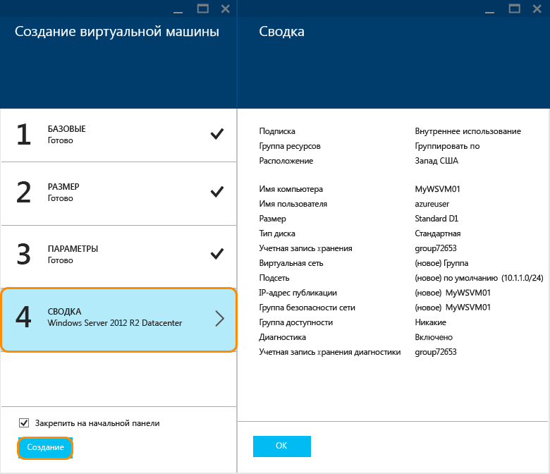
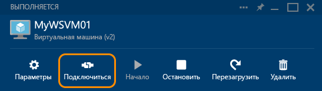

<properties
	pageTitle="Создание виртуальной машины Windows на портале Azure | Microsoft Azure"
	description="Узнайте, как на портале Azure с помощью Azure Marketplace создать виртуальную машину (виртуальный компьютер) Windows."
	keywords="виртуальная машина Windows, создать виртуальную машину, виртуальный компьютер, настроить виртуальную машину"
	services="virtual-machines-windows"
	documentationCenter=""
	authors="cynthn"
	manager="timlt"
	editor=""
	tags="azure-resource-manager"/>
<tags
	ms.service="virtual-machines-windows"
	ms.workload="infrastructure-services"
	ms.tgt_pltfrm="vm-windows"
	ms.devlang="na"
	ms.topic="hero-article"
	ms.date="03/11/2016"
	ms.author="cynthn"/>

# Создание виртуальной машины Windows на портале Azure#

> [AZURE.SELECTOR]
- [Портал](virtual-machines-windows-hero-tutorial.md)
- [PowerShell](virtual-machines-windows-create-powershell.md)
- [Шаблон](virtual-machines-windows-ps-template.md)

В этом руководстве мы покажем, как на портале Azure всего за несколько минут можно создать виртуальную машину Windows. В качестве примера мы создадим виртуальную машину с помощью образа Windows Server 2012 R2 Datacenter, но это лишь один из многих образов, предлагаемых в Azure. Доступность образов зависит от подписки. Например, подписчикам MSDN могут быть доступны образы рабочих столов.

[AZURE.INCLUDE [free-trial-note](../../includes/free-trial-note.md)] 

[AZURE.INCLUDE [learn-about-deployment-models](../../includes/learn-about-deployment-models-rm-include.md)] [classic deployment model](virtual-machines-windows-classic-createportal.md).

## Видеоруководство

Ниже приведено пошаговое описание этого учебника.

[AZURE.VIDEO create-a-virtual-machine-running-windows-in-the-azure-preview-portal]
 

>[AZURE.TIP] Если при работе на портале вы хотите, чтобы виртуальная машина входила в группу доступности, создайте группу доступности до или во время создания первой виртуальной машины в группе. Дополнительную информацию о создании и использовании групп доступности см. в статье [Управление доступностью виртуальных машин](virtual-machines-windows-manage-availability.md).

## Выбор образа виртуальной машины Windows

1. Войдите на портал Azure.

2. В меню концентратора щелкните элементы **Создать** > **Вычисления** > **Windows Server 2012 R2 Datacenter**.

	

	>[AZURE.TIP] Чтобы найти дополнительные образы, щелкните **Marketplace**, а затем выполните поиск среди доступных элементов или отфильтруйте их.

3. На странице **Windows Server 2012 R2 Datacenter** в разделе **Выбор модели развертывания** щелкните **Диспетчер ресурсов**. Щелкните **Создать**.

	

## Создание виртуальной машины Windows

Выбрав образ, можно оставить значения, используемые Azure по умолчанию, для большей части параметров в конфигурации и быстро создать виртуальную машину.

1. В колонке **Создание виртуальной машины** щелкните **Основные сведения**.

2. Введите **имя**, которые вы хотите присвоить виртуальной машине. Это имя не должно содержать специальных символов.

3. Введите **имя пользователя** администратора и задайте для него надежный **пароль**. Пароль должен иметь длину от 8 до 123 символов и содержать по крайней мере три символа из следующих типов: одна строчная буква, одна заглавная буква, одно число и один специальный символ. **Имя пользователя и пароль понадобятся для входа на виртуальную машину**.

4. Если вы используете несколько подписок, укажите одну из них для новой виртуальной машины, а также новую или существующую **группу ресурсов** и **расположение** центра обработки данных Azure.

	

	
2. Щелкните элемент **Размер** и укажите необходимый размер виртуальной машины. Каждому размеру соответствуют определенные количество вычислительных ядер, объем памяти и другие функции, например поддержка хранилища класса Premium, что влияет на цену. В зависимости от выбранного образа Azure автоматически рекомендует определенные размеры.

	

	>[AZURE.NOTE] Хранилище класса Premium доступно для виртуальных машин серии DS в определенных регионах. Хранилище класса Premium — наилучший вариант хранения данных для рабочих нагрузок с интенсивным обменом данными, например для базы данных. Дополнительные сведения см. в статье [Хранилище Premium: хранилище высокой производительности для рабочих нагрузок виртуальных машин Azure](../storage/storage-premium-storage.md).

3. Щелкните **Параметры**, чтобы отобразить параметры хранилища и сети для новой виртуальной машины. Для первой виртуальной машины можно в целом принять значения параметров по умолчанию. Если вы выбрали размер виртуальной машины, который поддерживает хранилище класса Premium, можно опробовать его, выбрав значение **Premium (SSD)** для параметра **Тип диска**.

	

6. Щелкните **Сводка**, чтобы отобразить выбранные вами значения параметров. Закончив просмотр или обновление параметров, нажмите кнопку **Создать**.

	

8. Процесс создания виртуальной машины в Azure можно отслеживать в разделе **Виртуальные машины** в меню концентратора.

## Вход в виртуальную машину Windows

После создания виртуальной машины необходимо войти в систему, чтобы управлять ее параметрами и приложениями, которые будут выполняться в ней.

>[AZURE.NOTE] Информацию о требованиях и устранении неполадок см. в разделе [Подключение к виртуальной машине Azure по RDP или SSH](https://msdn.microsoft.com/library/azure/dn535788.aspx).

1. Войдите на портал Azure, если вы еще этого не сделали.

2. Выберите виртуальную машину на панели мониторинга или щелкните "Виртуальные машины" и выберите ее из списка.

3. В колонке виртуальной машины щелкните **Подключить**.

	

4. Нажмите кнопку **Открыть**, чтобы использовать файл протокола удаленного рабочего стола, автоматически созданный для виртуальной машины Windows Server.

5. Щелкните **Подключить**.

6. Введите имя пользователя и пароль, указанные при создании виртуальной машины, и нажмите кнопку **ОК**.

7. Щелкните **Да** для проверки удостоверения виртуальной машины.

Теперь вы сможете работать с виртуальной машиной так же, как и с любым сервером.

## Дальнейшие действия

* Использование Azure PowerShell и интерфейса командной строки Azure для [поиска и выбора образов виртуальных машин](virtual-machines-linux-cli-ps-findimage.md).
* Автоматизация развертывания виртуальных машин и рабочих нагрузок, а также управления ими с помощью [шаблонов Azure Resource Manager](https://azure.microsoft.com/documentation/templates/).
* Вы также можете быстро [создать виртуальную машину Linux](virtual-machines-linux-quick-create-cli.md) с помощью интерфейса командной строки Azure.

<!---HONumber=AcomDC_0413_2016-->