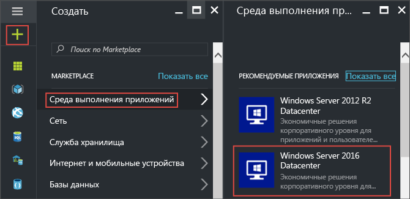
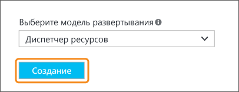
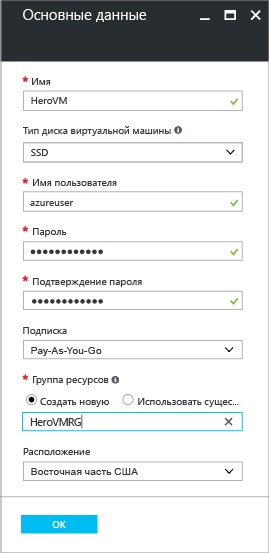
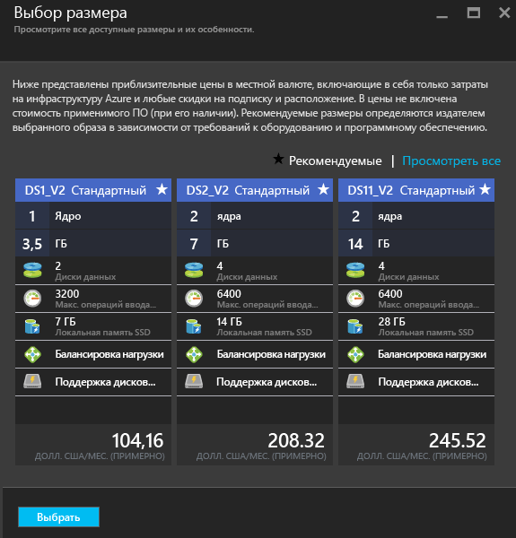
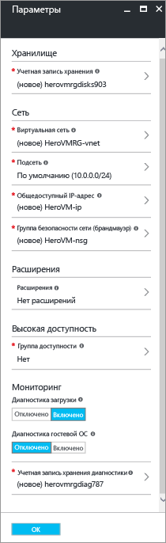
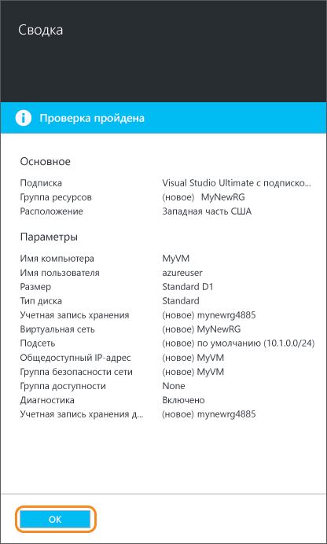
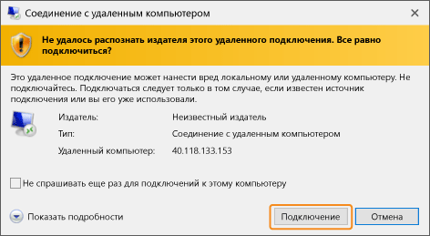
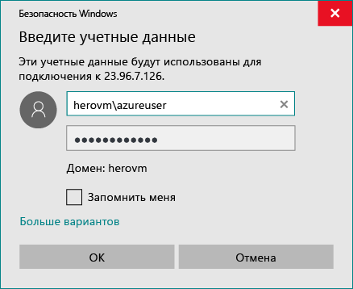
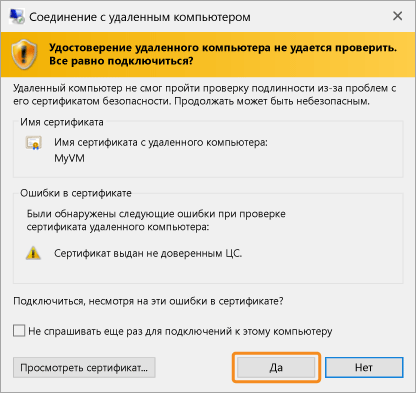
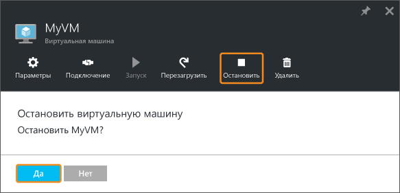

<properties
	pageTitle="Создание первой виртуальной машины Windows | Microsoft Azure"
	description="Узнайте, как создать первую виртуальную машину Windows с помощью портала Azure."
	keywords="виртуальная машина Windows, создать виртуальную машину, виртуальный компьютер, настроить виртуальную машину"
	services="virtual-machines-windows"
	documentationCenter=""
	authors="cynthn"
	manager="timlt"
	editor=""
	tags="azure-resource-manager"/>
<tags
	ms.service="virtual-machines-windows"
	ms.workload="infrastructure-services"
	ms.tgt_pltfrm="vm-windows"
	ms.devlang="na"
	ms.topic="hero-article"
	ms.date="09/06/2016"
	ms.author="cynthn"/>

# Создание первой виртуальной машины Windows на портале Azure

В этом руководстве мы покажем, как на портале Azure всего за несколько минут можно создать виртуальную машину Windows.

Если у вас еще нет подписки Azure, [создайте бесплатную учетную запись Azure](https://azure.microsoft.com/free/), прежде чем начинать работу.

## Выбор образа виртуальной машины из Marketplace

Мы будем использовать в качестве примера образ Windows Server 2012 R2 Datacenter — один из многих образов, доступных в Azure. Доступность образов зависит от подписки. Например, [подписчикам MSDN](https://azure.microsoft.com/pricing/member-offers/msdn-benefits-details/?WT.mc_id=A261C142F) могут быть доступны некоторые образы для настольных компьютеров.

1. Выполните вход на [портал Azure](https://portal.azure.com).

2. В главном меню последовательно выберите **Создать** > **Виртуальные машины** > **Windows Server 2012 R2 Datacenter**.

	

3. В колонке **Windows Server 2012 R2 Datacenter** в раскрывающемся списке **Выбор модели развертывания** выберите **Resource Manager**. Щелкните **Создать**.

	

## Создание виртуальной машины Windows

Выбрав образ, можно оставить значения, используемые по умолчанию, и быстро создать виртуальную машину.

1. В колонке **Основные сведения** в поле **Имя** введите имя виртуальной машины. Оно должно содержать от 1 до 15 знаков и не может включать специальные знаки.

2. Введите в соответствующих полях **имя пользователя** и надежный **пароль**, который будет использоваться для создания локальной учетной записи на виртуальной машине. Локальная учетная запись используется для входа на виртуальную машину и управления ею.

	Пароль должен содержать от 8 до 123 символов и включать по меньшей мере три из следующих символов: одна строчная буква, одна прописная буква, одна цифра и один специальный символ. См. дополнительную информацию о [требованиях к имени пользователя и паролю](virtual-machines-windows-faq.md#what-are-the-username-requirements-when-creating-a-vm).

3. Выберите существующую [группу ресурсов](../resource-group-overview.md#resource-groups) или введите имя, чтобы создать новую. В раскрывающемся списке **Расположение** выберите расположение центра данных Azure, например **западная часть США**.

4. После этого нажмите кнопку **ОК**, чтобы перейти к следующему разделу.

	

	
5. Выберите [размер](virtual-machines-windows-sizes.md) виртуальной машины и нажмите кнопку **Выбрать**, чтобы продолжить.

	

6. В колонке **Параметры** можно изменить параметры сети и хранилища. Для работы с этим руководством можно принять значения по умолчанию. Если вы выбрали размер виртуальной машины, который поддерживает хранилище Azure класса Premium, можно опробовать его, выбрав значение **Premium (SSD)** для параметра **Тип диска**. После внесения изменений нажмите кнопку **ОК**.

	

7. Щелкните **Сводка**, чтобы просмотреть выбранные значения. При появлении сообщения **Проверка пройдена** нажмите кнопку **ОК**.

	

8. Процесс создания виртуальной машины в Azure можно отслеживать в разделе **Виртуальные машины**, выбрав его в главном меню.

## Подключение к виртуальной машине и вход

1.	В главном меню щелкните **Виртуальные машины**.

2.	Затем выберите виртуальную машину из списка.

3. В колонке виртуальной машины щелкните **Подключить**. В результате этого будет создан и скачан RDP-файл в виде ярлыка, с помощью которого можно подключиться к компьютеру. Этот файл можно сохранить на рабочем столе для быстрого доступа. **Откройте** этот файл, чтобы подключиться к виртуальной машине.

	

4. Появится предупреждение, что издатель RDP-файла неизвестен. Это нормально. Чтобы продолжить, в окне удаленного рабочего стола нажмите кнопку **Подключить**.

	

5. В окне "Безопасность Windows" введите имя пользователя и пароль локальной учетной записи, созданной при создании виртуальной машины. Введите имя пользователя в формате *имя виртуальной машины*&#92;*имя пользователя*, а затем нажмите кнопку **ОК**.

	
 	
6.	Вы получите предупреждение о том, что сертификат невозможно проверить. Это нормально. Щелкните **Да** для проверки удостоверения виртуальной машины и завершения входа в систему.

	

Если при попытке подключения возникает ошибка, см. сведения в статье [Устранение неполадок с подключением к удаленному рабочему столу на виртуальной машине Azure под управлением Windows](virtual-machines-windows-troubleshoot-rdp-connection.md).

Теперь вы сможете работать с виртуальной машиной так же, как и с любым сервером.

## (Необязательно) Остановка виртуальной машины

Рекомендуется остановить виртуальную машину, чтобы с вас не взималась плата, когда вы фактически ее не используете. Просто щелкните **Прервать** и нажмите кнопку **Да**.

	
Чтобы перезапустить виртуальную машину для повторного использования, нажмите кнопку **Запустить**.

## Дальнейшие действия

- Вы можете поэкспериментировать с новой виртуальной машиной, [установив IIS](virtual-machines-windows-hero-role.md). В этом руководстве также показано, как открыть порт 80 для входящего веб-трафика с помощью группы безопасности сети (NSG).

- Вы также можете [создать виртуальную машину Windows с помощью PowerShell](virtual-machines-windows-ps-create.md) или [виртуальную машину Linux](virtual-machines-linux-quick-create-cli.md) с помощью интерфейса командной строки Azure.

- Если вас интересует автоматизация развертываний, см. статью [Создание виртуальной машины Windows с использованием шаблона Resource Manager](virtual-machines-windows-ps-template.md).

<!---HONumber=AcomDC_0912_2016---->