<properties
	pageTitle="Подготовка виртуальной машины SQL Server | Microsoft Azure"
	description="Создание и подключение к виртуальной машине SQL Server с помощью портала Azure. В этом руководстве используется модель Resource Manager."
	services="virtual-machines-windows"
	documentationCenter="na"
	authors="rothja"
	editor=""
	manager="jhubbard"
	tags="azure-resource-manager" />
<tags
	ms.service="virtual-machines-windows"
	ms.devlang="na"
	ms.topic="hero-article"
	ms.tgt_pltfrm="vm-windows-sql-server"
	ms.workload="infrastructure-services"
	ms.date="05/06/2016"
	ms.author="jroth" />

# Подготовка виртуальной машины SQL Server на портале Azure

> [AZURE.SELECTOR]
- [Портал](virtual-machines-windows-portal-sql-server-provision.md)
- [PowerShell](virtual-machines-windows-ps-sql-create.md)

В этом комплексном руководстве показано, как подготовить виртуальную машину SQL Server на портале Azure.

[AZURE.INCLUDE [learn-about-deployment-models](../../includes/learn-about-deployment-models-rm-include.md)]Классическая модель развертывания.

Коллекция виртуальных машин (VM) в Azure включает в себя несколько образов, содержащих Microsoft SQL Server. Всего за несколько действий вы можете выбрать один из образов виртуальной машины SQL из коллекции и подготовить ее в среде Azure.

Изучив данный учебник, вы научитесь:

- [выбирать образ виртуальной машины из коллекции](#select-a-sql-vm-image-from-the-gallery);
- [настраивать и создавать виртуальные машины](#configure-the-vm);
- [открывать виртуальные машины с помощью удаленного рабочего стола](#open-the-vm-with-remote-desktop);
- [удаленно подключаться к SQL Server](#connect-to-sql-server-remotely);

## Выбор образа виртуальной машины из коллекции

1. Войдите на [портал Azure](https://portal.azure.com), используя свою учетную запись.

	>[AZURE.NOTE] Если у вас нет учетной записи Azure, используйте [бесплатную пробную версию Azure](https://azure.microsoft.com/pricing/free-trial/).

1. На портале Azure нажмите кнопку **Создать**. Откроется колонка **Создать**. Ресурсы виртуальной машины SQL Server находятся в магазине Marketplace в группе **Виртуальные машины**.

1. В колонке **Создать** щелкните элемент **Виртуальные машины**.
1. Чтобы просмотреть все доступные образы, в колонке **Виртуальные машины** щелкните **Просмотреть все**.

	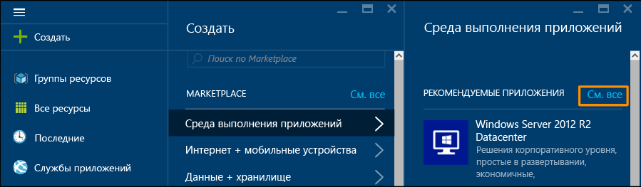

1. В разделе **Серверы баз данных** щелкните **SQL Server**, чтобы просмотреть все доступные шаблоны для SQL Server. Возможно, потребуется прокрутить страницу вниз, чтобы найти элемент **Серверы баз данных**.

	

1. 	Каждый шаблон определяет версию SQL Server и операционную систему. Выберите один из этих образов из списка, чтобы отобразилась колонка, содержащая сведения о нем.
1.	Колонка со сведениями содержит описание образа виртуальной машины. В этой колонке можно выбрать модель развертывания. В разделе **Выбор модели развертывания** выберите **Resource Manager** и нажмите кнопку **Создать**.

	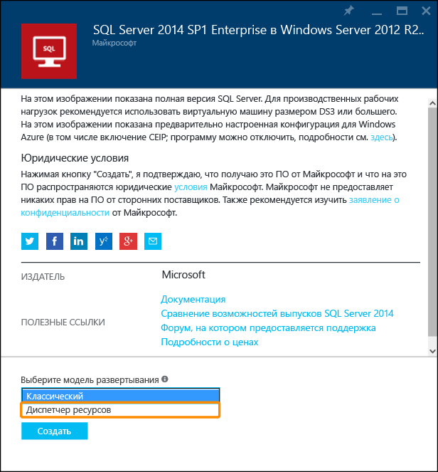

## Настройка виртуальной машины
На портале Azure есть пять колонок для настройки виртуальной машины SQL Server.

| Шаг | Описание |
|---------------------|-------------------------------|
| **Основы** | [Настройка основных параметров](#1-configure-basic-settings) |
| **Размер** | [Выбор размера виртуальной машины](#2-choose-virtual-machine-size) |
| **Параметры** | [Настройка дополнительных возможностей](#3-configure-optional-features) |
| **Параметры SQL Server** | [Настройка параметров SQL Server](#4-configure-sql-server-settings) |
| **Сводка** | [Просмотр сводки.](#5-review-the-summary) |

## 1\. Настройка основных параметров
В колонке **Основные** укажите следующие сведения:

* Введите уникальное **имя** виртуальной машины.
* Укажите **имя пользователя** для учетной записи локального администратора компьютера. Эта учетная запись будет также членом фиксированной серверной роли sysadmin SQL Server.
* Введите надежный **пароль**.
* Если у вас несколько подписок, проверьте, правильно ли выбрана подписка для виртуальной машины, которую вы собираетесь создать.
* В поле **Группа ресурсов** введите имя для новой группы ресурсов. Кроме того, можно использовать существующую группу ресурсов, нажав кнопку **Выбрать существующую**. Группа ресурсов — это коллекция связанных ресурсов в Azure (виртуальные машины, учетные записи хранения, виртуальные сети и т. д.).
>[AZURE.NOTE] Рекомендуется использовать новую группу ресурсов для тестирования или изучения процесса развертывания SQL Server в Azure. После завершения тестирования группу ресурсов можно полностью удалить. В процессе также будут удалены все ресурсы, связанные с данной группой ресурсов, включая виртуальную машину SQL. Дополнительные сведения о группах ресурсов см. в статье [Общие сведения об Azure Resource Manager](../resource-group-overview.md).
* Выберите **расположение** для развертывания.
* Нажмите кнопку **ОК**, чтобы сохранить настройки.

	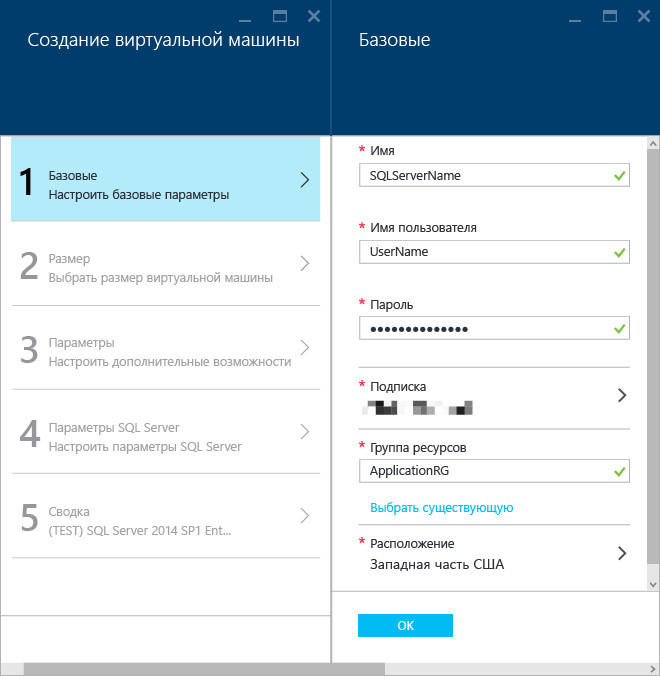

## 2\. Выбор размера виртуальной машины
Чтобы изменить **размер** виртуальной машины, выберите необходимый в колонке **Выбор размера**. Сразу после открытия в ней отобразятся рекомендуемые размеры. Размеры зависят от выбранного шаблона. Размер также определяет ежемесячные затраты на работу виртуальной машины.

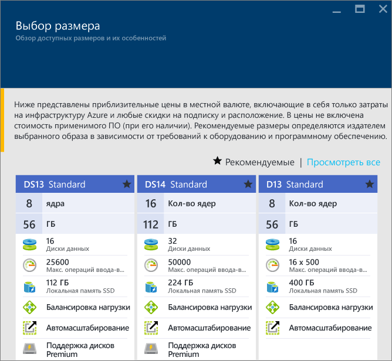

Для рабочих нагрузок рекомендуется выбрать размер виртуальной машины, который поддерживает [хранилище класса Premium](../storage/storage-premium-storage.md). Если этот уровень производительности не требуется, используйте кнопку **Просмотреть все**, чтобы просмотреть все доступные размеры машин. Например, для среды разработки и тестирования можно использовать виртуальную машину меньшего размера.

>[AZURE.NOTE] Дополнительную информацию о размерах виртуальных машин см. в статье [Размеры виртуальных машин](virtual-machines-windows-sizes.md). Рекомендации по размерам виртуальных машин SQL Server см. в статье [Рекомендации по оптимизации производительности SQL Server в виртуальных машинах Azure](virtual-machines-windows-sql-performance.md).

Выберите размер машины и нажмите кнопку **Выбрать**.

## 3\. Настройка дополнительных возможностей
В колонке **Параметры** настройте службу хранилища Azure, сеть и мониторинг для виртуальной машины.

- В разделе **Хранилище** укажите **тип диска**: стандартный или класса "Премиум" (SSD). Для производственных рабочих нагрузок рекомендуется хранилище класса Premium.

>[AZURE.NOTE] Хранилище класса Premium не поддерживает тип диска "Премиум" (SSD). Поэтому размер машины автоматически меняется до размера, который поддерживает хранилище класса Premium.

- В разделе **Учетная запись хранения** можно принять автоматически подготовленное имя учетной записи хранения или щелкнуть элемент **Учетная запись хранения**, чтобы выбрать существующую учетную запись и настроить тип учетной записи хранения. По умолчанию Azure создает новую учетную запись хранения с локально избыточным хранилищем. Дополнительные сведения о вариантах хранилища см. в статье [Репликация службы хранилища Azure](../storage/storage-redundancy.md).

- В разделе **Сеть** можно принять автоматически заполненные значения для компонентов или щелкнуть каждый из них, чтобы настроить **виртуальную сеть**, **подсеть**, **общедоступный IP-адрес** и **группу безопасности сети**. В рамках этого руководства можно использовать значения по умолчанию.

- Azure по умолчанию включает **мониторинг** в той же учетной записи хранения, которая будет использоваться для виртуальной машины. Эти параметры можно изменить.

- В поле **Группа доступности** укажите группу доступности. В рамках этого руководства можно выбрать значение **Нет**. Если вы планируете настроить группы доступности AlwaysOn SQL, настройте доступность, чтобы не создавать виртуальную машину повторно. Дополнительные сведения см. в статье [Управление доступностью виртуальных машин](virtual-machines-windows-manage-availability.md).

После завершения настройки параметров нажмите кнопку **OК**.

## 4\. Настройка параметров SQL Server
В колонке **Настройки SQL Server** настройте конкретные параметры и оптимизации для SQL Server. Для SQL Server можно настроить следующие параметры:

| Настройка |
|---------------------|
| [Соединение](#connectivity) |
| [Аутентификация](#authentication) |
| [Конфигурация хранилища](#storage-configuration) |
| [Автоматическое исправление](#automated-patching) |
| [Автоматическая архивация](#automated-backup) |
| [Интеграция с хранилищем ключей Azure](#azure-key-vault-integration) |

### Соединение
В разделе **Подключение SQL** укажите необходимый тип доступа к экземпляру SQL Server на этой виртуальной машине. В рамках этого руководства выберите вариант **Общедоступный (Интернет)** для подключения к SQL Server с машин или служб в Интернете. Если этот параметр выбран, Azure автоматически настроит брандмауэр и группу безопасности сети, чтобы разрешить трафик через порт 1433.

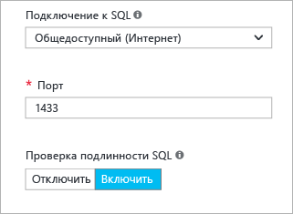

Чтобы подключиться к SQL Server через Интернет, также необходимо включить проверку подлинности SQL Server, как описано в следующем разделе.

>[AZURE.NOTE] Если клиенты подключаются к SQL Server через указанный порт, подключение к этому порту можно ограничить. Для этого после создания виртуальной машины необходимо изменить группу безопасности сети. Дополнительные сведения см. в статье [Группа безопасности сети](../virtual-network/virtual-networks-nsg.md).

Если вы не хотите включать подключения к ядру СУБД через Интернет, выберите один из следующих вариантов:

- **Локальный (только внутри ВМ)** для подключения к SQL Server только в пределах самой виртуальной машины.
- **Закрытый (в виртуальной сети)** для подключения к SQL Server с машин или из служб в той же виртуальной сети.

Как правило, чтобы повысить уровень безопасности, необходимо выбрать наиболее подходящий тип подключения для выполнения вашего сценария. Но все параметры можно защитить с помощью правил группы безопасности сети и проверки подлинности Windows или SQL.

Значение в поле **Порт** по умолчанию — 1433. Вы можете указать другой номер порта. Дополнительные сведения см. в статье [Подключение к виртуальной машине SQL Server в Azure (Resource Manager)](virtual-machines-windows-sql-connect.md).

### Аутентификация
Если требуется проверка подлинности SQL Server, установите флажок **Включить** возле параметра **Проверка подлинности SQL**.

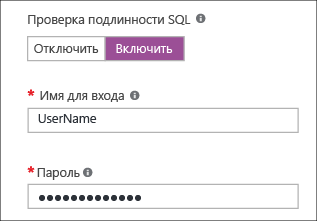

>[AZURE.NOTE] Если вы планируете предоставить доступ к SQL Server через Интернет (т. е. включаете параметр общедоступного подключения), включите проверку подлинности SQL здесь. Для общего доступа к SQL Server необходимо использовать проверку подлинности SQL.

Если вы включаете проверку подлинности SQL Server, укажите **имя для входа** и **пароль**. Это имя пользователя будет именем для входа во время проверки подлинности SQL Server и членом фиксированной серверной роли sysadmin. Дополнительные сведения о режимах проверки подлинности см. в статье [Выбор режима проверки подлинности](http://msdn.microsoft.com/library/ms144284.aspx).

Если проверка подлинности SQL Server не включена, подключиться к экземпляру SQL Server можно с помощью локальной учетной записи администратора на виртуальной машине.

### Конфигурация хранилища
Щелкните элемент **Конфигурация хранилища**, чтобы указать требования к хранилищу.

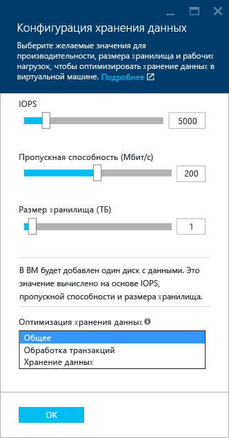

>[AZURE.NOTE] Этот параметр недоступен при выборе стандартного хранилища. Автоматическая оптимизация доступна только для хранилища класса Premium.

Вы можете указать такие требования, как количество операций ввода-вывода в секунду (IOPs), пропускная способность в МБ/с и общий размер хранилища. Настройте эти параметры на скользящих шкалах. Портал автоматически вычисляет количество дисков на основании этих требований.

По умолчанию Azure оптимизирует хранилище для 5000 операций ввода-вывода, 200 МБ/с и 1 ТБ дискового пространства. Вы можете изменить эти параметры хранения в зависимости от рабочей нагрузки. В разделе **Storage optimized for** (Оптимизация хранилища) выберите один из следующих вариантов.

- **Общая** — значение по умолчанию, которое поддерживает большинство рабочих нагрузок.
- **Транзакционная** обработка оптимизирует хранилище для рабочих нагрузок OLTP в традиционных базах данных.
- **Хранилище данных** оптимизирует хранилище для рабочих нагрузок аналитики и отчетов.

>[AZURE.NOTE] Ограничения, указанные с помощью ползунков, зависят от размера виртуальной машины.

### Автоматическое исправление
Параметр **Автоматическое исправление** по умолчанию включен. Автоматическая установка исправлений позволяет Azure автоматически исправлять SQL Server и операционную систему. Укажите день недели, время и длительность периода обслуживания. Azure будет выполнять исправления в период обслуживания. Расписание периода обслуживания использует для определения времени региональные параметры VM. Если вы не хотите, чтобы платформа Azure автоматически устанавливала исправления SQL Server и операционной системы, выберите вариант **Отключить**.

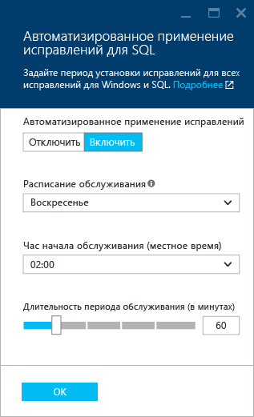

Дополнительные сведения см. в статье [Автоматическая установка исправлений SQL Server на виртуальных машинах Azure (классическая модель)](virtual-machines-windows-classic-sql-automated-patching.md).

### Автоматическая архивация
Включите автоматическую архивацию для всех баз данных в разделе **Автоматическая архивация**. По умолчанию автоматическая архивация отключена.

Во время включения автоматического резервного копирования SQL можно настроить следующие параметры:

- период удержания резервной копии в днях;
- учетная запись хранения, используемая для резервных копий;
- возможность шифрования для резервной копии.

Для шифрования архивной копии установите флажок **Включить**. Затем введите **пароль**. Azure создает сертификат для шифрования резервных копий и использует указанный пароль для защиты этого сертификата.

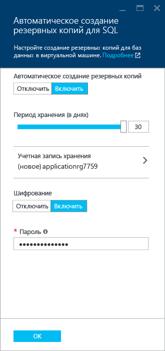

 Дополнительную информацию см. в статье [Автоматическое резервное копирование для SQL Server на виртуальных машинах Azure](virtual-machines-windows-classic-sql-automated-backup.md).

### Интеграция с хранилищем ключей Azure
Чтобы хранить секреты безопасности для шифрования в Azure, щелкните **Azure key vault integration** (Интеграция с хранилищем ключей Azure) и выберите вариант **Включить**.

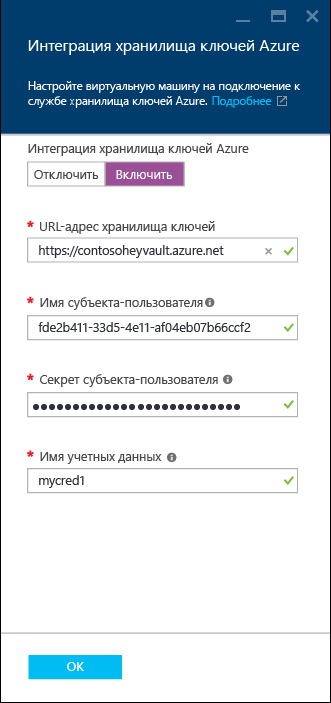

В следующей таблице перечислены параметры, необходимые для настройки интеграции с хранилищем ключей Azure.

|ПАРАМЕТР|ОПИСАНИЕ|ПРИМЕР|
|----------|----------|-------|
|**URL-адрес хранилища ключей** |Расположение хранилища ключей.|https://contosokeyvault.vault.azure.net/ |
|**Имя субъекта** |Имя субъекта-службы Azure Active Directory. Этот имя также называется «Идентификатор клиента». |fde2b411-33d5-4e11-af04eb07b669ccf2|
| **Секрет субъекта**|Секрет субъекта-службы Azure Active Directory. Другое имя — секрет клиента. | 9VTJSQwzlFepD8XODnzy8n2V01Jd8dAjwm/azF1XDKM=|
|**Имя учетных данных**|**Учетное имя**: интеграция AKV создает учетные данные в рамках SQL Server, позволяя виртуальной машине иметь доступ к хранилищу ключей. Выберите имя для этих учетных данных.| mycred1|

Дополнительные сведения см. в статье [Настройка интеграции хранилища ключей Azure для SQL Server на виртуальных машинах Azure (классическая модель)](virtual-machines-windows-classic-ps-sql-keyvault.md).

После настройки параметров SQL Server нажмите кнопку **ОК**.

## 5\. Просмотр сводки.
В колонке **Сводка** просмотрите сводку и нажмите кнопку **ОК**, чтобы создать SQL Server, группу ресурсов и ресурсы, указанные для этой виртуальной машины.

Развертывание можно отслеживать на портале Azure. Если в верхней части окна нажать кнопку **Уведомления**, будут показаны основные сведения о состоянии развертывания.

>[AZURE.NOTE] Чтобы предоставить вам сведения о времени, необходимом для выполнения развертывания, в нашем сценарии виртуальная машина SQL была развернута в восточной части США с параметрами по умолчанию. На выполнение процесса развертывания понадобилось 26 минут. Время развертывания зависит от региона и выбранных параметров.

## Открытие виртуальной машины с помощью удаленного рабочего стола

Выполните следующие действия, чтобы подключиться к виртуальной машине через удаленный рабочий стол.

1. После создания виртуальной машины Azure на панели мониторинга Azure отобразится значок виртуальной машины. Его также можно найти, открыв список существующих виртуальных машин. Чтобы просмотреть сведения о виртуальной машине SQL, щелкните ее.
1. В верхней части колонки **виртуальной машины** нажмите кнопку **Подключиться**.
1. Браузер загрузит RDP-файл для VM. Откройте RDP-файл. 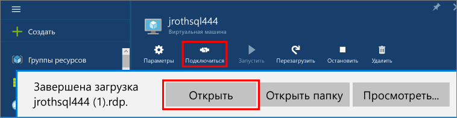
1. В ходе подключения к удаленному рабочему столу может появиться предупреждение о том, что издателя этого удаленного подключения невозможно определить. Чтобы продолжить, щелкните **Подключить**.
1. В диалоговом окне **Безопасность Windows** выберите **Другая учетная запись**.
1. В поле **Имя пользователя** введите **<имя\_пользователя>**, которое <user name> вы указали во время настройки виртуальной машины. Обратите внимание, что необходимо добавить обратную косую черту.
1. Введите **пароль**, ранее настроенный для этой виртуальной машины, и нажмите кнопку **ОК**, чтобы подключиться.
1. Если появится еще одно диалоговое окно **Подключение к удаленному рабочему столу** с запросом на подключение, нажмите кнопку **Да**.

После подключения к виртуальной машине SQL Server вы можете запустить SQL Server Management Studio и подключиться с проверкой подлинности Windows, используя свои учетные данные локального администратора. Если включена проверка подлинности SQL Server, можно также подключиться с проверкой подлинности SQL, используя имя пользователя и пароль SQL, настроенные во время подготовки.

Доступ к машине позволяет напрямую изменять настройки компьютера и SQL Server в зависимости от ваших требований. Например, можно настроить параметры брандмауэра или изменить параметры конфигурации SQL Server.

## Удаленное подключение к SQL Server

В рамках этого руководства для виртуальной машины используется **открытый** доступ и **проверка подлинности SQL Server**. Эти параметры позволяют автоматически настроить виртуальную машину для получения доступа к экземпляру SQL Server из любого клиента через Интернет (при условии, что будет использоваться правильное имя пользователя SQL).

>[AZURE.NOTE] Если вы не выбрали параметр «Общедоступное» во время подготовки, для доступа к экземпляру SQL Server через Интернет потребуется выполнить дополнительные действия. Дополнительные сведения см. в статье [Подключение к виртуальной машине SQL Server в Azure (Resource Manager)](virtual-machines-windows-sql-connect.md).

В следующих разделах описано, как подключиться к экземпляру SQL Server на виртуальной машине с другого компьютера через Интернет.

> [AZURE.INCLUDE [Подключение к SQL Server в диспетчере ресурсов VM](../../includes/virtual-machines-sql-server-connection-steps-resource-manager.md)]

## Дальнейшие действия
Дополнительные сведения об использовании SQL Server в Azure см. в статье [Общие сведения об SQL Server на виртуальных машинах Azure](virtual-machines-windows-sql-server-iaas-overview.md) и [Часто задаваемые вопросы об SQL Server в виртуальных машинах Azure](virtual-machines-windows-sql-server-iaas-faq.md).

Чтобы получить общие сведения об SQL Server в виртуальных машинах Azure, просмотрите видеоролик [Azure VM is the best platform for SQL Server 2016](https://channel9.msdn.com/Events/DataDriven/SQLServer2016/Azure-VM-is-the-best-platform-for-SQL-Server-2016) (Виртуальные машины Azure — лучшая платформа для SQL Server 2016).

<!---HONumber=AcomDC_0511_2016-->