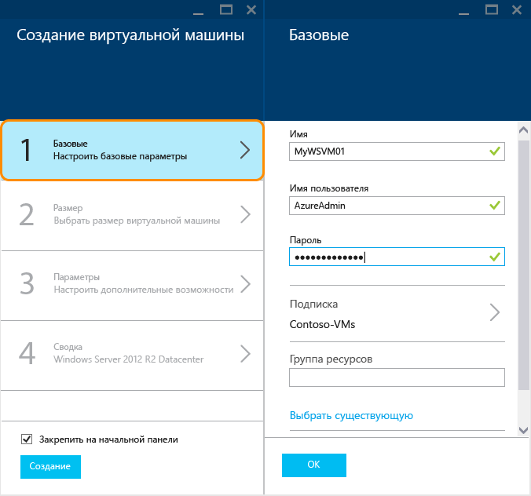
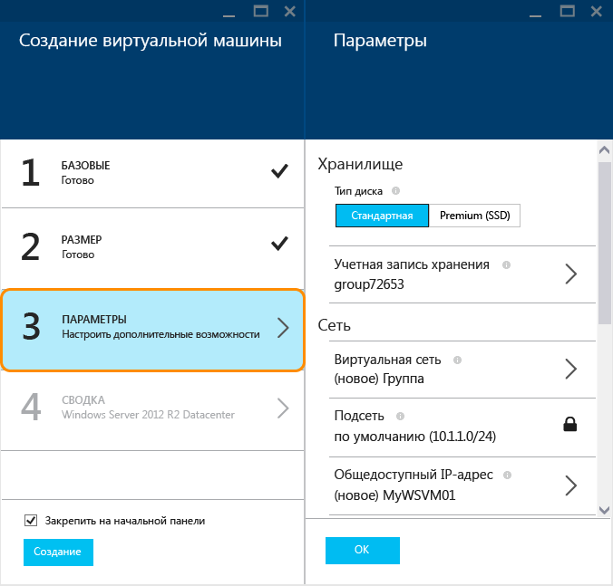

<properties
	pageTitle="Создание виртуальной машины под управлением Windows на портале предварительной версии Azure | Microsoft Azure"
	description="Узнайте, как создать виртуальную машину Azure под управлением Windows, используя Marketplace на портале предварительной версии Azure."
	services="virtual-machines"
	documentationCenter=""
	authors="cynthn"
	manager="timlt"
	editor=""
	tags="azure-resource-manager"/>
<tags
	ms.service="virtual-machines"
	ms.workload="infrastructure-services"
	ms.tgt_pltfrm="vm-windows"
	ms.devlang="na"
	ms.topic="hero-article"
	ms.date="08/14/2015"
	ms.author="cynthn"/>

# Создание виртуальной машины под управлением Windows на портале предварительной версии Azure#

> [AZURE.SELECTOR]
- [Azure preview portal](virtual-machines-windows-tutorial.md)
- [Azure portal](virtual-machines-windows-tutorial-classic-portal.md)
- [PowerShell: Resource Manager deployment](virtual-machines-deploy-rmtemplates-powershell.md)
- [PowerShell: Classic deployment](virtual-machines-ps-create-preconfigure-windows-vms.md)

 [AZURE.INCLUDE [learn-about-deployment-models](../../includes/learn-about-deployment-models-rm-include.md)]Классическая модель развертывания.

В этом учебнике показано, как всего за несколько минут на портале предварительной версии можно создать виртуальную машину Azure. В качестве примера мы создадим виртуальную машину с помощью образа Windows Server 2012 R2 Datacenter, но это лишь один из многих образов, предлагаемых в Azure. Доступность образов зависит от подписки. Например, подписчикам MSDN могут быть доступны образы рабочих столов.

Можно также создавать виртуальные машины с использованием собственных образов, шаблонов диспетчера ресурсов или с помощью инструментов автоматизации. Дополнительную информацию об этих разных методах см. в статье [Различные способы создания виртуальной машины Windows](virtual-machines-windows-choices-create-vm.md).

В этом учебнике для создания виртуальной машины используется модель развертывания диспетчера ресурсов. Ее рекомендуется использовать вместо классической модели развертывания, основанной на API управления службами. Подробные сведения о диспетчере ресурсов см. в статье [Общие сведения о диспетчере ресурсов Azure](resource-group-overview.md). Сведения о преимуществах использования диспетчера ресурсов для виртуальных машин см. в статье [Поставщики вычислительных и сетевых ресурсов, а также ресурсов службы хранилища Azure в диспетчере ресурсов Azure](virtual-machines-azurerm-versus-azuresm.md).

[AZURE.INCLUDE [free-trial-note](../../includes/free-trial-note.md)]

## Видеоруководство

Ниже приведено пошаговое описание этого учебника.

[AZURE.VIDEO create-a-virtual-machine-running-windows-in-the-azure-preview-portal]

## Выбор образа

1. Войдите на [портал предварительной версии](https://portal.azure.com).

2. В меню концентратора щелкните элементы **Создать** > **Среда выполнения приложений** > **Windows Server 2012 R2 Datacenter**.

	

	>[AZURE.TIP]Чтобы найти дополнительные образы, выберите пункт **Marketplace**, а затем выполните поиск среди доступных элементов или отфильтруйте их.

3. На странице **Windows Server 2012 R2 Datacenter** в разделе **Выбор модели развертывания** выберите пункт **Диспетчер ресурсов**. Щелкните **Создать**.

	

## Создание виртуальной машины

Выбрав образ, можно оставить значения, используемые Azure по умолчанию, для большей части параметров в конфигурации и быстро создать виртуальную машину.

1. В колонке **Создание виртуальной машины** щелкните элемент **Основные сведения**. Введите **имя** для виртуальной машины, **имя пользователя** администратора и надежный **пароль**. Если вы используете несколько подписок, укажите одну из них для новой виртуальной машины, а также новую или существующую **группу ресурсов** и **расположение** центра обработки данных Azure.

	

	>[AZURE.NOTE]**Имя пользователя** относится к административной учетной записи, используемой для управления сервером. Создайте пароль, который трудно угадать, но который вы сможете запомнить. **Имя пользователя и пароль понадобятся для входа на виртуальную машину**.

2. Щелкните элемент **Размер** и укажите необходимый размер виртуальной машины. Каждому размеру соответствуют определенные количество вычислительных ядер, объем памяти и другие функции, например поддержка хранилища класса Premium, что влияет на цену. В зависимости от выбранного образа Azure автоматически рекомендует определенные размеры.

	

	>[AZURE.NOTE]Хранилище класса Premium доступно для виртуальных машин серии DS в определенных регионах. Хранилище класса Premium — наилучший вариант хранения данных для рабочих нагрузок с интенсивным обменом данными, например для базы данных. Дополнительные сведения см. в статье [Хранилище Premium: хранилище высокой производительности для рабочих нагрузок виртуальных машин Azure](storage-premium-storage-preview-portal.md).

3. Щелкните элемент **Параметры**, чтобы отобразить параметры хранилища и сети для новой виртуальной машины. Для первой виртуальной машины можно в целом принять значения параметров по умолчанию. Если вы выбрали размер виртуальной машины, который поддерживает хранилище класса Premium, можно опробовать его, выбрав значение **Premium (SSD)** для параметра **Тип диска**.

	

6. Щелкните **Сводка**, чтобы отобразить выбранные вами значения параметров. Закончив просмотр или обновление параметров, нажмите кнопку **Создать**.

	

8. Процесс создания виртуальной машины в Azure можно отслеживать в разделе **Уведомления** в меню концентратора. После создания виртуальной машины в Azure она отобразится на начальной панели, если в колонке **Создание виртуальной машины** не снят флажок **Закрепить на начальной панели**.

## Вход на виртуальную машину

После создания виртуальной машины необходимо войти в систему, чтобы управлять ее параметрами и приложениями, которые будут выполняться в ней.

>[AZURE.NOTE]Информацию о требованиях и устранении неполадок см. в разделе [Подключение к виртуальной машине Azure по RDP или SSH](https://msdn.microsoft.com/library/azure/dn535788.aspx).

1. Войдите на [портал предварительной версии](https://portal.azure.com) (если вы еще этого не сделали).

2. Щелкните виртуальную машину на начальной панели. Если необходимо найти ее, щелкните элементы **Просмотреть все** > **Последние** или **Просмотреть все** > **Виртуальные машины**. Затем выберите виртуальную машину в списке.

3. В колонке виртуальной машины щелкните элемент **Подключить**.

	

4. Нажмите кнопку **Открыть**, чтобы использовать файл протокола удаленного рабочего стола, автоматически созданный для виртуальной машины Windows Server.

5. Щелкните **Подключить**.

6. Введите имя пользователя и пароль, указанные при создании виртуальной машины, и нажмите кнопку **ОК**.

7. Щелкните **Да** для проверки удостоверения виртуальной машины.

	Теперь вы сможете работать с виртуальной машиной так же, как и с любым сервером.

## Дальнейшие действия

* Использование Azure PowerShell и интерфейса командной строки Azure для [поиска и выбора образов виртуальных машин](resource-groups-vm-searching.md).
* Автоматизация развертывания виртуальных машин и рабочей нагрузки и управления ими с помощью [диспетчера ресурсов Azure](virtual-machines-how-to-automate-azure-resource-manager.md) и [шаблонов диспетчера ресурсов Azure](http://azure.microsoft.com/documentation/templates/).

<!---HONumber=Oct15_HO4-->