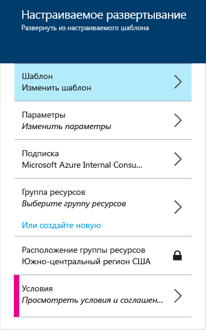
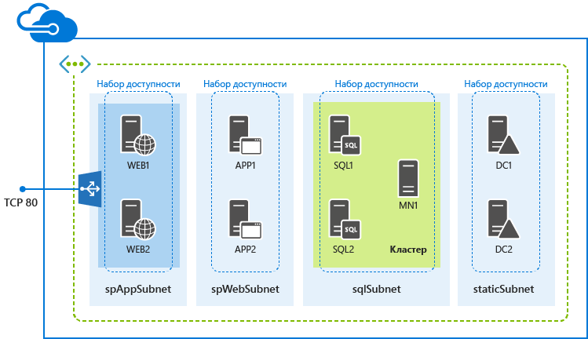

<properties
	pageTitle="Развертывание ферм SharePoint с помощью шаблонов ARM | Microsoft Azure"
	description="Информация о том, как легко развернуть трех- или девятисерверную ферму SharePoint с помощью шаблонов диспетчера ресурсов и портала Azure, Azure PowerShell или интерфейса командной строки Azure."
	services="virtual-machines"
	documentationCenter=""
	authors="JoeDavies-MSFT"
	manager="timlt"
	editor=""
	tags="azure-resource-manager"/>

<tags
	ms.service="virtual-machines"
	ms.workload="infrastructure-services"
	ms.tgt_pltfrm="vm-windows-sharepoint"
	ms.devlang="na"
	ms.topic="hero-article"
	ms.date="10/05/2015"
	ms.author="josephd"/>

# Развертывание ферм SharePoint с помощью шаблонов диспетчера ресурсов Azure

[AZURE.INCLUDE [learn-about-deployment-models](../../includes/learn-about-deployment-models-rm-include.md)]Классическая модель развертывания. Создать ресурс с помощью классической модели развертывания невозможно.

Используйте указания в этой статье для развертывания новой трех- или девятисерверной фермы SharePoint Server 2013 с помощью шаблонов диспетчера ресурсов.

## Развертывание трехсерверной фермы SharePoint

Для базовой фермы SharePoint Server 2013 шаблон диспетчера ресурсов создает три виртуальные машины в новой виртуальной сети в трех разных подсетях.

Шаблон можно запустить с помощью портала предварительной версии Azure, Azure PowerShell или интерфейса командной строки Azure.

### Портал предварительной версии Azure

Для развертывания этой рабочей нагрузки с помощью шаблона диспетчера ресурсов и портала предварительной версии Azure щелкните [здесь](https://portal.azure.com/#create/Microsoft.Template/uri/https%3A%2F%2Fraw.githubusercontent.com%2FAzure%2Fazure-quickstart-templates%2Fmaster%2Fsharepoint-three-vm%2Fazuredeploy.json).

1.	Щелкните **Параметры**. В области **Параметры** введите новые значения, выберите среди допустимых значений или примите значения по умолчанию и нажмите кнопку **ОК**.
2.	При необходимости щелкните **Подписка** и выберите правильную подписку Azure.
3.	Щелкните **Группа ресурсов** и выберите существующую группу ресурсов. Или щелкните **Или создать новую**, чтобы создать группу для этой рабочей нагрузки.
4.	При необходимости щелкните **Расположение группы ресурсов** и укажите правильное расположение Azure.
6.	При необходимости выберите **Юридические условия**, чтобы ознакомиться с условиями и соглашением об использовании шаблона.
7.	Щелкните **Создать**.

В зависимости от шаблона для создания рабочей нагрузки в Azure может потребоваться некоторое время. По завершении вы получите новую трехсерверную ферму SharePoint в существующей или новой группе ресурсов.

### Azure PowerShell

> [AZURE.NOTE]Эта статья содержит команды для Azure PowerShell версии вплоть до 1.0.0, *но не включая* саму версию 1.0.0 и более поздние версии. Используемую версию Azure PowerShell можно проверить с помощью команды **Get-Module azure | format-table version**. Приведенные в этой статье блоки команд Azure PowerShell проходят тестирование и обновление для обеспечения поддержки новых командлетов в Azure PowerShell 1.0.0 и более поздних версий. Благодарим вас за терпение.

Прежде чем начать, убедитесь, что у вас установлена подходящая версия Azure PowerShell, выполнен вход и включен новый режим диспетчера ресурсов. Дополнительные сведения см. [здесь](virtual-machines-deploy-rmtemplates-powershell.md#setting-up-powershell-for-resource-manager-templates).

Введите имя развертывания Azure, новое имя группы ресурсов и расположение центра обработки данных Azure в следующем наборе команд. Удалите все содержимое кавычек, включая знаки < and >.

	$deployName="<deployment name>"
	$RGName="<resource group name>"
	$locName="<Azure location, such as West US>"
	$templateURI="https://raw.githubusercontent.com/Azure/azure-quickstart-templates/master/sharepoint-three-vm/azuredeploy.json"
	New-AzureResourceGroup -Name $RGName -Location $locName
	New-AzureResourceGroupDeployment -Name $deployName -ResourceGroupName $RGName -TemplateUri $templateURI

Ниже приведен пример.

	$deployName="TestDeployment"
	$RGName="TestRG"
	$locname="West US"
	$templateURI="https://raw.githubusercontent.com/Azure/azure-quickstart-templates/master/sharepoint-three-vm/azuredeploy.json"
	New-AzureResourceGroup -Name $RGName -Location $locName
	New-AzureResourceGroupDeployment -Name $deployName -ResourceGroupName $RGName -TemplateUri $templateURI

Далее выполните свой блок команд в командной строке Azure PowerShell.

При выполнении команды **New-AzureResourceGroupDeployment** появится запрос на ввод значений для ряда параметров. После указания всех значений параметров **New-AzureResourceGroupDeployment** создает и настраивает виртуальные машины.

По завершении выполнения шаблона вы получите новую трехсерверную ферму SharePoint в новой группе ресурсов.

### Инфраструктура CLI Azure

Прежде чем начать, убедитесь, что у вас установлена подходящая версия интерфейса командной строки Azure, выполнен вход и включен новый режим диспетчера ресурсов. Дополнительные сведения см. [здесь](virtual-machines-deploy-rmtemplates-azure-cli.md#getting-ready).

В первую очередь создается новая группа ресурсов. Используйте следующую команду и укажите имя группы и местоположение центра обработки данных Azure, в который требуется выполнить развертывание.

	azure group create <group name> <location>

Затем используйте следующую команду и укажите имя группы ресурсов и имя развертывания Azure.

	azure group deployment create --template-uri https://raw.githubusercontent.com/Azure/azure-quickstart-templates/master/sharepoint-three-vm/azuredeploy.json <group name> <deployment name>

Ниже приведен пример.

	azure group create sp3serverfarm eastus2
	azure group deployment create --template-uri https://raw.githubusercontent.com/Azure/azure-quickstart-templates/master/sharepoint-three-vm/azuredeploy.json sp3serverfarm spdevtest

При выполнении команды **azure group deployment create** появится запрос на ввод значений для ряда параметров. После указания всех значений параметров Azure создает и настраивает виртуальные машины.

Теперь у вас есть новая трехсерверная ферма SharePoint в новой группе ресурсов.

## Развертывание девятисерверной фермы SharePoint

Для широкодоступной фермы SharePoint Server 2013 шаблон диспетчера ресурсов создает девять виртуальных машин в новой виртуальной сети в четырех разных подсетях.

### Портал предварительной версии Azure

Для развертывания этой рабочей нагрузки с помощью шаблона диспетчера ресурсов и портала предварительной версии Azure щелкните [здесь](https://portal.azure.com/#create/Microsoft.Template/uri/https%3A%2F%2Fraw.githubusercontent.com%2FAzure%2Fazure-quickstart-templates%2Fmaster%2Fsharepoint-server-farm-ha%2Fazuredeploy.json).

1.	Щелкните **Параметры**. В области **Параметры** введите новые значения, выберите нужные из допустимых значений или примите значения по умолчанию, а затем нажмите кнопку **ОК**.
2.	При необходимости щелкните **Подписка** и выберите правильную подписку Azure.
3.	Щелкните **Группа ресурсов** и выберите существующую группу ресурсов. Или щелкните **Или создать новую**, чтобы создать группу для этой рабочей нагрузки.
4.	При необходимости щелкните **Расположение группы ресурсов** и укажите правильное расположение Azure.
5.	При необходимости выберите **Юридические условия**, чтобы ознакомиться с условиями и соглашением об использовании шаблона.
6.	Щелкните **Создать**.

В зависимости от шаблона для создания рабочей нагрузки в Azure может потребоваться некоторое время. По завершении вы получите новую девятисерверную ферму SharePoint в существующей или новой группе ресурсов.

### Azure PowerShell

Прежде чем начать, убедитесь, что у вас установлена подходящая версия Azure PowerShell, выполнен вход и включен новый режим диспетчера ресурсов. Дополнительные сведения см. [здесь](virtual-machines-deploy-rmtemplates-powershell.md#setting-up-powershell-for-resource-manager-templates).

Введите имя развертывания Azure, новое имя группы ресурсов и расположение центра обработки данных Azure в следующем наборе команд. Удалите все содержимое кавычек, включая знаки < and >.

	$deployName="<deployment name>"
	$RGName="<resource group name>"
	$locName="<Azure location, such as West US>"
	$templateURI="https://raw.githubusercontent.com/Azure/azure-quickstart-templates/master/sharepoint-server-farm-ha/azuredeploy.json"
	New-AzureResourceGroup -Name $RGName -Location $locName
	New-AzureResourceGroupDeployment -Name $deployName -ResourceGroupName $RGName -TemplateUri $templateURI

Ниже приведен пример.

	$deployName="TestDeployment"
	$RGName="TestRG"
	$locname="West US"
	$templateURI="https://raw.githubusercontent.com/Azure/azure-quickstart-templates/master/sharepoint-server-farm-ha/azuredeploy.json"
	New-AzureResourceGroup -Name $RGName -Location $locName
	New-AzureResourceGroupDeployment -Name $deployName -ResourceGroupName $RGName -TemplateUri $templateURI

Далее выполните свой блок команд в командной строке Azure PowerShell.

При выполнении команды **New-AzureResourceGroupDeployment** появится запрос на ввод значений для ряда параметров. После указания всех значений параметров **New-AzureResourceGroupDeployment** создает и настраивает виртуальные машины.

По завершении выполнения шаблона вы получите новую девятисерверную ферму SharePoint в новой группе ресурсов.

### Инфраструктура CLI Azure

Прежде чем начать, убедитесь, что у вас установлена подходящая версия интерфейса командной строки Azure, выполнен вход и включен новый режим диспетчера ресурсов. Дополнительные сведения см. [здесь](virtual-machines-deploy-rmtemplates-azure-cli.md#getting-ready).

В первую очередь создается новая группа ресурсов. Используйте следующую команду и укажите имя группы и местоположение центра обработки данных Azure, в который требуется выполнить развертывание.

	azure group create <group name> <location>

Затем используйте следующую команду и укажите имя группы ресурсов и имя развертывания Azure.

	azure group deployment create --template-uri https://raw.githubusercontent.com/Azure/azure-quickstart-templates/master/sharepoint-server-farm-ha/azuredeploy.json <group name> <deployment name>

Ниже приведен пример.

	azure group create sphaserverfarm eastus2
	azure group deployment create --template-uri https://raw.githubusercontent.com/Azure/azure-quickstart-templates/master/sharepoint-server-farm-ha/azuredeploy.json sphaserverfarm spdevtest

При выполнении команды **azure group deployment create** появится запрос на ввод значений для ряда параметров. После указания всех значений параметров Azure создает и настраивает виртуальные машины.

По завершении выполнения шаблона вы получите новую девятисерверную ферму SharePoint Server 2013 в новой группе ресурсов.

## Дополнительные ресурсы

[Фермы SharePoint, размещенные в службах инфраструктуры Azure](virtual-machines-sharepoint-infrastructure-services.md)

[Развертывание виртуальных машин и управление ими с использованием шаблонов диспетчера ресурсов Azure и Azure PowerShell](virtual-machines-deploy-rmtemplates-powershell.md)

[Поставщики вычислительных и сетевых ресурсов, а также ресурсов хранения Azure в диспетчере ресурсов Azure](virtual-machines-azurerm-versus-azuresm.md)

[Общие сведения о диспетчере ресурсов Azure](../resource-group-overview.md)

[Развертывание виртуальных машин и управление ими с помощью шаблонов диспетчера ресурсов Azure и интерфейса командной строки Azure](virtual-machines-deploy-rmtemplates-azure-cli.md)

[Документация по виртуальным машинам](http://azure.microsoft.com/documentation/services/virtual-machines/)

[Установка и настройка Azure PowerShell](../install-configure-powershell.md)

<!---HONumber=Oct15_HO3-->