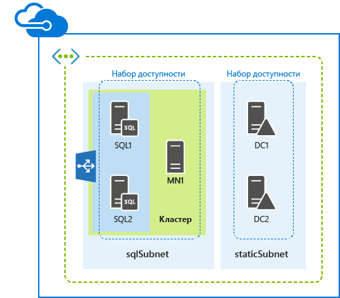
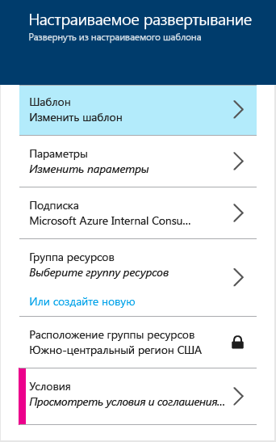

<properties
	pageTitle="Развертывание AlwaysOn SQL Server с помощью шаблона диспетчера ресурсов Azure | Microsoft Azure"
	description="Узнайте, как легко развернуть пять серверов, поддерживающих AlwaysOn SQL Server, с помощью шаблона диспетчера ресурсов и портала предварительной версии Azure, Azure PowerShell или интерфейса командной строки Azure."
	services="virtual-machines"
	documentationCenter=""
	authors="davidmu1"
	manager="timlt"
	editor=""
	tags="azure-resource-manager"/>

<tags
	ms.service="virtual-machines"
	ms.workload="infrastructure-services"
	ms.tgt_pltfrm="vm-windows-sql-server"
	ms.devlang="na"
	ms.topic="hero-article"
	ms.date="06/29/2015"
	ms.author="davidmu"/>

# Развертывание AlwaysOn SQL Server с помощью шаблона диспетчера ресурсов Azure

[AZURE.INCLUDE [learn-about-deployment-models](../../includes/learn-about-deployment-models-include.md)]В этой статье описывается процесс создания ресурса с помощью модели развертывания на основе диспетчера ресурсов. Создать этот ресурс с помощью классической модели развертывания невозможно.

В этой статье приведены указания по развертыванию AlwaysOn SQL Server с помощью шаблона диспетчера ресурсов Azure. Этот шаблон создает пять виртуальных машин в новой виртуальной сети в двух разных подсетях.

Шаблон можно запустить с помощью портала предварительной версии Azure, Azure PowerShell или интерфейса командной строки Azure.

## Портал предварительной версии Azure

Чтобы развернуть эту рабочую нагрузку с помощью шаблона диспетчера ресурсов Azure и портала предварительной версии Azure, щелкните [здесь](https://portal.azure.com/#create/Microsoft.Template/uri/https%3A%2F%2Fraw.githubusercontent.com%2FAzure%2Fazure-quickstart-templates%2Fmaster%2Fsql-server-2014-alwayson-dsc%2Fazuredeploy.json).

1.	В области **Шаблон** нажмите кнопку **Сохранить**.
2.	Щелкните **Параметры**. В области **Параметры** введите новые значения, выберите среди допустимых значений или примите значения по умолчанию, а затем нажмите кнопку **ОК**.
3.	При необходимости щелкните **Подписка** и выберите правильную подписку Azure.
4.	Щелкните **Группа ресурсов** и выберите существующую группу ресурсов. Или щелкните **Или создать новую**, чтобы создать группу для этой рабочей нагрузки.
5.	При необходимости щелкните **Расположение группы ресурсов** и укажите правильное расположение Azure.
6.	При необходимости выберите **Юридические условия**, чтобы ознакомиться с условиями и соглашением об использовании шаблона.
7.	Щелкните **Создать**.

В зависимости от шаблона для создания рабочей нагрузки в Azure может потребоваться некоторое время. По завершении выполнения шаблона вы получите новую конфигурацию AlwaysOn SQL Server с пятью серверами в существующей или новой группе ресурсов.

## Azure PowerShell

Прежде чем начать, убедитесь, что у вас установлена подходящая версия Azure PowerShell, выполнен вход и включен новый режим диспетчера ресурсов. Дополнительные сведения см. [здесь](virtual-machines-deploy-rmtemplates-powershell.md#setting-up-powershell-for-resource-manager-templates).

Введите имя развертывания Azure, новое имя группы ресурсов и расположение центра обработки данных Azure в следующем наборе команд. Удалите все содержимое кавычек, включая знаки < and >.

	$deployName="<deployment name>"
	$RGName="<resource group name>"
	$locName="<Azure location, such as West US>"
	$templateURI="https://raw.githubusercontent.com/Azure/azure-quickstart-templates/master/sql-server-2014-alwayson-dsc/azuredeploy.json"
	New-AzureResourceGroup -Name $RGName -Location $locName
	New-AzureResourceGroupDeployment -Name $deployName -ResourceGroupName $RGName -TemplateUri $templateURI

Ниже приведен пример.

	$deployName="TestDeployment"
	$RGName="TestRG"
	$locname="West US"
	$templateURI="https://raw.githubusercontent.com/Azure/azure-quickstart-templates/master/sql-server-2014-alwayson-dsc/azuredeploy.json"
	New-AzureResourceGroup -Name $RGName -Location $locName
	New-AzureResourceGroupDeployment -Name $deployName -ResourceGroupName $RGName -TemplateUri $templateURI

Далее выполните свой блок команд в командной строке Azure PowerShell.

При выполнении команды **New-AzureResourceGroupDeployment** появится запрос на ввод значений для ряда параметров. После указания всех значений параметров **New-AzureResourceGroupDeployment** создает и настраивает виртуальные машины.

По завершении выполнения шаблона вы получите новую конфигурацию AlwaysOn SQL Server с пятью серверами в новой группе ресурсов.

## Инфраструктура CLI Azure

Прежде чем начать, убедитесь, что у вас установлена подходящая версия интерфейса командной строки Azure, выполнен вход и включен новый режим диспетчера ресурсов. Дополнительные сведения см. [здесь](virtual-machines-deploy-rmtemplates-azure-cli.md#getting-ready).

В первую очередь создается новая группа ресурсов. Используйте следующую команду и укажите имя группы и местоположение центра обработки данных Azure, в который требуется выполнить развертывание.

	azure group create <group name> <location>

Затем используйте следующую команду и укажите имя группы ресурсов и имя развертывания Azure.

	azure group deployment create --template-uri https://raw.githubusercontent.com/Azure/azure-quickstart-templates/master/sql-server-2014-alwayson-dsc/azuredeploy.json <group name> <deployment name>

Ниже приведен пример.

	azure group create sqlao eastus2
	azure group deployment create --template-uri https://raw.githubusercontent.com/Azure/azure-quickstart-templates/master/sql-server-2014-alwayson-dsc/azuredeploy.json sqlao sqldevtest

При выполнении команды **azure group deployment create** появится запрос на ввод значений для ряда параметров. После указания всех значений параметров Azure создает и настраивает виртуальные машины.

По завершении выполнения шаблона вы получите новую конфигурацию AlwaysOn SQL Server с пятью серверами в новой группе ресурсов.

## Дополнительные ресурсы

[Развертывание виртуальных машин и управление ими с использованием шаблонов диспетчера ресурсов Azure и Azure PowerShell](virtual-machines-deploy-rmtemplates-powershell.md)

[Поставщики вычислительных и сетевых ресурсов, а также ресурсов хранения Azure в диспетчере ресурсов Azure](virtual-machines-azurerm-versus-azuresm.md)

[Общие сведения о диспетчере ресурсов Azure](../resource-group-overview.md)

[Развертывание виртуальных машин и управление ими с помощью шаблонов диспетчера ресурсов Azure и интерфейса командной строки Azure](virtual-machines-deploy-rmtemplates-azure-cli.md)

[Документация по виртуальным машинам](http://azure.microsoft.com/documentation/services/virtual-machines/)

[Установка и настройка Azure PowerShell](../install-configure-powershell.md)

<!---HONumber=Sept15_HO4-->