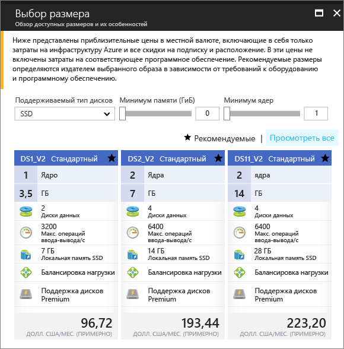

# <a name="create-a-windows-virtual-machine-in-an-availability-zone-with-the-azure-portal"></a>Создание виртуальной машины Windows в зоне доступности с помощью портала Azure

В этой статье рассматривается использование портала Azure для создания виртуальной машины в зоне доступности Azure. [Зона доступности](../../availability-zones/az-overview.md) представляет собой физически отдельную зону в регионе Azure. Зоны доступности позволяют защитить приложения и данные от маловероятных сбоев и потери всего центра обработки данных.

[!INCLUDE [availability-zones-preview-statement.md](../../../includes/availability-zones-preview-statement.md)]


## <a name="log-in-to-azure"></a>Вход в Azure 

Войдите на портал Azure по адресу https://portal.azure.com.

## <a name="create-virtual-machine"></a>Создание виртуальной машины

1. Щелкните **Создать** в верхнем левом углу портала Azure.

2. Выберите **Вычисления**, а затем — **Windows Server 2016 Datacenter**. 

3. Введите сведения о виртуальной машине. Имя пользователя и пароль понадобятся для входа на виртуальную машину. По завершении нажмите кнопку **ОК**.

    

4. Выберите размер виртуальной машины. Чтобы просмотреть дополнительные размеры, выберите **Просмотреть все** или измените фильтр **Supported disk type** (Поддерживаемые типы диска). Выберите размер, который поддерживается в предварительной версии зон доступности, например *DS1_v2 Standard*. 

      

5. В разделе **Параметры** > **Высокий уровень доступности** выберите одну из зон из раскрывающегося списка **зон доступности**. Оставьте значения по умолчанию, а затем нажмите кнопку **ОК**.

    

6. На странице сводки щелкните **Приобрести**, чтобы начать развертывание виртуальной машины.

7. Виртуальная машина будет закреплена на панели мониторинга портала Azure. Когда развертывание завершится, автоматически отобразятся сводные сведения о виртуальной машине.


## <a name="zone-for-ip-address-and-managed-disk"></a>Зона для IP-адреса и управляемого диска

При развертывании виртуальной машины в зоне доступности в этой же зоне развертываются IP-адрес и управляемый диск. Подтвердить параметры зоны можно с помощью Azure PowerShell. Если вам необходимо выполнить установку или обновление, см. статью [об установке модуля Azure PowerShell](/powershell/azure/install-azurerm-ps).

В примерах ниже содержатся сведения о ресурсах в группе ресурсов с именем *myResourceGroup*. Замените имя группы ресурсов именем, которое вы использовали при создании виртуальной машины.

Найдите зону общедоступного IP-адреса с помощью командлета [Get-AzureRmPublicIpAddress](/en-us/powershell/module/azurerm.network/get-azurermpublicipaddress):

```powershell
Get-AzureRmPublicIpAddress -ResourceGroupName myResourceGroup
```
Параметр `Zones` в выходных данных показывает, что общедоступный IP-адрес находится в той же зоне доступности, что и виртуальная машина:

```powershell
Name                     : myVM-ip
ResourceGroupName        : myResourceGroup
Location                 : eastus2
Id                       : /subscriptions/e44f251c-c67e-4760-9ed6-bf99a306ecff/resourceGroups/danlep0911/providers/Micr
                           osoft.Network/publicIPAddresses/myVM-ip
Etag                     : W/"b67e14c0-7e8a-4d12-91c5-da2a5dfad132"
ResourceGuid             : 314bf57d-9b25-4474-9282-db3561d536aa
ProvisioningState        : Succeeded
Tags                     :
PublicIpAllocationMethod : Dynamic
IpAddress                : 13.68.16.25
PublicIpAddressVersion   : IPv4
IdleTimeoutInMinutes     : 4
IpConfiguration          : {
                             "Id": "/subscriptions/e44f251c-c67e-4760-9ed6-bf99a306ecff/resourceGroups/myResourceGroup/providers/Microsoft.Network/networkInterfaces/myVM11842/ipConfigurations/ipconfig1"
                           }
DnsSettings              : null
Zones                    : {2}
```


В той же зоне доступности также создается управляемый диск для виртуальной машины. Это можно проверить с помощью командлета [Get-AzureRmDisk](/powershell/module/azurerm.compute/get-azurermdisk):

```powershell
Get-AzureRmDisk -ResourceGroupName myResourceGroup
```

В выходных данных видно, что управляемый диск находится в той же зоне доступности, что и виртуальная машина:

```powershell
ResourceGroupName  : myResourceGroup
AccountType        : PremiumLRS
OwnerId            : /subscriptions/d5b9d4b7-6fc1-0000-0000-000000000000/resourceGroups/myResourceGroup/providers/Microsoft.
                     Compute/virtualMachines/myVM
ManagedBy          : /subscriptions/d5b9d4b7-6fc1-0000-0000-000000000000/resourceGroups/myResourceGroup/providers/Microsoft.
                     Compute/virtualMachines/myVM
Sku                : Microsoft.Azure.Management.Compute.Models.DiskSku
Zones              : {2}
TimeCreated        : 9/7/2017 6:57:26 PM
OsType             : Windows
CreationData       : Microsoft.Azure.Management.Compute.Models.CreationData
DiskSizeGB         : 127
EncryptionSettings :
ProvisioningState  : Succeeded
Id                 : /subscriptions/d5b9d4b7-6fc1-0000-0000-000000000000/resourceGroups/myResourceGroup/providers/Microsoft.
                     Compute/disks/myVM_OsDisk_1_bd921920bb0a4650becfc2d830000000
Name               : myVM_OsDisk_1_bd921920bb0a4650becfc2d830000000
Type               : Microsoft.Compute/disks
Location           : eastus2
Tags               : {}
```

## <a name="next-steps"></a>Дополнительная информация

В этой статье вы узнали, как создать виртуальную машину в зоне доступности. Узнайте о [регионах и доступности](regions-and-availability.md) виртуальных машин Azure.
