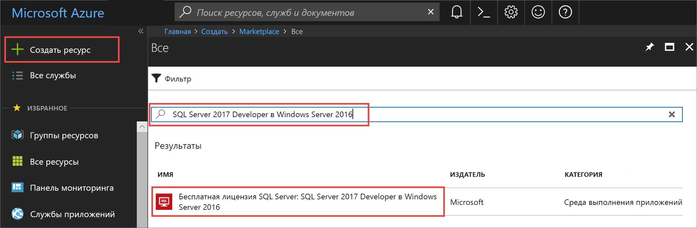
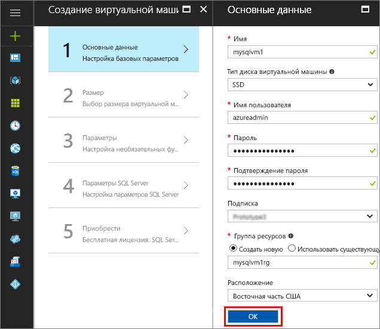
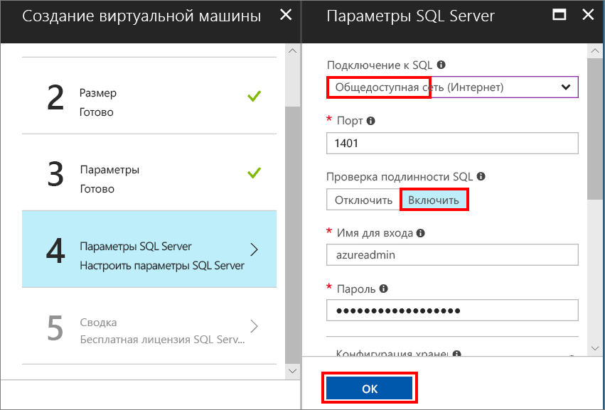
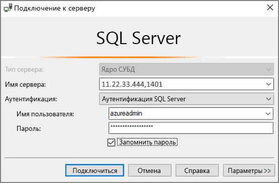

# Краткое руководство по созданию виртуальной машины SQL Server 2017 на платформе Windows с помощью портала Azure

> [!div class="op_single_selector"]
> * [Windows](quickstart-sql-vm-create-portal.md)
> * [Linux](../../linux/sql/provision-sql-server-linux-virtual-machine.md)

В этом кратком руководстве перечислены основные действия по созданию виртуальной машины SQL Server с помощью портала Azure.

> [!TIP]
> В этом кратком руководстве приводятся инструкции по быстрой подготовке виртуальной машины SQL Server и подключению к ней. Дополнительные сведения о других вариантах подготовки виртуальных машин SQL Server см. в [руководстве по подготовке виртуальных машин SQL Server на платформе Windows с помощью портала Azure](virtual-machines-windows-portal-sql-server-provision.md).

> [!TIP]
> Если у вас есть вопросы по виртуальным машинам SQL Server, см. раздел [часто задаваемых вопросов](virtual-machines-windows-sql-server-iaas-faq.md).

##  Оформление подписки Azure

Если у вас еще нет подписки Azure, [создайте бесплатную учетную запись Azure](https://azure.microsoft.com/free/?WT.mc_id=A261C142F), прежде чем начинать работу.

##  Выбор образа виртуальной машины SQL Server

1. Войдите на [портал Azure](https://portal.azure.com) , используя свою учетную запись.

1. На портале Azure щелкните **Создать ресурс**. 

1. В поле поиска введите **SQL Server 2017 Developer on Windows Server 2016** и нажмите клавишу ВВОД.

1. Выберите образ **Free SQL Server License: SQL Server 2017 Developer on Windows Server 2016**.

   

   > [!TIP]
   > В этом руководстве используется выпуск Developer, так как это полнофункциональный выпуск SQL Server, предоставляемый бесплатно для тестирования в процессе разработки. Вы оплачиваете только стоимость выполнения виртуальной машины. Полные рекомендации по ценам приведены в разделе [Руководство по выбору ценовой категории для виртуальных машин SQL Server в Azure](virtual-machines-windows-sql-server-pricing-guidance.md).

1. Нажмите кнопку **Создать**.

##  Указание основных сведений

В окне **Основные сведения** укажите следующую информацию:

1. В поле **Имя** введите уникальное имя виртуальной машины. 

1. В поле **Имя пользователя** укажите имя пользователя для учетной записи локального администратора виртуальной машины.

1. Введите надежный **пароль**.

1. Введите имя новой **группы ресурсов**. Эта группа поможет управлять всеми ресурсами, связанными с данной виртуальной машиной.

1. Проверьте другие параметры по умолчанию и нажмите кнопку **ОК**, чтобы продолжить.

   

## Выбор размера виртуальной машины.

1. Чтобы изменить **размер** виртуальной машины, выберите нужное значение в окне **Выбор размера**.

   Для этого краткого руководства выберите **D2S_V3**. На портале отображается предполагаемая ежемесячная стоимость непрерывного использования виртуальной машины (не включая стоимости лицензий на SQL Server). Обратите внимание на то, что лицензия на выпуск SQL Server Developer Edition не требует дополнительных затрат. Более точные сведения о ценах см. на [странице цен](https://azure.microsoft.com/pricing/details/virtual-machines/windows/).

   > [!TIP]
   > Размер виртуальной машины **D2S_V3** позволяет сэкономить средства при тестировании. Однако для рабочих нагрузок следует ознакомиться с рекомендациями по размерам машин SQL Server и их настройке в статье [Рекомендации по оптимизации производительности SQL Server в виртуальных машинах Azure](virtual-machines-windows-sql-performance.md).

1. Нажмите кнопку **Далее**, чтобы продолжить.

## Настройка дополнительных возможностей

1. В окне **Параметры** порт **RDP (3389)** порт в списке **общедоступных входящих портов** списка, чтобы войти на виртуальную машину с помощью RDP.

   

   > [!NOTE]
   > Можно выбрать порт **MS SQL (1433)** для удаленного доступа к SQL Server. Но это не является обязательным, так как это можно сделать и на этапе выбора **параметров SQL Server**. Если вы выберете порт 1433 на этом шаге, он будет открыт независимо от выбранных **параметров SQL Server**.

1. Нажмите кнопку **ОК**, чтобы сохранить изменения и продолжить.

## Параметры SQL Server

В окне **Настройки SQL Server** настройте следующие параметры.

1. Из раскрывающегося списка **Подключение SQL** выберите **Общедоступный (Интернет)**. Это позволит устанавливать подключения к SQL Server через Интернет.

1. Измените номер **порта** на **1401**, чтобы не использовать хорошо известный номер порта в сценарии общедоступного подключения.

1. В разделе **Проверка подлинности SQL** щелкните **Включить**. В качестве имени для входа SQL указаны имя пользователя и пароль, настроенные для виртуальной машины.

1. При необходимости измените любые другие параметры, затем нажмите кнопку **ОК**, чтобы завершить настройку виртуальной машины SQL Server.

   

## Создание виртуальной машины SQL Server

В окне **Сводка** просмотрите сводные данные и щелкните **Купить**, чтобы создать SQL Server, группу ресурсов и ресурсы, указанные для этой виртуальной машины.

Развертывание можно отслеживать на портале Azure. Если нажать кнопку **Уведомления** в верхней части окна, будут показаны основные сведения о состоянии развертывания.

> [!TIP]
> Развертывание виртуальной машины Windows Server SQL может занять несколько минут.

## Подключение к SQL Server

1. На портале в разделе **Обзор** свойств виртуальной машины найдите ее **общедоступный IP-адрес**.

1. На другом компьютере, подключенном к сети Интернет, откройте SQL Server Management Studio (SSMS).

   > [!TIP]
   > Если у вас нет SQL Server Management Studio, его можно скачать [здесь](https://docs.microsoft.com/sql/ssms/download-sql-server-management-studio-ssms).

1. В диалоговом окне **Подключение к серверу** или **Подключение к ядру СУБД** измените значение **Имя сервера**. Введите общедоступный IP-адрес своей виртуальной машины. Затем добавьте запятую и введите пользовательский порт **1401**, который был указан при настройке новой виртуальной машины. Например, `11.22.33.444,1401`.

1. В поле **Проверка подлинности** выберите **Проверка подлинности SQL Server**.

1. В поле **Имя пользователя** введите допустимое имя пользователя SQL.

1. В поле **Пароль** введите пароль для этого пользователя.

1. Щелкните **Подключить**.

    

##  Удаленный вход на виртуальную машину

Выполните следующие действия, чтобы подключиться к виртуальной машине SQL Server через удаленный рабочий стол.

[!INCLUDE [Connect to SQL Server VM with remote desktop](../../../../includes/virtual-machines-sql-server-remote-desktop-connect.md)]

После подключения к виртуальной машине SQL Server вы можете запустить SQL Server Management Studio и подключиться с проверкой подлинности Windows, используя свои учетные данные локального администратора. Если включена проверка подлинности SQL Server, можно также подключиться с проверкой подлинности SQL, используя имя пользователя и пароль SQL, настроенные во время подготовки.

Доступ к машине позволяет напрямую изменять настройки компьютера и SQL Server в зависимости от ваших требований. Например, можно настроить параметры брандмауэра или изменить параметры конфигурации SQL Server.

## Очистка ресурсов

Если не требуется, чтобы виртуальная машина SQL работала постоянно, можно избежать ненужных затрат, останавливая ее, когда она не используется. Кроме того, можно удалить без возможности восстановления все ресурсы, связанные с виртуальной машиной, удалив связанную с ней группу ресурсов на портале. При этом также будет удалена виртуальная машина, поэтому данную команду следует использовать с осторожностью. Дополнительные сведения см. в статье [Управление ресурсами Azure через портал](../../../azure-resource-manager/resource-group-portal.md).

## Дополнительная информация

В этом кратком руководстве вы создали виртуальную машину SQL Server 2017 на портале Azure. Чтобы узнать больше о том, как перенести данные на новый сервер SQL Server, ознакомьтесь со следующей статьей.

> [!div class="nextstepaction"]
> [Миграция базы данных SQL Server в экземпляр SQL Server на виртуальной машине Azure](virtual-machines-windows-migrate-sql.md)
