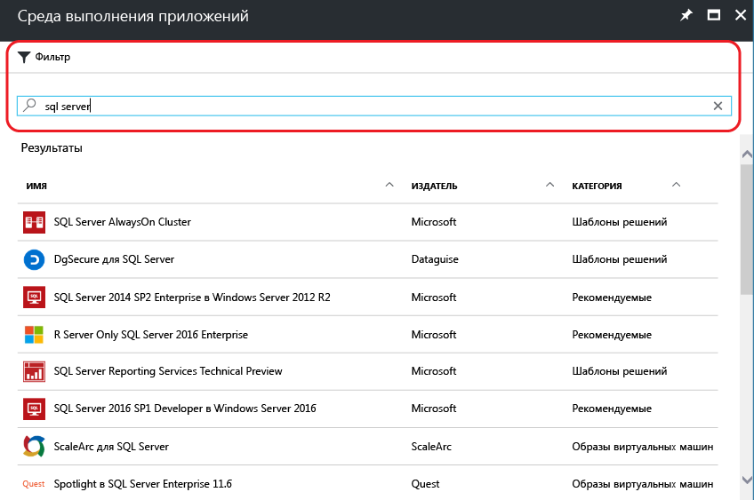
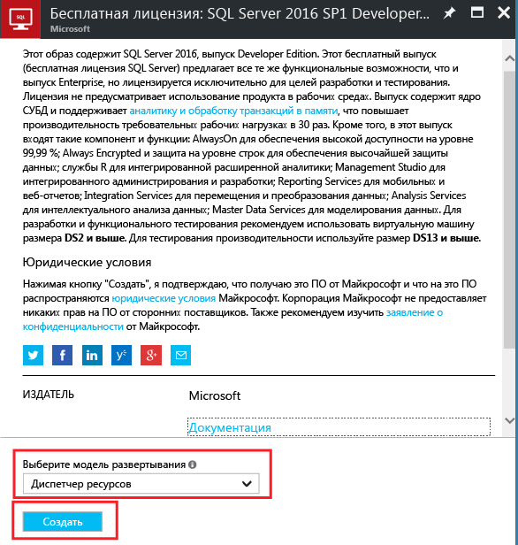
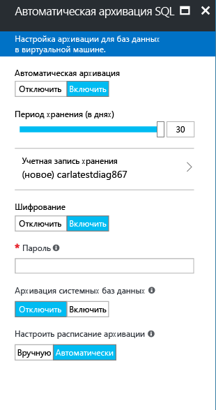

# Как подготовить виртуальную машину SQL Server на платформе Windows на портале Azure

В этом руководстве рассматриваются различные варианты, доступные при создании виртуальной машины SQL Server на платформе Windows на портале Azure. В этой статье рассматривается больше параметров конфигурации, чем в [кратком руководстве по виртуальным машинам SQL Server](quickstart-sql-vm-create-portal.md), и описывается одна возможная задача подготовки. 

Используйте это руководство, чтобы создать собственную виртуальную машину SQL Server. Его также можно использовать как справочник по параметрам, доступным на портале Azure.

> [!TIP]
> Если у вас есть вопросы по виртуальным машинам SQL Server, см. раздел [часто задаваемых вопросов](virtual-machines-windows-sql-server-iaas-faq.md).

Если у вас еще нет подписки Azure, [создайте бесплатную учетную запись Azure](https://azure.microsoft.com/free/?WT.mc_id=A261C142F), прежде чем начинать работу.

##  Образы из коллекции виртуальных машин SQL Server

При создании виртуальной машины SQL Server можно выбрать один из нескольких предварительно настроенных образов, доступных в коллекции виртуальных машин. Ниже приведены инструкции по выбору одного из образов SQL Server 2017.

1. Войдите на [портал Azure](https://portal.azure.com) , используя свою учетную запись.

1. На портале Azure щелкните **Создать ресурс**. На портале откроется окно **Создать** .

1. В окне **Создать** щелкните **Вычисления** и выберите **See all** (Показать все).

   

1. В поле поиска введите **SQL Server 2017** и нажмите клавишу ВВОД.

1. Щелкните значок **Фильтр**.

1. В окнах фильтра выберите подкатегорию **На основе Windows** и **Microsoft** для издателя. Нажмите кнопку **Готово**, чтобы отфильтровать результаты и отобразить только образы SQL Server на базе Windows, опубликованные корпорацией Майкрософт.

   

1. Просмотрите доступные образы SQL Server. Каждый образ определяет версию SQL Server и операционную систему.

1. Выберите образ с именем **Free SQL Server License: SQL Server 2017 Developer on Windows Server 2016**.

   > [!TIP]
   > В этом пошаговом руководстве используется выпуск Developer, так как это полнофункциональный выпуск SQL Server, предоставляемый бесплатно для тестирования в процессе разработки. Вы оплачиваете только стоимость выполнения виртуальной машины. Но вы можете выбрать для использования в этом пошаговом руководстве любой образ. Описание доступных образов см. в разделе [Начало работы с виртуальными машинами SQL](virtual-machines-windows-sql-server-iaas-overview.md#payasyougo).

   > [!TIP]
   > Стоимость лицензий для SQL Server включена в цену секунды использования создаваемой виртуальной машины и зависит от выпуска и числа ядер. Тем не менее выпуск SQL Server Developer предоставляется бесплатно для разработки и тестирования (не для рабочей среды), а выпуск SQL Express предоставляется бесплатно для упрощенных рабочих нагрузок (требующих менее 1 ГБ памяти и 10 ГБ хранилища). Можно также использовать собственную лицензию (BYOL) и платить только за виртуальную машину. Имена таких образов содержат префикс {BYOL}. 
   >
   > Дополнительные сведения об этих параметрах см. в [руководстве по выбору ценовой категории для виртуальных машин Azure SQL Server](virtual-machines-windows-sql-server-pricing-guidance.md).

1. В разделе **Выбор модели развертывания** выберите **Resource Manager**. Для новых виртуальных машин рекомендуется использовать модель развертывания Resource Manager. 

1. Нажмите кнопку **Создать**.

    

##  Параметры конфигурации
Есть пять окон для настройки виртуальной машины SQL Server.

| Шаг | ОПИСАНИЕ |
| --- | --- |
| **Основы** |[Настройка основных параметров](#1-configure-basic-settings) |
| **Размер** |[Выбор размера виртуальной машины](#2-choose-virtual-machine-size) |
| **Параметры** |[Настройка дополнительных возможностей](#3-configure-optional-features) |
| **Параметры SQL Server** |[Настройка параметров SQL Server](#4-configure-sql-server-settings) |
| **Сводка** |[Просмотр сводки.](#5-review-the-summary) |

## 1. Настройка основных параметров.

В окне **Основные сведения** укажите следующую информацию:

* Введите уникальное **имя**виртуальной машины.

* Для оптимальной производительности выберите **SSD** в качестве типа диска виртуальной машины.

* Укажите **имя пользователя** для учетной записи локального администратора виртуальной машины. Эта учетная запись также добавляется к фиксированной серверной роли **sysadmin** SQL Server.

* Введите надежный **пароль**.

* Если у вас несколько подписок, проверьте, правильно ли выбрана подписка для новой виртуальной машины.

* В поле **Группа ресурсов** введите имя новой группы ресурсов. Кроме того, можно использовать существующую группу ресурсов, щелкнув параметр **Использовать существующую**. Группа ресурсов — это коллекция связанных ресурсов в Azure (виртуальные машины, учетные записи хранения, виртуальные сети и т. д.).

  > [!NOTE]
  > Рекомендуется использовать новую группу ресурсов для тестирования или изучения процесса развертывания SQL Server в Azure. После завершения теста удалите группу ресурсов, чтобы автоматически удалить виртуальную машину и все ресурсы, связанные с этой группой ресурсов. Дополнительные сведения о группах ресурсов см. в статье [Общие сведения об Azure Resource Manager](../../../azure-resource-manager/resource-group-overview.md).

* Выберите **расположение** региона Azure, где будет размещаться это развертывание.

* Нажмите кнопку **ОК**, чтобы сохранить настройки.

    

## 2. Выбор размера виртуальной машины.

Чтобы изменить **размер** виртуальной машины, выберите нужное значение в окне **Выбор размера**. В окне изначально отображаются рекомендуемые размеры виртуальных машин в зависимости от выбранного образа.

> [!IMPORTANT]
> В расчетную ежемесячную стоимость, указанную в окне **Выбор размера**, не включена стоимость лицензирования SQL Server. Это только стоимость виртуальной машины. Для выпусков SQL Server Express и Developer указана итоговая расчетная стоимость. Получить сведения о других выпусках можно на странице [цен на виртуальные машины Windows](https://azure.microsoft.com/pricing/details/virtual-machines/windows/), где вы можете выбрать целевой выпуск SQL Server. См. также [руководство по выбору ценовой категории для виртуальных машин Azure SQL Server](virtual-machines-windows-sql-server-pricing-guidance.md).

Для рабочих нагрузок изучите рекомендации по размерам машин SQL Server и их настройке в статье [Рекомендации по оптимизации производительности SQL Server в виртуальных машинах Azure](virtual-machines-windows-sql-performance.md). Если в списке нет нужного вам размера машины, нажмите кнопку **Просмотреть все**.

> [!NOTE]
> Дополнительные сведения о размерах виртуальных машин см. в [этой статье](../sizes.md?toc=%2fazure%2fvirtual-machines%2fwindows%2ftoc.json).

Укажите размер машины и нажмите кнопку **Выбрать**.

## 3. Настройка дополнительных возможностей

В окне **Параметры** настройте для виртуальной машины параметры службы хранилища Azure, сети и мониторинга.

* В разделе **Хранилище** выберите **Да** возле параметра "Использование **управляемых дисков**".

   > [!NOTE]
   > Корпорация Майкрософт рекомендует использовать управляемые диски для SQL Server. Управляемые диски управляют хранилищем в фоновом режиме. Кроме того, когда виртуальные машины с управляемыми дисками находятся в одной группе доступности, Azure распределяет ресурсы хранения, чтобы обеспечить соответствующую избыточность. Дополнительные сведения см. в [обзоре службы "Управляемые диски Azure"][../managed-disks-overview.md). Подробные сведения об управляемых дисках в группе доступности см. в статье [Управление доступностью виртуальных машин Windows в Azure](../manage-availability.md).

* В разделе **Сеть**вы можете принять автоматически заполненные значения. Можно также щелкнуть каждый компонент, чтобы вручную настроить **виртуальную сеть**, **подсеть**, **общедоступный IP-адрес** и **группу безопасности сети**. В рамках этого пошагового руководства можно использовать значения по умолчанию.

* Azure по умолчанию включает **мониторинг** в учетной записи хранения, которая будет использоваться для виртуальной машины. Эти параметры можно изменить.

* Выполняя инструкции из этого пошагового руководства, в разделе **Группа доступности** можно оставить значение по умолчанию (**Нет**). Если вы планируете настроить группы доступности AlwaysOn SQL, настройте доступность, чтобы не создавать виртуальную машину повторно.  Дополнительные сведения см. в статье [Управление доступностью виртуальных машин](../manage-availability.md?toc=%2fazure%2fvirtual-machines%2fwindows%2ftoc.json).

Завершив настройку параметров, нажмите кнопку **OК**.

## 4. Настройка параметров SQL Server
В окне **Настройки SQL Server** укажите нужные параметры и настройте оптимизацию для SQL Server. Для SQL Server можно настроить следующие параметры:

| Параметр |
| --- |
| [Соединение](#connectivity) |
| [Аутентификация](#authentication) |
| [Конфигурация хранилища](#storage-configuration) |
| [Автоматическое исправление](#automated-patching) |
| [Автоматическая архивация](#automated-backup) |
| [Интеграция с хранилищем ключей Azure](#azure-key-vault-integration) |
| [Службы машинного обучения SQL Server](#sql-server-machine-learning-services) |

### Соединение

В разделе **Подключение SQL**укажите необходимый тип доступа к экземпляру SQL Server на этой виртуальной машине. В рамках этого пошагового руководства выберите **Общедоступный (Интернет)** для подключения к SQL Server с компьютеров или из служб в Интернете. Если этот параметр выбран, Azure автоматически настраивает брандмауэр и группу безопасности сети, чтобы разрешить трафик через порт 1433.

> [!TIP]
> По умолчанию сервер SQL Server ожидает передачи данных через стандартный порт **1433**. Для повышения безопасности измените порт в предыдущем диалоговом окне, чтобы ожидать передачи данных через нестандартный порт, например 1401. После изменения порта необходимо выполнить подключение, используя этот порт, с помощью любого клиентского инструмента, например SSMS.

Чтобы подключиться к SQL Server через Интернет, также необходимо включить проверку подлинности SQL Server, как описано в следующем разделе.

Если вы не хотите включать подключения к ядру СУБД через Интернет, выберите один из следующих вариантов:

* **Локальное (только в виртуальной машине)** — для подключения к SQL Server только в пределах самой виртуальной машины.
* **Частное (в виртуальной сети)** — для подключения к SQL Server с машин или из служб в той же виртуальной сети.

Как правило, чтобы повысить уровень безопасности, необходимо выбрать наиболее подходящий тип подключения для выполнения вашего сценария. Но все параметры можно защитить с помощью правил группы безопасности сети и проверки подлинности Windows или SQL. Вы можете изменить группу безопасности сети после создания виртуальной машины. Дополнительные сведения см. в статье [Вопросы безопасности SQL Server на виртуальных машинах Azure](virtual-machines-windows-sql-security.md).

### Authentication

Если требуется проверка подлинности SQL Server, выберите для параметра **Включить** under **Включить**.

> [!NOTE]
> Если вы планируете предоставить доступ к SQL Server через Интернет (т. е. включаете параметр общедоступного подключения), включите аутентификацию SQL здесь. Для общего доступа к SQL Server необходимо использовать проверку подлинности SQL.

Если вы включаете проверку подлинности SQL Server, укажите **имя для входа** и **пароль**. Это имя пользователя настраивается в качестве имени для входа во время проверки подлинности SQL Server и имени участника фиксированной серверной роли **sysadmin**. Дополнительные сведения о режимах проверки подлинности см. в [этой статье](https://docs.microsoft.com/sql/relational-databases/security/choose-an-authentication-mode).

Если проверка подлинности SQL Server не включена, подключиться к экземпляру SQL Server можно с помощью локальной учетной записи администратора на виртуальной машине.

### Конфигурация хранилища

Щелкните **Конфигурация хранилища** , чтобы указать требования к хранилищу.

> [!NOTE]
> Если вы вручную настроили виртуальную машину для использования стандартного хранилища, этот параметр недоступен. Автоматическая оптимизация доступна только для хранилища класса Premium.

> [!TIP]
> Число делений и верхний предел каждого ползунка зависит от выбранного размера виртуальной машины. Чем крупнее и мощнее виртуальная машина, тем больше возможностей увеличения масштаба.

Вы можете указать такие требования, как количество операций ввода-вывода в секунду (IOPs), пропускная способность в МБ/с и общий размер хранилища. Настройте эти значения на скользящих шкалах. Вы можете изменить эти параметры хранилища в зависимости от рабочей нагрузки. На основании этих требований портал автоматически вычисляет количество дисков для установки и настройки.

В разделе **Storage optimized for**(Оптимизация хранилища) выберите один из следующих вариантов.

* **Общая** — это значение по умолчанию, которое поддерживает большинство рабочих нагрузок.
* **Транзакционная** обработка оптимизирует хранилище для рабочих нагрузок OLTP в традиционных базах данных.
* **Хранилище данных** оптимизирует хранилище для рабочих нагрузок аналитики и отчетов.

### Автоматическое исправление

**Automated patching** включен по умолчанию. Автоматическая установка исправлений позволяет Azure автоматически исправлять SQL Server и операционную систему. Укажите день недели, время и длительность периода обслуживания. Azure устанавливает исправления в период обслуживания. Расписание периода обслуживания использует для определения времени региональные параметры VM. Если вы не хотите, чтобы платформа Azure автоматически устанавливала исправления для SQL Server и операционной системы, выберите вариант **Отключить**.  

Дополнительные сведения см. в статье [Автоматическая установка исправлений SQL Server на виртуальных машинах Azure (Resource Manager)](virtual-machines-windows-sql-automated-patching.md).

### Автоматическая архивация

Включите автоматическую архивацию для всех баз данных в разделе **Автоматическая архивация**. По умолчанию автоматическая архивация отключена.

Во время включения автоматического резервного копирования SQL можно настроить следующие параметры:

* срок хранения (в днях) для резервных копий;
* учетная запись хранения, используемая для резервных копий;
* параметр шифрования и пароль для резервных копий.
* архивация системных баз данных;
* настройка расписания архивации баз данных.

Для шифрования резервной копии щелкните **Включить**. Затем введите **пароль**. Azure создает сертификат для шифрования резервных копий и использует указанный пароль для защиты этого сертификата.

 Дополнительную информацию см. в статье [Автоматическая архивация SQL Server на виртуальных машинах Azure (Resource Manager)](virtual-machines-windows-sql-automated-backup.md).

### Интеграция с хранилищем ключей Azure

Чтобы хранить в Azure секреты безопасности для шифрования, щелкните **Интеграция хранилища ключей Azure** и выберите значение **Включить**.

В следующей таблице перечислены параметры, необходимые для настройки интеграции с хранилищем ключей Azure.

| ПАРАМЕТР | Описание | ПРИМЕР |
| --- | --- | --- |
| **URL-адрес хранилища ключей** |Расположение хранилища ключей. |https://contosokeyvault.vault.azure.net/ |
| **Имя субъекта** |Имя субъекта-службы Azure Active Directory. Этот имя также называется идентификатором клиента. |fde2b411-33d5-4e11-af04eb07b669ccf2 |
| **Секрет субъекта** |Секрет субъекта-службы Azure Active Directory. Этот секрет также называется секретом клиента. |9VTJSQwzlFepD8XODnzy8n2V01Jd8dAjwm/azF1XDKM= |
| **Имя учетных данных** |**Учетное имя**: интеграция AKV создает учетные данные в рамках SQL Server, позволяя виртуальной машине иметь доступ к хранилищу ключей. Выберите имя для этих учетных данных. |mycred1 |

Дополнительные сведения см. в статье [Настройка интеграции хранилища ключей Azure для SQL Server на виртуальных машинах Azure (Resource Manager)](virtual-machines-windows-ps-sql-keyvault.md).

### Службы машинного обучения SQL Server

Вы можете включить [службы машинного обучения SQL Server](https://msdn.microsoft.com/library/mt604845.aspx). Этот параметр позволяет использовать в SQL Server 2017 расширенные средства аналитики. Щелкните **Включить** в окне **SQL Server Settings**.

Настроив параметры SQL Server, нажмите кнопку **ОК**.

## 5. Просмотр сводки.

В окне **Сводка** просмотрите сводные данные и щелкните **Купить**, чтобы создать SQL Server, группу ресурсов и ресурсы, указанные для этой виртуальной машины.

Развертывание можно отслеживать на портале Azure. Если нажать кнопку **Уведомления** в верхней части окна, будут показаны основные сведения о состоянии развертывания.

> [!NOTE]
> Чтобы предоставить вам сведения о времени, необходимом для выполнения развертывания, в нашем сценарии виртуальная машина SQL была развернута в восточной части США с параметрами по умолчанию. На выполнение тестового развертывания требуется около 12 минут. Время развертывания зависит от региона и выбранных параметров.

##  Открытие виртуальных машин с помощью удаленного рабочего стола

Выполните следующие действия, чтобы подключиться к виртуальной машине SQL Server через удаленный рабочий стол.

[!INCLUDE [Connect to SQL Server VM with remote desktop](../../../../includes/virtual-machines-sql-server-remote-desktop-connect.md)]

После подключения к виртуальной машине SQL Server вы можете запустить SQL Server Management Studio и подключиться с проверкой подлинности Windows, используя свои учетные данные локального администратора. Если включена проверка подлинности SQL Server, можно также подключиться с проверкой подлинности SQL, используя имя пользователя и пароль SQL, настроенные во время подготовки.

Доступ к машине позволяет напрямую изменять настройки компьютера и SQL Server в зависимости от ваших требований. Например, можно настроить параметры брандмауэра или изменить параметры конфигурации SQL Server.

##  Удаленное подключение к SQL Server

В рамках этого пошагового руководства для виртуальной машины используется **открытый** доступ и **аутентификация SQL Server**. Эти параметры позволяют автоматически настроить виртуальную машину для получения доступа к экземпляру SQL Server из любого клиента через Интернет (при условии, что будет использоваться правильное имя пользователя SQL).

> [!NOTE]
> Если вы не выбрали открытый доступ во время подготовки, можно изменить параметры подключения к SQL на портале после подготовки. Дополнительные сведения см. в разделе [об изменении параметров подключения SQL](virtual-machines-windows-sql-connect.md#change).

В следующих разделах описано, как подключиться к вашему экземпляру виртуальной машины SQL Server через Интернет.

[!INCLUDE [Connect to SQL Server in a VM Resource Manager](../../../../includes/virtual-machines-sql-server-connection-steps-resource-manager.md)]

## Дальнейшие действия

Дополнительные сведения об использовании SQL Server в Azure см. в статье [Приступая к работе с SQL Server в виртуальных машинах Azure](virtual-machines-windows-sql-server-iaas-overview.md) и [Часто задаваемые вопросы об SQL Server в виртуальных машинах Azure](virtual-machines-windows-sql-server-iaas-faq.md).