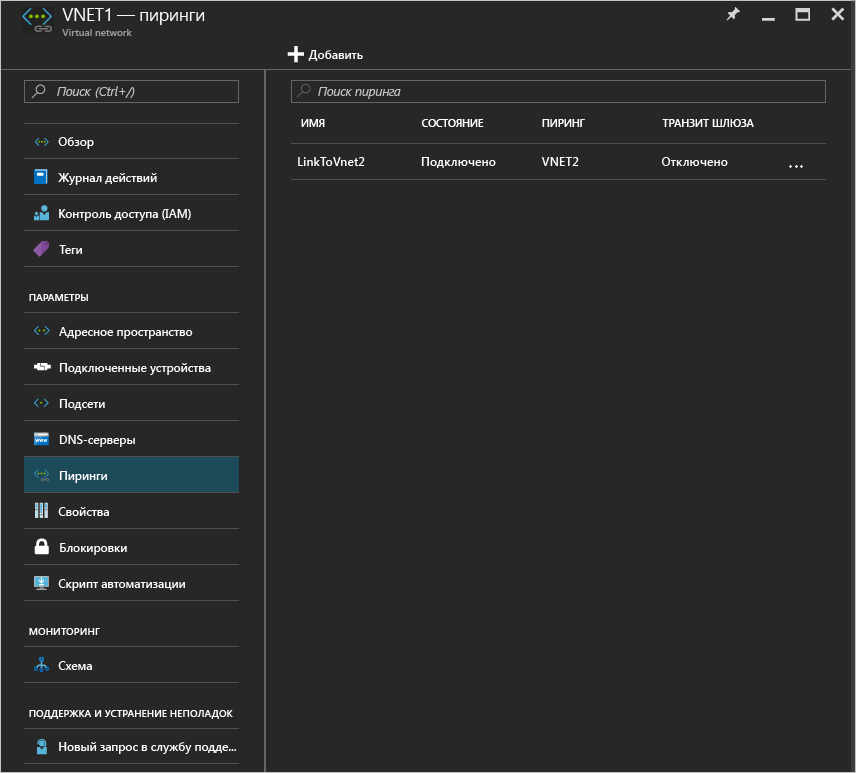

# Настройка пиринга виртуальных сетей с помощью портала Azure
[!INCLUDE [virtual-networks-create-vnet-selectors-arm-include](../../includes/virtual-networks-create-vnetpeering-selectors-arm-include.md)]

[!INCLUDE [virtual-networks-create-vnet-intro](../../includes/virtual-networks-create-vnetpeering-intro-include.md)]

[!INCLUDE [virtual-networks-create-vnet-scenario-basic-include](../../includes/virtual-networks-create-vnetpeering-scenario-basic-include.md)]

Чтобы настроить пиринг виртуальных сетей по описанному выше сценарию с помощью портала Azure, сделайте следующее:

1. В браузере откройте адрес http://portal.azure.com и войдите с помощью учетной записи Azure.
2. Чтобы настроить пиринг между двумя виртуальными сетями, необходимо создать два соединения — по одному для каждого направления. Сначала мы создадим пиринговое соединение от виртуальной сети VNET1 к сети VNET2. На портале щелкните **Обзор** > ** и выберите "Виртуальные сети"**.
   
    
3. В колонке виртуальных сетей выберите VNET1, щелкните "Пиринги", а затем — "Добавить".
   
    
4. В колонке "Добавить пиринг" присвойте пиринговому соединению имя LinkToVnet2, выберите нужную подписку, укажите виртуальную сеть VNET2 и нажмите кнопку "ОК".
   
    
5. После создания связи между виртуальными сетями состояние соединения будет таким:
   
    
6. Теперь мы создадим пиринговое соединение от виртуальной сети VNET2 к сети VNET1. В колонке виртуальных сетей выберите VNET2, щелкните "Пиринги", а затем — "Добавить".
   
    
7. В колонке "Добавить пиринг" присвойте пиринговому соединению имя LinkToVnet1, выберите нужную подписку и виртуальную сеть и нажмите кнопку "ОК".
   
    
8. После создания связи между виртуальными сетями состояние соединения будет таким:
   
    
9. Состояние соединения LinkToVnet2 теперь также примет значение "Подключено".  
   
    
   
   > [!NOTE]
   > Пиринг виртуальных сетей создается, только если оба соединения имеют состояние "Подключено".
   > 
   > 

Каждое соединение имеет несколько настраиваемых свойств.

| Параметр | Описание | значение по умолчанию |
|:--- |:--- |:--- |
| AllowVirtualNetworkAccess |Определяет, будет ли адресное пространство пиринговой виртуальной сети включено как часть тега Virtual_network. |Да |
| AllowForwardedTraffic |Определяет, будет ли приниматься трафик, поступающий не из пиринговой виртуальной сети. |Нет |
| AllowGatewayTransit |Разрешает пиринговой виртуальной сети использовать шлюз вашей виртуальной сети. |Нет |
| UseRemoteGateways |Необходимо использовать шлюз вашей пиринговой виртуальной сети. Этот шлюз должен быть настроен. Кроме того, должен быть выбран параметр AllowGatewayTransit. Этот параметр нельзя использовать, если вы уже настроили шлюз. |Нет |

Каждая пиринговая связь между виртуальными сетями имеет описанные выше свойства. Чтобы изменить выбранные параметры, на портале нужно щелкнуть пиринговое соединение между виртуальными сетями, внести изменения и нажать кнопку "Сохранить".

[!INCLUDE [virtual-networks-create-vnet-scenario-crosssub-include](../../includes/virtual-networks-create-vnetpeering-scenario-crosssub-include.md)]

1. В браузере откройте адрес http://portal.azure.com и войдите с помощью учетной записи Azure.
2. В этом примере мы используем две подписки, A и B, и два пользователя, A и B, которые имеют привилегии в соответствующих подписках.
3. На портале щелкните "Обзор", введите "Виртуальные сети" и щелкните отобразившийся пункт. Выберите виртуальную сеть и щелкните "Добавить".
   
    
4. В колонке "Добавить доступ" щелкните "Выберите роль" и выберите "Участник сетей". После этого щелкните "Добавить пользователей", введите в поле имя для входа пользователя B и нажмите кнопку "ОК".
   
    
   
    Это не является обязательным, так как пиринговую связь можно настроить, даже если пользователи отдельно отправляют запросы о пиринговом взаимодействии в рамках своих виртуальных сетей. Нужно только, чтобы эти запросы совпадали друг с другом. Добавление привилегированного пользователя из другой виртуальной сети в качестве пользователя локальной виртуальной сети упрощает настройку на портале.
5. Затем войдите на портал Azure с правами пользователя B, который является привилегированным пользователем в рамках подписки B. Выполните приведенные выше шаги, чтобы добавить пользователя A в качестве участника сетей.
   
    
   
   > [!NOTE]
   > Чтобы убедиться, что авторизация выполнена успешно, выполните вход и выход, используя имена обоих пользователей, в браузере.
   > 
   > 
6. Войдите на портал в качестве пользователя A, перейдите к колонке VNET3, щелкните "Пиринги", установите флажок "Я знаю идентификатор ресурса" и введите идентификатор ресурса сети VNET5 в следующем формате:
   
    /subscriptions/{SubscriptionID}/resourceGroups/{ResourceGroupName}/providers/Microsoft.Network/VirtualNetwork/{VNETname}
   
    
7. Войдите на портал в качестве пользователя B и выполните приведенные выше шаги, чтобы создать пиринговое соединение от VNET5 к VNet3.
   
    
8. После настройки пиринга любая виртуальная машина из сети VNet3 сможет обмениваться данными с любой виртуальной машиной из сети VNet5.

[!INCLUDE [virtual-networks-create-vnet-scenario-transit-include](../../includes/virtual-networks-create-vnetpeering-scenario-transit-include.md)]

1. Сначала настроим пиринговое соединение от сети HubVnet к сети VNET1. Обратите внимание, флажок "Разрешить перенаправленный трафик" не нужно устанавливать для этого соединения.
   
    
2. Теперь мы создадим пиринговое соединение от сети VNET1 к сети HubVnet. Обратите внимание, что теперь нужно установить флажок "Разрешить перенаправленный трафик".
   
    
3. Настроив пиринговую связь, ознакомьтесь с этой [статьей](virtual-network-create-udr-arm-ps.md). Из нее вы узнаете, как настроить пользовательский маршрут для перенаправления трафика VNet1 через виртуальное устройство. Указывая адрес следующего прыжка в маршруте, вы можете выбрать IP-адрес виртуального устройства в пиринговой виртуальной сети HubVNet.

[!INCLUDE [virtual-networks-create-vnet-scenario-asmtoarm-include](../../includes/virtual-networks-create-vnetpeering-scenario-asmtoarm-include.md)]

1. В браузере откройте адрес http://portal.azure.com и войдите с помощью учетной записи Azure.
2. Чтобы настроить пиринговую связь в этом сценарии, необходимо создать только одно соединение — от виртуальной сети Azure Resource Manager к классической сети. То есть от **VNET1** к **VNET2**. На портале, щелкните **Обзор** и выберите **Виртуальные сети**.
3. В колонке "Виртуальные сети" выберите **VNET1**. Щелкните **Пиринги**, а затем нажмите кнопку **Добавить**.
4. В колонке "Добавить пиринг" введите имя соединения. В этом примере соединение названо **LinkToVNet2**. В разделе сведений о пиринге выберите **Классический**.
5. Выберите нужную подписку и укажите виртуальную сеть **VNET2**. Затем нажмите кнопку ОК.
   
    
6. После создания связи между двумя виртуальными сетями вы увидите следующее:
   
    

## Удаление пиринговой связи между виртуальными сетями
1. В браузере откройте адрес http://portal.azure.com и войдите с помощью учетной записи Azure.
2. Перейдите к колонке виртуальной сети, щелкните "Пиринги", выберите соединение, которое нужно удалить, и нажмите кнопку "Удалить".
   
   
3. Когда вы удалите одну связь в пиринговой сети, состояние пирингового соединения изменится на "Отключено".
   
    
4. В этом состоянии вы не сможете повторно создать соединение, пока состояние не изменится на "Инициировано". Перед повторным созданием пиринговой связи между виртуальными сетями рекомендуем удалить оба соединения.

<!--HONumber=Nov16_HO2-->

