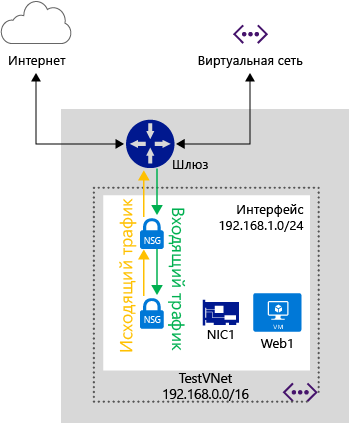

<properties 
   pageTitle="Группа безопасности сети"
   description="Эта статья содержит сведения о распределенном брандмауэре в Azure, использующем группы безопасности сети (NSG), и использовании групп безопасности сети для изоляции и контроля потоков трафика в виртуальных сетях."
   services="virtual-network"
   documentationCenter="na"
   authors="jimdial"
   manager="carmonm"
   editor="tysonn" />
<tags 
   ms.service="virtual-network"
   ms.devlang="na"
   ms.topic="get-started-article"
   ms.tgt_pltfrm="na"
   ms.workload="infrastructure-services"
   ms.date="02/11/2016"
   ms.author="jdial" />

# Группа безопасности сети

Группа безопасности сети (NSG) содержит перечень правил списка управления доступом (ACL), которые разрешают или запрещают сетевой трафик на экземпляры виртуальных машин в виртуальной сети. Группы безопасности сети можно связать с подсетями или отдельными экземплярами виртуальных машин в одной из подсетей. Когда группа безопасности сети связана с подсетью, правила списка управления доступом применяются ко всем экземплярам виртуальной машины в этой подсети. Кроме того, трафик на отдельные виртуальные машины можно дополнительно ограничить, связав группу безопасности сети непосредственно с нужной виртуальной машиной.

## Ресурс NSG

Группы безопасности сети содержат следующие свойства.

|Свойство|Описание|Ограничения|Рекомендации|
|---|---|---|---|
|Имя|Имя группы безопасности сети|Должно быть уникальным в пределах региона. Может содержать буквы, цифры, символы подчеркивания, точки и дефисы. Должно начинаться с буквы или цифры. Должно заканчиваться буквой, цифрой или символом подчеркивания. Может содержать до 80 символов.|Так как может потребоваться создать несколько групп NSG, убедитесь, что соглашение об именовании позволяет легко определить назначение ваших групп NSG.|
|Регион|Регион Azure, в котором размещается группа NSG|Группы NSG можно применять только к ресурсам в пределах региона, в котором они созданы.|Дополнительную информацию о том, сколько групп NSG может содержать регион, см. в разделе [Ограничения](#Limits) ниже.|
|Группа ресурсов|Группа ресурсов, к которой относится группа NSG|Несмотря на то, что группа NSG входит в определенную группу ресурсов, ее можно связать с ресурсами в любой другой группе при условии, что ресурс находится в одном регионе Azure с группой NSG.|Группы ресурсов используются для одновременного управления несколькими ресурсами как единицей развертывания. Группу безопасности сети можно сгруппировать со связанными ресурсами.|
|Правила|Правила, которые определяют разрешенный и запрещенный трафик||Дополнительную информацию см. в разделе [Правила групп безопасности сети (NSG)](#Nsg-rules) ниже.| 

>[AZURE.NOTE] На одном экземпляре виртуальной машины нельзя одновременно использовать списки ACL для конечных точек и группы NSG. Если вам нужна группа NSG, но у вас уже есть список ACL для конечных точек, сначала удалите этот список. Сведения о том, как это сделать, см. в статье [Управление списками управления доступом для конечных точек с помощью PowerShell](virtual-networks-acl-powershell.md).

### Правила групп безопасности сети (NSG)

Правила групп NSG содержат следующие свойства.

|Свойство|Описание|Ограничения|Рекомендации|
|---|---|---|---|
|**Имя**|Имя правила|Должно быть уникальным в пределах региона. Может содержать буквы, цифры, символы подчеркивания, точки и дефисы. Должно начинаться с буквы или цифры. Должно заканчиваться буквой, цифрой или символом подчеркивания. Может содержать до 80 символов.|Группа NSG может содержать несколько правил. Поэтому обязательно придерживайтесь соглашения об именовании, которое позволяет судить о функции правила.|
|**Протокол**|Протокол правила для сопоставления.|TCP, UDP или *|Использование * в качестве протокола включает использование протокола ICMP (только трафик Восток — Запад), а также UDP и TCP, и может сократить необходимое количество правил. Вместе с тем использование * может быть слишком широким, поэтому используйте его только при необходимости.|
|**Диапазон исходных портов**|Диапазон портов источника правила для сопоставления.|Один номер порта от 1 до 65535, диапазон портов (т. е. от 1 до 65635) или * (все порты).|Исходные порты могут быть временными. Если клиентская программа не использует определенный порт, в большинстве случаев следует использовать "*". Старайтесь использовать диапазоны портов, где это возможно, чтобы не задавать несколько правил. Несколько портов или диапазонов портов нельзя группировать, указывая их через запятую.
|**Диапазон конечных портов**|Диапазон портов назначения правила для сопоставления.|Один номер порта от 1 до 65535, диапазон портов (т. е. от 1 до 65535) или "*" (все порты).|Старайтесь использовать диапазоны портов, где это возможно, чтобы не задавать несколько правил. Несколько портов или диапазонов портов нельзя группировать, указывая их через запятую.
|**Префикс исходного адреса**|Префикс исходного адреса или тег правила для сопоставления|Один IP-адрес (т. е. 10.10.10.10), IP-подсеть (т. е. 192.168.1.0/24), [тег по умолчанию](#default-tags) или * (для всех адресов).|Чтобы уменьшить количество правил, лучше всего использовать диапазоны, теги по умолчанию и символ *.|
|**Префикс адреса назначения**|Префикс конечного адреса или тег правила для сопоставления|Один IP-адрес (т. е. 10.10.10.10), IP-подсеть (т. е. 192.168.1.0/24), [тег по умолчанию](#default-tags) или * (для всех адресов).|Чтобы уменьшить количество правил, лучше всего использовать диапазоны, теги по умолчанию и символ *.|
|**Направление**|Направление трафика правила для сопоставления.|inbound или outbound|Правила входящего и исходящего трафика обрабатываются отдельно, в зависимости от направления.|
|**Приоритет**|Правила проверяются в порядке приоритета. Когда применяется правило, соответствие другим правилам не проверяется.|Значение в диапазоне от 100 до 4096.|Рекомендуем создавать правила перехода через 100 для каждого правила, чтобы оставить место для новых правил, появляющихся между существующими правилами.|
|**Access**|Тип доступа, применяемый при соответствии правилу.|allow или deny|Не забывайте: если разрешающее правило для пакета не найдено, пакет отбрасывается.|

Группы безопасности сети содержат два набора правил: для входящего и исходящего трафика. Приоритет для правила должен быть уникальным в пределах каждого набора.

На рисунке выше показано, как обрабатываются правила NSG.

### Теги по умолчанию

Теги по умолчанию — это системные идентификаторы для определения категорий IP-адресов. Для свойств **префикс исходного адреса** и **префикс конечного адреса** можно использовать теги по умолчанию. Существует три доступных тега по умолчанию.

- **VIRTUAL\_NETWORK**. Это тег по умолчанию, обозначающий все адресное пространство сети. Он включает адресное пространство виртуальной сети (диапазоны CIDR, определенные в Azure) и все адресное пространство подключенных локальных сетей и виртуальных сетей Azure.

- **AZURE\_LOADBALANCER**. Это тег по умолчанию, обозначающий балансировщик нагрузки для инфраструктуры Azure. Он преобразуется в IP-адрес центра обработки данных Azure, где инициируются проверки работоспособности Azure.

- **INTERNET**. Это тег по умолчанию, обозначающий пространство IP-адресов, которые находятся за пределами виртуальной сети и к которым можно получить доступ из общедоступного сегмента Интернета. К этому диапазону относится также [пространство общедоступных IP-адресов, принадлежащее Azure](https://www.microsoft.com/download/details.aspx?id=41653).

### Правила по умолчанию

Все группы NSG содержат набор правил по умолчанию. Эти правила нельзя удалить, но у них самый низкий приоритет, поэтому их можно переопределить, создав другие правила.

Как показано в таблице правил по умолчанию ниже, входящий и исходящий трафик виртуальной сети разрешен в обоих направлениях. По умолчанию исходящий трафик в Интернет разрешен, входящий трафик из Интернета заблокирован. Существует правило по умолчанию, которое разрешает балансировщику нагрузки Azure инициировать проверку работоспособности виртуальных машин и экземпляров роли. Это правило можно переопределить, если набор балансировки нагрузки не используется.

**Правила по умолчанию для входящего трафика**

| Имя | Приоритет | Исходный IP-адрес | Исходный порт | Конечный IP-адрес | Конечный порт | Протокол | Доступ |
|-----------------------------------|----------|--------------------|-------------|-----------------|------------------|----------|--------|
| РАЗРЕШИТЬ ВХОДЯЩИЙ ТРАФИК ВИРТУАЛЬНОЙ СЕТИ | 65000 | VIRTUAL\_NETWORK | * | VIRTUAL\_NETWORK | * | * | РАЗРЕШИТЬ |
| РАЗРЕШИТЬ ВХОДЯЩИЙ ТРАФИК БАЛАНСИРОВЩИКА НАГРУЗКИ AZURE | 65001 | AZURE\_LOADBALANCER | * | * | * | * | РАЗРЕШИТЬ |
| ЗАПРЕТИТЬ ВЕСЬ ВХОДЯЩИЙ ТРАФИК | 65500 | * | * | * | * | * | ЗАПРЕТИТЬ |

**Правила по умолчанию для исходящего трафика**

| Имя | Приоритет | Исходный IP-адрес | Исходный порт | Конечный IP-адрес | Конечный порт | Протокол | Доступ |
|-------------------------|----------|-----------------|-------------|-----------------|------------------|----------|--------|
| РАЗРЕШИТЬ ИСХОДЯЩИЙ ТРАФИК ВИРТУАЛЬНОЙ СЕТИ | 65000 | VIRTUAL\_NETWORK | * | VIRTUAL\_NETWORK | * | * | РАЗРЕШИТЬ |
| РАЗРЕШИТЬ ИСХОДЯЩИЙ ИНТЕРНЕТ-ТРАФИК | 65001 | * | * | ИНТЕРНЕТ | * | * | РАЗРЕШИТЬ |
| ЗАПРЕТИТЬ ВЕСЬ ИСХОДЯЩИЙ ТРАФИК | 65500 | * | * | * | * | * | ЗАПРЕТИТЬ |

## Связывание групп NSG

Группу NSG можно связать с виртуальными машинами, сетевыми адаптерами и подсетями. Выбор зависит от используемой модели развертывания.

[AZURE.INCLUDE [learn-about-deployment-models-both-include.md](../../includes/learn-about-deployment-models-both-include.md)]
 
- **Связывание группы NSG с виртуальной машиной (только для классических развертываний).** При связывании группы безопасности сети с виртуальной машиной правила доступа к сети в этой группе NSG применяются ко всему входящему и исходящему трафику данной виртуальной машины.

- **Связывание группы NSG с сетевой картой (только для развертываний диспетчера ресурсов).** При связывании группы безопасности сети с сетевой картой правила доступа к сети в этой группе NSG применяются только для данной сетевой карты. Это означает, что, если группа NSG применяется к одной сетевой карте на виртуальной машине с несколькими сетевыми картами, она не затрагивает трафик других сетевых карт.

- **Связывание группы NSG с подсетью (все развертывания)**. При связывании группы NSG с подсетью правила доступа к сети этой группы NSG применяются ко всем ресурсам IaaS и PaaS в данной подсети.

Различные группы NSG можно связать с виртуальной машиной (или сетевой картой в зависимости от модели развертывания) и подсетью, с которой связана сетевая карта или виртуальная машина. В этом случае все правила доступа к сети применяются к трафику в каждой группе безопасности сети в следующем порядке.

- **Входящий трафик**
	1. Группа NSG применяется к подсети.
	
           Если NSG подсети имеет соответствующее правило для блокировки трафика, пакет будет удален.
	2. NSG применяется к сетевой карте (диспетчеру ресурсов) или виртуальной машине (классическое развертывание).
	   
           Если NSG виртуальной машины или сетевой карты имеет соответствующее правило для блокировки трафика, пакет будет удален на виртуальной машине или сетевой карте, несмотря на то что NSG подсети имеет соответствующее правило, разрешающее трафик.
- **Исходящий трафик**
	1. NSG применяется к сетевой карте (диспетчеру ресурсов) или виртуальной машине (классическое развертывание).
	  
           Если NSG виртуальной машины или сетевой карты имеет соответствующее правило для блокировки трафика, пакет будет удален.
	2. Группа NSG применяется к подсети.
	   
           Если NSG подсети имеет соответствующее правило для блокировки трафика, пакет будет удален, несмотря на то что NSG виртуальной машины или сетевой карты имеет соответствующее правило, разрешающее трафик.

	

>[AZURE.NOTE] Хотя к подсети, виртуальной машине или сетевой карте можно привязать только одну группу безопасности сети, ту же самую группу NSG можно связать с любым необходимым количеством ресурсов.

## Реализация
Группы безопасности сети можно реализовать в классической модели развертывания или в модели развертывания диспетчера ресурсов с помощью различных средств, перечисленных ниже.

|Средство развертывания|Классический|Диспетчер ресурсов|
|---|---|---|
|Классический портал.|||
|Портал Azure||[![Да][green]](virtual-networks-create-nsg-arm-pportal.md)|
|PowerShell|[![Да][green]](virtual-networks-create-nsg-classic-ps.md)|[![Да][green]](virtual-networks-create-nsg-arm-ps.md)|
|Инфраструктура CLI Azure|[![Да][green]](virtual-networks-create-nsg-classic-cli.md)|[![Да][green]](virtual-networks-create-nsg-arm-cli.md)|
|Шаблон ARM||[![Да][green]](virtual-networks-create-nsg-arm-template.md)|

|**Ключ**| Поддерживается.| Не поддерживается.|
|---|---|---|

## Планирование

Перед реализацией групп NSG необходимо ответить на следующие вопросы.

1. Для каких типов ресурсов необходимо фильтровать входящий и исходящий трафик (для сетевых карт на одной виртуальной машине, виртуальных машин и других ресурсов, к примеру облачных служб или сред службы приложений, подключенных к той же подсети, или трафик между ресурсами, которые подключены к разным подсетям)?

2. Все ли ресурсы, для которых необходимо фильтровать входящий и исходящий трафик, подключены к подсетям в существующих виртуальных сетях, или они будут подключены к новым виртуальным сетям или подсетям?
 
Дополнительные сведения о планировании сетевой безопасности в Azure см. в статье [Облачные службы Microsoft Cloud и сетевая безопасность](../best-practices-network-security.md).

## Рекомендации по проектированию

Если вы знаете ответы на вопросы из раздела [Планирование](#Planning), перед определением групп NSG просмотрите следующую таблицу.

### Ограничения

При разработке групп NSG необходимо учитывать следующие ограничения.

|**Описание**|**Ограничение по умолчанию**|**Последствия**|
|---|---|---|
|Количество групп NSG, которые можно связать с подсетью, виртуальной машиной или сетевой картой|1|Это означает, что нельзя объединять группы NSG. Убедитесь, что все правила, необходимые для данного набора ресурсов, находятся в одной NSG.|
|Число групп NSG в регионе на подписку|100|По умолчанию для каждой виртуальной машины, создаваемой на портале Azure, создается новая группа NSG. Если вы разрешите это поведение по умолчанию, очень быстро останетесь без групп NSG. Во время разработки следует учитывать это ограничение и при необходимости распределить ресурсы между несколькими регионами или подписками. |
|Правил группы NSG на группу NSG|200|Чтобы не превысить это ограничение, используйте широкий диапазон IP-адресов и портов. |

>[AZURE.IMPORTANT] Перед разработкой решения обязательно ознакомьтесь со всеми [ограничениями, касающимися сетевых служб в Azure](../azure-subscription-service-limits.md#networking-limits). Некоторые ограничения можно увеличить, отправив запрос в службу поддержки.

### Разработка виртуальных сетей и подсетей

Так как группы NSG могут применяться к подсетям, можно свести к минимуму количество групп NSG. Для этого ресурсы следует сгруппировать по подсетям и применить к подсетям группы NSG. Если вы захотите применить группы NSG к подсетям, может оказаться, что существующие виртуальные сети и подсети определены без учета групп NSG. Возможно, потребуется задать новые виртуальные сети и подсети для поддержки вашей схемы группы NSG. Затем разверните новые ресурсы в новых подсетях. После этого можно определяться со стратегией миграции для перемещения существующих ресурсов в новые подсети.

### Специальные правила

Необходимо учитывать особые правила, приведенные ниже. Убедитесь, что вы не заблокировали трафик, разрешенный этими правилами, в противном случае инфраструктура не сможет взаимодействовать с основными службами Azure.

- **Виртуальный IP-адрес главного узла**. Базовые службы инфраструктуры, например DHCP, DNS и служба наблюдение за работоспособностью системы, работают через IP-адрес виртуализированного узла 168.63.129.16. Этот общедоступный IP-адрес принадлежит корпорации Майкрософт. Он является единственным виртуализированным IP-адресом, используемым для этих целей во всех регионах. Адрес сопоставляется с физическим IP-адресом сервера (главного узла), на котором размещена виртуальная машина. Главный узел выполняет функции ретранслятора DHCP, рекурсивного сопоставителя DNS-имен и источника проб работоспособности, инициируемых балансировщиком нагрузки и виртуальными машинами. Обмен данными с этим IP-адресом не является атакой.

- **Лицензирование (служба управления ключами)**. Для используемых на виртуальных машинах образов Windows требуется лицензия. С этой целью на соответствующие серверы узлов, на которых работает служба управления ключами, отправляется запрос на получение лицензии. Для этого всегда используется исходящий порт 1688.

### ICMP-трафик

Текущие правила NSG разрешают использовать только протоколы *TCP* и *UDP*. Для *ICMP* нет отдельного тега. Тем не менее по умолчанию ICMP-трафик в виртуальной сети разрешен правилом для входящего трафика виртуальной сети (правило по умолчанию 65000 для входящего трафика). Оно разрешает входящий и исходящий трафик в виртуальной сети на любом порту и по любому протоколу.

### Подсети

- Определите, сколько уровней необходимо для вашей рабочей нагрузки. Каждый уровень можно изолировать с помощью подсети, применив к ней группу NSG.
- Если необходимо реализовать подсеть для VPN-шлюза или канала ExpressRoute, ни в коем случае **НЕ** применяйте группу NSG к этой подсети. Если это сделать, подключение по виртуальной сети или между локальными сетями будет невозможно установить.
- Если необходимо реализовать виртуальное устройство, убедитесь, что развертываете устройство в его собственной подсети. Тогда определенные пользователем маршруты будут работать правильно. Можно реализовать группу NSG на уровне подсети для фильтрации входящего и исходящего трафика подсети. Дополнительные сведения об [управлении потоком трафика и использовании виртуальных устройств](virtual-networks-udr-overview.md).

### Балансировщики нагрузки

- Рассмотрите правила балансировки нагрузки и преобразования сетевых адресов для балансировщиков нагрузки, используемых рабочими нагрузками. Эти правила привязаны к внутреннему пулу, содержащему сетевые карты (развертывания диспетчера ресурсов) или экземпляры ВМ или ролей (классические развертывания). Рассмотрите возможность создания группы NSG для всех внутренних пулов. Так будет разрешаться только трафик на основе правил, реализованных в балансировщиках нагрузки. Это гарантирует, что трафик, приходящий на внутренний пул напрямую, минуя балансировщик нагрузки, также фильтруется.
- В классическом развертывании создайте конечные точки, сопоставляющие порты на балансировщике нагрузки с портами на виртуальных машинах или экземплярах ролей. Можно также создать собственный отдельный общедоступный балансировщик нагрузки в развертывании диспетчера ресурсов. Если вы ограничиваете трафик к экземплярам ВМ и ролей во внутреннем пуле на балансировщике нагрузки с помощью групп NSG, имейте в виду, что порт назначения для входящего трафика является действительным портом на экземпляре ВМ или роли, а не портом балансировщика нагрузки. Кроме того, не забывайте, что порт источника и адрес для подключения к ВМ являются портом и адресом удаленного компьютера в Интернете, а не балансировщика нагрузки.
- Как и в случае с общедоступными балансировщиками нагрузки, создавая группы NSG для фильтрации трафика, проходящего через внутренний балансировщик нагрузки, имейте в виду, что порт источника и применяемый диапазон адресов принадлежат компьютеру, от которого поступил вызов, а не балансировщику нагрузки. Порт назначения и диапазон адресов связаны с компьютером, получающим трафик, а не с балансировщиком нагрузки.

### Другие

- На одном экземпляре виртуальной машины нельзя одновременно использовать списки управления доступом для конечных точек и групп NSG. Если вам нужна группа NSG, но у вас уже есть список ACL для конечных точек, сначала удалите этот список. Сведения о том, как это сделать, см. в статье [Управление списками управления доступом для конечных точек с помощью PowerShell](virtual-networks-acl-powershell.md).
- В модели развертывания диспетчера ресурсов можно использовать группу NSG, связанную с сетевой картой, для виртуальных машин с несколькими сетевыми картами. Так ими можно будет управлять (через удаленный доступ) с помощью сетевой карты и, следовательно, разделить трафик.
- Как и при использовании балансировщиков нагрузки, во время фильтрации трафика из других виртуальных сетей необходимо использовать диапазон адресов источника удаленного компьютера, а не шлюза для подключения виртуальных сетей.
- Многим службам Azure не удается подключиться к виртуальным сетям Azure. Поэтому их входящий и исходящий трафик невозможно отфильтровать с помощью групп NSG. Чтобы определить, возможно ли подключиться к виртуальным сетям, прочтите документацию по используемым службам.

## Пример развертывания

Чтобы на практике проиллюстрировать все описанное в этой статье, зададим группы NSG для фильтрации сетевого трафика для двухуровневого решения рабочей нагрузки со следующими требованиями:

1. Разделение трафика между внешним интерфейсом (веб-серверами Windows) и серверной частью (серверами баз данных SQL).
2. Правила балансировки нагрузки, перенаправляющие трафик, который поступает на балансировщик нагрузки, на все веб-сервера на порте 80.
3. Правила преобразования сетевых адресов, перенаправляющие трафик, который поступает на порт 50001 балансировщика нагрузки, а затем на порт 3389 только одной ВМ в подсети переднего плана.
4. Отсутствие доступа из Интернета к виртуальным машинам в подсети переднего плана или внутренней подсети (если это не противоречит требованию 1).
5. Отсутствие доступа к Интернету из подсети переднего плана или внутренней подсети.
6. Доступ к порту 3389 любого веб-сервера в подсети переднего плана для трафика, поступающего из этой же подсети.
7. Доступ к порту 3389 всех виртуальных машин SQL Server во внутренней подсети только из подсети переднего плана.
8. Доступ к порту 1433 всех виртуальных машин SQL Server во внутренней подсети только из подсети переднего плана.
9. Разделение трафика управления (порт 3389) и трафика базы данных (1433) на разные сетевые карты на виртуальных машинах внутренней подсети.

Как видно из схемы выше, *Web1* и *Web2* — виртуальные машины, подключенные к подсети *FrontEnd*, а *DB1* и *DB2* — виртуальные машины, подключенные к подсети *BackEnd*. Обе подсети являются частью виртуальной сети *TestVNet*. Все ресурсы назначены региону Azure *Запад США*.

Требования к 1–6 (за исключением 3), приведенные выше, касаются только пространства подсетей. Чтобы свести к минимуму число правил, необходимых для каждой группы NSG, и упростить добавление в подсети дополнительных ВМ, имеющих дело с теми же типами рабочих нагрузок, что и уже имеющиеся ВМ, можно реализовать группы NSG следующего уровня.

### Группы NSG для подсети FrontEnd

**Правила для входящего трафика**

|правило;|Access|Приоритет|Диапазон адресов источника|Порт источника|Диапазон адресов назначения|Порт назначения|Протокол|
|---|---|---|---|---|---|---|---|
|Разрешение HTTP|Разрешение|100|ИНТЕРНЕТ|*|*|80|TCP|
|Разрешение RDP из FrontEnd|Разрешение|200|192\.168.1.0/24|*|*|3389|TCP|
|Запрещение трафика из Интернета|Запрет|300|ИНТЕРНЕТ|*|*|*|TCP|

**Правила для исходящего трафика**

|правило;|Access|Приоритет|Диапазон адресов источника|Порт источника|Диапазон адресов назначения|Порт назначения|Протокол|
|---|---|---|---|---|---|---|---|
|Запрет Интернета|Запрет|100|*|*|ИНТЕРНЕТ|*|*|

### Группа NSG для подсети BackEnd

**Правила для входящего трафика**

|правило;|Access|Приоритет|Диапазон адресов источника|Порт источника|Диапазон адресов назначения|Порт назначения|Протокол|
|---|---|---|---|---|---|---|---|
|Запрет Интернета|Запрет|100|ИНТЕРНЕТ|*|*|*|*|

**Правила для исходящего трафика**

|правило;|Access|Приоритет|Диапазон адресов источника|Порт источника|Диапазон адресов назначения|Порт назначения|Протокол|
|---|---|---|---|---|---|---|---|
|Запрет Интернета|Запрет|100|*|*|ИНТЕРНЕТ|*|*|

### Группа NSG для одной ВМ (сетевая карта) в подсети FrontEnd для RDP из Интернета

**Правила для входящего трафика**

|правило;|Access|Приоритет|Диапазон адресов источника|Порт источника|Диапазон адресов назначения|Порт назначения|Протокол|
|---|---|---|---|---|---|---|---|
|Разрешение RDP из Интернета|Разрешение|100|ИНТЕРНЕТ|*|\*|3389|TCP|

>[AZURE.NOTE] Обратите внимание, что для балансировщика нагрузки диапазоном исходных адресов в этом правиле является **Интернет**, а не виртуальный IP-адрес, а исходным портом является **\***, а не 500001. Не путайте правила преобразования сетевых адресов или правила балансировки нагрузки с правилами групп NSG. Правила NSG всегда связаны с исходным источником и конечным получателем трафика **БЕЗ** балансировщика нагрузки между ними.

### Группа NSG для управления сетевыми картами в BackEnd

**Правила для входящего трафика**

|правило;|Access|Приоритет|Диапазон адресов источника|Порт источника|Диапазон адресов назначения|Порт назначения|Протокол|
|---|---|---|---|---|---|---|---|
|Разрешение RDP из интерфейсной подсети|Разрешение|100|192\.168.1.0/24|*|\*|3389|TCP|

### Группа NSG для сетевых карт доступа к базам данных во внутренней подсети

**Правила для входящего трафика**

|правило;|Access|Приоритет|Диапазон адресов источника|Порт источника|Диапазон адресов назначения|Порт назначения|Протокол|
|---|---|---|---|---|---|---|---|
|Разрешение SQL из интерфейсной подсети|Разрешение|100|192\.168.1.0/24|*|\*|1433|TCP|

Некоторые указанные выше группы NSG требуют связывания с отдельными сетевыми картами. Этот сценарий необходимо развертывать в диспетчере ресурсов. Обратите внимание, что правила для уровней подсетей и сетевых карт объединяются в зависимости от их применения.

## Дальнейшие действия

- [Развертывание групп безопасности сети в классической модели развертывания](virtual-networks-create-nsg-classic-ps.md).
- [Развертывание групп безопасности сети в диспетчере ресурсов](virtual-networks-create-nsg-arm-pportal.md).
- [Управление журналами групп безопасности сети](virtual-network-nsg-manage-log.md).

[green]: ./media/virtual-network-nsg-overview/green.png
[yellow]: ./media/virtual-network-nsg-overview/yellow.png
[red]: ./media/virtual-network-nsg-overview/red.png

<!---HONumber=AcomDC_0907_2016--->