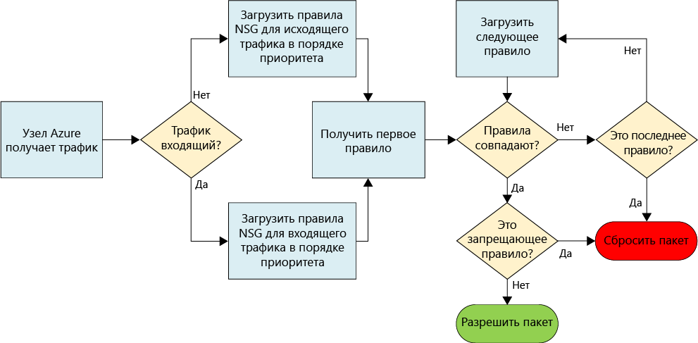
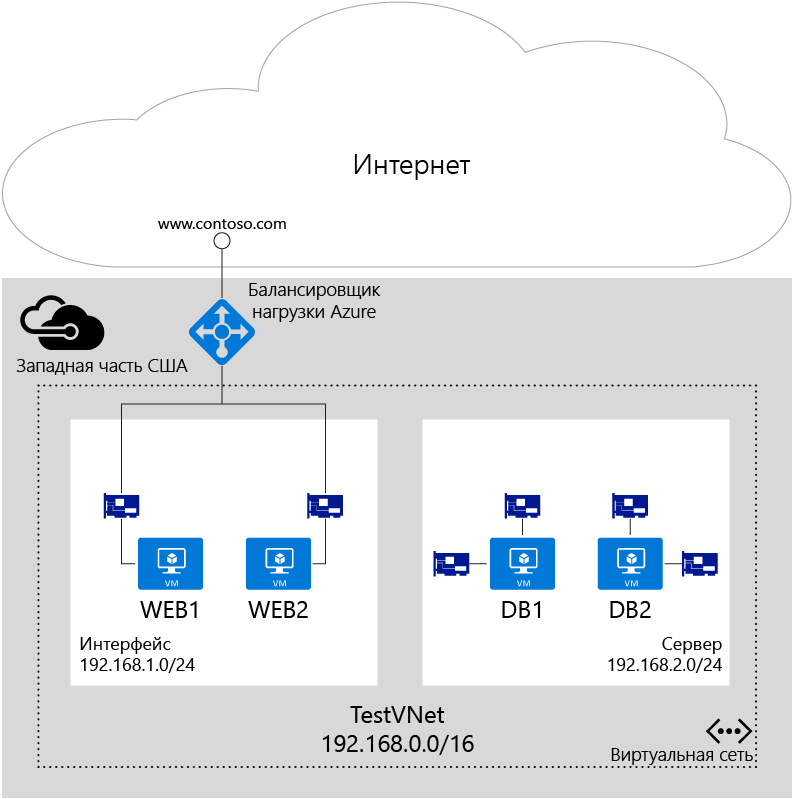

# Фильтрация сетевого трафика с помощью групп безопасности сети

Группа безопасности сети (NSG) содержит перечень правил безопасности, которые разрешают или запрещают передачу сетевого трафика к ресурсам, подключенным к виртуальным сетям Azure. Группы безопасности сети можно связать с подсетями, отдельными виртуальными машинами (классическими) или отдельными сетевыми интерфейсами (NIC), подключенными к виртуальным машинам (Resource Manager). Если группа безопасности сети связана с подсетью, эти правила применяются ко всем ресурсам в подсети. Кроме того, трафик можно ограничить, связав группу безопасности сети с отдельной виртуальной машиной или сетевым интерфейсом.
 
> [!NOTE]
> В Azure предлагаются две модели развертывания для создания ресурсов и работы с ними: [модель Resource Manager и классическая модель](../resource-manager-deployment-model.md). В этой статье описывается использование обеих моделей, но для большинства новых развертываний корпорация Майкрософт рекомендует использовать модель диспетчера ресурсов.

## Ресурс NSG
Ниже приведены свойства групп безопасности сети.

| Свойство | ОПИСАНИЕ | Ограничения | Рекомендации |
| --- | --- | --- | --- |
| ИМЯ |Имя группы безопасности сети |Должно быть уникальным в пределах региона. Может содержать буквы, цифры, символы подчеркивания, точки и дефисы. Первый символ — буква или цифра. Последний символ — буква, цифра или символ подчеркивания. Максимальная длина: 80 символов. |Так как может потребоваться создать несколько групп безопасности сети, убедитесь, что соглашение об именовании позволяет легко определить назначение этих групп. |
| Регион |[Регион](https://azure.microsoft.com/regions) Azure, в котором создана группа безопасности сети. |Группы безопасности сети можно связывать только с ресурсами в пределах региона, в котором созданы эти группы. |Дополнительные сведения о том, сколько групп безопасности сети можно создать на регион, см. в разделе [Ограничения сети](../azure-subscription-service-limits.md#virtual-networking-limits-classic).|
| Группа ресурсов |[Группа ресурсов](../azure-resource-manager/resource-group-overview.md#resource-groups), к которой относится группа безопасности сети. |Несмотря на то что группа NSG входит в определенную группу ресурсов, ее можно связать с ресурсами в любой другой группе при условии, что ресурс находится в одном регионе Azure с группой NSG. |Группы ресурсов используются для одновременного управления несколькими ресурсами как единицей развертывания. Группу безопасности сети можно сгруппировать со связанными ресурсами. |
| Правила |Правила для входящего и исходящего трафика, определяющие разрешенный и запрещенный трафик. | |Дополнительные сведения см. в разделе о [правилах групп безопасности сети](#Nsg-rules) этой статьи. |

> [!NOTE]
> На одном экземпляре виртуальной машины нельзя одновременно использовать списки ACL для конечных точек и группы NSG. Если вам нужна группа NSG, но у вас уже есть список ACL для конечных точек, сначала удалите этот список. Сведения о том, как это сделать, см. в статье [Управление списками управления доступом конечной точки с помощью PowerShell в классической модели развертывания](virtual-networks-acl-powershell.md).
> 

### Правила групп безопасности сети (NSG)
Правила групп NSG содержат следующие свойства.

| Свойство | ОПИСАНИЕ | Ограничения | Рекомендации |
| --- | --- | --- | --- |
| **Имя** |Имя правила. |Должно быть уникальным в пределах региона. Может содержать буквы, цифры, символы подчеркивания, точки и дефисы. Первый символ — буква или цифра. Последний символ — буква, цифра или символ подчеркивания. Максимальная длина: 80 символов. |Группа безопасности сети может содержать несколько правил. Поэтому обязательно придерживайтесь соглашения об именовании, которое позволяет определить назначение правила. |
| **Протокол** |Протокол правила для сопоставления. |TCP, UDP или * |Использование "*" в качестве протокола включает использование протокола ICMP (только трафик Восток — Запад), а также UDP и TCP и может сократить необходимое количество правил. Вместе с тем использование "*" может быть слишком широким, поэтому мы рекомендуем использовать его только при необходимости. |
| **Диапазон исходных портов** |Диапазон портов источника правила для сопоставления. |Один номер порта от 1 до 65535, диапазон портов (например, 1–65535) или * (для всех портов). |Исходные порты могут быть временными. Если клиентская программа не использует определенный порт, в большинстве случаев следует использовать "*". Старайтесь использовать диапазоны портов, где это возможно, чтобы не задавать несколько правил. Несколько портов или диапазонов портов нельзя группировать, указывая их через запятую. |
| **Диапазон конечных портов** |Диапазон портов назначения правила для сопоставления. |Один номер порта от 1 до 65535, диапазон портов (например, 1–65535) или \* (для всех портов). |Старайтесь использовать диапазоны портов, где это возможно, чтобы не задавать несколько правил. Несколько портов или диапазонов портов нельзя группировать, указывая их через запятую. |
| **Префикс исходного адреса** |Префикс исходного адреса или тег правила для сопоставления. |Отдельный IP-адрес (например, 10.10.10.10), IP-подсеть (например, 192.168.1.0/24), [тег службы](#service-tags) или "*" (для всех адресов). |Чтобы уменьшить количество правил, рекомендуем использовать диапазоны, теги служб и символ "*". |
| **Префикс адреса назначения** |Префикс конечного адреса или тег правила для сопоставления. | Отдельный IP-адрес (например, 10.10.10.10), IP-подсеть (например, 192.168.1.0/24), [тег по умолчанию](#service-tags) или "*" (для всех адресов). |Чтобы уменьшить количество правил, рекомендуем использовать диапазоны, теги служб и символ "*". |
| **Направление** |Направление трафика правила для сопоставления. |Входящий или исходящий. |Правила для входящего и исходящего трафика обрабатываются отдельно, в зависимости от направления. |
| **Приоритет** |Правила проверяются в порядке приоритета. Когда применяется правило, соответствие других правил не проверяется. | Значение в диапазоне от 100 до 4096. | Мы рекомендуем создавать правила перехода через 100 для каждого правила, чтобы оставить место для правил, которые можно создать в будущем. |
| **Access** |Тип доступа, применяемый при соответствии правилу. | Разрешить или запретить доступ. | Не забывайте: если разрешающее правило для пакета не найдено, пакет отбрасывается. |

Группы безопасности сети содержат два набора правил: для входящего и исходящего трафика. Приоритет для правила должен быть уникальным в пределах каждого набора. 

 

На рисунке выше показано, как обрабатываются правила групп безопасности сети.

### Системные теги

Теги служб — это системные идентификаторы для определения категорий IP-адресов. Для свойств **префикса исходного адреса** и **префикса конечного адреса** любого правила безопасности можно использовать теги служб. Дополнительные сведения о [тегах служб](security-overview.md#service-tags).

### Правила безопасности по умолчанию

Все группы NSG содержат набор правил безопасности по умолчанию. Эти правила нельзя удалить, но у них самый низкий приоритет, поэтому их можно переопределить, создав другие правила. Ознакомьтесь с дополнительными сведениями о [правилах безопасности по умолчанию](security-overview.md#default-security-rules).

## Связывание групп NSG
Группу безопасности сети можно связать с виртуальными машинами, сетевыми интерфейсами и подсетями. Выбор зависит от используемой модели развертывания, как показано ниже.

* **Виртуальная машина (только для классических развертываний).** Правила безопасности применяются ко всему входящему и исходящему трафику этой виртуальной машины. 
* **Сетевой интерфейс (только для развертываний с помощью Resource Manager).** Правила безопасности применяются ко всему входящему и исходящему трафику сетевого интерфейса, с которым связана группа безопасности сети. На виртуальных машинах с несколькими сетевыми интерфейсами к каждому сетевому интерфейсу можно применить отдельную группу безопасности сети (или ту же). 
* **Подсеть (классические развертывания и развертывания с помощью Resource Manager).** Правила безопасности применяются ко всему входящему и исходящему трафику ресурсов, подключенных к подсети.

Различные группы безопасности сети можно связать с виртуальной машиной (или сетевым интерфейсом в зависимости от модели развертывания) и подсетью, к которым подключен сетевой интерфейс или виртуальная машина. Правила безопасности применяются к трафику в каждой группе безопасности сети в следующем порядке:

- **Входящий трафик**

  1. **Группа безопасности сети применяется к подсети.** Если группа безопасности сети для подсети имеет соответствующее правило для блокировки трафика, пакет удаляется.

  2. **Группа безопасности сети применяется к сетевому интерфейсу** (развертывание с помощью Resource Manager) или виртуальной машине (классическое развертывание). Если группа безопасности сети виртуальной машины или сетевого интерфейса имеет соответствующее правило блокировки трафика, пакеты удаляются на виртуальной машине или в сетевом интерфейсе, даже если группа безопасности сети для подсети имеет соответствующее правило, разрешающее трафик.

- **Исходящий трафик**

  1. **Группа безопасности сети применяется к сетевому интерфейсу** (развертывание с помощью Resource Manager) или виртуальной машине (классическое развертывание). Если группа безопасности сети виртуальной машины или сетевого интерфейса имеет соответствующее правило блокировки трафика, пакеты удаляются.

  2. **Группа безопасности сети применяется к подсети.** Если группа безопасности сети для подсети имеет соответствующее правило блокировки трафика, пакеты удаляются, даже если группа безопасности виртуальной машины или сетевого интерфейса имеет соответствующее правило, разрешающее трафик.

> [!NOTE]
> Хотя к подсети, виртуальной машине или сетевой карте можно привязать только одну группу безопасности сети, ту же самую группу NSG можно связать с любым необходимым количеством ресурсов.
>

## Реализация
Группы безопасности сети можно реализовать в классической модели развертывания или в модели развертывания с помощью Resource Manager, используя различные средства, перечисленные ниже.

| Средство развертывания | Классический | Диспетчер ресурсов |
| --- | --- | --- |
| Портал Azure   | Yes | [Да](virtual-networks-create-nsg-arm-pportal.md) |
| PowerShell     | [Да](virtual-networks-create-nsg-classic-ps.md) | [Да](tutorial-filter-network-traffic.md) |
| Azure CLI **1.0**   | [Да](virtual-networks-create-nsg-classic-cli.md) | [Да](tutorial-filter-network-traffic-cli.md) |
| Azure CLI **2.0**   | Нет  | [Да](tutorial-filter-network-traffic-cli.md) |
| Шаблон диспетчера ресурсов Azure   | Нет   | [Да](template-samples.md) |

## Планирование
Прежде чем реализовать группы NSG, необходимо ответить на следующие вопросы.

1. Для каких типов ресурсов необходимо фильтровать входящий и исходящий трафик? Вы можете подключить такие ресурсы, как сетевые интерфейсы (развернутые с помощью Resource Manager), виртуальные машины (классические), облачные службы, среды службы приложений и Масштабируемые наборы ВМ. 
2. Все ли ресурсы, для которых необходимо фильтровать входящий и исходящий трафик, подключены к подсетям в имеющихся виртуальных сетях?

Дополнительные сведения о планировании безопасности сети в Azure см. в статье [Облачные службы Microsoft Cloud и сетевая безопасность](../best-practices-network-security.md). 

## Рекомендации по проектированию
Если вы знаете ответы на вопросы из раздела [Планирование](#Planning), перед определением групп безопасности сети просмотрите разделы ниже.

### Ограничения
Число групп безопасности сети на подписку и число правил на группу безопасности сети ограничено. Сведения об ограничениях см. в статье [Подписка Azure, границы, квоты и ограничения службы](../azure-subscription-service-limits.md#networking-limits).

### Разработка виртуальных сетей и подсетей
Так как группы NSG могут применяться к подсетям, можно свести к минимуму количество групп NSG. Для этого ресурсы следует сгруппировать по подсетям и применить к подсетям группы NSG.  Если вы захотите применить группы NSG к подсетям, может оказаться, что существующие виртуальные сети и подсети определены без учета групп NSG. Возможно, вам потребуется определить новые виртуальные сети и подсети, чтобы обеспечить поддержку схемы группы безопасности сети. Затем разверните новые ресурсы в новых подсетях. После этого можно определяться со стратегией миграции для перемещения существующих ресурсов в новые подсети. 

### Специальные правила
При блокировании трафика, разрешенного приведенными ниже правилами, инфраструктура не сможет взаимодействовать с основными службами Azure.

* **Виртуальный IP-адрес главного узла.** Базовые службы инфраструктуры, например DHCP, DNS и служба наблюдения за работоспособностью системы, работают через виртуальный IP-адрес узла 168.63.129.16. Этот общедоступный IP-адрес принадлежит корпорации Майкрософт. Он является единственным виртуальным IP-адресом, используемым для этих целей во всех регионах. Адрес сопоставляется с физическим IP-адресом сервера (главного узла), на котором размещена виртуальная машина. Главный узел выполняет функции ретранслятора DHCP, рекурсивного сопоставителя DNS-имен и источника проб работоспособности, инициируемых балансировщиком нагрузки и виртуальными машинами. Взаимодействие с этим IP-адресом не рассматривается как атака.
* **Лицензирование (служба управления ключами).** Для используемых на виртуальных машинах образов Windows требуется лицензия. Чтобы получить лицензию, на серверы узлов службы управления ключами отправляется соответствующий запрос. Для отправки запроса используется исходящий порт 1688.

### ICMP-трафик
Текущие правила NSG разрешают использовать только протоколы *TCP* и *UDP*. Для протокола *ICMP* нет отдельного тега. Тем не менее трафик ICMP разрешен в виртуальной сети правилом по умолчанию AllowVNetInBound. Это правило разрешает входящий и исходящий трафик в виртуальной сети на любом порту и по любому протоколу.

### Подсети
* Определите, сколько уровней необходимо для вашей рабочей нагрузки. Каждый уровень можно изолировать с помощью подсети, применив к ней группу NSG. 
* Если необходимо реализовать подсеть для VPN-шлюза или канала ExpressRoute, **не** применяйте группу безопасности сети к этой подсети. В противном случае при подключении между виртуальными сетями или между локальными сетями может произойти сбой. 
* Если необходимо реализовать сетевой виртуальный модуль, подключите этот модуль к подсети и создайте определяемые пользователем маршруты для входящего и исходящего трафика. Можно реализовать группу NSG на уровне подсети для фильтрации входящего и исходящего трафика подсети. Дополнительные сведения об определяемых пользователем маршрутах см. в [этой статье](virtual-networks-udr-overview.md).

### Балансировщики нагрузки
* Мы рекомендуем применять правила балансировки нагрузки и преобразования сетевых адресов (NAT) для каждого балансировщика нагрузки, используемого рабочими нагрузками. Правила преобразования сетевых адресов привязаны к внутреннему пулу, содержащему сетевые интерфейсы (развернутые с помощью модели Resource Manager) или экземпляры роли виртуальных машин и облачных служб. Мы рекомендуем создавать группы безопасности сети для всех внутренних пулов. Это позволит разрешить только трафик на основе правил, реализованных в балансировщиках нагрузки, а также гарантирует, что трафик, приходящий на внутренний пул напрямую, минуя балансировщик нагрузки, также фильтруется.
* В классическом развертывании создайте конечные точки, сопоставляющие порты на балансировщике нагрузки с портами на виртуальных машинах или экземплярах ролей. Можно также создать собственный отдельный общедоступный балансировщик нагрузки в развертывании с помощью Resource Manager. Конечный порт для входящего трафика является действительным портом на экземпляре виртуальной машины или роли, а не портом балансировщика нагрузки. Исходный порт и адрес для подключения к виртуальной машине — это порт и адрес удаленного компьютера в Интернете, а не балансировщика нагрузки.
* При создании группы безопасности сети для фильтрации трафика, проходящего через Azure Load Balancer, исходный порт и применяемый диапазон адресов принадлежат компьютеру, от которого поступил вызов, а не интерфейсному серверу балансировщика нагрузки. Конечный порт и диапазон адресов связаны с компьютером, получающим трафик, а не с интерфейсным сервером балансировщика нагрузки.
* При блокировке тега AzureLoadBalancer проверки работоспособности из Azure Load Balancer будут завершаться ошибкой, что может повлиять на службу.

### Другие
* На одном экземпляре виртуальной машины невозможно одновременно использовать списки управления доступом на основе конечных точек и групп безопасности сети. Если вам нужна группа NSG, но у вас уже есть список ACL для конечных точек, сначала удалите этот список. Сведения о том, как это сделать, см. в статье [Управление списками управления доступом конечной точки с помощью PowerShell в классической модели развертывания](virtual-networks-acl-powershell.md).
* В модели Resource Manager можно использовать группу безопасности сети, связанную с сетевым интерфейсом, для виртуальных машин с несколькими сетевыми интерфейсами. Так вы сможете управлять каждым сетевым интерфейсом отдельно (через удаленный доступ). Связав уникальную группу безопасности сети с сетевым интерфейсом, вы сможете разделять трафик между сетевыми интерфейсами.
* Как и при использовании балансировщиков нагрузки, во время фильтрации трафика из других виртуальных сетей необходимо использовать диапазон адресов источника удаленного компьютера, а не шлюза для подключения виртуальных сетей.
* Многие службы Azure не поддерживают подключение к виртуальным сетям. Если ресурс Azure не подключен к виртуальной сети, вы не можете фильтровать трафик с помощью групп безопасности сети.  Сведения о возможности подключения к виртуальной сети см. в документации по используемым службам.

## Пример развертывания
Чтобы проиллюстрировать все описанное в этой статье, рассмотрим стандартный сценарий с использованием двухуровневого приложения, показанный на следующей схеме.

Как видно из схемы, *Web1* и *Web2* — виртуальные машины, подключенные к подсети *FrontEnd*, а *DB1* и *DB2* — виртуальные машины, подключенные к подсети *BackEnd*.  Обе подсети являются частью виртуальной сети *TestVNet* . Компоненты приложения выполняются на виртуальной машине Azure, подключенной к виртуальной сети. Этот сценарий имеет следующие требования:

1. Разделение трафика между веб-серверами и серверами баз данных.
2. Правила балансировки нагрузки перенаправляют трафик, который поступает из балансировщика нагрузки, на все веб-серверы на порте 80.
3. Правила преобразования сетевых адресов, примененные к балансировщику нагрузки, перенаправляют трафик, который поступает в балансировщик на порте 50001, на порт 3389 виртуальной машины WEB1.
4. Отсутствие доступа из Интернета к внешним или внутренним виртуальным машинам (не учитывая требования 2 и 3).
5. Отсутствие исходящего доступа к Интернету из веб-серверов и серверов баз данных.
6. Доступ из подсети FrontEnd к порту 3389 любого веб-сервера.
7. Доступ из подсети FrontEnd к порту 3389 любого сервера баз данных.
8. Доступ из подсети FrontEnd к порту 1433 всех серверов баз данных.
9. Разделение трафика управления (порт 3389) и трафика базы данных (1433) на разные сетевые интерфейсы на серверах баз данных.

Требования 1–6 (не учитывая требования 3 и 4) касаются только пространства подсетей. Приведенные ниже группы безопасности сети соответствуют указанным требованиям, что позволяет свести к минимуму число этих групп.

### FrontEnd
**Правила для входящего трафика**

| правило; | Access | Приоритет | Диапазон адресов источника | Исходный порт | Диапазон адресов назначения | Конечный порт | Протокол |
| --- | --- | --- | --- | --- | --- | --- | --- |
| Allow-Inbound-HTTP-Internet | РАЗРЕШИТЬ | 100 | Интернет | * | * | 80 | TCP |
| Allow-Inbound-RDP-Internet | РАЗРЕШИТЬ | 200 | Интернет | * | * | 3389 | TCP |
| Deny-Inbound-All | Запрет | 300 | Интернет | * | * | * | TCP |

**Правила для исходящего трафика**

| правило; | Access | Приоритет | Диапазон адресов источника | Исходный порт | Диапазон адресов назначения | Конечный порт | Протокол |
| --- | --- | --- | --- | --- | --- | --- | --- |
| Deny-Internet-All |Запрет |100 | * | * | Интернет | * | * |

### BackEnd
**Правила для входящего трафика**

| правило; | Access | Приоритет | Диапазон адресов источника | Исходный порт | Диапазон адресов назначения | Конечный порт | Протокол |
| --- | --- | --- | --- | --- | --- | --- | --- |
| Deny-Internet-All | Запрет | 100 | Интернет | * | * | * | * |

**Правила для исходящего трафика**

| правило; | Access | Приоритет | Диапазон адресов источника | Исходный порт | Диапазон адресов назначения | Конечный порт | Протокол |
| --- | --- | --- | --- | --- | --- | --- | --- |
| Deny-Internet-All | Запрет | 100 | * | * | Интернет | * | * |

Приведенные ниже группы безопасности сети можно связать с сетевыми интерфейсами на следующих виртуальных машинах.

### WEB1
**Правила для входящего трафика**

| правило; | Access | Приоритет | Диапазон адресов источника | Исходный порт | Диапазон адресов назначения | Конечный порт | Протокол |
| --- | --- | --- | --- | --- | --- | --- | --- |
| Allow-Inbound-RDP-Internet | РАЗРЕШИТЬ | 100 | Интернет | * | * | 3389 | TCP |
| Allow-Inbound-HTTP-Internet | РАЗРЕШИТЬ | 200 | Интернет | * | * | 80 | TCP |

> [!NOTE]
> Диапазоном исходных адресов для предыдущего правила является **Интернет**, а не виртуальный IP-адрес балансировщика нагрузки. Исходным портом является символ "*", а не 500001. Правила преобразования сетевых адресов для балансировщика нагрузки и правила безопасности групп NSG отличаются. Правила безопасности групп NSG всегда связаны с исходным источником и конечным получателем трафика **без** балансировщика нагрузки между ними. Azure Load Balancer всегда сохраняет исходные IP-адрес и порт.
> 
> 

### WEB2
**Правила для входящего трафика**

| правило; | Access | Приоритет | Диапазон адресов источника | Исходный порт | Диапазон адресов назначения | Конечный порт | Протокол |
| --- | --- | --- | --- | --- | --- | --- | --- |
| Deny-Inbound-RDP-Internet | Запрет | 100 | Интернет | * | * | 3389 | TCP |
| Allow-Inbound-HTTP-Internet | РАЗРЕШИТЬ | 200 | Интернет | * | * | 80 | TCP |

### Серверы баз данных (сетевой интерфейс управления)
**Правила для входящего трафика**

| правило; | Access | Приоритет | Диапазон адресов источника | Исходный порт | Диапазон адресов назначения | Конечный порт | Протокол |
| --- | --- | --- | --- | --- | --- | --- | --- |
| Allow-Inbound-RDP-Front-end | РАЗРЕШИТЬ | 100 | 192.168.1.0/24 | * | * | 3389 | TCP |

### Серверы баз данных (сетевой интерфейс трафика базы данных)
**Правила для входящего трафика**

| правило; | Access | Приоритет | Диапазон адресов источника | Исходный порт | Диапазон адресов назначения | Конечный порт | Протокол |
| --- | --- | --- | --- | --- | --- | --- | --- |
| Allow-Inbound-SQL-Front-end | РАЗРЕШИТЬ | 100 | 192.168.1.0/24 | * | * | 1433 | TCP |

Так как некоторые группы безопасности сети связаны с отдельными сетевыми интерфейсами, эти правила предназначены для ресурсов, развернутых с помощью Resource Manager. Правила для подсетей и сетевых интерфейсов объединяются в зависимости от того, как они связаны. 

## Дополнительная информация
* [Создание групп безопасности сети с помощью портала Azure](virtual-networks-create-nsg-arm-pportal.md)
* [Как создать группы безопасности сети (классические) в PowerShell](virtual-networks-create-nsg-classic-ps.md)
* [Управление журналами групп безопасности сети](virtual-network-nsg-manage-log.md).
* [Устранение неполадок с группами NSG](virtual-network-nsg-troubleshoot-portal.md)
