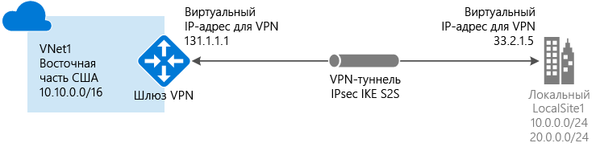
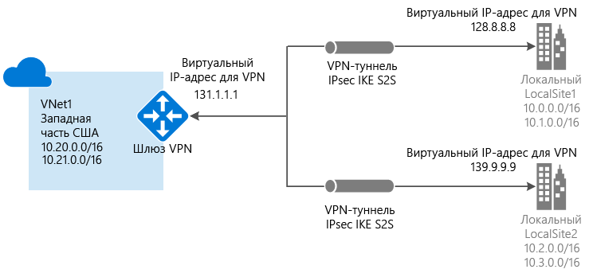
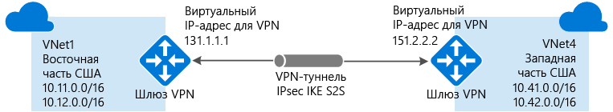
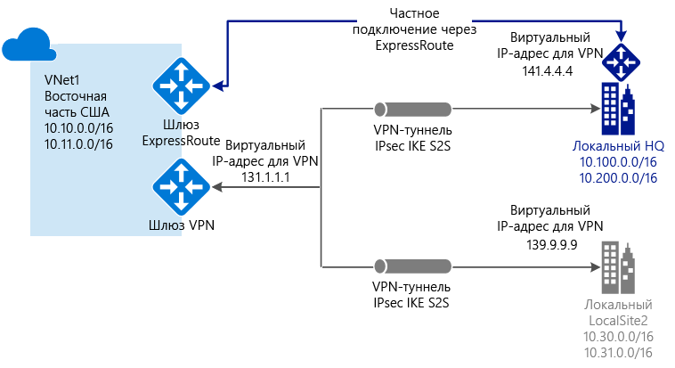

# Сведения о VPN-шлюзе

VPN-шлюз — это особый тип шлюза виртуальной сети, используемый для отправки зашифрованного трафика между виртуальной сетью Azure и локальным расположением через общедоступный Интернет. Его также можно использовать для обмена зашифрованным трафиком между виртуальными сетями Azure через сеть Майкрософт. Каждая виртуальная сеть может иметь только один VPN-шлюз. Однако к одному VPN-шлюзу можно создать несколько подключений. При создании нескольких подключений к одному VPN-шлюзу все VPN-туннели совместно используют доступную для этого шлюза пропускную способность.

## Что такое шлюз виртуальной сети

Шлюз виртуальной сети состоит из двух или более виртуальных машин, развернутых в определенной созданной подсети, которая называется *подсетью шлюза*. Виртуальные машины, расположенные в подсети шлюза, создаются при создании шлюза виртуальной сети. Виртуальные машины шлюза виртуальной сети содержат таблицы маршрутизации и службы шлюза, соответствующие его настройкам. Невозможно непосредственно настроить виртуальные машины, которые являются частью шлюза виртуальной сети. Кроме того, не следует развертывать дополнительные ресурсы в подсети шлюза.

Создание шлюза виртуальной сети может длиться до 45 минут. При создании шлюза виртуальной сети связанные виртуальные машины развертываются в подсети шлюза и на них настраиваются необходимые указанные параметры. Один из параметров, которые можно настроить, — это тип шлюза. VPN-шлюз — это созданный шлюз виртуальной сети типа VPN. Создав VPN-шлюз, вы можете создать подключение VPN-туннеля IPsec/IKE между этим и другим VPN-шлюзом (подключение "виртуальная сеть — виртуальная сеть") или создать распределенное подключение VPN-туннеля IPsec/IKE между VPN-шлюзом и локальным VPN-устройством (подключение "сеть — сеть"). Вы также можете создать VPN-подключение "точка — сеть" (VPN-подключение по протоколу IKEv2 или SSTP), которое позволяет подключиться к виртуальной сети из удаленного расположения, например во время конференции или из дома.

## Настройка VPN-шлюза

При подключении через VPN-шлюз используется ряд ресурсов, настроенных с определенными параметрами. Большинство этих ресурсов можно настроить по отдельности, однако некоторые из них следует настраивать в определенном порядке.

### Параметры

Правильный выбор параметров каждого ресурса критически важен для успешного создания подключения. Сведения об отдельных ресурсах и параметрах для VPN-шлюза см. в статье [Сведения о параметрах VPN-шлюза](vpn-gateway-about-vpn-gateway-settings.md). Эта статья содержит сведения о типах шлюзов, SKU шлюзов, типах VPN, типах подключения, подсетях шлюзов, локальных сетевых шлюзах и других интересующих параметрах ресурсов.

### Средства развертывания

Создать и настроить ресурсы можно с помощью одного средства настройки, например портала Azure. Затем с помощью другого средства, например PowerShell, можно настроить дополнительные ресурсы или при необходимости внести изменения в имеющееся ресурсы. Сейчас на портале Azure можно настроить не все ресурсы и их параметры. В статьях с инструкциями по топологии каждого подключения указывается, нужно ли использовать определенное средство настройки. 

### Модель развертывания

Сейчас есть две модели развертывания для Azure. Действия при настройке VPN-шлюза зависят от модели развертывания, которая использовалась для создания виртуальной сети. Например, если для создания виртуальной сети вы использовали классическую модель развертывания, при создании и настройке параметров VPN-шлюза нужно придерживаться соответствующих рекомендаций и указаний. Дополнительные сведения о моделях развертывания см. в статье [Развертывание с помощью Azure Resource Manager и классическое развертывание: сведения о моделях развертывания и состоянии ресурсов](../azure-resource-manager/resource-manager-deployment-model.md).

### Таблица планирования

Приведенная ниже таблица поможет вам подобрать наилучший вариант подключения для решения.

[!INCLUDE [cross-premises](../../includes/vpn-gateway-cross-premises-include.md)]

## SKU шлюзов

Во время создания шлюза виртуальной сети укажите номер SKU шлюза, который вы хотите использовать. Выберите номер SKU, который соответствует требованиям, в зависимости от типов рабочих нагрузок, пропускной способности, функций и соглашений об уровне обслуживания. Дополнительные сведения о номерах SKU шлюзов, в том числе поддерживаемые возможности, инструкции по разработке и тестированию в рабочей среде, а также инструкции по настройке см. в разделе [SKU шлюзов](vpn-gateway-about-vpn-gateway-settings.md#gwsku).

### Номера SKU шлюзов в зависимости от количества туннелей и подключений, и пропускной способности шлюзов

[!INCLUDE [Aggregated throughput by SKU](../../includes/vpn-gateway-table-gwtype-aggtput-include.md)]

## Схемы топологий подключения

Важно знать, что существуют различные конфигурации подключения к VPN-шлюзу. Вам нужно определить, какая из конфигураций наилучшим образом соответствует вашим требованиям. Далее приведены сведения и топологии для разных типов подключения VPN-шлюза. Приведенные ниже разделы содержат таблицы со следующими сведениями:

* доступная модель развертывания;
* доступные средства настройки;
* ссылки, по которым можно перейти непосредственно к соответствующей статье (если она есть).

Представленные здесь схемы и описания помогут вам выбрать топологию подключения в соответствии со своими требованиями. На схемах показаны основные базовые топологии; руководствуясь этими схемами, можно создавать и более сложные конфигурации.

## Подключение типа "сеть — сеть" и многосайтовое подключение (через VPN-туннель IPsec/IKE)

### Подключение типа "сеть — сеть"

Подключение типа "сеть — сеть" (S2S) через VPN-шлюз — это подключение через туннель VPN по протоколу IPsec/IKE (IKEv1 или IKEv2). Подключения типа "сеть — сеть" можно использовать для распределенных и гибридных конфигураций. Для подключения типа "сеть — сеть" требуется локальное VPN-устройство, которому назначен общедоступный IP-адрес и которое не расположено за NAT. Дополнительные сведения о выборе VPN-устройства см. в [этом разделе](vpn-gateway-vpn-faq.md#s2s).

### Многосайтовые подключения

Такой тип подключения является вариантом подключения типа "сеть — сеть". В шлюзе виртуальной сети создается несколько VPN-подключений, как правило, к разным локальным сайтам. При работе с несколькими подключениями следует использовать тип VPN "RouteBased" (динамический шлюз для работы с классическими виртуальными сетями). Так как каждая виртуальная сеть может иметь только один VPN-шлюз, доступную пропускную способность шлюза используют все подключения. Этот тип подключения часто называется многосайтовым.

### Модели и методы развертывания для подключений "сеть — сеть" и многосайтовых подключений

[!INCLUDE [site-to-site and multi-site table](../../includes/vpn-gateway-table-site-to-site-include.md)]

## Подключение типа "точка — сеть" (VPN-подключение по протоколу IKEv2 или SSTP)

Подключение типа "точка — сеть" через VPN-шлюз позволяет создать безопасное подключение к виртуальной сети с отдельного клиентского компьютера. Подключение типа "точка — сеть" сначала устанавливается на клиентском компьютере. Это эффективное решение для сотрудников, которым нужно подключаться к виртуальным сетям Azure из удаленного расположения, например, если они находятся дома или на конференции. Такую конфигурацию также удобно использовать вместо VPN-подключения типа "сеть — сеть" при наличии небольшого числа клиентов, которым требуется подключение к виртуальной сети.

В отличие от подключений типа "сеть — сеть", для подключений типа "точка — сеть" локальный общедоступный IP-адрес или VPN-устройство не требуются. Подключения типа "точка — сеть" можно использовать с подключениями "сеть — сеть" через один и тот же VPN-шлюз при условии совместимости всех требований к конфигурации для обоих типов подключений. См. дополнительные сведения о [подключениях типа "точка — сеть"](point-to-site-about.md).

### Модели и методы развертывания для типа подключения "точка — сеть"

[!INCLUDE [vpn-gateway-table-site-to-site](../../includes/vpn-gateway-table-point-to-site-include.md)]

## Подключение между виртуальными сетями (через VPN-туннель IPsec/IKE)

Подключение типа "виртуальная сеть — виртуальная сеть" похоже на подключение виртуальной сети к локальному сайту. В обоих типах подключений используется VPN-шлюз для создания защищенного туннеля, использующего IPsec/IKE. Можно даже комбинировать подключение между виртуальными сетями с конфигурациями многосайтовых подключений. Это позволяет настраивать топологии сети, совмещающие распределенные подключения с подключениями между виртуальными сетями.

Подключаемые виртуальные сети могут относиться:

* к одному или разным регионам;
* к одной или разным подпискам; 
* к одной или разным моделям развертывания.

### Подключения между моделями развертывания

Сейчас в Azure доступны два режима развертывания: классический и Resource Manager. Если вы использовали Azure какое-то время, вероятно, у вас есть виртуальные машины и роли экземпляров Azure, выполняемые в классической виртуальной сети. А более новые виртуальные машины и экземпляры ролей могут выполняться в виртуальной сети, созданной Resource Manager. Вы можете создать подключение между виртуальными сетями, чтобы ресурсы в одной виртуальной сети непосредственно взаимодействовали с ресурсами в другой.

### Пиринговая связь между виртуальными сетями

Для создания подключения можно использовать пиринговую связь между виртуальными сетями, если виртуальная сеть соответствует определенным требованиям. При пиринговой связи между виртуальными сетями шлюз виртуальной сети не используется. Дополнительную информацию см. в статье [Пиринговая связь между виртуальными сетями](../virtual-network/virtual-network-peering-overview.md).

### Модели и методы развертывания для подключения между виртуальными сетями

[!INCLUDE [vpn-gateway-table-vnet-to-vnet](../../includes/vpn-gateway-table-vnet-to-vnet-include.md)]

## ExpressRoute (частное подключение)

ExpressRoute позволяет переносить локальные сети в Microsoft Cloud по частному подключению, которое обеспечивается поставщиком услуг подключения. ExpressRoute позволяет устанавливать подключения к облачным службам Майкрософт, таким как Microsoft Azure, Office 365 и CRM Online. Это может быть подключение типа "любой к любому" (IP VPN), подключение Ethernet типа "точка-точка" или виртуальное кросс-подключение через поставщика услуг подключения на совместно используемом сервере.

Подключения ExpressRoute не проходят через общедоступный Интернет. Это обеспечивает повышенный уровень безопасности, надежности и быстродействия подключений ExpressRoute и более низкий уровень задержки по сравнению с типовыми подключениями через Интернет.

При подключениях с помощью ExpressRoute используется шлюз виртуальной сети, который является частью его базовой конфигурации. В подключении ExpressRoute для шлюза виртуальной сети задается тип шлюза "ExpressRoute", а не "Vpn". Хотя трафик, который передается по каналу ExpressRoute, не зашифрован по умолчанию, вы можете создать решение, которое позволяет отправить зашифрованный трафик по каналу ExpressRoute. Дополнительные сведения об ExpressRoute см. в [техническом обзоре ExpressRoute](../expressroute/expressroute-introduction.md).

## Параллельные подключения "сеть — сеть" и ExpressRoute

ExpressRoute — это прямое частное подключение из глобальной сети (а не через общедоступное подключение к Интернету) к службам Майкрософт, включая Azure. Трафик подключения VPN типа "сеть — сеть" проходит через общедоступный Интернет в зашифрованном виде. Возможность настраивать VPN-подключения типа "сеть — сеть" и ExpressRoute для одной виртуальной сети дает целый ряд преимуществ.

VPN типа "сеть — сеть" можно настроить как защищенный путь отработки отказа для ExpressRoute или использовать для подключения к сайтам, которые не входят в вашу сеть, но подключены через ExpressRoute. Обратите внимание, что в рамках такой конфигурации для одной виртуальной сети требуются два шлюза виртуальной сети: с типом "VPN" и типом "ExpressRoute".

### Модели и методы развертывания для параллельных подключений "сеть — сеть" и ExpressRoute

[!INCLUDE [vpn-gateway-table-coexist](../../includes/vpn-gateway-table-coexist-include.md)]

## Цены

[!INCLUDE [vpn-gateway-about-pricing-include](../../includes/vpn-gateway-about-pricing-include.md)]

См. дополнительные сведения о [номерах SKU для VPN-шлюзов](vpn-gateway-about-vpn-gateway-settings.md#gwsku).

## Часто задаваемые вопросы

См. [вопросы и ответы, связанные с использованием VPN-шлюза](vpn-gateway-vpn-faq.md).

## Дополнительная информация

- Составьте план конфигурации VPN-шлюза. См. статью [Планирование и проектирование VPN-шлюза](vpn-gateway-plan-design.md).
- Дополнительные сведения см. в статье [VPN-шлюз: вопросы и ответы](vpn-gateway-vpn-faq.md).
- См. дополнительные сведения об [ограничениях подписки и службы](../azure-subscription-service-limits.md#networking-limits).
- Дополнительные сведения о некоторых других ключевых [сетевых возможностях](../networking/networking-overview.md) Azure.
