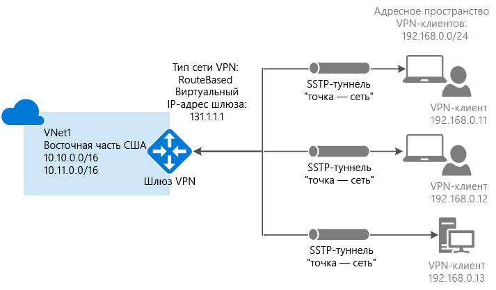

# Основные сведения о VPN-шлюзах Azure
Для обмена сетевым трафиком между виртуальной сетью Azure и локальным сайтом необходимо создать шлюз для виртуальной сети. VPN-шлюз — это тип шлюза виртуальной сети, который отправляет зашифрованный трафик через общедоступное подключение. VPN-шлюзы также можно использовать для обмена трафиком между виртуальными сетями Azure через сеть Майкрософт.

Существует два типа шлюзов виртуальных сетей: ExpressRoute и VPN. При создании шлюза виртуальной сети нужно указать тип шлюза, который вы хотите использовать. VPN-шлюз — это шлюз виртуальной сети, использующий тип шлюза "Vpn". 

У каждой виртуальной сети может быть два шлюза виртуальной сети, но обязательно разных типов. В зависимости от выбранных параметров можно создать несколько подключений к одному VPN-шлюзу. Примером такой конфигурации является многосайтовое подключение. При создании нескольких подключений к одному VPN-шлюзу все VPN-туннели, включая туннель типа "точка — сеть", совместно используют доступную для этого шлюза пропускную способность.

## Настройка VPN-шлюза
При подключении через VPN-шлюз используется ряд ресурсов, настроенных с определенными параметрами. Большинство этих ресурсов можно настроить по отдельности, несмотря на то что в некоторых случаях их следует настраивать в определенном порядке.

###Параметры
Правильный выбор параметров каждого ресурса критически важен для успешного создания подключения. Сведения об отдельных ресурсах и параметрах для VPN-шлюза см. в статье [Сведения о параметрах VPN-шлюза](vpn-gateway-about-vpn-gateway-settings.md). Здесь вы найдете необходимую информацию о типах шлюзов, типах VPN, типах подключения, подсетях шлюзов, локальных сетевых шлюзах и других интересующих параметрах ресурсов.

###Средства развертывания
Создать и настроить ресурсы можно с помощью одного средства настройки, например портала Azure. Затем с помощью другого средства, например PowerShell, можно настроить дополнительные ресурсы или при необходимости внести изменения в существующие ресурсы. Сейчас на портале Azure можно настроить не все ресурсы и их параметры. В статьях с инструкциями по топологии каждого подключения указывается, нужно ли использовать определенное средство настройки. 

###Модель развертывания
Действия при настройке VPN-шлюза зависят от модели развертывания, которая использовалась для создания виртуальной сети. Например, если для создания виртуальной сети вы использовали классическую модель развертывания, при создании и настройке параметров VPN-шлюза нужно придерживаться соответствующих рекомендаций и указаний. Дополнительные сведения о моделях развертывания см. в статье [Развертывание с помощью Azure Resource Manager и классическое развертывание: сведения о моделях развертывания и состоянии ресурсов](../azure-resource-manager/resource-manager-deployment-model.md).

## Схемы топологий подключения
Важно знать, что существуют различные конфигурации подключения к VPN-шлюзу. Вам нужно определить, какая из конфигураций наилучшим образом соответствует вашим требованиям. Далее приведены сведения и топологии для разных типов подключения VPN-шлюза. Приведенные ниже разделы содержат таблицы со следующими сведениями:

* доступная модель развертывания;
* доступные средства настройки;
* ссылки, по которым можно перейти непосредственно к соответствующей статье (если она есть).

Представленные здесь схемы и описания помогут вам выбрать топологию подключения в соответствии со своими требованиями. На схемах показаны основные базовые топологии; руководствуясь этими схемами, можно создавать и более сложные конфигурации.

## Подключение типа "сеть — сеть" и многосайтовое подключение (через VPN-туннель IPsec/IKE)
### Подключение типа "сеть — сеть"
Подключение типа "сеть — сеть" (S2S) через VPN-шлюз — это подключение через туннель VPN по протоколу IPsec/IKE (IKEv1 или IKEv2). Для этого типа подключения требуется локальное VPN-устройство, которому назначен общедоступный IP-адрес и которое не расположено за NAT. Подключения типа "сеть — сеть" можно использовать для распределенных и гибридных конфигураций.   

### Многосайтовые подключения
Такой тип подключения является вариантом подключения типа "сеть — сеть". В шлюзе виртуальной сети создается несколько VPN-подключений, как правило, к разным локальным сайтам. При работе с несколькими подключениями следует использовать тип VPN "RouteBased" (динамический шлюз для работы с классическими виртуальными сетями). Так как каждая виртуальная сеть может иметь только один VPN-шлюз, доступную пропускную способность шлюза используют все подключения. Такое подключение часто называется многосайтовым.

### Модели и методы развертывания для подключений "сеть — сеть" и многосайтовых подключений
[!INCLUDE [vpn-gateway-table-site-to-site](../../includes/vpn-gateway-table-site-to-site-include.md)]

## VPN-подключение типа "точка — сеть" по протоколу SSTP
Подключение через VPN-шлюз типа "точка — сеть" (P2S) позволяет создать безопасное подключение к виртуальной сети с отдельного клиентского компьютера. Подключение типа "точка — сеть" — это VPN-подключение по протоколу SSTP (Secure Socket Tunneling Protocol). Для подключения типа "точка — сеть" не требуется VPN-устройство или общедоступный IP-адрес. VPN-подключение устанавливается начиная с клиентского компьютера. Это решение эффективно при подключении к виртуальной сети из удаленного расположения, например, если вы находитесь дома или на конференции, либо если подключение к виртуальной сети требуется всего нескольким клиентам. Подключения типа "точка — сеть" можно использовать с подключениями "сеть — сеть" через один и тот же VPN-шлюз при условии совместимости всех требований к конфигурации для обоих типов подключений.

### Модели и методы развертывания для подключения "точка — сеть"
[!INCLUDE [vpn-gateway-table-point-to-site](../../includes/vpn-gateway-table-point-to-site-include.md)]

## Подключение между виртуальными сетями (через VPN-туннель IPsec/IKE)
Подключение типа "виртуальная сеть — виртуальная сеть" похоже на подключение виртуальной сети к локальному сайту. В обоих типах подключений используется VPN-шлюз для создания защищенного туннеля, использующего IPsec/IKE. Можно даже комбинировать подключение между виртуальными сетями с конфигурациями многосайтовых подключений. Это позволяет настраивать топологии сети, совмещающие распределенные подключения с подключениями между виртуальными сетями.

Подключаемые виртуальные сети могут относиться:

* к одному или разным регионам;
* к одной или разным подпискам; 
* к одной или разным моделям развертывания.

###Подключения между моделями развертывания
Сейчас в Azure доступны два режима развертывания: классический и Resource Manager. Если вы использовали Azure какое-то время, вероятно, у вас есть виртуальные машины и роли экземпляров Azure, выполняемые в классической виртуальной сети. А более новые виртуальные машины и экземпляры ролей могут выполняться в виртуальной сети, созданной Resource Manager. Вы можете создать подключение между виртуальными сетями, чтобы ресурсы в одной виртуальной сети непосредственно взаимодействовали с ресурсами в другой.

###Пиринговая связь между виртуальными сетями
Для создания подключения можно использовать пиринговую связь между виртуальными сетями, если виртуальная сеть соответствует определенным требованиям. При пиринговой связи между виртуальными сетями шлюз виртуальной сети не используется. Дополнительную информацию см. в статье [Пиринговая связь между виртуальными сетями](../virtual-network/virtual-network-peering-overview.md).

###Модели и методы развертывания для подключения между виртуальными сетями
[!INCLUDE [vpn-gateway-table-vnet-to-vnet](../../includes/vpn-gateway-table-vnet-to-vnet-include.md)]

## ExpressRoute (выделенное частное подключение)
Microsoft Azure ExpressRoute позволяет переносить локальные сети в облако Microsoft по выделенному закрытому соединению, которое обеспечивается поставщиком услуг подключения. ExpressRoute позволяет устанавливать подключения к облачным службам Майкрософт, таким как Microsoft Azure, Office 365 и CRM Online. Это может быть подключение типа "любой к любому" (IP VPN), подключение Ethernet типа "точка-точка" или виртуальное кросс-подключение через поставщика услуг подключения на совместно используемом сервере.

Подключения ExpressRoute не проходят через общедоступный Интернет. Это обеспечивает повышенный уровень безопасности, надежности и быстродействия подключений ExpressRoute и более низкий уровень задержки по сравнению с типовыми подключениями через Интернет.

При подключениях с помощью ExpressRoute вместо VPN-шлюза используется шлюз виртуальной сети, который является частью его базовой конфигурации. В подключении ExpressRoute для шлюза виртуальной сети задается тип шлюза "ExpressRoute", а не "Vpn". Дополнительные сведения об ExpressRoute см. в [техническом обзоре ExpressRoute](../expressroute/expressroute-introduction.md).

## Параллельные подключения "сеть — сеть" и ExpressRoute
ExpressRoute — это прямое выделенное подключение из глобальной сети (а не через общедоступное подключение к Интернету) к службам Майкрософт, включая Azure. Трафик подключения VPN типа "сеть — сеть" проходит через общедоступный Интернет в зашифрованном виде. Возможность настраивать VPN-подключения типа "сеть — сеть" и ExpressRoute для одной виртуальной сети дает целый ряд преимуществ.

VPN типа "сеть — сеть" можно настроить как защищенный путь отработки отказа для ExpressRoute или использовать для подключения к сайтам, которые не входят в вашу сеть, но подключены через ExpressRoute. Обратите внимание, что в рамках такой конфигурации для одной виртуальной сети требуются два шлюза виртуальной сети: с типом "VPN" и типом "ExpressRoute".

### Модели и методы развертывания для подключений "сеть — сеть" и ExpressRoute
[!INCLUDE [vpn-gateway-table-coexist](../../includes/vpn-gateway-table-coexist-include.md)]

## Цены
[!INCLUDE [vpn-gateway-about-pricing-include](../../includes/vpn-gateway-about-pricing-include.md)]

## Артикулы шлюзов
[!INCLUDE [vpn-gateway-gwsku-include](../../includes/vpn-gateway-gwsku-include.md)]

См. дополнительные сведения о [номерах SKU для VPN-шлюзов](vpn-gateway-about-vpn-gateway-settings.md#gwsku).

### Расчетная суммарная пропускная способность в зависимости от SKU
[!INCLUDE [vpn-gateway-table-gwtype-aggthroughput](../../includes/vpn-gateway-table-gwtype-aggtput-include.md)]

## Часто задаваемые вопросы

См. [вопросы и ответы, связанные с использованием VPN-шлюза](vpn-gateway-vpn-faq.md).

## Дальнейшие действия
- Составьте план конфигурации VPN-шлюза. См. статью [Планирование и проектирование VPN-шлюза](vpn-gateway-plan-design.md).
- Дополнительные сведения см. в статье [VPN-шлюз: вопросы и ответы](vpn-gateway-vpn-faq.md).
- См. дополнительные сведения об [ограничениях подписки и службы](../azure-subscription-service-limits.md#networking-limits).

