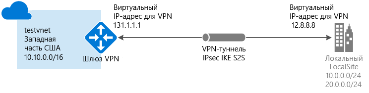

# <a name="create-a-vnet-with-a-site-to-site-vpn-connection-using-powershell"></a>Создание виртуальной сети с VPN-подключением типа "сеть — сеть" с помощью PowerShell

Подключение типа "сеть — сеть" (S2S) через VPN-шлюз — это подключение через туннель VPN по протоколу IPsec/IKE (IKEv1 или IKEv2). Для этого типа подключения требуется локальное VPN-устройство, которому назначен общедоступный IP-адрес и которое не расположено за NAT. Подключения типа "сеть — сеть" можно использовать для распределенных и гибридных конфигураций.



В этой статье мы расскажем, как создать виртуальную сеть, соединенную с локальной сетью через подключение с помощью VPN-шлюза типа "сеть — сеть", используя модель развертывания с помощью Azure Resource Manager. Подключения типа "сеть — сеть" можно использовать для распределенных и гибридных конфигураций. Эту конфигурацию также можно создать, используя разные средства развертывания, либо с помощью классической модели развертывания, выбрав вариант из следующего списка:

> [!div class="op_single_selector"]
> * [Resource Manager — портал Azure](vpn-gateway-howto-site-to-site-resource-manager-portal.md)
> * [Resource Manager — PowerShell](vpn-gateway-create-site-to-site-rm-powershell.md)
> * [Классическая модель — портал Azure](vpn-gateway-howto-site-to-site-classic-portal.md)
> * [Классическая модель — классический портал](vpn-gateway-site-to-site-create.md)
>
>

#### <a name="additional-configurations"></a>Дополнительные конфигурации
Если вы хотите объединить виртуальные сети, не создавая соединение с локальным расположением, см. статью о [настройке подключения между виртуальными сетями](vpn-gateway-vnet-vnet-rm-ps.md). Если вы хотите добавить подключение "сеть — сеть" к виртуальной сети, в которой уже есть подключение, см. статью о [добавлении подключения "сеть — сеть" к виртуальной сети с существующим подключением через VPN-шлюз](vpn-gateway-howto-multi-site-to-site-resource-manager-portal.md).


## <a name="before-you-begin"></a>Перед началом работы

[!INCLUDE [deployment models](../../includes/vpn-gateway-deployment-models-include.md)]

Перед началом настройки убедитесь, что у вас есть следующее:

* Совместимое VPN-устройство и пользователь, который может настроить его. См. статью о [VPN-устройствах](vpn-gateway-about-vpn-devices.md). Если вы не умеете настраивать VPN-устройство или не знаете диапазоны IP-адресов в своей локальной сети, вам следует найти того, кто сможет предоставить вам нужную информацию.
* Внешний общедоступный IP-адрес для VPN-устройства. Этот IP-адрес не может располагаться вне преобразования сетевых адресов (NAT).
* Подписка Azure. Если у вас нет подписки Azure, вы можете активировать [преимущества для подписчиков MSDN](https://azure.microsoft.com/pricing/member-offers/msdn-benefits-details) или зарегистрировать [бесплатную учетную запись](https://azure.microsoft.com/pricing/free-trial).
* Последняя версия командлетов PowerShell для Azure Resource Manager. Дополнительные сведения об установке командлетов PowerShell см. в статье [Как установить и настроить Azure PowerShell](/powershell/azureps-cmdlets-docs).

## <a name="Login"></a>1. Подключение к подписке
Для работы с командлетами диспетчера ресурсов необходимо перейти в режим PowerShell. Дополнительные сведения см. в статье [Использование Azure PowerShell с диспетчером ресурсов Azure](../powershell-azure-resource-manager.md).

Откройте консоль PowerShell и подключитесь к своей учетной записи. Для подключения используйте следующий пример.

```powershell
Login-AzureRmAccount
```

Просмотрите подписки учетной записи.

```powershell
Get-AzureRmSubscription
```

Укажите подписку, которую нужно использовать.

```powershell
Select-AzureRmSubscription -SubscriptionName "Replace_with_your_subscription_name"
```

## <a name="VNet"></a>2. Создание виртуальной сети и подсети шлюза
В примерах используется подсеть шлюза с маской подсети /28. Хотя можно создать подсеть шлюза размером /29, рекомендуется создать подсеть большего размера, включающую несколько адресов, выбрав по крайней мере значение /28 или /27. Таким образом, у вас будет достаточно адресов, чтобы добавить дополнительные конфигурации в будущем.

Если у вас уже есть виртуальная сеть с подсетью шлюза c длиной префикса 29 бит (/29) или больше, сразу переходите к разделу [Добавление локального сетевого шлюза](#localnet).

[!INCLUDE [vpn-gateway-no-nsg](../../includes/vpn-gateway-no-nsg-include.md)]

### <a name="to-create-a-virtual-network-and-a-gateway-subnet"></a>Создание виртуальной сети и подсети шлюза
Используйте пример ниже, чтобы создать виртуальную сеть и подсеть шлюза.

Сначала создайте группу ресурсов.

```powershell
New-AzureRmResourceGroup -Name testrg -Location 'West US'
```

Затем создайте виртуальную сеть. Убедитесь, что указанные адресные пространства не перекрываются ни с одним из адресных пространств, которые используются в локальной сети.

В примере ниже создается виртуальная сеть с именем *testvnet* и две подсети: *GatewaySubnet* и *Subnet1*. Важно, чтобы одна из подсетей имела имя *GatewaySubnet*. Если вы используете другое имя, подключение не будет настроено.

Задайте переменные.

```powershell
$subnet1 = New-AzureRmVirtualNetworkSubnetConfig -Name 'GatewaySubnet' -AddressPrefix 10.0.0.0/28
$subnet2 = New-AzureRmVirtualNetworkSubnetConfig -Name 'Subnet1' -AddressPrefix '10.0.1.0/28'
```

Создайте виртуальную сеть.

```powershell
New-AzureRmVirtualNetwork -Name testvnet -ResourceGroupName testrg `
-Location 'West US' -AddressPrefix 10.0.0.0/16 -Subnet $subnet1, $subnet2
```

### <a name="gatewaysubnet"></a>Добавление подсети шлюза в уже созданную виртуальную сеть
Этот шаг требуется только в том случае, если вам нужно добавить подсеть шлюза в созданную ранее виртуальную сеть.

Подсеть шлюза можно создать с помощью примера, указанного ниже. Обязательно присвойте подсети шлюза имя "GatewaySubnet". Если будет присвоено другое имя, вы создадите подсеть, но Azure не будет рассматривать ее как подсеть шлюза.

Задайте переменные.

```powershell
$vnet = Get-AzureRmVirtualNetwork -ResourceGroupName testrg -Name testvnet
```

Создайте подсеть шлюза.\

```powershell
Add-AzureRmVirtualNetworkSubnetConfig -Name 'GatewaySubnet' -AddressPrefix 10.0.3.0/28 -VirtualNetwork $vnet
```

Теперь нужно настроить конфигурацию.

```powershell
Set-AzureRmVirtualNetwork -VirtualNetwork $vnet
```

## 3) <a name="localnet"></a>Добавление локального сетевого шлюза
В виртуальной сети термин "шлюз локальной сети" обычно означает локальное расположение. Присвойте этому расположению имя (чтобы определить расположение в среде Azure), а также укажите префикс адресного пространства для шлюза локальной сети.

С помощью указанного префикса IP-адреса служба Azure может определить, какой трафик отправлять в локальное расположение. Это значит, что вам нужно будет указать каждый префикс адреса, который необходимо связать со шлюзом локальной сети. При изменении локальной сети вы с легкостью можете обновить эти префиксы.

При использовании примеров PowerShell обратите внимание на следующее.

* Параметр *GatewayIPAddress* — это IP-адрес локального VPN-устройства. Ваше VPN-устройство не может располагаться вне преобразования сетевых адресов (NAT).
* Параметр *AddressPrefix* — локальное адресное пространство.

Чтобы добавить шлюз локальной сети с одним префиксом адреса, используйте этот пример:

```powershell
New-AzureRmLocalNetworkGateway -Name LocalSite -ResourceGroupName testrg `
-Location 'West US' -GatewayIpAddress '23.99.221.164' -AddressPrefix '10.5.51.0/24'
```

Чтобы добавить шлюз локальной сети с несколькими префиксами адреса, используйте этот пример:

```powershell
New-AzureRmLocalNetworkGateway -Name LocalSite -ResourceGroupName testrg `
-Location 'West US' -GatewayIpAddress '23.99.221.164' -AddressPrefix @('10.0.0.0/24','20.0.0.0/24')
```

### <a name="to-modify-ip-address-prefixes-for-your-local-network-gateway"></a>Изменение префиксов IP-адресов для локального сетевого шлюза
Иногда префиксы адресов шлюза локальной сети могут изменяться. Действия по изменению префиксов IP-адресов зависят от того, создано ли подключение через VPN-шлюз. См. раздел [Изменение префиксов IP-адресов для локального сетевого шлюза](#modify) этой статьи.

## <a name="PublicIP"></a>4. Запрос общедоступного IP-адреса для VPN-шлюза
Затем вам нужно запросить общедоступный IP-адрес, который будет выделен для VPN-шлюза виртуальной сети Azure. Он отличается от IP-адреса, назначенного VPN-устройству. Этот адрес присваивается VPN-шлюзу Azure отдельно. Указать необходимый вам IP-адрес нельзя. Он выделяется для шлюза динамически. Этот IP-адрес будет использоваться при настройке локального VPN-устройства для подключения к шлюзу.

VPN-шлюз Azure для модели развертывания, в которой используется диспетчер ресурсов, в настоящее время поддерживает только общедоступные IP-адреса, которые выделяются динамически. Но это не значит, что IP-адрес изменится. IP-адрес VPN-шлюза Azure изменяется только после его удаления и повторного создания. Общедоступный IP-адрес шлюза остается прежним после изменения размера, сброса или обновления VPN-шлюза Azure, а также после других процедур по его обслуживанию.

Используйте следующий пример PowerShell.

```powershell
$gwpip= New-AzureRmPublicIpAddress -Name gwpip -ResourceGroupName testrg -Location 'West US' -AllocationMethod Dynamic
```

## <a name="GatewayIPConfig"></a>5. Создание конфигурации IP-адресации шлюза
Конфигурация шлюза определяет используемые подсеть и общедоступный IP-адрес. Используйте следующий пример, чтобы создать конфигурацию шлюза.

```powershell
$vnet = Get-AzureRmVirtualNetwork -Name testvnet -ResourceGroupName testrg
$subnet = Get-AzureRmVirtualNetworkSubnetConfig -Name 'GatewaySubnet' -VirtualNetwork $vnet
$gwipconfig = New-AzureRmVirtualNetworkGatewayIpConfig -Name gwipconfig1 -SubnetId $subnet.Id -PublicIpAddressId $gwpip.Id
```

## <a name="CreateGateway"></a>6. Создание шлюза виртуальной сети
На этом этапе вы создадите шлюз виртуальной сети. Обратите внимание, что создание шлюза может занять некоторое время — 45 минут или больше.

Используйте следующие значения:

* Для конфигурации "сеть — сеть" задайте для параметра *-GatewayType* значение *Vpn*. Тип шлюза всегда зависит от реализуемой конфигурации. Например, для других конфигураций шлюза может потребоваться тип шлюза ExpressRoute.
* У параметра *-VpnType* может быть значение *RouteBased* (в некоторых документах такой шлюз называется шлюзом с динамической маршрутизацией) или *PolicyBased* (в некоторых документах — шлюз со статической маршрутизацией). Дополнительные сведения о типах VPN-шлюзов см. в статье [Основные сведения о VPN-шлюзах Azure](vpn-gateway-about-vpngateways.md).
* У параметра *-GatewaySku* может быть значение *Basic*, *Standard* или *HighPerformance*.

```powershell
New-AzureRmVirtualNetworkGateway -Name vnetgw1 -ResourceGroupName testrg `
-Location 'West US' -IpConfigurations $gwipconfig -GatewayType Vpn `
-VpnType RouteBased -GatewaySku Standard
```

## <a name="ConfigureVPNDevice"></a>7. Настройка устройства VPN
На этом этапе вам понадобится общедоступный IP-адрес шлюза виртуальной сети для настройки локального VPN-устройства. Обратитесь к производителю устройства, чтобы получить конкретные сведения о конфигурации. Дополнительные сведения также см. в статье о [VPN-устройствах](vpn-gateway-about-vpn-devices.md).

Чтобы найти общедоступный IP-адрес шлюза виртуальной сети, используйте следующий пример.

```powershell
Get-AzureRmPublicIpAddress -Name gwpip -ResourceGroupName testrg
```

## <a name="CreateConnection"></a>8. Создание VPN-подключения
Далее вам нужно создать VPN-подключение типа "сеть — сеть" между шлюзом виртуальной сети и VPN-устройством. Обязательно подставьте собственные значения. Общий ключ должен соответствовать значению, использованному в конфигурации VPN-устройства. Обратите внимание, что для подключения типа "сеть — сеть" параметр `-ConnectionType` имеет значение *IPsec*.

Задайте переменные.

```powershell
$gateway1 = Get-AzureRmVirtualNetworkGateway -Name vnetgw1 -ResourceGroupName testrg
$local = Get-AzureRmLocalNetworkGateway -Name LocalSite -ResourceGroupName testrg
```

Создайте подключение.

```powershell
New-AzureRmVirtualNetworkGatewayConnection -Name localtovon -ResourceGroupName testrg `
-Location 'West US' -VirtualNetworkGateway1 $gateway1 -LocalNetworkGateway2 $local `
-ConnectionType IPsec -RoutingWeight 10 -SharedKey 'abc123'
```

Через некоторое время будет установлено подключение.

## <a name="toverify"></a>Проверка VPN-подключения
Существует несколько разных способов для проверки VPN-подключения.

[!INCLUDE [vpn-gateway-verify-connection-rm](../../includes/vpn-gateway-verify-connection-rm-include.md)]

## <a name="modify"></a>Изменение префиксов IP-адресов для локального сетевого шлюза
Если вам нужно изменить префиксы для шлюза локальной сети, сделайте следующее. Мы приводим два набора инструкций. Выбор тех или других инструкций зависит от того, создано ли у вас подключение через шлюз.

[!INCLUDE [vpn-gateway-modify-ip-prefix-rm](../../includes/vpn-gateway-modify-ip-prefix-rm-include.md)]

## <a name="modifygwipaddress"></a>Изменение IP-адреса шлюза для локального сетевого шлюза
[!INCLUDE [vpn-gateway-modify-lng-gateway-ip-rm](../../includes/vpn-gateway-modify-lng-gateway-ip-rm-include.md)]

## <a name="next-steps"></a>Дальнейшие действия
*  Установив подключение, можно добавить виртуальные машины в виртуальные сети. Дополнительные сведения о виртуальных машинах см. [здесь](https://docs.microsoft.com/azure/#pivot=services&panel=Compute).
* Сведения о BGP см. в статьях [Обзор использования BGP с VPN-шлюзами Azure](vpn-gateway-bgp-overview.md) и [Настройка BGP на VPN-шлюзах Azure с помощью Azure Resource Manager и PowerShell](vpn-gateway-bgp-resource-manager-ps.md).

