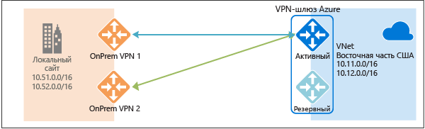
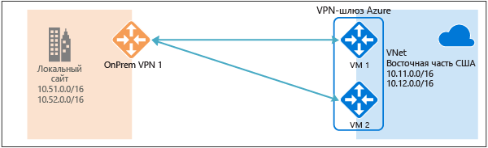
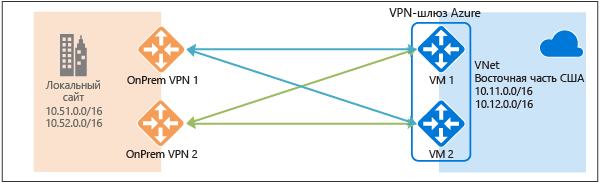
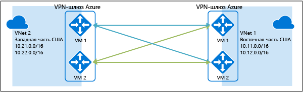

# Настройка высокодоступных подключений: распределенных и между виртуальными сетями
В этой статье рассматриваются параметры высокодоступных подключений (распределенных и между виртуальными сетями), устанавливаемых с помощью VPN-шлюзов Azure.

## Избыточность VPN-шлюзов Azure
Каждый VPN-шлюз Azure состоит из двух экземпляров: активного и резервного. При запланированном обслуживании или незапланированном простое активного экземпляра выполняется автоматический переход (отработка отказа) на резервный экземпляр. Это позволяет возобновить VPN-подключение типа "сеть — сеть" или подключение типа "виртуальная сеть — виртуальная сеть". Переключение сопровождается кратким прерыванием работы. При плановом обслуживании подключение должно быть восстановлено в течение 10–15 секунд. При сбое на восстановление подключения потребуется больше времени — от одной до полутора минут (в худшем случае). При этом клиентские VPN-подключения к шлюзу типа "точка — сеть" будут разорваны, и пользователям придется повторно устанавливать подключение на клиентских компьютерах.

## Высокодоступные распределенные подключения
Есть три способа обеспечить высокую доступность распределенных подключений:

* использование нескольких локальных VPN-устройств;
* использование VPN-шлюза Azure в конфигурации "активный — активный";
* сочетание этих двух вариантов.

### Использование нескольких локальных VPN-устройств
Вы можете использовать несколько VPN-устройств из локальной сети для подключения к VPN-шлюзу Azure, как показано на следующей схеме.

Такая конфигурация обеспечивает топологию из нескольких активных туннелей между одним VPN-шлюзом Azure и локальными устройствами в одном и том же расположении. Применимые требования и ограничения:

1. Вам нужно создать несколько VPN-подключений типа "сеть — сеть" между VPN-устройствами и средой Azure. При подключении нескольких VPN-устройств из одной и той же локальной сети к среде Azure вам нужно создать по одному шлюзу локальной сети для каждого VPN-устройства, а также одно подключение между VPN-шлюзом Azure и шлюзом локальной сети.
2. Для шлюзов локальной сети, связанных с VPN-устройствами, нужно указать уникальные общедоступные IP-адреса в свойстве GatewayIpAddress.
3. Для этой конфигурации требуется BGP. Для каждого шлюза локальной сети, представляющего VPN-устройство, нужно указать уникальный IP-адрес для узла BGP в свойстве BgpPeerIpAddress.
4. Значения свойства AddressPrefix для каждого шлюза локальной сети не должны перекрываться. Укажите значение BgpPeerIpAddress в формате CIDR (с префиксом /32) в поле AddressPrefix (например, 10.200.200.254/32).
5. Используйте BGP для объявления VPN-шлюзу Azure одинаковых диапазонов IP-адресов из одинаковых локальных сетей, и трафик будет направляться одновременно во все эти туннели.
6. В рамках каждого подключения учитывается максимальное число туннелей для VPN-шлюза Azure: 10 для SKU категорий "Базовый" и "Стандартный" и 30 для категории HighPerformance. 

Так как в этой конфигурации VPN-шлюз Azure по-прежнему работает в режиме "активный — резервный", отработка отказа будет сопровождаться кратким прерыванием работы, как описано [выше](#activestandby). Тем не менее эта конфигурация помогает защититься от сбоев и перерывов в работе локальной сети и VPN-устройств.

### Использование VPN-шлюза Azure в конфигурации "активный — активный"
Теперь можно создать VPN-шлюз Azure в конфигурации "активный — активный". В этом случае оба экземпляра ВМ шлюза через туннели устанавливают VPN-подключение "сеть — сеть" к локальному VPN-устройству, как показано на следующей схеме.

В этой конфигурации у каждого экземпляра шлюза Azure будет уникальный общедоступный IP-адрес. Кроме того, каждый экземпляр устанавливает через туннель VPN-подключение по протоколу IPsec/IKE S2S к локальному VPN-устройству, связанному со шлюзом локальной сети и подключением. Обратите внимание, что оба туннеля VPN на самом деле представляют одно подключение. Вам также нужно настроить локальное VPN-устройство, чтобы обеспечить топологию из двух туннелей для VPN-подключения типа "сеть — сеть" с использованием этих двух общедоступных IP-адресов VPN-шлюзов Azure.

Так как экземпляры шлюза Azure работают в режиме "активный — активный", трафик, поступающий из виртуальной сети Azure в локальную сеть, будет направляться через оба туннеля одновременно, даже если локальное VPN-устройство использует один из этих туннелей. Учтите, что один и тот же поток TCP или UDP всегда будет проходить через один и тот же туннель (по одному и тому же пути), если только для одного из экземпляров не выполняется обслуживание.

При запланированном обслуживании одного из экземпляров шлюза или его сбое IPsec-туннель между таким экземпляром и локальным VPN-устройством будет закрыт. Связанные с VPN-устройствами маршруты следует удалить (это может произойти автоматически), чтобы перенаправить трафик в другой активный IPsec-туннель. На стороне Azure переключение между неактивным и активным экземплярами выполняется автоматически.

### Двойная избыточность: VPN-шлюзы Azure в конфигурации "активный — активный" для сетей Azure и локальных сетей
Самый надежный вариант — это использование шлюзов в конфигурации "активный — активный" для локальной сети и сети Azure, как показано на следующей схеме.

Вам нужно создать и настроить VPN-шлюз Azure в конфигурации "активный — активный", а также создать два шлюза локальной сети и установить два подключения для двух локальных VPN-устройств, как описано выше. В результате вы получите топологию из четырех IPsec-туннелей, где каждая виртуальная сеть Azure соединяется с каждой локальной сетью.

Так как на стороне Azure все шлюзы и туннели будут активными, трафик будет распределяться между четырьмя туннелями одновременно, хотя каждый исходящий из среды Azure поток TCP или UDP снова будет следовать по тому же туннелю или пути. Распределение трафика может сопровождаться некоторым повышением пропускной способности через IPsec-туннели, однако основная задача этой конфигурации — обеспечить высокую доступность. Кроме того, статистический характер распределения не позволяет точно определить влияние разных условий передачи трафика на общую пропускную способность.

Для этой топологии потребуется два шлюза локальной сети и два подключения, которые обеспечат поддержку для пары локальных VPN-устройств. Кроме того, чтобы установить два подключения к одной и той же локальной сети, понадобится BGP. Эти требования аналогичны требованиям, описанным [выше](#activeactiveonprem). 

## Высокодоступные подключения типа "виртуальная сеть — виртуальная сеть" через VPN-шлюзы Azure
Конфигурацию "активный — активный" можно также применить к подключениям между виртуальными сетями Azure. Вы можете создать VPN-шлюзы в конфигурации "активный — активный" для виртуальных сетей, используя аналогичную топологию из двух виртуальных сетей и четырех туннелей, как показано на следующей схеме.

Так вы обеспечите постоянное наличие пары туннелей между двумя виртуальными сетями при плановом обслуживании любого типа, делая подключение высокодоступным. Хотя аналогичная топология для распределенного подключения предполагает два подключения, для описанной выше сетевой топологии с виртуальными сетями требуется только одно подключение для каждого шлюза. Кроме того, здесь можно не использовать BGP, если только вам не нужно обеспечить транзитную маршрутизацию при подключении между виртуальными сетями.

## Дополнительная информация
Инструкции по настройке распределенных подключений (локальных и между виртуальными сетями) с конфигурацией "активный — активный" см. в статье [Настройка VPN-подключений типа "сеть — сеть" в режиме "активный — активный" для VPN-шлюзов Azure с помощью Azure Resource Manager и PowerShell](vpn-gateway-activeactive-rm-powershell.md).

