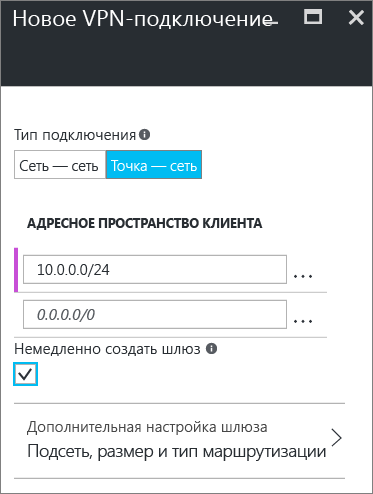

# Настройка подключения типа "точка — сеть" к виртуальной сети с помощью портала Azure (классическая модель)
> [!div class="op_single_selector"]
> * [Resource Manager — портал Azure](vpn-gateway-howto-point-to-site-resource-manager-portal.md)
> * [Resource Manager — PowerShell](vpn-gateway-howto-point-to-site-rm-ps.md)
> * [Классическая модель — портал Azure](vpn-gateway-howto-point-to-site-classic-azure-portal.md)
>
>

Конфигурация типа "точка — сеть" позволяет создать безопасное подключение к виртуальной сети с отдельного клиентского компьютера. Подключение типа "точка — сеть" — это VPN-подключение по протоколу SSTP (Secure Socket Tunneling Protocol). Это эффективное решение для подключений типа "точка — сеть" к виртуальной сети из удаленного расположения, например, если вы находитесь дома или на конференции, или если подключение к виртуальной сети требуется всего нескольким клиентам. Для подключения типа "точка — сеть" не требуется VPN-устройство или общедоступный IP-адрес. VPN-подключение устанавливается с клиентского компьютера.

В этой статье рассматривается создание виртуальной сети с подключением типа "точка — сеть" в классической модели развертывания с помощью портала Azure. Дополнительные сведения о подключениях типа "точка — сеть" см. в разделе [Часто задаваемые вопросы о подключениях типа "точка — сеть"](#faq) в конце этой статьи.

### Модели и методы развертывания для подключений типа "точка — сеть"
[!INCLUDE [deployment models](../../includes/vpn-gateway-deployment-models-include.md)]

В следующей таблице представлены две модели развертывания и доступные методы развертывания для конфигурации "точка — сеть". Когда появится статья с руководством по конфигурации, мы разместим прямую ссылку на нее в этой таблице.

[!INCLUDE [vpn-gateway-clasic-rm](../../includes/vpn-gateway-table-point-to-site-include.md)]

## Базовый рабочий процесс

Следующие разделы помогут поэтапно создать безопасное подключение типа "точка — сеть" к виртуальной сети.

1. Создайте виртуальную сеть и VPN-шлюз.
2. Создайте сертификаты.
3. Передайте CER-файл.
4. Создайте пакет конфигурации VPN-клиента.
5. Настройте клиентский компьютер.
6. Подключение к Azure

### Примеры настроек
Можно использовать следующий примеры параметров:

* **Имя: VNet1**.
* **Адресное пространство: 192.168.0.0/16**. В этом примере мы используем только одно адресное пространство, но для виртуальной сети можно настроить несколько.
* **Имя подсети: FrontEnd**.
* **Диапазон адресов подсети: 192.168.1.0/24**.
* **Подписка**. Если у вас есть несколько подписок, убедитесь, что используется правильная.
* **Группа ресурсов: TestRG**.
* **Расположение: восточная часть США**.
* **Тип подключения: "точка — сеть"**.
* **Адресное пространство клиента: 172.16.201.0/24**. VPN-клиенты, подключающиеся к виртуальной сети с помощью этого подключения "точка — сеть", получают IP-адреса из указанного пула.
* **Подсеть шлюза: 192.168.200.0/24**. Для подсети шлюза должно использоваться имя GatewaySubnet.
* **Размер.** Выберите SKU шлюза, который нужно использовать.
* **Тип маршрутизации: динамическая**.

## Раздел 1. Создание виртуальной сети и VPN-шлюза

Прежде чем начать, убедитесь в том, что у вас есть подписка Azure. Если у вас нет подписки Azure, вы можете [активировать преимущества для подписчиков MSDN](https://azure.microsoft.com/pricing/member-offers/msdn-benefits-details) или [зарегистрировать бесплатную учетную запись](https://azure.microsoft.com/pricing/free-trial).
### Часть 1. Создание виртуальной сети
Если у вас нет виртуальной сети, создайте ее. Снимки экрана приведены в качестве примеров. Обязательно подставьте собственные значения. Чтобы создать виртуальную сеть на портале Azure, сделайте следующее:

1. В браузере откройте [портал Azure](http://portal.azure.com) и при необходимости войдите с помощью учетной записи Azure.
2. Нажмите кнопку **Создать**. В поле **Поиск по Marketplace** введите "Виртуальная сеть". Найдите **виртуальную сеть** в результатах поиска и щелкните ее, чтобы открыть колонку **Виртуальная сеть**.

    
3. В нижней части колонки "Виртуальная сеть" в списке **Выберите модель развертывания** выберите **Классическая** и нажмите кнопку **Создать**.

    
4. В колонке **Создание виртуальной сети** настройте параметры виртуальной сети. В этой колонке добавьте первое адресное пространство и единый диапазон адресов подсети. После создания виртуальной сети вернитесь назад и добавьте дополнительные подсети и адресные пространства.

    
5. Убедитесь, что вы используете правильную **подписку** . Подписки можно менять с помощью раскрывающегося списка.
6. Щелкните **Группа ресурсов** и либо выберите существующую, либо создайте новую группу ресурсов. Чтобы создать группу, введите ее имя. Если вы создаете группу ресурсов, укажите для нее имя, которое будет использоваться в вашей конфигурации. Дополнительные сведения о группах ресурсов см. в разделе "Группы ресурсов" [обзора Azure Resource Manager](../azure-resource-manager/resource-group-overview.md#resource-groups).
7. Затем выберите параметры **расположения** для виртуальной сети. Расположение определяет расположение ресурсов, развертываемых в этой виртуальной сети.
8. Установите флажок **Закрепить на панели мониторинга** для быстрого перехода к виртуальной сети с панели мониторинга, а затем нажмите кнопку **Создать**.

    
9. После нажатия кнопки "Создать" вы увидите плитку на панели мониторинга, на которой отображается ход создания виртуальной сети. Когда виртуальная сеть будет создана, плитка изменится.

    
10. После создания виртуальной сети можно добавить IP-адрес DNS-сервера для обработки разрешения имен. Откройте параметры виртуальной сети, щелкните "DNS-серверы" и добавьте IP-адрес DNS-сервера, который нужно использовать. Установка этого параметра не приводит к созданию DNS-сервера. Нужно добавить DNS-сервер, с которым могут взаимодействовать ваши ресурсы.

Когда виртуальная сеть будет создана, на классическом портале Azure на странице сетей в столбце **Состояние** отобразится значение **Создано**.

### Часть 2. Создание подсети шлюза и шлюза динамической маршрутизации
На этом шаге вы создадите подсеть шлюза и шлюз динамической маршрутизации. При создании подсети шлюза и шлюза на портале Azure для классической модели развертывания используются те же колонки конфигурации.

1. На портале перейдите к виртуальной сети, для которой необходимо создать шлюз.
2. В колонке виртуальной сети в колонке **Обзор** в разделе "VPN-подключения" щелкните **Шлюз**.

    
3. В колонке **Новое VPN-подключение** выберите **Точка — сеть**.

    
4. В поле **Адресное пространство клиента** добавьте диапазон IP-адресов. Из этого диапазона VPN-клиенты будут получать IP-адреса при подключении. Удалите диапазон, указываемый автоматически, и добавьте собственный.

    
5. Установите флажок **Немедленно создать шлюз**.

    
6. Щелкните **Дополнительная настройка шлюза**, чтобы открыть колонку **Настройка шлюза**.

    
7. Щелкните **Subnet Configure required settings** (Обязательные параметры для настройки подсети), чтобы добавить **подсеть шлюза**. Хотя можно создать подсеть шлюза размером /29, рекомендуется создать подсеть большего размера, включающую несколько адресов, выбрав по крайней мере значение /28 или /27. Таким образом, у вас будет достаточно адресов, чтобы добавить дополнительные конфигурации в будущем.

   > [!IMPORTANT]
   > При работе с подсетями шлюза не связывайте группу безопасности сети (NSG) с подсетью шлюза. Связывание группы безопасности сети (NSG) с этой подсетью приведет к тому, что VPN-шлюз перестанет правильно функционировать. Дополнительные сведения о группах безопасности сети см. в статье [Группа безопасности сети](../virtual-network/virtual-networks-nsg.md).
   >
   >

    
8. Выберите **размер** шлюза. Это SKU шлюза, который будет использоваться для создания шлюза виртуальной сети. На портале SKU по умолчанию — **Базовый**. Дополнительные сведения о номерах SKU шлюзов см. в статье [Сведения о параметрах VPN-шлюза](vpn-gateway-about-vpn-gateway-settings.md#gwsku).

    
9. Выберите **тип маршрутизации** для шлюза. Конфигурации "точка — сеть" требует **динамического** типа маршрутизации. Нажмите кнопку **ОК** после завершения настройки в этой колонке.

    
10. В нижней части колонки **Новое VPN-подключение** нажмите кнопку **ОК**, чтобы приступить к созданию шлюза виртуальной сети. Это может занять до 45 минут.

## Раздел 2. Создание сертификатов
Сертификаты используются в Azure для проверки подлинности VPN-клиентов в VPN-подключениях типа "точка — сеть". После создания корневого сертификата данные общедоступного сертификата (а не закрытый ключ) экспортируются в виде CER-файла X.509 в кодировке Base-64. Затем данные общедоступного сертификата отправляются из корневого сертификата в Azure.

На каждом клиентском компьютере, который подключается к виртуальной сети с помощью подключения типа "точка —сеть", должен быть установлен сертификат клиента. Сертификат клиента создается из корневого сертификата и устанавливается на каждом клиентском компьютере. Если допустимый сертификат клиента не установлен и клиент пытается подключиться к виртуальной сети, проверка подлинности завершается ошибкой.

### Часть 1. Получение открытого ключа CER-файла для корневого сертификата

####Корпоративный сертификат
 
Если вы пользуетесь корпоративным решением центра сертификации, можно использовать существующую цепочку сертификатов. Получите CER-файл для корневого сертификата, который нужно использовать.

####Самозаверяющий корневой сертификат

Если вы не планируете использовать корпоративное решение для создания сертификатов, нужно создать самозаверяющий корневой сертификат. Чтобы создать самозаверяющий сертификат, содержащий поля, необходимые для проверки подлинности подключения типа "точка — сеть", можно использовать PowerShell. Дополнительные сведения о создании такого сертификата см. [здесь](vpn-gateway-certificates-point-to-site.md).

> [!NOTE]
> Ранее для создания самозаверяющих корневых сертификатов и клиентских сертификатов для подключений типа "точка — сеть" рекомендовалось использовать средство makecert. Теперь для создания этих сертификатов можно использовать PowerShell. Одним из преимуществ использования PowerShell является возможность создания сертификатов SHA-2. Чтобы получить необходимые значения, ознакомьтесь со статьей [Работа с самозаверяющими сертификатами для подключений типа "точка — сеть"](vpn-gateway-certificates-point-to-site.md).
>
>

#### Экспорт открытого ключа для самозаверяющего корневого сертификата

Для подключения типа "точка — сеть" необходимо отправить открытый ключ (CER-файл) в Azure. Чтобы экспортировать CER-файл для самозаверяющего корневого сертификата, сделайте следующее:

1. Для получения из сертификата файла в формате CER откройте **certmgr.msc**. Найдите корневой самозаверяющий сертификат (обычно он находится в папке Certificates - <текущий_пользователь>\Personal\Certificates) и щелкните его правой кнопкой мыши. Щелкните **Все задачи** > **Экспорт**. Откроется **мастера экспорта сертификатов**.
2. В мастере нажмите кнопку **Далее**. Выберите **Нет, не экспортировать закрытый ключ** и снова нажмите кнопку **Далее**.
3. На странице **Формат экспортируемого файла** выберите **Файлы X.509 (.CER) в кодировке Base-64** и нажмите кнопку **Далее**. 
4. На странице **Имя экспортируемого файла** нажмите кнопку **Обзор**, чтобы перейти в расположение для экспорта сертификата. В поле **Имя файла**введите имя для файла сертификата. Нажмите кнопку **Далее**.
5. Нажмите кнопку **Готово** , чтобы экспортировать сертификат. Вы увидите сообщение **Экспорт выполнен успешно**. Нажмите кнопку **ОК**, чтобы закрыть мастер.

### Часть 2. Создание сертификата клиента

Можно создать уникальный сертификат для каждого клиента, который будет подключаться, или использовать один сертификат для нескольких клиентов. Преимущество уникальных клиентских сертификатов заключается в том, что при необходимости можно отозвать один сертификат. В противном случае, если все используют один и тот же сертификат клиента и нужно отозвать сертификат для одного клиента, потребуется создать и установить новые сертификаты для всех клиентов, которые используют сертификат для проверки подлинности.

####Корпоративный сертификат
- При использовании корпоративного решения для создания сертификатов создайте сертификат клиента с общим именем в формате name@yourdomain.com, а не в формате "доменное_имя\имя_пользователя".
- Убедитесь, что выдаваемый сертификат клиента основан на шаблоне сертификата User, в котором первым указан пункт "Проверка подлинности клиента", а не "Вход со смарт-картой" и т. д. Проверить сертификат можно, дважды щелкнув сертификат клиента и выбрав **Сведения > Улучшенный ключ**.

####Самозаверяющий корневой сертификат 
Если вы используете самозаверяющий корневой сертификат, ознакомьтесь с разделом [Создание и установка сертификатов клиента](vpn-gateway-certificates-point-to-site.md#clientcert), чтобы создать сертификат клиента, который совместим с подключением типа "точка — сеть".

### Часть 3. Экспорт сертификата клиента
Если вы создаете сертификат клиента из самозаверяющего корневого сертификата, следуя инструкциям для [PowerShell](vpn-gateway-certificates-point-to-site.md#clientcert), он автоматически устанавливается на компьютере, используемом для его создания. Если вы хотите установить сертификат клиента на другом клиентском компьютере, его необходимо экспортировать.

1. Для экспорта сертификата клиента запустите **certmgr.msc**. Щелкните правой кнопкой мыши сертификат, который нужно экспортировать, щелкните **Все задачи** и выберите **Экспорт**. Откроется **мастера экспорта сертификатов**.
2. В мастере экспорта сертификатов нажмите кнопку **Далее**, выберите **Да, экспортировать закрытый ключ** и снова нажмите кнопку **Далее**.
3. На странице **Формат экспортируемого файла** оставьте настройки по умолчанию. Нажмите кнопку **Далее**. 
4. На странице **Безопасность** следует защитить закрытый ключ. Если вы решите использовать пароль, обязательно запишите или запомните пароль, заданный для этого сертификата. Нажмите кнопку **Далее**.
5. На странице **Имя экспортируемого файла** нажмите кнопку **Обзор**, чтобы перейти в расположение для экспорта сертификата. В поле **Имя файла**введите имя для файла сертификата. Нажмите кнопку **Далее**.
6. Нажмите кнопку **Готово** , чтобы экспортировать сертификат.

## Раздел 3. Отправка CER-файла корневого сертификата
После создания шлюза CER-файл для доверенного корневого сертификата можно отправить в Azure. Вы можете отправить файлы для 20 корневых сертификатов. Не отправляйте закрытый ключ для корневого сертификата в Azure. После отправки CER-файла он используется в Azure для проверки подлинности клиентов, подключающихся к виртуальной сети.

1. В колонке виртуальной сети в разделе **VPN-подключения** щелкните рисунок, обозначающий **клиентов**, чтобы открыть колонку **VPN-подключение типа "точка — сеть"**.

    
2. В колонке **VPN-подключение типа "точка — сеть"** щелкните **Управление сертификатами**, чтобы открыть колонку **Сертификаты**. 

      
3. В колонке **Сертификаты** щелкните **Загрузить**, чтобы открыть колонку **Отправка сертификата**. 

     
4. Щелкните значок папки, чтобы найти CER-файл. Выберите файл и нажмите кнопку **ОК**. Обновите страницу, чтобы сертификат отобразился в колонке **Сертификаты**.

     

## Раздел 4. Создание пакета конфигурации VPN-клиента
Для подключения к виртуальной сети также потребуется настроить VPN-клиент. Для подключения клиентскому компьютеру необходим как сертификат клиента, так и правильный пакет конфигурации VPN-клиента.

Пакет VPN-клиента содержит данные конфигурации для настройки программного обеспечения VPN-клиента, встроенного в Windows. Пакет не устанавливает никакого дополнительного программного обеспечения. Параметры соответствуют виртуальной сети, к которой нужно подключиться. Список поддерживаемых клиентских операционных систем см. в разделе [Часто задаваемые вопросы о подключениях типа "точка — сеть"](#faq) в конце этой статьи.

### Создание пакета конфигурации VPN-клиента
1. На портале Azure в колонке **Обзор** виртуальной сети в разделе **VPN-подключения** щелкните рисунок, обозначающий клиентов, чтобы открыть колонку **VPN-подключение типа "точка — сеть"**.
2. В верхней части колонки **VPN-подключение типа "точка — сеть"** выберите пакет скачивания для операционной системы, в которой требуется установить клиент:

   * Для 64-разрядных клиентов выберите вариант **VPN-клиент (64-разрядная версия)**.
   * Для 32-разрядных клиентов выберите вариант **VPN-клиент (32-разрядная версия)**.

      
3. Появится сообщение о том, что Azure создает пакет конфигурации VPN-клиента для виртуальной сети. Через несколько минут пакет будет создан и на локальном компьютере появится сообщение о скачивании пакета. Сохраните файл пакета конфигурации. Его нужно установить на каждом клиентском компьютере, который будет подключаться к виртуальной сети с помощью подключения типа "точка — сеть".

## Раздел 5. Настройка клиентского компьютера
### Часть 1. Установка экспортированного сертификата клиента

Если вы хотите создать подключение типа "точка — сеть" на клиентском компьютере, отличном от того, который использовался для создания сертификатов клиентов, необходимо установить сертификат клиента. При установке сертификата клиента потребуется пароль, созданный при экспорте сертификата клиента.

1. Найдите *PFX* -файл и скопируйте его на клиентский компьютер. На клиентском компьютере дважды щелкните *PFX* -файл, чтобы установить его. Для параметра **Расположение хранилища** оставьте значение **Текущий пользователь**, а затем нажмите кнопку **Далее**.
2. На странице **Файл для импорта** не вносите никаких изменений. Нажмите кнопку **Далее**.
3. На странице **Защита с помощью закрытого ключа** введите пароль для сертификата (если он используется) или проверьте, правильно ли выбран субъект безопасности, который устанавливает сертификат. Затем нажмите кнопку **Далее**.
4. На странице **Хранилище сертификатов** оставьте расположение по умолчанию и нажмите кнопку **Далее**.
5. Нажмите кнопку **Готово** На странице **Предупреждение системы безопасности** для установки сертификата щелкните **Да**. Можно спокойно нажать кнопку "Да", так как сертификат создали вы. Сертификат успешно импортирован.

### Часть 2. Создание пакета конфигурации VPN-клиента
На каждом клиентском компьютере можно использовать один и тот же пакет конфигурации VPN-клиента при условии, что его версия соответствует архитектуре для клиента.

1. Скопируйте файл конфигурации на локальный компьютер, который необходимо подключить к виртуальной сети. 
2. Дважды щелкните EXE-файл, чтобы установить пакет на клиентском компьютере. Так как пакет конфигурации создали вы, он не подписан. Это означает, что может появиться предупреждение. При появлении всплывающего окна Windows SmartScreen щелкните **Дополнительно** (в левой части окна), а затем выберите **Выполнить в любом случае**, чтобы установить пакет.
3. На клиентском компьютере перейдите в раздел **Параметры сети** и щелкните **VPN**. Вы увидите подключение в списке. Оно содержит имя виртуальной сети, подключение к которой будет установлено, и будет выглядеть примерно так:

    

## Часть 6. Подключение к Azure
### Подключение к виртуальной сети
1. Чтобы подключиться к виртуальной сети, откройте VPN-подключения на клиентском компьютере и найдите созданное VPN-подключение. Его имя совпадает с названием вашей виртуальной сети. Щелкните **Подключить**. Может появиться всплывающее сообщение об использовании сертификата. В таком случае щелкните **Продолжить** , чтобы использовать более высокий уровень привилегий.
2. На странице состояния **подключения** щелкните **Подключить**. Если появится окно **Выбор сертификата** , убедитесь в том, что отображается сертификат клиента, с помощью которого вы хотите подключиться к сети. Если окно не появится, выберите нужный сертификат в раскрывающемся списке и нажмите кнопку **ОК**.

    
3. Теперь следует установить подключение.

    

> [!NOTE]
> Если используется сертификат, который был выдан с помощью корпоративного ЦС, и при аутентификации возникли проблемы, проверьте порядок прохождения аутентификации в сертификате клиента. Проверить список этапов аутентификации можно, дважды щелкнув сертификат клиента и выбрав **Сведения > Улучшенный ключ**. Убедитесь, что первым в списке отображается пункт "Проверка подлинности клиента" . В противном случае потребуется выдать сертификат клиента на основе шаблона User, в котором пункт "Проверка подлинности клиента" указан первым в списке. 
>
>

### Проверка VPN-подключения
1. Чтобы проверить, активно ли VPN-подключение, откройте окно командной строки от имени администратора и выполните команду *ipconfig/all*.
2. Просмотрите результаты. Обратите внимание, что полученный вами IP-адрес — это один из адресов в адресном пространстве подключения типа "точка — сеть", которое вы указали при создании виртуальной сети. Результаты должны выглядеть примерно так:

Пример:

    PPP adapter VNet1:
        Connection-specific DNS Suffix .:
        Description.....................: VNet1
        Physical Address................:
        DHCP Enabled....................: No
        Autoconfiguration Enabled.......: Yes
        IPv4 Address....................: 192.168.130.2(Preferred)
        Subnet Mask.....................: 255.255.255.255
        Default Gateway.................:
        NetBIOS over Tcpip..............: Enabled

## Добавление и удаление доверенного корневого сертификата

Вы можете добавлять доверенные корневые сертификаты в Azure, а также удалять их из Azure. При удалении доверенного сертификата сертификаты клиента, созданные на его основе, не смогут подключаться к Azure с использованием подключения типа "точка — сеть". Чтобы клиенты снова смогли подключаться, необходимо установить новый сертификат клиента, созданный на основе доверенного сертификата в Azure.

### Добавление доверенного корневого сертификата

В Azure можно добавить до 20 CER-файлов доверенных корневых сертификатов. Инструкции см. в разделе 3 [Отправка CER-файла корневого сертификата](#upload).

### Удаление доверенного корневого сертификата

1. В колонке виртуальной сети в разделе **VPN-подключения** щелкните рисунок, обозначающий **клиентов**, чтобы открыть колонку **VPN-подключение типа "точка — сеть"**.

    
2. В колонке **VPN-подключение типа "точка — сеть"** щелкните **Управление сертификатами**, чтобы открыть колонку **Сертификаты**. 

      
3. В колонке **Сертификаты** нажмите кнопку с многоточием рядом с сертификатом, который требуется удалить, а затем щелкните **Удалить**.

      

## Отзыв сертификата клиента
Можно отозвать сертификаты клиента. Список отзыва сертификатов позволяет выборочно запрещать подключение типа "точка-сеть" на основе отдельных сертификатов клиента. Эта процедура отличается от удаления доверенного корневого сертификата. При удалении доверенного корневого сертификата (CER-файл) из Azure будет запрещен доступ для всех сертификатов клиента, созданных на основе отозванного корневого сертификата или подписанных им. Отзыв сертификата клиента, а не корневого сертификата, позволяет по-прежнему использовать другие сертификаты, созданные на основе корневого сертификата, для проверки подлинности подключения типа "точка — сеть".

Обычно корневой сертификат используется для управления доступом на уровнях группы или организации, а отозванный сертификат клиента — для точного контроля доступа для отдельных пользователей.

### Отзыв сертификата клиента

Вы можете отозвать сертификат клиента, добавив отпечаток в список отзыва.

1. Получите отпечаток сертификата клиента. Дополнительные сведения см. в статье [Практическое руководство. Извлечение отпечатка сертификата](https://msdn.microsoft.com/library/ms734695.aspx).
2. Скопируйте данные в текстовый редактор и удалите все пробелы, чтобы предоставить отпечаток в виде непрерывной строки.
3. Перейдите к колонке **имя классической виртуальной сети > VPN-подключение типа "точка — сеть" > Сертификаты** и выберите **Список отзыва**, чтобы открыть колонку списка отзыва. 
4. В колонке **Список отзыва** щелкните **+Add certificate** (Добавить сертификат), чтобы открыть колонку **Добавление сертификата в список отзыва**.
5. В колонке **Добавление сертификата в список отзыва** вставьте отпечаток сертификата в виде одной непрерывной текстовой строки без пробелов. В нижней части колонки нажмите кнопку **ОК**.
6. После применения изменений сертификат больше не будет использоваться для подключения. Клиенты, пытающиеся подключиться с помощью этого сертификата, получат сообщение, что он недействителен.

## Часто задаваемые вопросы о подключениях типа "точка — сеть"

[!INCLUDE [Point-to-Site FAQ](../../includes/vpn-gateway-point-to-site-faq-include.md)]

## Дальнейшие действия
Установив подключение, можно добавить виртуальные машины в виртуальные сети. Дополнительные сведения о виртуальных машинах см. [здесь](https://docs.microsoft.com/azure/#pivot=services&panel=Compute). Дополнительные сведения о сетях и виртуальных машинах см. в статье [Azure и Linux: обзор сетей виртуальных машин](../virtual-machines/virtual-machines-linux-azure-vm-network-overview.md).

