# <a name="configure-a-point-to-site-connection-to-a-vnet-using-certificate-authentication-classic-azure-portal"></a>Настройка подключения типа "точка — сеть" к виртуальной сети с помощью проверки подлинности на основе сертификата (классическая модель), используя портал Azure

[!INCLUDE [deployment models](../../includes/vpn-gateway-classic-deployment-model-include.md)]

В этой статье показано, как создать виртуальную сеть с подключением типа "точка-сеть" в классической модели развертывания с помощью портала Azure. В этой конфигурации для аутентификации подключающегося клиента используются сертификаты — самозаверяющие или выпущенные ЦС. Эту конфигурацию также можно создать с помощью разных средств или моделей развертывания, выбрав вариант из следующего списка:

> [!div class="op_single_selector"]
> * [Портал Azure](vpn-gateway-howto-point-to-site-resource-manager-portal.md)
> * [PowerShell](vpn-gateway-howto-point-to-site-rm-ps.md)
> * [Портал Azure (классический)](vpn-gateway-howto-point-to-site-classic-azure-portal.md)
>

VPN-шлюз типа "точка — сеть" (P2S) позволяет создать безопасное подключение к виртуальной сети с отдельного клиентского компьютера. VPN-подключения типа "точка — сеть" (P2S) эффективны для подключения к виртуальной сети из удаленного расположения, например, если вы дома или на конференции. Такая конфигурация также эффективна для использования вместо VPN-подключения типа "сеть — сеть" при наличии небольшого количества клиентов, которым требуется подключение к виртуальной сети. VPN-подключение типа P2S сначала устанавливается с клиентского компьютера.

> [!IMPORTANT]
> Классическая модель развертывания поддерживает только клиенты VPN в Windows и использует Socket Tunneling Protocol (SSTP), протокол VPN на основе SSL. Чтобы обеспечить поддержку клиентов VPN не в Windows, виртуальную сеть следует создавать с использованием модели развертывания с помощью Resource Manager. Помимо SSTP, эта модель развертывания поддерживает VPN IKEv2. Дополнительные сведения см. в статье [Сведения о VPN-подключениях типа "точка — сеть"](point-to-site-about.md).
>
>

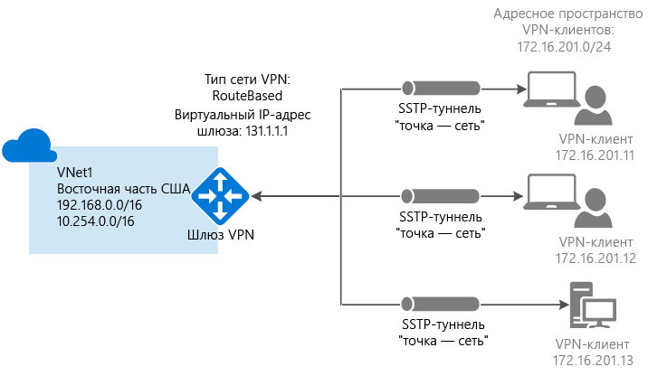


Для проверки подлинности подключений типа "точка — сеть" на основе сертификатов необходимо следующее:

* Динамический VPN-шлюз.
* Открытый ключ (CER-файл) для корневого сертификата, импортированный в Azure. Он считается доверенным сертификатом и используется для проверки подлинности.
* Сертификат клиента создается из корневого сертификата и устанавливается на каждом подключаемом клиентском компьютере. Этот сертификат используется для проверки подлинности клиента.
* Пакет конфигурации VPN-клиента необходимо создать и установить на каждом подключаемом клиентском компьютере. Пакет конфигурации клиента настраивает собственный VPN-клиент, находящийся в операционной системе, используя данные, необходимые для подключения к виртуальной сети.

Для подключения типа "точка — сеть" не требуется VPN-устройство или локальный общедоступный IP-адрес. Для создания VPN-подключения используется протокол SSTP (Secure Socket Tunneling Protocol). На стороне сервера поддерживается SSTP версии 1.0, 1.1 и 1.2. Какую версию использовать, решает клиент. Для Windows 8.1 и более поздних версий по умолчанию используется SSTP версии 1.2. 

Дополнительные сведения о подключениях типа "точка — сеть" см. в разделе [Часто задаваемые вопросы о подключениях типа "точка — сеть"](#faq) в конце этой статьи.

### <a name="example-settings"></a>Примеры настроек

Следующие значения можно использовать для создания тестовой среды или для лучшего понимания примеров в этой статье.

* **Имя: VNet1**.
* **Адресное пространство: 192.168.0.0/16**.<br>В этом примере мы используем только одно адресное пространство, но для виртуальной сети можно настроить несколько, как показано на схеме.
* **Имя подсети: FrontEnd**.
* **Диапазон адресов подсети: 192.168.1.0/24**.
* **Подписка**. Если у вас есть несколько подписок, убедитесь, что используется правильная.
* **Группа ресурсов: TestRG**.
* **Расположение: восточная часть США**.
* **Тип подключения: "точка — сеть"**.
* **Адресное пространство клиента: 172.16.201.0/24**. VPN-клиенты, подключающиеся к виртуальной сети с помощью этого подключения "точка — сеть", получают IP-адреса из указанного пула.
* **Подсеть шлюза: 192.168.200.0/24**. Для подсети шлюза должно использоваться имя GatewaySubnet.
* **Размер.** Выберите SKU шлюза, который нужно использовать.
* **Тип маршрутизации: динамическая**.

## <a name="vnetvpn"></a>1. Создание виртуальной сети и VPN-шлюза.

Прежде чем начать, убедитесь в том, что у вас есть подписка Azure. Если у вас нет подписки Azure, вы можете [активировать преимущества для подписчиков MSDN](https://azure.microsoft.com/pricing/member-offers/msdn-benefits-details) или [зарегистрировать бесплатную учетную запись](https://azure.microsoft.com/pricing/free-trial).

### <a name="createvnet"></a>Часть 1. Создание виртуальной сети

Если у вас нет виртуальной сети, создайте ее. Снимки экрана приведены в качестве примеров. Обязательно подставьте собственные значения. Чтобы создать виртуальную сеть на портале Azure, сделайте следующее:

1. В браузере откройте [портал Azure](http://portal.azure.com) и при необходимости войдите с помощью учетной записи Azure.
2. Последовательно выберите **Создать ресурс** > **Сети** > **Виртуальная сеть**. 
3. В нижней части страницы "Виртуальная сеть" в списке **Выберите модель развертывания** выберите **Классическая** и щелкните **Создать**.

  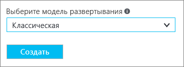
4. На странице **Создание виртуальной сети** настройте параметры виртуальной сети. На этой странице добавьте первое адресное пространство и единый диапазон адресов подсети. После создания виртуальной сети вернитесь назад и добавьте дополнительные подсети и адресные пространства.

  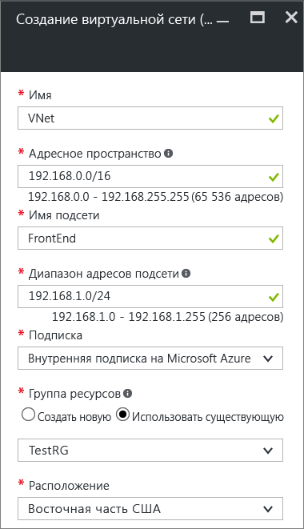
5. Убедитесь, что вы используете правильную **подписку** . Подписки можно менять с помощью раскрывающегося списка.
6. Щелкните **Группа ресурсов** и либо выберите существующую, либо создайте новую группу ресурсов. Чтобы создать группу, введите ее имя. Если вы создаете группу ресурсов, укажите для нее имя, которое будет использоваться в вашей конфигурации. Дополнительные сведения о группах ресурсов см. в разделе "Группы ресурсов" [обзора Azure Resource Manager](../azure-resource-manager/resource-group-overview.md#resource-groups).
7. Затем выберите параметры **расположения** для виртуальной сети. Расположение определяет, где будут находиться ресурсы, развертываемые в этой виртуальной сети.
8. Установите флажок **Закрепить на панели мониторинга** для быстрого перехода к виртуальной сети с панели мониторинга, а затем нажмите кнопку **Создать**.

  
9. После нажатия кнопки "Создать" на панели мониторинга появится плитка, на которой отображается ход создания виртуальной сети. Когда виртуальная сеть будет создана, плитка изменится.

  
10. После создания виртуальной сети появится сообщение с текстом **Создано**.
11. Добавьте DNS-сервер (необязательно). После создания виртуальной сети можно добавить IP-адрес DNS-сервера для разрешения имен. Необходимо указать IP-адрес DNS-сервера, который может разрешать имена для ресурсов в вашей виртуальной сети.<br>Чтобы добавить DNS-сервер, откройте параметры виртуальной сети, щелкните "DNS-серверы" и добавьте IP-адрес DNS-сервера, который нужно использовать.

### <a name="gateway"></a>Часть 2. Создание подсети шлюза и шлюза динамической маршрутизации

На этом шаге вы создадите подсеть шлюза и шлюз динамической маршрутизации. При создании подсети шлюза и шлюза на портале Azure для классической модели развертывания используются те же страницы конфигурации. Подсеть шлюза используется только службами шлюза. Поэтому не развертывайте ничего (например, виртуальные машины или другие службы) напрямую в подсеть шлюза.

1. На портале перейдите к виртуальной сети, для которой необходимо создать шлюз.
2. На странице виртуальной сети на странице **Обзор** в разделе "VPN-подключения" щелкните **Шлюз**.

  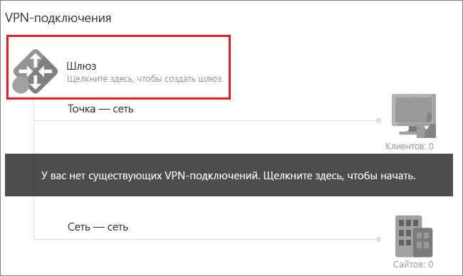
3. На странице **Новое VPN-подключение** выберите **Точка — сеть**.

  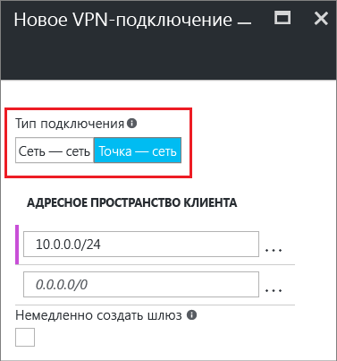
4. В поле **Адресное пространство клиента** добавьте диапазон IP-адресов. Из этого диапазона VPN-клиенты будут получать IP-адреса при подключении. Используйте диапазон частных IP-адресов, который не пересекается с локальным расположением, из которого будет выполняться подключение, или с виртуальной сетью, к которой вы хотите подключиться. Вы можете удалить автоматически заполненный диапазон, затем добавить частный диапазон IP-адресов, который хотите использовать. В этом примере показан автоматически заполненный диапазон. Удалите его, чтобы добавить нужное значение.

  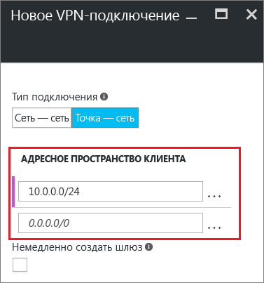
5. Установите флажок **Немедленно создать шлюз**. Щелкните **Дополнительная настройка шлюза**, чтобы открыть страницу **Настройка шлюза**.

  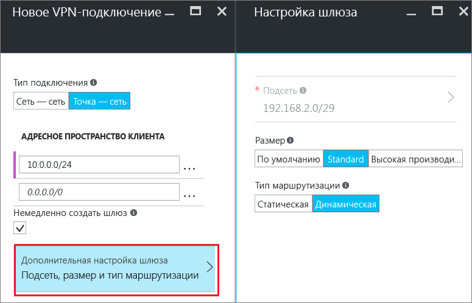
6. Щелкните **Subnet Configure required settings** (Обязательные параметры для настройки подсети), чтобы добавить **подсеть шлюза**. Хотя можно создать подсеть шлюза размером /29, рекомендуется создать подсеть большего размера, включающую несколько адресов, выбрав по крайней мере значение /28 или /27. Таким образом, у вас будет достаточно адресов, чтобы добавить дополнительные конфигурации в будущем. При работе с подсетями шлюза не связывайте группу безопасности сети (NSG) с подсетью шлюза. Связывание группы безопасности сети (NSG) с этой подсетью приведет к тому, что VPN-шлюз перестанет правильно функционировать.

  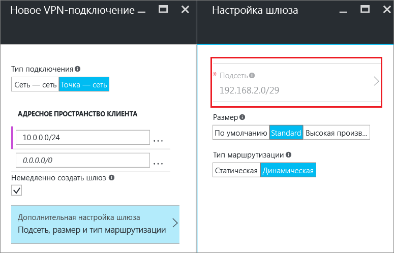
7. Выберите **размер** шлюза. Размер — это SKU шлюза для шлюза виртуальной сети. На портале SKU по умолчанию — **Базовый**. Дополнительные сведения о номерах SKU шлюзов см. в статье [Сведения о параметрах VPN-шлюза](vpn-gateway-about-vpn-gateway-settings.md#gwsku).

  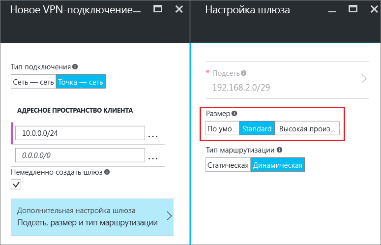
8. Выберите **тип маршрутизации** для шлюза. Конфигурации "точка — сеть" требует **динамического** типа маршрутизации. Щелкните **ОК** после завершения настройки на этой странице.

  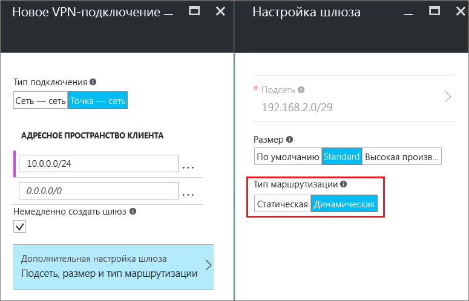
9. В нижней части страницы **Новое VPN-подключение** нажмите кнопку **ОК**, чтобы приступить к созданию шлюза виртуальной сети. Создание VPN-шлюза может занять до 45 минут в зависимости от выбранного номера SKU шлюза.

## <a name="generatecerts"></a>2. Создание сертификатов

Сертификаты используются в Azure для проверки подлинности VPN-клиентов в VPN-подключениях типа "точка — сеть". Необходимо отправить сведения об открытом ключе корневого сертификата в Azure. После этого открытый ключ считается доверенным. Сертификаты клиентов должны создаваться из доверенного корневого сертификата, а затем устанавливаться на каждом клиентском компьютере в хранилище сертификатов Certificates-Current User/Personal. Сертификат используется для проверки подлинности клиента, когда он инициирует подключение к виртуальной сети. 

Используемые самозаверяющие сертификаты должны быть созданы с помощью определенных параметров. Чтобы создать самозаверяющий сертификат, см. инструкции по [PowerShell и Windows 10](vpn-gateway-certificates-point-to-site.md) или [MakeCert](vpn-gateway-certificates-point-to-site-makecert.md). Следовать этим инструкциям очень важно при работе с самозаверяющими корневыми сертификатами и создании на их основе клиентских сертификатов. В противном случае создаваемые сертификаты не будут совместимы с подключениями типа "точка — сеть", и вы получите сообщение об ошибке подключения.

### <a name="cer"></a>Часть 1. Получение открытого ключа CER-файла для корневого сертификата

[!INCLUDE [vpn-gateway-basic-vnet-rm-portal](../../includes/vpn-gateway-p2s-rootcert-include.md)]

### <a name="genclientcert"></a>Часть 2. Создание сертификата клиента

[!INCLUDE [vpn-gateway-basic-vnet-rm-portal](../../includes/vpn-gateway-p2s-clientcert-include.md)]

## <a name="upload"></a>3. Отправка CER-файла корневого сертификата

После создания шлюза вы можете передать CER-файл (который содержит сведения об открытом ключе) доверенного корневого сертификата в Azure. Не отправляйте закрытый ключ для корневого сертификата в Azure. После отправки CER-файла Azure сможет использовать его для проверки подлинности клиентов, на которых установлен клиентский сертификат, созданный из доверенного корневого сертификата. При необходимости позже можно отправить дополнительные файлы доверенных корневых сертификатов (не более 20).  

1. На странице виртуальной сети в разделе **VPN-подключения** щелкните рисунок, обозначающий **клиентов**, чтобы открыть страницу **VPN-подключение типа "точка — сеть"**.

  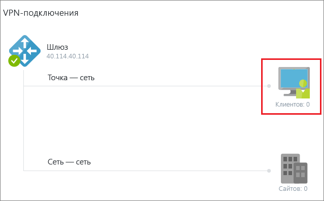
2. На странице **VPN-подключение типа "точка — сеть"** щелкните **Управление сертификатами**, чтобы открыть страницу **Сертификаты**.<br>

  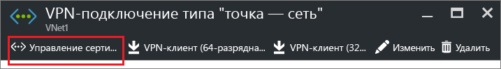<br><br>
3. На странице **Сертификаты** щелкните **Загрузить**, чтобы открыть страницу **Отправка сертификата**.<br>

    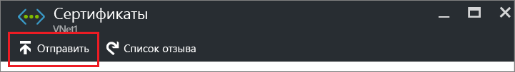<br>
4. Щелкните значок папки, чтобы найти CER-файл. Выберите файл и нажмите кнопку **ОК**. Обновите страницу, чтобы сертификат отобразился на странице **Сертификаты**.

  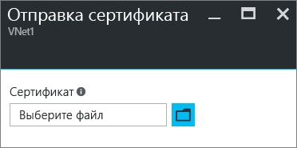<br>

## <a name="vpnclientconfig"></a>4. Настройка клиента

Для подключения к виртуальной сети с помощью VPN-подключения типа "точка — сеть" для каждого клиента необходимо установить пакет конфигурации для собственного VPN-клиента Windows. Пакет конфигурации настраивает собственный VPN-клиент Windows с необходимыми параметрами для подключения к виртуальной сети.

На каждом клиентском компьютере можно использовать один и тот же пакет конфигурации VPN-клиента при условии, что его версия соответствует архитектуре клиента. Список поддерживаемых клиентских операционных систем см. в разделе [Часто задаваемые вопросы о подключениях типа "точка — сеть"](#faq) в конце этой статьи.

### <a name="generateconfigpackage"></a>Часть 1. Создание и установка пакета конфигурации VPN-клиента

1. На портале Azure на странице **Обзор** виртуальной сети в разделе **VPN-подключения** щелкните рисунок, обозначающий клиентов, чтобы открыть страницу **VPN-подключение типа "точка — сеть"**.
2. В верхней части страницы **VPN-подключение типа "точка — сеть"** выберите пакет скачивания для операционной системы, в которой требуется установить клиент:

  * Для 64-разрядных клиентов выберите вариант **VPN-клиент (64-разрядная версия)**.
  * Для 32-разрядных клиентов выберите вариант **VPN-клиент (32-разрядная версия)**.

  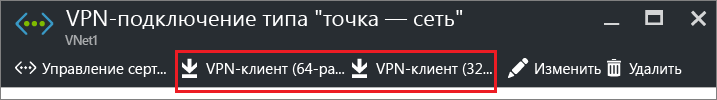<br>
3. После создания пакета скачайте и установите его на клиентском компьютере. При появлении всплывающего окна SmartScreen щелкните **Дополнительно**, а затем выберите **Выполнить в любом случае**. Вы также можете сохранить пакет для установки на других клиентских компьютерах.

### <a name="installclientcert"></a>Часть 2. Установка сертификата клиента

Если вы хотите создать подключение типа "точка — сеть" на клиентском компьютере, отличном от того, который использовался для создания сертификатов клиентов, необходимо установить сертификат клиента. При установке сертификата клиента потребуется пароль, созданный при экспорте сертификата клиента. Обычно для этого нужно просто дважды щелкнуть сертификат и установить его. Дополнительные сведения см. в разделе [Установка экспортированного сертификата клиента](vpn-gateway-certificates-point-to-site.md#install).

## <a name="connect"></a>5. Подключение к Azure

### <a name="connect-to-your-vnet"></a>Подключение к виртуальной сети

>[!NOTE]
>Вам потребуются права администратора для клиентского компьютера, с которого устанавливается подключение.
>
>

1. Чтобы подключиться к виртуальной сети, откройте VPN-подключения на клиентском компьютере и найдите созданное VPN-подключение. Его имя совпадает с названием вашей виртуальной сети. Щелкните **Подключить**. Может появиться всплывающее сообщение об использовании сертификата. В таком случае щелкните **Продолжить**, чтобы использовать более высокий уровень привилегий.
2. На странице состояния **подключения** щелкните **Подключить**. Если появится окно **Выбор сертификата**, убедитесь в том, что отображается сертификат клиента, с помощью которого вы хотите подключиться к сети. Если окно не появится, выберите нужный сертификат в раскрывающемся списке и нажмите кнопку **ОК**.

  
3. Теперь подключение установлено.

  

#### <a name="troubleshooting-p2s-connections"></a>Устранение неполадок подключения P2S

[!INCLUDE [verify-client-certificates](../../includes/vpn-gateway-certificates-verify-client-cert-include.md)]

### <a name="verifyvpnconnect"></a>Проверка VPN-подключения

1. Чтобы проверить, активно ли VPN-подключение, на клиентском компьютере откройте окно командной строки от имени администратора и выполните команду *ipconfig/all*.
2. Просмотрите результаты. Обратите внимание, что полученный вами IP-адрес — это один из адресов в адресном пространстве подключения типа "точка — сеть", которое вы указали при создании виртуальной сети. Результаты должны выглядеть приблизительно как в приведенном примере.

  ```
    PPP adapter VNet1:
        Connection-specific DNS Suffix .:
        Description.....................: VNet1
        Physical Address................:
        DHCP Enabled....................: No
        Autoconfiguration Enabled.......: Yes
        IPv4 Address....................: 192.168.130.2(Preferred)
        Subnet Mask.....................: 255.255.255.255
        Default Gateway.................:
        NetBIOS over Tcpip..............: Enabled
  ```

## <a name="connectVM"></a>Подключение к виртуальной машине

[!INCLUDE [Connect to a VM](../../includes/vpn-gateway-connect-vm-p2s-classic-include.md)]

## <a name="add"></a>Добавление и удаление доверенного корневого сертификата

Вы можете добавлять доверенные корневые сертификаты в Azure, а также удалять их из Azure. При удалении корневого сертификата клиенты, использующие сертификат, созданный из этого корневого сертификата, не смогут пройти проверку подлинности и поэтому не смогут подключиться. Чтобы клиенты могли проходить аутентификацию и подключаться, необходимо установить новый сертификат клиента, созданный на основе корневого сертификата, который является доверенным для Azure (то есть он передан в Azure).

### <a name="addtrustedroot"></a>Добавление доверенного корневого сертификата

В Azure можно добавить до 20 CER-файлов доверенных корневых сертификатов. Инструкции см. в разделе 3 [Отправка CER-файла корневого сертификата](#upload).

### <a name="removetrustedroot"></a>Удаление доверенного корневого сертификата

1. На странице виртуальной сети в разделе **VPN-подключения** щелкните рисунок, обозначающий **клиентов**, чтобы открыть страницу **VPN-подключение типа "точка — сеть"**.

  
2. На странице **VPN-подключение типа "точка — сеть"** щелкните **Управление сертификатами**, чтобы открыть страницу **Сертификаты**.<br>

  <br><br>
3. На странице **Сертификаты** щелкните кнопку с многоточием рядом с сертификатом, который требуется удалить, а затем щелкните **Удалить**.

  <br>

## <a name="revokeclient"></a>Отзыв сертификата клиента

Можно отозвать сертификаты клиента. Список отзыва сертификатов позволяет выборочно запрещать подключение типа "точка-сеть" на основе отдельных сертификатов клиента. Эта процедура отличается от удаления доверенного корневого сертификата. При удалении доверенного корневого сертификата (CER-файл) из Azure будет запрещен доступ для всех сертификатов клиента, созданных на основе отозванного корневого сертификата или подписанных им. Отзыв сертификата клиента, а не корневого сертификата, позволяет по-прежнему использовать другие сертификаты, созданные на основе корневого сертификата, для проверки подлинности подключения типа "точка — сеть".

Обычно корневой сертификат используется для управления доступом на уровнях группы или организации, а отозванный сертификат клиента — для точного контроля доступа для отдельных пользователей.

### <a name="revokeclientcert"></a>Отзыв сертификата клиента

Вы можете отозвать сертификат клиента, добавив отпечаток в список отзыва.

1. Получите отпечаток сертификата клиента. Дополнительные сведения см. в статье [Практическое руководство. Извлечение отпечатка сертификата](https://msdn.microsoft.com/library/ms734695.aspx).
2. Скопируйте данные в текстовый редактор и удалите все пробелы, чтобы предоставить отпечаток в виде непрерывной строки.
3. Перейдите на страницу **имя классической виртуальной сети > VPN-подключение типа "точка — сеть" > Сертификаты** и выберите **Список отзыва**, чтобы открыть страницу списка отзыва. 
4. На странице **Список отзыва** щелкните **+Добавить сертификат** , чтобы открыть страницу **Добавление сертификата в список отзыва**.
5. На странице **Добавление сертификата в список отзыва** вставьте отпечаток сертификата в виде одной непрерывной текстовой строки без пробелов. В нижней части страницы щелкните **ОК**.
6. После применения изменений сертификат больше не будет использоваться для подключения. Клиенты, пытающиеся подключиться с помощью этого сертификата, получат сообщение, что он недействителен.

## <a name="faq"></a>Часто задаваемые вопросы о подключениях типа "точка — сеть"

[!INCLUDE [Point-to-Site FAQ](../../includes/vpn-gateway-faq-point-to-site-classic-include.md)]

## <a name="next-steps"></a>Дополнительная информация
Установив подключение, можно добавить виртуальные машины в виртуальные сети. Дополнительные сведения о виртуальных машинах см. [здесь](https://docs.microsoft.com/azure/#pivot=services&panel=Compute). Дополнительные сведения о сетях и виртуальных машинах см. в статье [Azure и Linux: обзор сетей виртуальных машин](../virtual-machines/linux/azure-vm-network-overview.md).

Дополнительные сведения см. в руководстве по [устранению неполадок с подключением "точка — сеть" в Azure](vpn-gateway-troubleshoot-vpn-point-to-site-connection-problems.md).